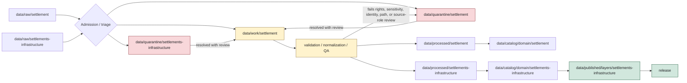

<!-- [KFM_META_BLOCK_V2]
doc_id: kfm://data/work/settlement/readme
name: Settlement Work Compatibility README
path: data/work/settlement/README.md
type: data-work-domain-lane-readme; compatibility-lane-readme
version: v0.1.0
status: draft
owners:
  - <data-steward>
  - <settlements-infrastructure-domain-steward>
  - <settlement-identity-steward>
  - <pipeline-steward>
  - <source-steward>
  - <rights-reviewer>
  - <sensitivity-reviewer>
  - <policy-steward>
  - <evidence-steward>
  - <proof-steward>
  - <receipt-steward>
  - <catalog-steward>
  - <release-steward>
  - <docs-steward>
created: 2026-06-29
updated: 2026-06-29
policy_label: restricted-review
truth_posture: cite-or-abstain
responsibility_root: data/
lifecycle_phase: work
domain: settlement
canonical_domain_candidate: settlements-infrastructure
artifact_family: settlement-working-intermediates-and-candidates
path_posture: existing-greenfield-stub-replaced; singular-settlement-compatibility-path; broader-settlements-infrastructure-work-parent-is-greenfield-stub; directory-rules-lists-data-work-domain-run-id; canonical-path-docs-mark-settlements-infrastructure-vs-settlement-conflicted; raw-quarantine-processed-catalog-receipts-proofs-compatibility-lanes-confirmed
sensitivity_posture: internal-work-only; no-public-path; release-blocked; candidate-not-truth; source-role-preserving; settlement-identity-and-time-anti-collapse-required; critical-infrastructure-cultural-sovereignty-archaeology-private-property-person-land-and-exact-location-joins-fail-closed; rights-needs-verification; evidence-aware; receipt-aware; policy-aware; correction-and-rollback-aware
related:
  - ../README.md
  - ../../README.md
  - ../../raw/settlement/README.md
  - ../../raw/settlements-infrastructure/README.md
  - ../../quarantine/settlement/README.md
  - ../../quarantine/settlements-infrastructure/README.md
  - ../../processed/settlement/README.md
  - ../../processed/settlements-infrastructure/README.md
  - ../../catalog/domain/settlement/README.md
  - ../../catalog/domain/settlements-infrastructure/README.md
  - ../../receipts/settlement/README.md
  - ../../proofs/settlement/README.md
  - ../../published/layers/settlements-infrastructure/README.md
  - ../../../docs/domains/settlements-infrastructure/README.md
  - ../../../docs/domains/settlements-infrastructure/CANONICAL_PATHS.md
  - ../../../docs/domains/settlements-infrastructure/DATA_LIFECYCLE.md
  - ../../../docs/doctrine/directory-rules.md
  - ../../../release/README.md
  - ../../../contracts/domains/settlements-infrastructure/
  - ../../../schemas/contracts/v1/domains/settlements-infrastructure/
  - ../../../policy/domains/settlements-infrastructure/
  - ../../../tools/validators/
tags:
  - kfm
  - data
  - work
  - settlement
  - settlements-infrastructure
  - compatibility-path
  - lifecycle
  - raw-to-work
  - work-to-processed
  - quarantine-exit
  - settlement
  - municipality
  - census-place
  - townsite
  - ghost-town
  - fort
  - mission
  - reservation-community
  - candidate-assertion
  - place-identity
  - legal-status
  - temporal-scope
  - geometry-normalization
  - conflation
  - qa
  - source-role
  - no-public-path
  - not-release-authority
  - not-processed
  - not-proof
  - not-catalog
  - not-published
  - cite-or-abstain
notes:
  - "This README replaces the greenfield stub at `data/work/settlement/README.md`."
  - "The singular `settlement` path is treated as a compatibility WORK lane under the broader Settlements/Infrastructure domain while path topology remains conflicted."
  - "Directory Rules list `data/work/<domain>/<run_id>/` and describe WORK as normalized intermediates and candidate assertions that must not feed public API/UI or release aliases directly."
  - "WORK material is not settlement truth, not infrastructure truth, not processed truth, not catalog truth, not proof, not receipt authority, not policy authority, not release authority, and not public material."
  - "README presence does not prove work payloads, run manifests, validators, receipts, CI checks, policy enforcement, source descriptors, review completion, or release readiness."
[/KFM_META_BLOCK_V2] -->

<a id="top"></a>

# Settlement WORK Compatibility Lane

Working lifecycle lane for settlement/place-identity normalization intermediates, candidate assertions, QA outputs, join packets, redaction/generalization trials, and run-local material associated with the broader Settlements/Infrastructure domain.

<p>
  
  
  
  
  
  
</p>

**Quick links:** [Scope](#scope) · [Canonical path warning](#canonical-path-warning) · [Repo fit](#repo-fit) · [Accepted material](#accepted-material) · [Exclusions](#exclusions) · [Settlement WORK guardrails](#settlement-work-guardrails) · [Lifecycle flow](#lifecycle-flow) · [Suggested directory shape](#suggested-directory-shape) · [Required checks](#required-checks-before-use) · [Status notes](#status-notes) · [Evidence ledger](#evidence-ledger)

> [!CAUTION]
> `data/work/settlement/` is an internal compatibility WORK lane. It is not public, not release authority, not proof, not receipt authority, not catalog closure, not processed truth, not settlement legal-status truth, not infrastructure authority, not source registry authority, not policy authority, not a normal UI/API source, and not an AI-answer source.

---

## Scope

`data/work/settlement/` may hold settlement/place-identity working material after RAW source capture or quarantine exit and before PROCESSED promotion.

This lane is appropriate for run-local, reviewable material such as:

- normalized intermediate records that still need validation;
- candidate `Settlement`, `Municipality`, `CensusPlace`, `Townsite`, `GhostTown`, `Fort`, `Mission`, or `ReservationCommunity` objects;
- candidate name variants, status intervals, legal-status events, census-place matches, historic-townsite matches, fort/mission/reservation-community context, and source-vintage alignment;
- geometry normalization, geometry repair, public-safe geometry trials, boundary-vintage alignment, and over-precision review packets;
- identity reconciliation, dedupe, conflation, alias matching, and crosswalk drafts;
- source-role mapping outputs, citation mappings, rights/sensitivity review drafts, and QA summaries;
- aggregation, redaction, suppression, and generalization trials used to evaluate public-safe settlement/place representations;
- join packets that remain internal while evidence, source role, rights, sensitivity, cultural/sovereignty review, archaeology adjacency, person/land relation, infrastructure dependency, policy, and review state are unresolved;
- run-local indexes and README files that explain work state without becoming proof, catalog, registry, policy, release, or public authority.

A file here may help a steward inspect a candidate. It does **not** make that candidate true, canonical, public, policy-admitted, evidence-supported, or released.

---

## Canonical path warning

Visible Settlements/Infrastructure doctrine records a segment-name conflict:

```text
settlements-infrastructure
settlement
```

The broader domain documentation treats `settlements-infrastructure` as the working domain segment while acknowledging singular `settlement` as a conflicted short form. The requested path exists and is therefore documented here as a **singular compatibility WORK lane**, not a standalone canonical authority.

The broader WORK parent also exists but remains a greenfield stub:

```text
data/work/settlements-infrastructure/README.md
```

Until an ADR, Directory Rules update, migration note, or path map resolves this topology, do not create divergent WORK payloads under both `settlement` and `settlements-infrastructure` without a clear source, run, checksum, receipt, correction, and rollback relationship.

---

## Repo fit

| Responsibility | Correct home | Boundary |
|---|---|---|
| Settlement RAW compatibility captures | [`../../raw/settlement/`](../../raw/settlement/README.md) | Source-edge material using singular compatibility segment. |
| Settlements/Infrastructure RAW captures | [`../../raw/settlements-infrastructure/`](../../raw/settlements-infrastructure/README.md) | Broader domain RAW parent. |
| Settlement WORK compatibility candidates | `data/work/settlement/` | This lane. Internal only. |
| Settlements/Infrastructure WORK parent | `data/work/settlements-infrastructure/` | Confirmed stub; broader parent still needs full README. |
| Settlement quarantine compatibility holds | [`../../quarantine/settlement/`](../../quarantine/settlement/README.md) | Held singular-path material. |
| Settlements/Infrastructure quarantine holds | [`../../quarantine/settlements-infrastructure/`](../../quarantine/settlements-infrastructure/README.md) | Held broader-domain material. |
| Settlement processed compatibility artifacts | [`../../processed/settlement/`](../../processed/settlement/README.md) | Downstream processed compatibility lane. |
| Settlements/Infrastructure processed artifacts | [`../../processed/settlements-infrastructure/`](../../processed/settlements-infrastructure/README.md) | Downstream broader processed parent. |
| Settlement catalog compatibility records | [`../../catalog/domain/settlement/`](../../catalog/domain/settlement/README.md) | Catalog-stage alias, not WORK. |
| Settlements/Infrastructure catalog records | [`../../catalog/domain/settlements-infrastructure/`](../../catalog/domain/settlements-infrastructure/README.md) | Broader catalog lane. |
| Settlement receipts | [`../../receipts/settlement/`](../../receipts/settlement/README.md) | Process memory; WORK may reference receipts but does not own them. |
| Settlement proofs | [`../../proofs/settlement/`](../../proofs/settlement/README.md) | EvidenceBundle/proof support; not WORK storage. |
| Published Settlements/Infrastructure layers | [`../../published/layers/settlements-infrastructure/`](../../published/layers/settlements-infrastructure/README.md) | Released public-safe carriers only. |
| Release decisions | `release/` | Release manifests, promotion decisions, rollback cards, corrections, withdrawals, signatures. |
| Contracts, schemas, policy, validators | `contracts/`, `schemas/`, `policy/`, `tools/validators/` | Separate authority roots. |

---

## Accepted material

Accepted content is limited to settlement working/intermediate material and work-local sidecars:

- run-local normalization outputs and candidate assertion files;
- identity reconciliation, legal-status alignment, geometry repair, place-name normalization, alternate-name matching, dedupe, conflation, crosswalk, unit/time conversion, source-vintage alignment, and QA outputs;
- candidate objects for `Settlement`, `Municipality`, `CensusPlace`, `Townsite`, `GhostTown`, `Fort`, `Mission`, and `ReservationCommunity`;
- source-role mapping drafts and source-field mapping drafts;
- aggregation, suppression, redaction, public-safe geometry, and generalization trials;
- work-local manifest, digest, and index sidecars used to inspect the run;
- references to RAW source captures, quarantine exits, receipts, proof candidates, policy decisions, and review notes;
- README files explaining local run or candidate boundaries.

All accepted material should preserve enough context to inspect source lineage, input digests, source role, run identity, tool/version where applicable, source vintage, observed/valid/retrieval/release/correction times where material, geometry handling, sensitivity posture, rights posture, reviewer state, and intended downstream path.

---

## Exclusions

| Do not place here | Correct home |
|---|---|
| Immutable settlement source captures, source-native payloads, source query snapshots, source-head records, raw response mirrors, images, scans, OCR inputs, or source media | `data/raw/settlement/` or `data/raw/settlements-infrastructure/` |
| Rights-unclear, sensitivity-unclear, privacy-unsafe, source-role-unclear, critical-infrastructure-adjacent, cultural/sovereignty-sensitive, archaeology-adjacent, person/land-linked, over-precise, or unresolved material requiring hold | `data/quarantine/settlement/` or `data/quarantine/settlements-infrastructure/` |
| Validated normalized settlement/place datasets ready for catalog/triplet promotion | `data/processed/settlement/` or `data/processed/settlements-infrastructure/` after path resolution |
| Catalog records, STAC/DCAT/PROV/domain catalog entries, catalog matrices, or catalog indexes | `data/catalog/` |
| Graph/triplet projections, graph deltas, relationship exports, or public graph support | `data/triplets/` |
| EvidenceBundle, ProofPack, citation validation, integrity proof, or proof indexes | `data/proofs/settlement/` or accepted proof lanes |
| RunReceipt, TransformReceipt, AggregationReceipt, RedactionReceipt, ValidationReceipt, AIReceipt, PolicyDecision, release-support receipt, or rollback receipt authority | `data/receipts/settlement/` or accepted receipt/rollback lanes |
| SourceDescriptor, source activation records, source registry entries, rights registry, sensitivity registry, or dataset registry records | `data/registry/` |
| Published layers, PMTiles, GeoParquet, reports, stories, API payloads, map tiles, public downloads, or release-linked artifacts | `data/published/` after release gates |
| ReleaseManifest, PromotionDecision, RollbackCard, CorrectionNotice, WithdrawalNotice, signatures, or release changelog | `release/` |
| Contracts, schemas, policy rules, validators, tests, implementation code, notebooks intended as code, apps, packages, or workflows | `contracts/`, `schemas/`, `policy/`, `tools/`, `tests/`, `apps/`, `packages/`, `.github/` |

---

## Settlement WORK guardrails

| Risk | Guardrail |
|---|---|
| Candidate becomes truth | WORK candidates remain candidates until processed validation, proof/catalog closure, policy review, and release state support stronger claims. |
| WORK becomes public | Public clients, normal UI surfaces, reports, stories, map layers, graph/vector indexes, Focus Mode, and AI answers must not read this lane directly. |
| Singular path becomes canonical by accident | Keep `settlement/` documented as compatibility while `settlements-infrastructure` remains the broader working domain segment and the conflict is unresolved. |
| Release alias bypass | WORK must not contain or update release aliases, current pointers, public route payloads, or published artifacts. |
| RAW mutation | RAW captures stay immutable; WORK may derive from RAW but must not overwrite or replace source captures. |
| Quarantine bypass | Rights-unclear, sensitivity-unsafe, source-role-unclear, over-precise, critical-infrastructure-adjacent, cultural/sovereignty-sensitive, archaeology-adjacent, or person/land-linked material must move to quarantine or remain denied/held. |
| Source-role collapse | Census geography, GNIS/gazetteer records, municipal legal records, historic maps, operator/provider sources, modeled geometry, administrative indexes, candidates, and generated summaries must stay distinguishable. |
| Identity collapse | Settlement, Municipality, CensusPlace, Townsite, GhostTown, Fort, Mission, and ReservationCommunity must not collapse by name similarity, geometry overlap, or map label alone. |
| Time collapse | Source, observed, valid, retrieval, release, and correction times must remain distinct where material. |
| Cross-lane ownership drift | Roads/Rail owns routes; Hydrology owns water evidence; Hazards owns hazard events and warnings; People/DNA/Land owns ownership, parcels, and living-person privacy; Archaeology owns sensitive site coordinates. Settlement WORK may hold candidate joins only. |
| AI overclaim | Generated labels, summaries, matching notes, or inferred place narratives cannot stand in for EvidenceBundle, source role, validation, policy, review, or release state. |
| Stale or orphaned work | Work products should carry run identity, input refs, digests, timestamp/vintage, reviewer state, and intended disposition: process, quarantine, deny, hold, or delete through governed cleanup. |

---

## Lifecycle flow



> [!NOTE]
> This diagram is a responsibility map, not proof that pipelines, validators, receipts, policy engines, release manifests, or CI gates are currently wired.

---

## Suggested directory shape

Directory Rules list the pattern `data/work/<domain>/<run_id>/`. Exact settlement run layout is **PROPOSED** until schemas, pipeline specs, validators, and receipt conventions confirm it.

```text
data/work/settlement/
├── README.md
├── <run_id>/
│   ├── README.md
│   ├── work.manifest.json
│   ├── input_refs.json
│   ├── candidate_index.json
│   ├── normalized/
│   ├── candidates/
│   ├── identity_matching/
│   ├── geometry_review/
│   ├── joins/
│   ├── qa/
│   ├── redaction_trials/
│   ├── policy_review_refs.json
│   ├── receipt_refs.json
│   └── disposition.json
└── indexes/
    └── settlement.work.index.json
```

Do not pre-create empty child stubs unless a real run, migration, inventory, or steward decision requires them.

Recommended run-level fields:

| Field | Purpose |
|---|---|
| `run_id` | Stable working-run identifier. |
| `source_refs` | RAW captures, source registry records, or source descriptors feeding the run. |
| `input_digests` | Hashes or digests for source and intermediate inputs. |
| `source_role_state` | Observed, regulatory, modeled, aggregate, administrative, candidate, synthetic, or other governed posture. |
| `candidate_families` | Settlement/place object families represented by the run. |
| `rights_state` | Rights, terms, attribution, agreement, and use-limit posture. |
| `sensitivity_state` | Exact-location, critical-infrastructure, cultural/sovereignty, archaeology, private-property, and person/land risk posture. |
| `identity_state` | Name, geometry, temporal, legal-status, and source-identifier reconciliation posture. |
| `validation_state` | Preflight, failed, held, passed, or needs review. |
| `intended_disposition` | `PROCESS`, `QUARANTINE`, `HOLD`, `DENY`, `ABSTAIN`, or `SUPERSEDE`. |
| `downstream_refs` | Processed, quarantine, receipt, proof, catalog, or release references if promoted later. |

---

## Required checks before use

- [ ] Confirm actual child run directories under `data/work/settlement/`.
- [ ] Confirm whether `data/work/settlement/` remains compatibility, migrates, or redirects to `data/work/settlements-infrastructure/`.
- [ ] Confirm accepted settlement WORK manifest shape and naming convention.
- [ ] Confirm contracts, schemas, and validators for settlement/place candidate records.
- [ ] Confirm RAW source refs and input digest closure for every work run.
- [ ] Confirm source-role mapping for Census TIGER, GNIS, state/local GIS, municipal legal records, historical gazetteers/maps, infrastructure providers, KDOT/facility sources, and FEMA/hazard/resilience sources where used.
- [ ] Confirm legal municipality, CensusPlace, historic townsite, ghost-town, fort, mission, and reservation-community identities are not collapsed by label or geometry.
- [ ] Confirm critical-infrastructure-adjacent, cultural/sovereignty-sensitive, archaeology-adjacent, private property, people/land, exact-location, and vulnerable-facility joins are quarantined, redacted, aggregated, denied, or explicitly reviewed before downstream promotion.
- [ ] Confirm candidate outputs that advance to `data/processed/settlement/` or `data/processed/settlements-infrastructure/` have validation, receipt refs, policy posture, correction path, and rollback target where material.
- [ ] Confirm no public clients, normal UI, API, map layer, report, story, vector index, search surface, Focus Mode answer, or AI answer reads from this lane.
- [ ] Confirm work-local cleanup, retention, and supersession do not delete required provenance, receipts, evidence refs, or review state.

---

## Status notes

| Item | Status | Notes |
|---|---:|---|
| Target path presence | CONFIRMED | `data/work/settlement/README.md` existed as a greenfield stub before this update. |
| Parent WORK README | CONFIRMED stub | `data/work/README.md` exists as a greenfield stub; this child README is self-bounding. |
| Broader WORK parent | CONFIRMED stub | `data/work/settlements-infrastructure/README.md` exists as a greenfield stub. |
| Data root | CONFIRMED README | `data/README.md` lists `work` under lifecycle data and excludes release decisions. |
| Directory Rules WORK path | CONFIRMED doctrine | Directory Rules list `data/work/<domain>/<run_id>/` and say WORK holds normalized intermediates and candidate assertions. |
| Settlements/Infrastructure domain doctrine | CONFIRMED README | Domain docs define object families, source families, cross-lane boundaries, sensitivity posture, and path conflict. |
| Segment conflict | CONFIRMED doctrine | `CANONICAL_PATHS.md` and `DATA_LIFECYCLE.md` mark `settlements-infrastructure` vs `settlement` as conflicted / ADR-class. |
| Settlement RAW compatibility lane | CONFIRMED README | `data/raw/settlement/README.md` treats singular `settlement` as compatibility. |
| Settlement QUARANTINE compatibility lane | CONFIRMED README | `data/quarantine/settlement/README.md` treats singular `settlement` as compatibility. |
| Settlement PROCESSED compatibility lane | CONFIRMED README | `data/processed/settlement/README.md` treats singular `settlement` as compatibility. |
| Settlement CATALOG compatibility lane | CONFIRMED README | `data/catalog/domain/settlement/README.md` treats singular `settlement` as compatibility. |
| Settlement RECEIPTS and PROOFS lanes | CONFIRMED README | `data/receipts/settlement/README.md` and `data/proofs/settlement/README.md` exist as settlement-sublane support lanes. |
| Actual WORK payload inventory | UNKNOWN | This README does not prove any work-run payloads exist. |
| WORK schemas, validators, receipts, CI, policy enforcement, release linkage | NEEDS VERIFICATION | No runtime enforcement was proven by this edit. |
| Public release readiness | DENY | A WORK README cannot publish, prove, or expose Settlement claims. |

---

## Evidence ledger

| Source | Status | Supports | Limits |
|---|---|---|---|
| Previous target file | CONFIRMED | `data/work/settlement/README.md` existed as a greenfield stub. | Did not define WORK-lane boundaries. |
| [`../README.md`](../README.md) | CONFIRMED stub | Parent WORK root exists. | Parent contract still needs expansion. |
| [`../../README.md`](../../README.md) | CONFIRMED README | `data/` owns lifecycle data and lists `work`. | Data root README is short and status `PROPOSED`. |
| [`../../../docs/doctrine/directory-rules.md`](../../../docs/doctrine/directory-rules.md) | CONFIRMED doctrine | `data/work/<domain>/<run_id>/`; WORK holds normalized intermediates and candidate assertions; no public API/UI or release aliases. | Exact settlement run layout remains unresolved. |
| [`../../../docs/domains/settlements-infrastructure/README.md`](../../../docs/domains/settlements-infrastructure/README.md) | CONFIRMED doctrine / PROPOSED implementation | Domain scope, object families, source families, cross-lane boundaries, and sensitivity posture. | Does not prove runtime implementation. |
| [`../../../docs/domains/settlements-infrastructure/CANONICAL_PATHS.md`](../../../docs/domains/settlements-infrastructure/CANONICAL_PATHS.md) | CONFIRMED doctrine | Working canonical slug and `settlements-infrastructure` vs `settlement` conflict. | ADR/migration remains unresolved. |
| [`../../../docs/domains/settlements-infrastructure/DATA_LIFECYCLE.md`](../../../docs/domains/settlements-infrastructure/DATA_LIFECYCLE.md) | CONFIRMED doctrine / PROPOSED implementation | Lifecycle invariant, WORK role, gates, and segment conflict. | Does not prove validators or pipelines. |
| [`../../raw/settlement/README.md`](../../raw/settlement/README.md) | CONFIRMED README | Singular RAW compatibility posture. | Does not prove source payload presence. |
| [`../../raw/settlements-infrastructure/README.md`](../../raw/settlements-infrastructure/README.md) | CONFIRMED README | Broader RAW parent and domain halves. | Does not prove source payload presence. |
| [`../../quarantine/settlement/README.md`](../../quarantine/settlement/README.md) | CONFIRMED README | Singular quarantine compatibility posture. | Does not prove held payloads or automated policy enforcement. |
| [`../../quarantine/settlements-infrastructure/README.md`](../../quarantine/settlements-infrastructure/README.md) | CONFIRMED README | Broader quarantine parent and fail-closed posture. | Does not prove held payloads or automated policy enforcement. |
| [`../../processed/settlement/README.md`](../../processed/settlement/README.md) | CONFIRMED README | Singular processed compatibility posture. | Does not prove processed inventory or validators. |
| [`../../processed/settlements-infrastructure/README.md`](../../processed/settlements-infrastructure/README.md) | CONFIRMED README | Broader processed parent and source-role/sensitivity posture. | Does not prove processed inventory or validators. |
| [`../../catalog/domain/settlement/README.md`](../../catalog/domain/settlement/README.md) | CONFIRMED README | Singular catalog compatibility posture. | Does not prove catalog records. |
| [`../../catalog/domain/settlements-infrastructure/README.md`](../../catalog/domain/settlements-infrastructure/README.md) | CONFIRMED README | Broader catalog parent and release-gated posture. | Does not prove catalog records. |
| [`../../receipts/settlement/README.md`](../../receipts/settlement/README.md) | CONFIRMED README | Settlement receipts are process memory, not proof or release. | Does not prove emitted receipts. |
| [`../../proofs/settlement/README.md`](../../proofs/settlement/README.md) | CONFIRMED README | Settlement proofs support EvidenceBundle/EvidenceRef closure and exclude WORK scratch. | Proofs are not WORK storage or publication authority. |
| [`../../published/layers/settlements-infrastructure/README.md`](../../published/layers/settlements-infrastructure/README.md) | CONFIRMED README | Published layers require release and public-safe posture. | Does not prove released artifacts exist. |

[Back to top](#top)
