<div align="center">

# 🧪🛰️ `data/work/sims/` — Simulation Campaigns & Scenario Lab


**Simulation workbench** for KFM: scenario testing, parameter sweeps, ensembles, synthetic data generation, and simulation V&V artifacts.  
This is **not** the canonical published home of results.

</div>

> [!IMPORTANT]
> KFM is pipeline-driven and enforces a strict **staging → validation → publish** sequence (no shortcuts). `data/work/sims/` is the “prove it’s real” zone *before* promotion.  
> If a simulation output is referenced by **Graph / API / UI / Story Nodes / Focus Mode**, it becomes an **evidence artifact** and must be promoted + cataloged (STAC/DCAT/PROV).[^kfm-mdp][^kfm-evidence-artifacts]

---

## 🚀 Quick links

- ⬅️ Back to workbench root → [`../README.md`](../README.md)
- 🎨 Visualization sandbox → [`../viz/README.md`](../viz/README.md)
- 📦 Processed data (publishable outputs) → [`../../processed/`](../../processed/)
- 🛰️ STAC (asset indexing) → [`../../stac/`](../../stac/)
- 🗂️ DCAT (dataset discovery) → [`../../catalog/dcat/`](../../catalog/dcat/)
- 🧬 PROV (lineage bundles) → [`../../prov/`](../../prov/)
- 🔐 Security policy → [`../../../SECURITY.md`](../../../SECURITY.md) *(or `.github/SECURITY.md`, depending on repo convention)*

---

<details>
<summary><strong>📌 Table of contents</strong></summary>

- [🎯 What belongs in `data/work/sims/`](#-what-belongs-in-dataworksims)
- [🧭 Canonical pipeline context](#-canonical-pipeline-context)
- [🧠 Simulation in KFM (what counts)](#-simulation-in-kfm-what-counts)
- [🗺️ Recommended directory layout](#️-recommended-directory-layout)
- [🧾 Simulation Work Package Standard (SWPS)](#-simulation-work-package-standard-swps)
- [🧷 Deterministic runner pattern (recommended)](#-deterministic-runner-pattern-recommended)
- [✅ Reproducibility rules (bitwise vs statistical)](#-reproducibility-rules-bitwise-vs-statistical)
- [🧪 V&V: verification, validation, calibration](#-vv-verification-validation-calibration)
- [📉 UQ & sensitivity (don’t ship single numbers)](#-uq--sensitivity-dont-ship-single-numbers)
- [📦 Data management & storage (large outputs)](#-data-management--storage-large-outputs)
- [🔐 Governance, safety, and “don’t be creepy” rules](#-governance-safety-and-dont-be-creepy-rules)
- [🚀 Promotion checklist (work → processed → catalogs)](#-promotion-checklist-work--processed--catalogs)
- [🧪 Validation & CI gates (recommended)](#-validation--ci-gates-recommended)
- [🧩 Templates (copy/paste starters)](#-templates-copypaste-starters)
- [📚 Project reference shelf](#-project-reference-shelf)
- [🕰️ Version history](#️-version-history)

</details>

---

## 🎯 What belongs in `data/work/sims/`

### ✅ Put these here
- 🧪 **Simulation campaigns**  
  Scenario ensembles, parameter sweeps, stochastic Monte Carlo runs, replay experiments, calibration studies.
- 🧷 **Run manifests + configs**  
  `manifest.yaml`, parameter grids, seeds, model version pins, environment lockfiles.
- 🧫 **V&V / UQ artifacts**  
  Regression tests, benchmark comparisons, sensitivity plots, uncertainty summaries.
- 🧰 **Prototype simulators**  
  Early code that might later become a governed pipeline module.
- 🧾 **Synthetic data generation** (with loud labeling)  
  When simulation is used to create data for testing or analysis, it still needs traceable lineage and guardrails.[^nasa-synthetic]

### ❌ Don’t keep these here as “the truth”
- 🏛️ Anything powering **Graph/API/UI/Story/Focus** without promotion
- 🔑 Secrets / tokens / credentials (ever)
- 🧍 PII or sensitive coordinates (unless explicitly approved + classified + controlled)
- 🧨 Mystery outputs with no manifest, no seed, no environment

> [!TIP]
> If the sim output is “good enough to cite,” it’s good enough to **promote + catalog**.  
> KFM treats simulations as first-class evidence artifacts (same rigor as “real data”).[^kfm-evidence-artifacts]

---

## 🧭 Canonical pipeline context

KFM ordering is **non-negotiable**:

**ETL → STAC/DCAT/PROV → Graph → API → UI → Story Nodes → Focus Mode**[^kfm-mdp][^kfm-evidence-artifacts]

```mermaid
flowchart LR
  RAW["📥 raw inputs<br/>data/raw/<domain>/"] --> WORK["🧪 workbench<br/>data/work/sims/"]
  WORK --> PROC["📦 publishable outputs<br/>data/processed/<domain>/"]
  PROC --> STAC["🛰️ STAC<br/>data/stac/"]
  PROC --> DCAT["🗂️ DCAT<br/>data/catalog/dcat/"]
  PROC --> PROV["🧬 PROV<br/>data/prov/"]
  STAC --> GRAPH["🕸️ Graph (Neo4j)<br/>IDs + relationships"]
  DCAT --> GRAPH
  PROV --> GRAPH
  GRAPH --> API["🔌 Governed API<br/>contracts + redaction"]
  API --> UI["🗺️ UI<br/>map/timeline/downloads"]
  UI --> STORY["🎬 Story Nodes"]
  STORY --> FOCUS["🧠 Focus Mode<br/>evidence-linked only"]
```



> [!IMPORTANT]
> Focus Mode operational rule: **“no new narrative without sources, no data without provenance.”**[^kfm-focus-no-leaks]

---

## 🧠 Simulation in KFM (what counts)

In KFM, simulation is part of the **modeling & analytics** toolbox, including **simulation & scenario testing** (agent-based models, system dynamics models, and custom computational simulations).[^kfm-sim-scenario]

A “simulation output” counts as a dataset when it can be:
- discovered,
- accessed (even gated),
- cited,
- versioned.

That includes:
- 🗺️ spatial simulation outputs (rasters/vectors/time series),
- 📈 metrics/benchmarks/evaluation artifacts,
- 🧾 reports produced from simulation runs,
- 🧠 derived entities/relationships extracted from simulation results (graph ingest must remain provenance-backed).[^kfm-evidence-artifacts]

---

## 🗺️ Recommended directory layout

Keep flexible, but navigable:

```text
📁 data/work/sims/
├── 📁 _templates/                  🧩 manifests + runbooks + VV/UQ starters
├── 📁 _scratch/                    ⚠️ throwaway (keep empty in PRs)
├── 📁 campaigns/                   🧪 repeatable simulation campaigns (preferred)
│   ├── 📁 2026-01-05__hydrology__flood_extent_sweep__v01/
│   ├── 📁 2026-01-07__landuse__agent_based_settlement__v01/
│   └── 📁 2026-01-10__climate__scenario_ensemble__v02/
├── 📁 models/                      🧰 shared model code/components (optional)
├── 📁 fixtures/                    ✅ tiny fixtures for CI / regression checks
└── 📄 README.md                    👈 you are here
```

---

## 🧾 Simulation Work Package Standard (SWPS)

A **Simulation Work Package** is any folder under `data/work/sims/campaigns/` that someone else should be able to:
- run (or reproduce statistically),
- review,
- promote.

### ✅ Naming convention
Use timestamp + domain + slug + version:

- `YYYY-MM-DD__<domain>__<short_slug>__vNN/`

Examples:
- `2026-01-05__hydrology__flood_extent_sweep__v01/`
- `2026-01-07__landuse__agent_based_settlement__v01/`
- `2026-01-10__climate__scenario_ensemble__v02/`

### ✅ Required files (minimum)
Inside each campaign:

- `README.md` — what/why/how, key findings, limitations, next steps
- `manifest.yaml` — inputs/params/outputs/environment/hashes
- `config/` — campaign config(s): scenario definitions, parameter grids
- `src/` *(or `model/`)* — runnable implementation
- `outputs/` — small summaries (metrics, tables), **not huge raw dumps**
- `viz/` — quick-look plots/maps/screenshots (keep it PR-friendly)

### 🔥 Strongly recommended
- `environment/` — lockfiles: `requirements.txt`/`poetry.lock`/`environment.yml`/`docker/`
- `vv/` — verification & validation plan + results (tests, benchmarks)
- `uq/` — uncertainty/sensitivity plan + results (ensembles, intervals)
- `runs/` — run registry (`runs.parquet` or `runs.csv`) with run_id + params + seed + output pointers
- `artifacts/` — large outputs tracked via DVC/Git LFS or external storage pointers[^kfm-dvc]
- `exports/` — candidate promotion bundle (clean outputs + metadata stubs)

---

## 🧷 Deterministic runner pattern (recommended)

KFM’s proposal set includes a deterministic simulation runner concept (`kfm-sim-run`) for **scenario replay**:
- fixed random seed,
- containerized tools,
- “virtual clock” / frozen time,
- emits a diff patch,
- updates STAC Items + PROV bundles,
- opens a PR for promotion.[^kfm-sim-runner]

Even if your current campaign is simpler, aim for the same spirit:
- **config-driven**
- **idempotent**
- **diff-stable outputs** (where meaningful)

This aligns with KFM’s deterministic pipeline principle.[^kfm-deterministic]

---

## ✅ Reproducibility rules (bitwise vs statistical)

Simulation reproducibility comes in (at least) two forms:
- **Bitwise reproducibility**: identical output bits (harder across platforms)
- **Statistical reproducibility**: results agree within expected tolerances (often the realistic goal)[^nasa-bitwise]

### ✅ Minimum reproducibility checklist
- [ ] Inputs pinned (hash/version) + recorded in `manifest.yaml`
- [ ] Parameters captured (scenario IDs, grid, time windows, thresholds)
- [ ] Environment pinned (container digest or lockfiles)
- [ ] Randomness controlled (seeds recorded per run)
- [ ] “Back-to-back test” exists when the environment/hardware changes (at least on a small fixture)[^nasa-bitwise]
- [ ] Outputs have clear units, coordinate frames, and metadata

---

## 🧪 V&V: verification, validation, calibration

> [!IMPORTANT]
> “It ran” is not verification. “It seems right” is not validation.  
> V&V is how simulation results become safe to cite.

### Verification (did we build it right?)
- Unit tests for core logic
- Regression tests on known fixtures
- CI runs smoke tests on pull requests[^nasa-vv][^kfm-ci-gates]

### Validation (did we build the right thing?)
- Compare outputs to observed data where possible
- Document where validation is impossible, and why
- Make assumptions explicit (domain bounds)

### Calibration (tuning with guardrails)
- Separate calibration from validation datasets
- Avoid overfitting to one historic episode
- Document calibration method + stopping criteria[^nasa-vv]

---

## 📉 UQ & sensitivity (don’t ship single numbers)

Simulation outputs should avoid “single-number certainty.” 
Use ensembles (e.g., multiple plausible runs) and report uncertainty or confidence intervals.[^nasa-uq]

### Minimum UQ deliverables (practical)
- [ ] Sensitivity sweep over 3–5 key parameters
- [ ] Ensemble summary (mean/median + spread)
- [ ] Identify instability regions (“where the model breaks”)
- [ ] Confidence bounds on key outputs (even if approximate)

### Compute-friendly uncertainty (optional but powerful)
For very large outputs, consider efficient uncertainty estimation patterns (e.g., bootstrap variants designed to reduce compute burden).[^scalable-blb]

---

## 📦 Data management & storage (large outputs)

Simulation campaigns can explode in size fast; treat storage as part of design.[^nasa-bigdata]

### Large artifact strategy (recommended)
- Keep Git commits **small and reviewable**
- Track large outputs with **DVC** (recommended in KFM design notes)[^kfm-dvc]
- For public repos, consider Git LFS for some binaries (if policy allows)
- Always keep **manifests** and **checksums** in Git

### Versioning patterns
- Include run IDs or dates in filenames for publishable artifacts (prevents silent overwrites).[^kfm-versioning-dvc]
- Prefer append-only run registries (`runs.parquet`) over rewriting ad-hoc files
- Containerize dependencies for reproducibility (especially in CI).[^kfm-ci-container]

---

## 🔐 Governance, safety, and “don’t be creepy” rules

### FAIR+CARE is enforced (not vibes)
KFM governance is explicitly built around FAIR/CARE and sovereignty-aware controls:
- do not expose precise locations of sensitive sites,
- require review/approval for sensitive layers,
- block promotions that violate policy.[^kfm-fair-care]

### No sensitive location leaks (Focus Mode rule)
Focus Mode must not become a side-channel to bypass restrictions:
- sensitive locations should be generalized/omitted,
- AI hints are opt-in and must respect sensitivity rules.[^kfm-focus-no-leaks]

### Supply chain & provenance attestation (direction of travel)
KFM proposals include supply-chain attestations (SBOM/SLSA/Sigstore-style) attached to automated actions and releases.[^kfm-supply-chain]

### Provenance visibility (trust feature)
Even with authentication, actions should be traceable (e.g., “dataset X added by user Y on date Z”).[^kfm-fair-care]

---

## 🚀 Promotion checklist (work → processed → catalogs)

Promote simulation outputs when:
- they’re referenced beyond the campaign,
- they support a Story Node or decision-facing doc,
- they’re shown in UI/map/timeline,
- they need to be cited or shared.

### Promotion definition of done ✅
- [ ] Outputs moved (or re-generated) into `data/processed/<domain>/...`
- [ ] Boundary artifacts created:
  - 🛰️ STAC (if spatial assets exist)
  - 🗂️ DCAT (dataset discovery record)
  - 🧬 PROV (lineage: inputs → activity → outputs → agents)
- [ ] Graph ingest uses stable IDs + provenance references (no “mystery nodes”)
- [ ] API is the access boundary (no UI direct file/db reads)
- [ ] Sensitivity/classification reviewed (no accidental downgrades)[^kfm-ci-gates]
- [ ] A thin pointer remains here (README links → canonical artifact)

> [!NOTE]
> Evidence artifacts (including **climate model simulations**) must be treated like datasets and moved through the same pipeline with STAC/DCAT/PROV + governed API exposure.[^kfm-evidence-artifacts]

---

## 🧪 Validation & CI gates (recommended)

KFM’s CI strategy includes:
- Markdown protocol + front-matter validation,
- link/reference validation,
- schema validation for STAC/DCAT/PROV,
- graph integrity tests,
- secret scanning,
- sensitive content + sensitive location checks,
- classification consistency checks.[^kfm-ci-gates]

### Suggested “sims” gates (additive)
- [ ] `manifest.yaml` schema validation (create a schema; fail on missing fields)
- [ ] deterministic smoke-run on a tiny fixture (`fixtures/`)
- [ ] output hash/tolerance check (bitwise or statistical)
- [ ] no secrets in configs/logs
- [ ] no sensitive coordinates in public artifacts
- [ ] “promotion bundle” contains STAC/DCAT/PROV stubs or links

---

## 🧩 Templates (copy/paste starters)

<details>
<summary><strong>📄 `manifest.yaml` (simulation campaign starter)</strong></summary>

```yaml
id: 2026-01-10__climate__scenario_ensemble__v02
owner: "@your-handle"
created_at: "2026-01-10"
status: wip  # wip | review | archived | promoted

purpose:
  question: "What changes under scenarios A/B/C for region X?"
  intended_use: "Exploration & hypothesis generation (not final claims)."
  not_intended_for: "Publishing precise sensitive locations."

model:
  name: "<simulator name>"
  version: "<tag/commit/container digest>"
  type: "agent_based | system_dynamics | monte_carlo | pde | discrete_event | hybrid"
  assumptions:
    - "<assumption 1>"
    - "<assumption 2>"

inputs:
  - name: "<input dataset>"
    dataset_id: "<kfm.dataset.id or external reference>"
    pointer: "<path or URL>"
    pinned: true
    checksum: "sha256:<optional>"

parameters:
  scenario_set: ["A", "B", "C"]
  region: "<AOI slug or path>"
  time_range: ["YYYY-MM-DD", "YYYY-MM-DD"]
  random_seed_strategy: "fixed-per-run"
  runs:
    n_ensemble: 50

verification:
  fixture_run: "fixtures/smoke_case.yaml"
  tests:
    - "pytest -q"
  regression_baseline: "fixtures/baselines/"

validation:
  approach: "compare to observed <X> where available; otherwise document constraints"
  benchmarks:
    - "<benchmark dataset id>"
  calibration:
    method: "<if any>"
    separation: "calibration vs validation sets documented"

uncertainty:
  method: "ensemble"
  outputs:
    - "median"
    - "p10"
    - "p90"
  sensitivity:
    key_parameters: ["p1", "p2", "p3"]

outputs:
  - name: summary_metrics
    path: outputs/metrics.parquet
  - name: report
    path: outputs/report.md
  - name: quicklooks
    path: viz/

environment:
  container: "<image digest or tag>"
  lockfiles:
    - environment/requirements.txt
    - environment/poetry.lock

promotion_intent:
  candidate_dataset_id: "kfm.<domain>.<product>.<timerange>.v1"
  requires_catalogs: true   # STAC + DCAT + PROV
  notes: "Promote only after VV/UQ + steward review."
```

</details>

<details>
<summary><strong>📄 `runs.parquet` (recommended columns)</strong></summary>

- `run_id` (stable, unique)
- `scenario_id`
- `seed`
- `param_hash`
- `started_at`, `finished_at`
- `status` (ok/failed)
- `output_pointer`
- `metrics_pointer`
- `code_commit_sha` / `container_digest`

</details>

---

## 📚 Project reference shelf

> [!NOTE]
> Reference materials may have licenses different from the repository code/data. KFM treats them as **influence + citation** resources, not repo-owned content.[^kfm-library-license]

### 🧭 Core KFM design & governance
- `Kansas Frontier Matrix (KFM) – Comprehensive Technical Documentation.docx`
- `🌟 Kansas Frontier Matrix – Latest Ideas & Future Proposals.docx`
- `Kansas-Frontier-Matrix_ Open-Source Geospatial Historical Mapping Hub Design.pdf`
- `MARKDOWN_GUIDE_v13.md.gdoc`
- `Comprehensive Markdown Guide_ Syntax, Extensions, and Best Practices.docx`

### 🧪 Simulation discipline (V&V + UQ + reproducibility)
- `Scientific Modeling and Simulation_ A Comprehensive NASA-Grade Guide.pdf`
- `Understanding Statistics & Experimental Design.pdf`
- `think-bayes-bayesian-statistics-in-python.pdf`
- `regression-analysis-with-python.pdf`
- `Regression analysis using Python - slides-linear-regression.pdf`
- `graphical-data-analysis-with-r.pdf`

### 🧮 Optimization + graphs (optional deep dives)
- `Generalized Topology Optimization for Structural Design.pdf`
- `Spectral Geometry of Graphs.pdf`

### 🗺️ GIS + remote sensing (simulation often consumes these inputs)
- `Cloud-Based Remote Sensing with Google Earth Engine-Fundamentals and Applications.pdf`
- `python-geospatial-analysis-cookbook.pdf` *(and/or the KFM-labeled variant)*
- `making-maps-a-visual-guide-to-map-design-for-gis.pdf`
- `PostgreSQL Notes for Professionals - PostgreSQLNotesForProfessionals.pdf`
- `Mobile Mapping_ Space, Cartography and the Digital - 9789048535217.pdf`
- `compressed-image-file-formats-jpeg-png-gif-xbm-bmp.pdf`

### ⚙️ Systems + scale + interoperability
- `Scalable Data Management for Future Hardware.pdf`
- `Data Spaces.pdf`
- `concurrent-real-time-and-distributed-programming-in-java-threads-rtsj-and-rmi.pdf`

### ❤️ Ethics + autonomy + policy
- `Introduction to Digital Humanism.pdf`
- `Principles of Biological Autonomy - book_9780262381833.pdf`
- `On the path to AI Law’s prophecies and the conceptual foundations of the machine learning age.pdf`

### 🌐 Web + visualization (for sim outputs / quicklooks)
- `responsive-web-design-with-html5-and-css3.pdf`
- `webgl-programming-guide-interactive-3d-graphics-programming-with-webgl.pdf`

### 🧰 General programming shelf (bundles)
- `A programming Books.pdf`
- `B-C programming Books.pdf`
- `D-E programming Books.pdf`
- `F-H programming Books.pdf`
- `I-L programming Books.pdf`
- `M-N programming Books.pdf`
- `O-R programming Books.pdf`
- `S-T programming Books.pdf`
- `U-X programming Books.pdf`

### 🛡️ Security (defensive reference only)
- `ethical-hacking-and-countermeasures-secure-network-infrastructures.pdf`
- `Gray Hat Python - Python Programming for Hackers and Reverse Engineers (2009).pdf`

> These are used to inform **defensive controls** (threat modeling, secure coding, incident response).  
> They are **not** a request for offensive contributions.

---

## 🕰️ Version history

| Version | Date | Summary |
|---|---|---|
| v1.0.0 | 2026-01-11 | Created sims workbench README: campaign standards, deterministic runner pattern, V&V/UQ expectations, governance + promotion rules ✅ |

---

<p align="right"><a href="#-dataworksims--simulation-campaigns--scenario-lab">⬆️ Back to top</a></p>

---

## 🔎 Evidence notes (sources)

[^kfm-mdp]: Pipeline-driven system + strict staged promotion (“KFM-MDP rulebook”). :contentReference[oaicite:0]{index=0}
[^kfm-deterministic]: Deterministic pipeline principle (idempotent, config-driven, stable outputs). :contentReference[oaicite:1]{index=1}
[^kfm-evidence-artifacts]: Evidence artifact pattern: analysis/AI outputs (e.g., climate model simulation) must be stored in `data/processed/`, cataloged in STAC/DCAT, traced in PROV, integrated with graph cautiously, and exposed via governed APIs (no direct UI bypass). :contentReference[oaicite:2]{index=2}
[^kfm-ci-gates]: Minimum CI gates (front-matter checks, link validation, schema validation, graph tests, security/governance scans incl. sensitive location + classification consistency). :contentReference[oaicite:3]{index=3}
[^kfm-focus-no-leaks]: Focus Mode safety: AI opt-in + “no sensitive location leaks” + provenance-first user experience. :contentReference[oaicite:4]{index=4}
[^kfm-sim-scenario]: Modeling & analytics includes simulation & scenario testing (agent-based/system dynamics/custom simulations). :contentReference[oaicite:5]{index=5}
[^kfm-sim-runner]: Proposed deterministic simulation runner pattern (`kfm-sim-run`), scenario replay, frozen time, diff patch, updated STAC + PROV, PR. :contentReference[oaicite:6]{index=6}
[^kfm-fair-care]: FAIR/CARE + sovereignty: sensitive data flagging, refusal to expose sacred sites, enforcement via policy checks; provenance logs for actions. :contentReference[oaicite:7]{index=7}
[^kfm-supply-chain]: Supply chain security direction: SBOM/SLSA-style attestations + Sigstore-like verification for CI artifacts/PRs. :contentReference[oaicite:8]{index=8}
[^kfm-dvc]: KFM design notes recommend DVC for large artifacts + CI tests for validity and reproducibility. :contentReference[oaicite:9]{index=9}
[^kfm-ci-container]: CI containerization recommendation for reproducible pipelines. :contentReference[oaicite:10]{index=10}
[^kfm-versioning-dvc]: Dataset versioning (timestamps/run IDs) + DVC/Quilt as options for tracking large data via Git pointers. :contentReference[oaicite:11]{index=11}
[^kfm-library-license]: `docs/library/` described as external reference materials with their own licenses. :contentReference[oaicite:12]{index=12}
[^nasa-bitwise]: Bitwise vs statistical reproducibility in simulation contexts. :contentReference[oaicite:13]{index=13}
[^nasa-uq]: UQ expectation: represent uncertainty (ensembles/confidence intervals), avoid single-number certainty. :contentReference[oaicite:14]{index=14}
[^nasa-bigdata]: Simulation outputs can grow huge; post-processing may require distributed compute and careful data management. :contentReference[oaicite:15]{index=15}
[^nasa-synthetic]: Synthetic data generation as a simulation use-case; still needs proper framing and controls. :contentReference[oaicite:16]{index=16}
[^nasa-vv]: Verification/testing + CI/regression tests + validation/calibration + sensitivity/Monte Carlo framing. :contentReference[oaicite:17]{index=17}
[^scalable-blb]: Efficient uncertainty estimation idea: Bag of Little Bootstraps reduces compute burden vs traditional bootstrap. :contentReference[oaicite:18]{index=18}

