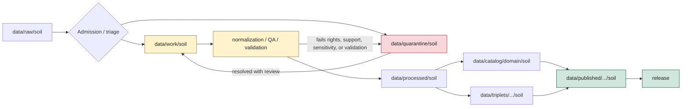

<!-- [KFM_META_BLOCK_V2]
doc_id: kfm://data/work/soil/readme
name: Soil Work README
path: data/work/soil/README.md
type: data-work-domain-lane-readme
version: v0.1.0
status: draft
owners:
  - <data-steward>
  - <soil-domain-steward>
  - <soil-survey-steward>
  - <soil-moisture-steward>
  - <soil-interpretation-steward>
  - <pipeline-steward>
  - <source-steward>
  - <rights-reviewer>
  - <sensitivity-reviewer>
  - <policy-steward>
  - <evidence-steward>
  - <proof-steward>
  - <receipt-steward>
  - <catalog-steward>
  - <release-steward>
  - <docs-steward>
created: 2026-06-29
updated: 2026-06-29
policy_label: restricted-review
truth_posture: cite-or-abstain
responsibility_root: data/
lifecycle_phase: work
domain: soil
artifact_family: soil-working-intermediates-and-candidates
path_posture: existing-greenfield-stub-replaced; directory-rules-lists-data-work-domain-run-id; parent-data-work-readme-is-greenfield-stub; data-root-lists-work-lifecycle-family; soil-raw-quarantine-and-processed-lanes-confirmed; soil-domain-readme-is-greenfield-stub; run-id-child-shape-proposed
sensitivity_posture: internal-work-only; no-public-path; release-blocked; candidate-not-truth; source-role-preserving; support-type-preserving; map-unit-component-horizon-lineage-preserving; field-owner-specific-proprietary-and-operational-sensor-detail-fail-closed; aggregation-and-generalization-trials-not-public-safe-by-placement; cross-lane-joins-restricted; rights-needs-verification; evidence-aware; receipt-aware; policy-aware; correction-and-rollback-aware
related:
  - ../README.md
  - ../../README.md
  - ../../raw/soil/README.md
  - ../../quarantine/soil/README.md
  - ../../processed/soil/README.md
  - ../../../docs/domains/soil/README.md
  - ../../../docs/doctrine/directory-rules.md
  - ../../../docs/doctrine/lifecycle-law.md
  - ../../../docs/doctrine/trust-membrane.md
  - ../../../release/README.md
  - ../../../contracts/domains/soil/
  - ../../../schemas/contracts/v1/domains/soil/
  - ../../../policy/domains/soil/
  - ../../../tools/validators/
tags:
  - kfm
  - data
  - work
  - soil
  - lifecycle
  - raw-to-work
  - work-to-processed
  - quarantine-exit
  - soil-survey
  - ssurgo
  - gssurgo
  - gnatsgo
  - soil-data-access
  - soilgrids
  - mesonet
  - scan
  - uscrn
  - smap
  - map-unit
  - component
  - horizon
  - pedon
  - soil-moisture
  - hydrologic-soil-group
  - suitability
  - erosion-context
  - support-type
  - candidate-assertion
  - transform-intermediate
  - normalization
  - qa
  - redaction-trial
  - generalization-trial
  - source-role
  - no-public-path
  - not-release-authority
  - not-processed
  - not-proof
  - not-catalog
  - not-published
  - cite-or-abstain
notes:
  - "This README replaces the greenfield stub at `data/work/soil/README.md`."
  - "Directory Rules lists `data/work/<domain>/<run_id>/` and describes WORK as normalized intermediates and candidate assertions that must not be public API/UI or release aliases."
  - "Soil RAW, QUARANTINE, and PROCESSED READMEs confirm adjacent lifecycle lanes and soil-specific support-type, source-role, map-unit, component, horizon, pedon, observation, interpretation, and sensitivity boundaries."
  - "WORK material is not Soil truth, not processed truth, not catalog truth, not proof, not receipt authority, not policy authority, not release authority, and not public material."
  - "README presence does not prove work payloads, run manifests, validators, receipts, CI checks, policy enforcement, source descriptors, review completion, or release readiness."
[/KFM_META_BLOCK_V2] -->

<a id="top"></a>

# Soil WORK

Working lifecycle lane for Soil-domain normalization intermediates, candidate assertions, support-type classification, QA outputs, joins, redaction/generalization trials, and run-local material that is not yet processed, cataloged, proven, released, or public.

<p>
  
  
  
  
  
  
</p>

**Quick links:** [Scope](#scope) · [Path posture](#path-posture) · [Repo fit](#repo-fit) · [Accepted material](#accepted-material) · [Exclusions](#exclusions) · [Soil WORK guardrails](#soil-work-guardrails) · [Lifecycle flow](#lifecycle-flow) · [Suggested directory shape](#suggested-directory-shape) · [Required checks](#required-checks-before-use) · [Status notes](#status-notes) · [Evidence ledger](#evidence-ledger)

> [!CAUTION]
> `data/work/soil/` is not public, not release authority, not proof, not general receipt storage, not catalog closure, not processed truth, not Soil truth, not source registry authority, not policy authority, not schema authority, not a normal UI/API source, and not an AI-answer source. It is a working lane for candidate and intermediate material only.

---

## Scope

`data/work/soil/` may hold Soil working material after RAW source capture or quarantine exit and before PROCESSED promotion.

This lane is appropriate for run-local, reviewable material such as:

- normalized intermediate tables, rasters, vectors, or derived records that still need validation;
- candidate `SoilMapUnit`, `SoilComponent`, `SoilHorizon`, `SoilProperty`, `HydrologicSoilGroup`, `SoilMoistureObservation`, `Pedon`, `SoilProfileView`, `ErosionRisk`, `SuitabilityRating`, `SoilTimeCaveat`, and component-horizon join objects;
- MUKEY, COKEY, CHKEY, component, horizon, depth, unit, rating, and survey-area reconciliation outputs;
- support-type classification outputs for static soil surveys, gridded derivatives, station observations, satellite grids, pedon/profile evidence, and interpretations;
- SSURGO, Soil Data Access, gSSURGO, gNATSGO, SoilGrids, Mesonet, SCAN, USCRN, and SMAP working products before processed promotion;
- geometry repair, CRS alignment, raster/vector derivation, resampling, conflation, dedupe, validation, and QA summaries;
- aggregation, suppression, redaction, public-safe geometry, and generalization trials used to evaluate release-safe Soil representations;
- source-role mapping drafts, rights/sensitivity review drafts, citation support drafts, and policy-review reference packets;
- run-local indexes and README files that explain work state without becoming proof, catalog, registry, policy, release, or public authority.

A file here may help a steward inspect a candidate. It does **not** make that candidate true, public, policy-admitted, evidence-supported, or released.

---

## Path posture

The documented lane is:

```text
data/work/soil/
```

Current placement evidence:

- `data/README.md` lists `work` as a lifecycle data family.
- `data/work/README.md` exists but is still a greenfield stub, so this child README is self-bounding.
- Directory Rules list `data/work/<domain>/<run_id>/` and define WORK as normalized intermediates and candidate assertions.
- Directory Rules say WORK must not feed public API/UI or release aliases directly.
- Soil RAW README points downstream to `data/work/soil/` or quarantine after governed source admission/triage.
- Soil QUARANTINE README sends ordinary safe work material to `data/work/soil/` and keeps unresolved rights, sensitivity, source-role, validation, support-type, and review issues under quarantine.
- Soil PROCESSED README places `data/work/soil/` upstream of validated processed artifacts.

Therefore this README treats `data/work/soil/` as **CONFIRMED path presence / DRAFT Soil WORK-lane contract / NEEDS VERIFICATION implementation maturity**.

---

## Repo fit

| Responsibility | Correct home | Boundary |
|---|---|---|
| Soil RAW source captures | [`../../raw/soil/`](../../raw/soil/README.md) | Immutable source-edge material; not work scratch. |
| Soil WORK candidates and intermediates | `data/work/soil/` | This lane. Internal only. |
| Soil quarantine holds | [`../../quarantine/soil/`](../../quarantine/soil/README.md) | Rights/sensitivity/source-role/support-type/validation unresolved material. |
| Soil processed artifacts | [`../../processed/soil/`](../../processed/soil/README.md) | Validated normalized outputs; downstream of WORK. |
| Soil domain doctrine | [`../../../docs/domains/soil/`](../../../docs/domains/soil/README.md) | Currently a greenfield placeholder; does not override adjacent lifecycle READMEs. |
| Data lifecycle root | [`../../`](../../README.md) | Lifecycle families and data/root exclusions. |
| WORK lifecycle root | [`../`](../README.md) | Parent exists but remains a greenfield stub. |
| Release decisions | [`../../../release/`](../../../release/README.md) | Release manifests, promotion decisions, rollback cards, corrections, withdrawals, signatures. |
| Contracts, schemas, policy, validators | `contracts/`, `schemas/`, `policy/`, `tools/validators/` | Separate authority roots; do not duplicate them here. |

---

## Accepted material

Accepted content is limited to Soil working/intermediate material and work-local sidecars:

- run-local normalization outputs and candidate assertion files;
- transform, conflation, alignment, dedupe, unit conversion, depth normalization, rating normalization, geometry repair, raster/vector derivation, and QA outputs;
- candidate feature/object packets for Soil object families;
- MUKEY/COKEY/CHKEY reconciliation tables and component-horizon join drafts;
- map-unit, component, horizon, property, hydrologic-group, moisture, pedon/profile, erosion-context, and suitability working products;
- support-type mapping drafts for static survey, gridded derivative, station reading, satellite grid, pedon evidence, and interpretation/suitability products;
- gridded derivative review outputs, resampling notes, resolution caveats, vintage/time caveats, and observation-window checks;
- aggregation, suppression, redaction, public-safe geometry, and generalization trials;
- work-local manifest, digest, and index sidecars used to inspect the run;
- references to RAW source captures, quarantine exits, receipts, proof candidates, policy decisions, and review notes;
- README files explaining local run or candidate boundaries.

All accepted material should preserve enough context to inspect source lineage, input digests, source role, support type, run identity, tool/version where applicable, units, depth basis, time/vintage, geometry handling, sensitivity posture, rights posture, reviewer state, and intended downstream path.

---

## Exclusions

| Do not place here | Correct home |
|---|---|
| Immutable Soil source captures, source-native payloads, source query snapshots, source-head records, or raw response mirrors | `data/raw/soil/` |
| Rights-unclear, sensitivity-unclear, source-role-unclear, support-type-unclear, geometry-risk, unit/depth-unresolved, validation-failed, proprietary, or review-blocked material requiring hold | `data/quarantine/soil/` |
| Validated normalized Soil datasets ready for catalog/triplet promotion | `data/processed/soil/` |
| Soil catalog records, STAC/DCAT/PROV/domain catalog entries, catalog matrices, or catalog indexes | `data/catalog/` |
| Graph/triplet projections, graph deltas, relationship exports, or public graph support | `data/triplets/` |
| EvidenceBundle, ProofPack, citation validation, integrity proof, or proof indexes | `data/proofs/` |
| RunReceipt, TransformReceipt, AggregationReceipt, RedactionReceipt, ValidationReceipt, AIReceipt, PolicyDecision, release-support receipt, or rollback receipt authority | `data/receipts/` or accepted receipt/rollback lanes |
| SourceDescriptor, source activation records, source registry entries, rights registry, sensitivity registry, or dataset registry records | `data/registry/` |
| Published layers, PMTiles, GeoParquet, reports, stories, API payloads, map tiles, public downloads, or release-linked artifacts | `data/published/` after release gates |
| ReleaseManifest, PromotionDecision, RollbackCard, CorrectionNotice, WithdrawalNotice, signatures, or release changelog | `release/` |
| Contracts, schemas, policy rules, validators, tests, implementation code, notebooks intended as code, apps, packages, or workflows | `contracts/`, `schemas/`, `policy/`, `tools/`, `tests/`, `apps/`, `packages/`, `.github/` |
| Crop/yield truth, agronomic prescription, streamflow truth, groundwater truth, flood hazard truth, lithology, boreholes, stratigraphy, habitat truth, ecological occurrence truth, or rare species location truth | Owning domain lanes after evidence, policy, review, and release gates. |

---

## Soil WORK guardrails

| Risk | Guardrail |
|---|---|
| Candidate becomes truth | WORK candidates remain candidates until processed validation, proof/catalog closure, policy review, and release state support stronger claims. |
| WORK becomes public | Public clients, normal UI surfaces, reports, stories, map layers, graph/vector indexes, Focus Mode, and AI answers must not read this lane directly. |
| Release alias bypass | WORK must not contain or update release aliases, current pointers, public route payloads, or published artifacts. |
| RAW mutation | RAW captures stay immutable; WORK may derive from RAW but must not overwrite or replace source captures. |
| Quarantine bypass | Rights-unclear, sensitivity-unsafe, source-role-unclear, support-type-unclear, over-precise, proprietary, validation-failed, or review-blocked material must move to quarantine or remain denied/held. |
| Source-role collapse | Static survey, gridded derivative, station reading, satellite grid, pedon evidence, interpretation, suitability, candidate, and generated outputs must stay distinguishable. |
| Support-type collapse | Survey polygons, map units, components, horizons, gridded surfaces, station observations, satellite grids, and interpretations must not be treated as interchangeable evidence. |
| Soil identity drift | MUKEY, COKEY, CHKEY, horizon depth, component-horizon joins, survey area, version, vintage, unit, and rating basis should remain inspectable. |
| Scale/resolution overclaim | County, survey-area, raster-cell, map-unit, component, horizon, station, satellite, and pedon evidence must not be promoted beyond its support scale. |
| Cross-lane ownership drift | Agriculture owns crop/yield and prescriptions; Hydrology/Hazards own streamflow, groundwater, and flood/hazard truth; Geology owns lithology, boreholes, and stratigraphy; Habitat/Fauna/Flora own ecological occurrence and habitat truth. Soil WORK may hold candidate joins only. |
| AI overclaim | Generated summaries, labels, or classifications are downstream carriers and cannot stand in for EvidenceBundle, source role, support type, validation, policy, or release state. |
| Stale or orphaned work | Work products should carry run identity, input refs, digests, timestamp/vintage, reviewer state, and intended disposition: process, quarantine, deny, hold, or delete through governed cleanup. |

---

## Lifecycle flow



> [!NOTE]
> This diagram is a responsibility map, not proof that pipelines, validators, receipts, policy engines, release manifests, or CI gates are currently wired.

---

## Suggested directory shape

Directory Rules list the pattern `data/work/<domain>/<run_id>/`. Exact Soil run layout is **PROPOSED** until schemas, pipeline specs, validators, and receipt conventions confirm it.

```text
data/work/soil/
├── README.md
├── <run_id>/
│   ├── README.md
│   ├── work.manifest.json
│   ├── input_refs.json
│   ├── candidate_index.json
│   ├── normalized/
│   ├── candidates/
│   ├── mapunit_component_horizon/
│   ├── moisture_observations/
│   ├── gridded_derivatives/
│   ├── pedon_profiles/
│   ├── interpretations/
│   ├── geometry_review/
│   ├── qa/
│   ├── redaction_trials/
│   ├── policy_review_refs.json
│   ├── receipt_refs.json
│   └── disposition.json
└── indexes/
    └── soil.work.index.json
```

Do not pre-create empty child stubs unless a real run, migration, inventory, or steward decision requires them.

Recommended run-level fields:

| Field | Purpose |
|---|---|
| `run_id` | Stable working-run identifier. |
| `source_refs` | RAW captures, source registry records, or source descriptors feeding the run. |
| `input_digests` | Hashes or digests for source and intermediate inputs. |
| `source_role_state` | Static survey, gridded derivative, station reading, satellite grid, pedon evidence, interpretation, candidate, generated, or other governed posture. |
| `support_type_state` | Soil evidence support class and limits. |
| `candidate_families` | Soil object families represented by the run. |
| `identity_keys` | MUKEY, COKEY, CHKEY, horizon, pedon/profile, station, grid, source, or other relevant identifiers. |
| `rights_state` | Rights, terms, attribution, agreement, and use-limit posture. |
| `sensitivity_state` | Field/owner/proprietary/operational-sensor/cross-lane risk posture. |
| `validation_state` | Preflight, failed, held, passed, or needs review. |
| `intended_disposition` | `PROCESS`, `QUARANTINE`, `HOLD`, `DENY`, `ABSTAIN`, or `SUPERSEDE`. |
| `downstream_refs` | Processed, quarantine, receipt, proof, catalog, or release references if promoted later. |

---

## Required checks before use

- [ ] Confirm actual child run directories under `data/work/soil/`.
- [ ] Confirm accepted Soil WORK manifest shape and naming convention.
- [ ] Confirm Soil contracts, schemas, and validators for candidate records.
- [ ] Confirm RAW source refs and input digest closure for every work run.
- [ ] Confirm source-role and support-type mapping for SSURGO, SDA, gSSURGO, gNATSGO, SoilGrids, Mesonet, SCAN, USCRN, SMAP, pedon/profile sources, interpretations, and generated outputs where used.
- [ ] Confirm MUKEY, COKEY, CHKEY, horizon depth, component-horizon joins, survey area, units, ratings, grid resolution, station identity, satellite-grid caveats, and vintage/time caveats remain inspectable where relevant.
- [ ] Confirm field/owner/proprietary/operational sensor details and cross-lane joins are quarantined, redacted, aggregated, denied, or explicitly reviewed before any downstream promotion.
- [ ] Confirm candidate outputs that advance to `data/processed/soil/` have validation, receipt refs, policy posture, correction path, and rollback target where material.
- [ ] Confirm no public clients, normal UI, API, map layer, report, story, vector index, search surface, Focus Mode answer, or AI answer reads from this lane.
- [ ] Confirm work-local cleanup, retention, and supersession do not delete required provenance, receipts, evidence refs, or review state.

---

## Status notes

| Item | Status | Notes |
|---|---:|---|
| Target path presence | CONFIRMED | `data/work/soil/README.md` existed as a greenfield stub before this update. |
| Parent WORK README | CONFIRMED stub | `data/work/README.md` exists as a greenfield stub; this child README is self-bounding. |
| Data root | CONFIRMED README | `data/README.md` lists `work` under lifecycle data and excludes release decisions. |
| Directory Rules WORK path | CONFIRMED doctrine | Directory Rules list `data/work/<domain>/<run_id>/` and say WORK holds normalized intermediates and candidate assertions. |
| Soil RAW lane | CONFIRMED README | RAW captures are upstream and point to WORK or QUARANTINE after admission/triage. |
| Soil QUARANTINE lane | CONFIRMED README | Quarantine holds unresolved rights, sensitivity, source role, support type, validation, or review risk material and excludes ordinary safe WORK. |
| Soil PROCESSED lane | CONFIRMED README | Processed Soil is downstream of WORK and upstream of catalog/triplet/published outputs. |
| Soil domain doctrine | CONFIRMED stub | `docs/domains/soil/README.md` is still a greenfield placeholder; adjacent lifecycle READMEs carry stronger current path detail. |
| Actual WORK payload inventory | UNKNOWN | This README does not prove any work-run payloads exist. |
| WORK schemas, validators, receipts, CI, policy enforcement, release linkage | NEEDS VERIFICATION | No runtime enforcement was proven by this edit. |
| Public release readiness | DENY | A WORK README cannot publish, prove, or expose Soil claims. |

---

## Evidence ledger

| Source | Status | Supports | Limits |
|---|---|---|---|
| Previous target file | CONFIRMED | `data/work/soil/README.md` existed as a greenfield stub. | Did not define WORK-lane boundaries. |
| [`../README.md`](../README.md) | CONFIRMED stub | Parent WORK root exists. | Parent contract still needs expansion. |
| [`../../README.md`](../../README.md) | CONFIRMED README | `data/` owns lifecycle data and lists `work`. | Data root README is short and status `PROPOSED`. |
| [`../../../docs/doctrine/directory-rules.md`](../../../docs/doctrine/directory-rules.md) | CONFIRMED doctrine | `data/work/<domain>/<run_id>/`; WORK holds normalized intermediates and candidate assertions; no public API/UI or release aliases. | Exact Soil run layout remains unresolved. |
| [`../../raw/soil/README.md`](../../raw/soil/README.md) | CONFIRMED README | RAW captures are upstream and point to WORK or QUARANTINE after admission/triage; Soil source families and support-type boundaries. | Does not prove source payload presence or connector activation. |
| [`../../quarantine/soil/README.md`](../../quarantine/soil/README.md) | CONFIRMED README | Quarantine holds unsafe or unresolved Soil material and routes safe ordinary work back to this lane. | Does not prove held payloads or automated policy enforcement. |
| [`../../processed/soil/README.md`](../../processed/soil/README.md) | CONFIRMED README | Processed Soil is downstream of WORK and upstream of catalog/triplet/publication; support-type separation and cross-lane boundaries. | Does not prove processed inventory or validators. |
| [`../../../docs/domains/soil/README.md`](../../../docs/domains/soil/README.md) | CONFIRMED stub | Soil domain doc path exists. | It is only a greenfield placeholder and does not prove doctrine or implementation. |

[Back to top](#top)
