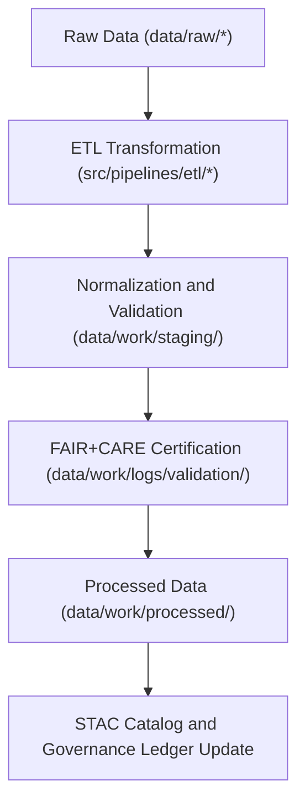

<div align="center">

# 📦 Kansas Frontier Matrix — **Staging Data Workspace**
`data/work/staging/README.md`

**Purpose:** Serves as the controlled workspace for intermediate, pre-publication datasets awaiting validation, normalization, and FAIR+CARE certification.  
This layer bridges raw data ingestion and fully processed outputs, ensuring ethical, reproducible, and schema-compliant data flow within Kansas Frontier Matrix (KFM).

[](../../../docs/standards/faircare-validation.md)
[](../../../LICENSE)
[](../../../docs/architecture/repo-focus.md)

</div>

---

## 📚 Overview

The `data/work/staging/` directory is the **intermediate workspace** where all datasets pass through structured transformation and validation processes before being promoted to `data/work/processed/`.  

This workspace supports:
- Schema normalization and data harmonization across domains.  
- FAIR+CARE metadata injection and ethical review pre-certification.  
- Validation of STAC/DCAT compatibility and checksum consistency.  
- Manual quality assurance and cross-referencing against external sources.  

Datasets in this layer are versioned, timestamped, and linked to both the **ETL logs** (`data/work/logs/etl/`) and the **governance ledger** (`data/reports/audit/data_provenance_ledger.json`).

---

## 🗂️ Directory Layout

```plaintext
data/work/staging/
├── README.md                           # This file — overview of staging workspace
│
├── tabular/                            # Intermediate tabular datasets (CSV, Parquet)
│   ├── tmp/                            # Temporary working directory for tabular ETL
│   │   ├── intake/                     # Intake pipeline temporary workspace
│   │   ├── validation/                 # Validation reports and metadata checks
│   │   └── logs/                       # Pipeline execution and governance logs
│   └── normalized/                     # Harmonized tabular data ready for validation
│
├── spatial/                            # Geospatial datasets pre-validation (GeoJSON, GeoParquet)
│   ├── tmp/                            # Temporary staging for spatial data transformation
│   ├── validation/                     # STAC and schema conformance testing
│   └── logs/                           # ETL and schema audit logs
│
└── metadata/                           # Metadata harmonization workspace
    ├── tmp/                            # Transient metadata conversion artifacts
    ├── validation/                     # FAIR+CARE and schema validation reports
    └── logs/                           # Metadata governance and audit trail
```

---

## ⚙️ Staging Workflow



### Workflow Description:
1. **Ingestion:** Data retrieved from `data/raw/` for transformation.  
2. **Normalization:** Structural alignment and metadata harmonization.  
3. **Validation:** Schema, FAIR+CARE, and checksum verification.  
4. **Promotion:** Certified datasets moved to `data/work/processed/`.  
5. **Governance:** Provenance logs updated with checksum and version metadata.  

---

## 🧩 Example Staging Metadata Record

```json
{
  "id": "staging_tabular_hazards_v9.3.2",
  "dataset_type": "tabular",
  "source": "data/raw/fema/disaster_declarations/disaster_declarations_2025.csv",
  "pipeline": "src/pipelines/etl/hazards_pipeline.py",
  "created": "2025-10-28T15:00:00Z",
  "records_processed": 54321,
  "validation_status": "pending",
  "checksum": "sha256:0a87c2fbbfa9e23b8bcb3d2a9f045fd4225b731f...",
  "fairstatus": "in_review",
  "governance_ref": "data/reports/audit/data_provenance_ledger.json"
}
```

---

## 🧠 FAIR+CARE Governance

| Principle | Implementation in Staging Layer |
|------------|--------------------------------|
| **Findable** | Datasets indexed with version, checksum, and dataset type. |
| **Accessible** | Internal-only access for validators and maintainers. |
| **Interoperable** | Open formats (CSV, JSON, GeoJSON, Parquet) and standardized schema. |
| **Reusable** | Rich metadata and validation history ensure reproducibility. |
| **Collective Benefit** | Ensures ethical, high-quality data publication. |
| **Authority to Control** | FAIR+CARE Council oversees data movement approvals. |
| **Responsibility** | Staging metadata automatically logged to governance ledger. |
| **Ethics** | No sensitive data retained; all data subject to FAIR+CARE review. |

Compliance reports stored in:  
- `data/reports/fair/data_care_assessment.json`  
- `data/reports/audit/data_provenance_ledger.json`

---

## ⚖️ Governance Integration

| Record | Purpose |
|---------|----------|
| `data/reports/audit/data_provenance_ledger.json` | Logs staging activity and dataset promotion approvals. |
| `data/reports/fair/data_care_assessment.json` | FAIR+CARE validation metrics. |
| `data/reports/validation/schema_validation_summary.json` | Schema conformance validation reports. |
| `releases/v9.3.2/manifest.zip` | Global checksum registry of staged datasets. |

---

## 🧾 Data Retention & Promotion Policy

| Staging Category | Retention Duration | Promotion Policy |
|-------------------|--------------------|------------------|
| Tabular TMP | 14 days | Promoted upon validation success. |
| Spatial TMP | 30 days | Retained until STAC validation passes. |
| Metadata TMP | 7 days | Rebuilt during schema updates. |
| Validation Reports | 180 days | Retained for FAIR+CARE audit. |

Automation workflows (`staging_cleanup.yml` and `validation_sync.yml`) handle purge and promotion tasks.

---

## 🧾 Internal Use Citation

```text
Kansas Frontier Matrix (2025). Staging Data Workspace (v9.3.2).
Intermediate transformation and validation workspace supporting FAIR+CARE certification and reproducible data flow.
Restricted to internal ETL, QA, and governance operations.
```

---

## 🧾 Version Notes

| Version | Date | Notes |
|----------|------|--------|
| v9.3.2 | 2025-10-28 | Unified staging structure for tabular, spatial, and metadata workflows under FAIR+CARE governance. |
| v9.2.0 | 2024-07-15 | Added metadata harmonization submodule and checksum verification. |
| v9.0.0 | 2023-01-10 | Established staging workspace for intermediate ETL and validation steps. |

---

<div align="center">

**Kansas Frontier Matrix** · *Data Quality × FAIR+CARE Ethics × Reproducible Staging Pipelines*  
[🔗 Repository](https://github.com/bartytime4life/Kansas-Frontier-Matrix) • [🧭 Docs Portal](../../../docs/) • [⚖️ Governance Ledger](../../../docs/standards/governance/)

</div>