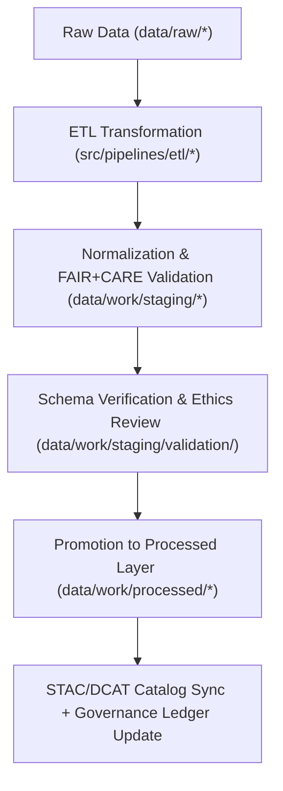

<div align="center">

# 📦 Kansas Frontier Matrix — **Staging Data Workspace**
`data/work/staging/README.md`

**Purpose:** Controlled workspace for intermediate, pre-publication datasets undergoing transformation, validation, and FAIR+CARE certification.  
This layer ensures ethical, reproducible, and schema-compliant transitions between raw inputs and processed outputs in the Kansas Frontier Matrix (KFM).

[](../../../docs/standards/faircare-validation.md)
[](../../../LICENSE)
[](../../../docs/architecture/repo-focus.md)

</div>

---

## 📚 Overview

The `data/work/staging/` directory functions as the **intermediate governance workspace** bridging raw ingestion and fully certified data layers.  
All datasets in this workspace are under review for schema alignment, FAIR+CARE compliance, and catalog readiness.

### Core Responsibilities
- Normalize and validate datasets across KFM domains (tabular, spatial, metadata).  
- Apply FAIR+CARE ethical governance before data promotion.  
- Verify STAC/DCAT compatibility and checksum consistency.  
- Maintain audit trail linking ETL logs and governance ledgers.  

This workspace is integral to the MCP-DL pipeline, enforcing reproducibility and data ethics prior to publication.

---

## 🗂️ Directory Layout

```plaintext
data/work/staging/
├── README.md
│
├── tabular/                            # Intermediate tabular datasets (CSV, Parquet)
│   ├── tmp/                            # Temporary working directory for tabular ETL
│   │   ├── intake/                     # Intake and transformation staging
│   │   ├── validation/                 # Schema and ethics validation reports
│   │   └── logs/                       # ETL execution and audit logs
│   └── normalized/                     # Harmonized tabular data ready for FAIR+CARE validation
│
├── spatial/                            # Intermediate spatial datasets (GeoJSON, GeoParquet)
│   ├── tmp/                            # Temporary spatial transformations
│   ├── validation/                     # STAC/DCAT and CRS validation
│   └── logs/                           # Spatial QA and governance logs
│
└── metadata/                           # Metadata harmonization workspace
    ├── tmp/                            # Transient metadata transformation outputs
    ├── validation/                     # FAIR+CARE and schema audits
    └── logs/                           # Metadata lineage and audit tracking
```

---

## ⚙️ Staging Workflow



### Workflow Description
1. **Ingestion:** Data retrieved from raw sources and transformed by ETL scripts.  
2. **Normalization:** Harmonized schemas and standardized metadata alignment.  
3. **Validation:** FAIR+CARE audits, schema conformance, and checksum verification.  
4. **Certification:** Approved datasets promoted to `data/work/processed/`.  
5. **Governance:** Provenance, validation reports, and telemetry logged in governance ledgers.  

---

## 🧩 Example Staging Metadata Record

```json
{
  "id": "staging_tabular_hazards_v9.4.0",
  "dataset_type": "tabular",
  "source": "data/raw/fema/disaster_declarations/disaster_declarations_2025.csv",
  "pipeline": "src/pipelines/etl/hazards_pipeline.py",
  "created": "2025-11-02T14:00:00Z",
  "records_processed": 55743,
  "validation_status": "in_review",
  "checksum": "sha256:0a87c2fbbfa9e23b8bcb3d2a9f045fd4225b731f...",
  "fairstatus": "pending_certification",
  "telemetry_link": "releases/v9.4.0/focus-telemetry.json",
  "governance_ref": "data/reports/audit/data_provenance_ledger.json"
}
```

---

## 🧠 FAIR+CARE Governance Framework

| Principle | Implementation |
|------------|----------------|
| **Findable** | Each dataset logged with ID, checksum, and version for internal discovery. |
| **Accessible** | Restricted internal access to maintain integrity during validation. |
| **Interoperable** | Open standard formats (CSV, Parquet, GeoJSON) ensure schema consistency. |
| **Reusable** | Validation and audit records provide full reproducibility. |
| **Collective Benefit** | Enables ethical release of verified, high-quality data. |
| **Authority to Control** | FAIR+CARE Council approves promotion to processed layer. |
| **Responsibility** | All staging events recorded in the governance ledger. |
| **Ethics** | Sensitive data excluded; all content under ethics review. |

Compliance records archived in:  
`data/reports/fair/data_care_assessment.json`  
and `data/reports/audit/data_provenance_ledger.json`

---

## ⚖️ Governance Integration

| Record | Description |
|---------|-------------|
| `data/reports/audit/data_provenance_ledger.json` | Logs staging activity, validator actions, and promotion approvals. |
| `data/reports/fair/data_care_assessment.json` | FAIR+CARE validation metrics and ethics assessments. |
| `data/reports/validation/schema_validation_summary.json` | Schema and metadata validation results. |
| `releases/v9.4.0/manifest.zip` | Global checksum and staging registry manifest. |

Governance data synchronized via CI/CD pipelines after each validation cycle.

---

## 🧾 Data Retention & Promotion Policy

| Category | Retention | Promotion Policy |
|-----------|------------|------------------|
| Tabular TMP | 14 days | Promoted upon successful schema and FAIR+CARE validation. |
| Spatial TMP | 30 days | Retained until STAC compliance verified. |
| Metadata TMP | 7 days | Rebuilt each schema iteration or certification cycle. |
| Validation Reports | 180 days | Archived post-certification for audit reproducibility. |

Retention and automation handled via `staging_cleanup.yml` and `validation_sync.yml`.

---

## 🧾 Internal Citation

```text
Kansas Frontier Matrix (2025). Staging Data Workspace (v9.4.0).
Intermediate transformation and validation workspace enabling FAIR+CARE certification and reproducible data governance.
Restricted to internal ETL, QA, and certification operations within the Kansas Frontier Matrix.
```

---

## 🧾 Version Notes

| Version | Date | Notes |
|----------|------|--------|
| v9.4.0 | 2025-11-02 | Added telemetry integration, validation report registry, and enhanced ethics auditing workflows. |
| v9.3.2 | 2025-10-28 | Unified staging structure for tabular, spatial, and metadata workflows under FAIR+CARE governance. |
| v9.2.0 | 2024-07-15 | Added metadata harmonization submodule and checksum verification. |
| v9.0.0 | 2023-01-10 | Established staging workspace for intermediate ETL and validation steps. |

---

<div align="center">

**Kansas Frontier Matrix** · *Data Quality × FAIR+CARE Ethics × Reproducible Staging Pipelines × Telemetry Traceability*  
[🔗 Repository](https://github.com/bartytime4life/Kansas-Frontier-Matrix) • [🧭 Docs Portal](../../../docs/) • [⚖️ Governance Ledger](../../../docs/standards/governance/)

</div>
