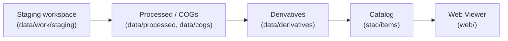

<div align="center">

# 🗂️ Kansas-Frontier-Matrix — Staging Workspace (`data/work/staging/`)

**Mission:** Provide a buffer for **intermediate rasters/vectors**
that are being transformed, clipped, or standardized **before promotion**
to canonical directories (`processed/`, `cogs/`, or `derivatives/`).

This folder acts as a **pre-flight zone** where data is assembled,
checked, and prepared for reproducible use.

[](../../../../.github/workflows/site.yml)
[](../../../../.github/workflows/stac-badges.yml)
[](../../../../.github/workflows/pre-commit.yml)
[](../../../../.github/workflows/codeql.yml)
[](../../../../.github/workflows/trivy.yml)
[](https://codecov.io/gh/bartytime4life/Kansas-Frontier-Matrix)
[](https://stacspec.org/)
[](https://www.cidoc-crm.org/)
[](../../../../docs/templates/experiment.md)
[](../../../../LICENSE)

📌 Subdirectory of `data/work/` (scratch + staging).
📌 Files here are **ephemeral** until validated and promoted.
📌 **Promote when analysis-ready** with checksums + STAC entries.

</div>

---

## 🎯 Purpose

* Hold **clipped subsets** of rasters or vectors.
* Store **intermediate GeoTIFFs** prior to COG conversion.
* Stage **trial reprojected layers** before standardization (EPSG:4326).
* Buffer **temporary exports** from geoprocessing pipelines.

---

## 📂 Typical Contents

* Clipped county-level DEMs before mosaicking.
* Unoptimized TIFFs awaiting conversion to COG.
* Trial reprojected shapefiles/GeoJSONs.
* Intermediate MBTiles/PMTiles built for inspection.
* Any spatial artifact pending cleanup and promotion.

---

## 🚦 Rules

* 🚫 **Not final** — staging files are not analysis-ready.
* ✅ **Promote if reproducible:**

  * → `data/processed/` once cleaned and standardized.
  * → `data/cogs/` if converted to Cloud-Optimized GeoTIFF.
  * → `data/derivatives/` if finalized as an analysis product.
  * Always create/update **STAC Item + provenance** when promoted.
* 🧹 **Safe to delete** — pipelines must regenerate as needed.

---

## 🔄 Lifecycle Position



<!-- END OF MERMAID -->

---

## 🛠️ Usage Examples

### Staging DEM tiles

```bash
# Clip statewide DEM to Ellis County before COG conversion
gdalwarp -cutline data/raw/counties/ellis.geojson \
  -crop_to_cutline data/raw/dem/ks_1m_2018.tif \
  data/work/staging/ellis_dem_stage.tif
```

### Reprojection trial

```bash
# Reproject shapefile to EPSG:4326 for staging
ogr2ogr -t_srs EPSG:4326 \
  data/work/staging/railroads_stage.geojson \
  data/raw/railroads/railroads_1900.shp
```

### Raster merge trial

```bash
# Merge staged tiles before promotion
gdal_merge.py -o data/work/staging/merged_stage.tif data/work/staging/tile_*.tif
```

---

## 🧹 Cleanup Policy

* Wipe staging area manually:

  ```bash
  make clean-staging
  ```

  ```makefile
  clean-staging:
    rm -rf data/work/staging/*
  ```
* CI/CD may auto-clean this directory after jobs.
* **Promote validated outputs before cleanup.**

---

## 🔗 Cross-Disciplinary Connections

While staging is **temporary**, it supports:

* **Cartography & GIS** → clipped or mosaicked topo sheets before COGs.
* **Hydrology** → staged floodplain rasters pre-analysis.
* **Archaeology** → reprojected shapefiles of dig sites before graph insertion.
* **Climate modeling** → staged gridded outputs (Daymet, drought indices).
* **Simulation workflows** → NASA-grade hazard models in trial runs.
* **Ontology alignment** → staging is **pre-semantic** (no graph links until promoted).

---

## ✅ Summary

* `data/work/staging/` = **pre-flight zone for rasters/vectors**.
* Use it to **prep data for standardization**; promote only once reproducible & documented.
* Ephemeral by design → wipe freely, keep only what advances the pipeline.
