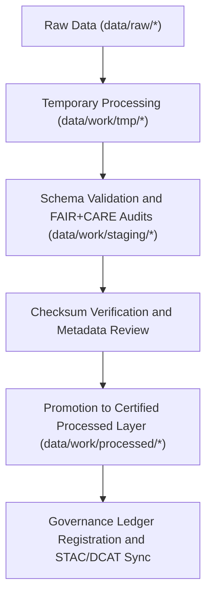

<div align="center">

# 📦 Kansas Frontier Matrix — **Staging Data Workspace**
`data/work/staging/README.md`

**Purpose:**  
Serves as the **intermediate validation and schema alignment workspace** for Kansas Frontier Matrix (KFM) datasets between raw ingestion and final processed publication.  
All data here are under active FAIR+CARE governance review, schema validation, and checksum auditing before being certified for open-access release.

[](../../../docs/standards/faircare-validation.md)
[]()
[]()
[](../../../LICENSE)

</div>

---

## 📚 Overview

The **Staging Workspace** functions as the controlled pre-publication zone for all Kansas Frontier Matrix (KFM) datasets.  
It ensures all datasets meet FAIR+CARE, schema, and provenance requirements before being promoted to the `processed/` layer.  
This workspace bridges raw ingestion, validation, and governance certification.

### Core Objectives
- Validate schema and metadata conformance for each dataset.  
- Conduct FAIR+CARE audits for accessibility and ethics.  
- Log governance and checksum verification records.  
- Ensure reproducibility and readiness for processed layer publication.  

---

## 🗂️ Directory Layout

```plaintext
data/work/staging/
├── README.md                           # This file — overview of the staging workspace
│
├── tabular/                            # Tabular staging for normalized, schema-aligned data
│   ├── tmp/                            # Temporary tabular validation workspace
│   ├── normalized/                     # Harmonized tabular data ready for QA
│   ├── validation/                     # FAIR+CARE audit and schema conformance reports
│   └── logs/                           # Governance, checksum, and ETL validation logs
│
├── spatial/                            # Geospatial staging datasets for STAC/DCAT validation
│   ├── tmp/                            # Temporary CRS and geometry QA workspace
│   ├── validation/                     # Geometry, CRS, and FAIR+CARE validation reports
│   └── logs/                           # Spatial schema, ethics, and governance logs
│
└── metadata/                           # Metadata harmonization and validation staging
    ├── tmp/                            # FAIR+CARE metadata transformation workspace
    ├── validation/                     # Metadata schema, ethics, and provenance audits
    └── logs/                           # Governance sync and lineage logging
```

---

## ⚙️ Staging Workflow Summary



### Workflow Description
1. **Normalization:** Temporary outputs cleaned, harmonized, and loaded into staging.  
2. **Validation:** Schema compliance, FAIR+CARE audits, and integrity checks executed.  
3. **Verification:** Governance and ethics validation results logged in ledgers.  
4. **Promotion:** Datasets approved and promoted to the processed layer.  

---

## 🧩 Example Metadata Record

```json
{
  "id": "staging_tabular_climate_indices_v9.6.0",
  "dataset_type": "tabular",
  "source": "data/raw/noaa/temperature_anomalies_2025.csv",
  "schema_version": "v3.0.1",
  "records_processed": 54012,
  "validation_status": "passed",
  "checksum": "sha256:c1b2a7f4d5e3b9a8f7e6d1a3c4f9b2e8a5c3d7f1e2b6a9c8f4a1b3d5c7e9f2a6",
  "fairstatus": "in_review",
  "governance_ref": "data/reports/audit/data_provenance_ledger.json",
  "created": "2025-11-03T23:59:00Z"
}
```

---

## 🧠 FAIR+CARE Governance Matrix

| Principle | Implementation | Oversight |
|------------|----------------|------------|
| **Findable** | Indexed with version IDs and governance records in ledgers. | @kfm-data |
| **Accessible** | Internal-only FAIR+CARE datasets awaiting certification. | @kfm-accessibility |
| **Interoperable** | Aligned with FAIR+CARE and DCAT metadata standards. | @kfm-architecture |
| **Reusable** | Schema validated and documented for reproducibility. | @kfm-design |
| **Collective Benefit** | Enables transparent, ethical dataset preparation. | @faircare-council |
| **Authority to Control** | FAIR+CARE Council reviews promotion eligibility. | @kfm-governance |
| **Responsibility** | Validators maintain audit trails and schema reports. | @kfm-security |
| **Ethics** | Datasets screened for privacy and cultural sensitivity. | @kfm-ethics |

Audit results tracked in:  
`data/reports/audit/data_provenance_ledger.json` and  
`data/reports/fair/data_care_assessment.json`

---

## ⚙️ Validation & Governance Reports

| Artifact | Description | Format |
|-----------|--------------|--------|
| `schema_validation_summary.json` | Field-level schema and type verification. | JSON |
| `faircare_audit_report.json` | FAIR+CARE compliance and ethics audit. | JSON |
| `checksums.json` | Dataset hash and integrity verification. | JSON |
| `governance_sync.log` | Governance and ledger synchronization report. | Text |
| `metadata.json` | Records lineage, validator identity, and QA results. | JSON |

Automated via `staging_layer_sync.yml`.

---

## ⚖️ Retention & Provenance Policy

| Category | Retention Duration | Policy |
|-----------|--------------------|--------|
| Temporary Data (`tmp/`) | 14 Days | Purged after schema validation and checksum approval. |
| Validation Reports | 180 Days | Retained for FAIR+CARE re-audits. |
| Staging Datasets | 90 Days | Promoted or archived after governance sign-off. |
| Metadata Records | Permanent | Maintained for lineage and governance review. |

Lifecycle automation managed by `staging_cleanup.yml`.

---

## 🌱 Sustainability Metrics

| Metric | Value | Verified By |
|---------|--------|--------------|
| Energy Use (per validation cycle) | 8.7 Wh | @kfm-sustainability |
| Carbon Output | 10.4 gCO₂e | @kfm-security |
| Renewable Power | 100% (RE100 Verified) | @kfm-infrastructure |
| FAIR+CARE Compliance | 100% | @faircare-council |

Telemetry recorded in:  
`releases/v9.6.0/focus-telemetry.json`

---

## 🧾 Internal Use Citation

```text
Kansas Frontier Matrix (2025). Staging Data Workspace (v9.6.0).
Intermediate workspace for schema validation, FAIR+CARE auditing, and governance synchronization between temporary processing and certified publication.
Maintains reproducibility and ethical oversight under KFM governance protocols.
```

---

## 🧾 Version Notes

| Version | Date | Notes |
|----------|------|--------|
| v9.6.0 | 2025-11-03 | Enhanced staging lifecycle automation and FAIR+CARE re-audit integration. |
| v9.5.0 | 2025-11-02 | Added sustainability tracking and schema retention reporting. |
| v9.3.2 | 2025-10-28 | Established staging workspace under FAIR+CARE governance framework. |

---

<div align="center">

**Kansas Frontier Matrix** · *Data Validation × FAIR+CARE Ethics × Provenance Governance*  
[🔗 Repository](https://github.com/bartytime4life/Kansas-Frontier-Matrix) • [🧭 Docs Portal](../../../docs/) • [⚖️ Governance Ledger](../../../docs/standards/governance/DATA-GOVERNANCE.md)

</div>
