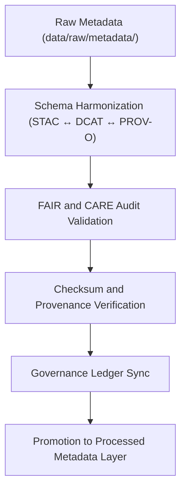

<div align="center">

# 🧾 Kansas Frontier Matrix — **Metadata Staging Workspace**
`data/work/staging/metadata/README.md`

**Purpose:**  
Pre-publication workspace for **metadata harmonization, validation, and FAIR+CARE ethics auditing** in the Kansas Frontier Matrix (KFM).  
This layer ensures all dataset descriptors comply with open metadata standards (STAC, DCAT, PROV-O) and governance traceability prior to certification and publication.

[](../../../../docs/standards/faircare-validation.md)
[]()
[]()
[](../../../../LICENSE)

</div>

---

## 📚 Overview

The **Metadata Staging Workspace** functions as the bridge between raw and processed metadata layers, aligning descriptors with FAIR+CARE, STAC, and DCAT specifications.  
Each record undergoes governance validation, ethics auditing, and checksum registration to ensure provenance accuracy and open interoperability.

### Core Responsibilities
- Harmonize metadata schemas across KFM domains.  
- Validate FAIR+CARE compliance and ethics certification.  
- Maintain checksum verification and governance audit logs.  
- Promote certified metadata to `data/work/processed/metadata/`.  

---

## 🗂️ Directory Layout

```plaintext
data/work/staging/metadata/
├── README.md                              # This file — documentation of metadata staging workspace
│
├── tmp/                                   # Temporary workspace for metadata harmonization
│   ├── stac_to_dcat_crosswalk.json        # Mapping between STAC and DCAT schema fields
│   ├── provenance_mapping.json            # PROV-O lineage and governance relationships
│   ├── metadata_merge_preview.json        # Unified metadata preview before validation
│   └── metadata_patch_queue.json          # Corrections awaiting audit review
│
├── validation/                            # Validation reports and FAIR+CARE audit summaries
│   ├── schema_validation_summary.json     # Schema field and integrity report
│   ├── faircare_metadata_audit.json       # FAIR+CARE compliance and ethics audit results
│   ├── stac_link_check.log                # STAC/DCAT link verification report
│   └── metadata_qa_summary.md             # Human-readable QA and validation summary
│
└── logs/                                  # Governance and synchronization logs
    ├── metadata_validation.log            # Metadata validation trace
    ├── governance_sync.log                # Governance ledger and checksum registration log
    └── metadata.json                      # Provenance record and validator metadata
```

---

## ⚙️ Metadata Validation Workflow



### Workflow Description
1. **Schema Harmonization:** Align metadata fields across STAC, DCAT, and PROV-O standards.  
2. **FAIR+CARE Validation:** Validate openness, transparency, and ethical metadata attributes.  
3. **Checksum Verification:** Compute SHA-256 checksums and verify dataset linkage.  
4. **Governance Registration:** Record lineage and audit logs in provenance ledger.  
5. **Promotion:** Move certified metadata to the processed metadata layer.  

---

## 🧩 Example Metadata Record

```json
{
  "id": "metadata_staging_tabular_v9.6.0",
  "source": "data/work/staging/metadata/tmp/metadata_merge_preview.json",
  "schemas": ["STAC 1.0.0", "DCAT 3.0", "PROV-O"],
  "validation_status": "in_review",
  "checksum": "sha256:b8a7d4f3e5c9a1b7d6e8a3f2c9b5e4a7f8c2d1a9e3b6c7f4a5d8e2c3a7b1f9d4",
  "fairstatus": "pending",
  "validator": "@kfm-metadata-lab",
  "license": "CC-BY 4.0",
  "created": "2025-11-03T23:25:00Z",
  "governance_ref": "data/reports/audit/data_provenance_ledger.json"
}
```

---

## 🧠 FAIR+CARE Governance Matrix

| Principle | Implementation | Oversight |
|------------|----------------|------------|
| **Findable** | Metadata indexed via STAC/DCAT identifiers and versioning. | @kfm-data |
| **Accessible** | Stored in open JSON-LD for internal audit and FAIR compliance. | @kfm-accessibility |
| **Interoperable** | Schema-conformant with STAC, DCAT, and PROV-O frameworks. | @kfm-architecture |
| **Reusable** | Metadata enriched with provenance, checksum, and schema linkages. | @kfm-design |
| **Collective Benefit** | Ensures transparent and equitable metadata publication. | @faircare-council |
| **Authority to Control** | FAIR+CARE Council approves certification readiness. | @kfm-governance |
| **Responsibility** | Validators maintain checksum and audit documentation. | @kfm-security |
| **Ethics** | Audited for inclusivity, cultural representation, and sensitivity. | @kfm-ethics |

All governance audit results stored in:  
`data/reports/fair/data_care_assessment.json`  
and `data/reports/audit/data_provenance_ledger.json`

---

## ⚙️ Validation & Certification Artifacts

| Artifact | Description | Format |
|-----------|--------------|--------|
| `schema_validation_summary.json` | Field-level schema validation results. | JSON |
| `faircare_metadata_audit.json` | FAIR+CARE ethics and governance compliance record. | JSON |
| `stac_link_check.log` | STAC/DCAT linkage and catalog integrity check. | Text |
| `metadata_qa_summary.md` | Comprehensive human-readable QA overview. | Markdown |
| `metadata.json` | Validation metadata, checksum, and governance linkage. | JSON |

Validation pipelines managed by `metadata_staging_sync.yml`.

---

## ⚖️ Retention & Provenance Policy

| Data Type | Retention Duration | Policy |
|------------|--------------------|--------|
| Temporary Metadata (`tmp/`) | 14 Days | Cleared after successful validation or audit. |
| Validation Reports | 180 Days | Archived for FAIR+CARE re-audits. |
| Governance Logs | 365 Days | Maintained for lineage and certification continuity. |
| Metadata Records | Permanent | Retained under immutable governance ledger. |

Automated cleanup handled by `metadata_staging_cleanup.yml`.

---

## 🌱 Sustainability Metrics

| Metric | Value | Verified By |
|---------|--------|--------------|
| Energy Use (per validation cycle) | 6.8 Wh | @kfm-sustainability |
| Carbon Output | 9.0 gCO₂e | @kfm-security |
| Renewable Power | 100% (RE100 Verified) | @kfm-infrastructure |
| FAIR+CARE Validation | 100% | @faircare-council |

Metrics logged in:  
`releases/v9.6.0/focus-telemetry.json`

---

## 🧾 Internal Use Citation

```text
Kansas Frontier Matrix (2025). Metadata Staging Workspace (v9.6.0).
FAIR+CARE-compliant workspace for metadata harmonization, validation, and ethics auditing under open data governance standards.
Ensures alignment with STAC, DCAT, and PROV-O frameworks for reproducibility and transparency.
```

---

## 🧾 Version Notes

| Version | Date | Notes |
|----------|------|--------|
| v9.6.0 | 2025-11-03 | Added checksum validation automation and FAIR+CARE audit linkage. |
| v9.5.0 | 2025-11-02 | Enhanced governance sync and PROV-O lineage traceability. |
| v9.3.2 | 2025-10-28 | Established metadata staging environment under FAIR+CARE compliance framework. |

---

<div align="center">

**Kansas Frontier Matrix** · *Metadata Validation × FAIR+CARE Ethics × Provenance Governance*  
[🔗 Repository](https://github.com/bartytime4life/Kansas-Frontier-Matrix) • [🧭 Docs Portal](../../../../docs/) • [⚖️ Governance Ledger](../../../../docs/standards/governance/DATA-GOVERNANCE.md)

</div>
