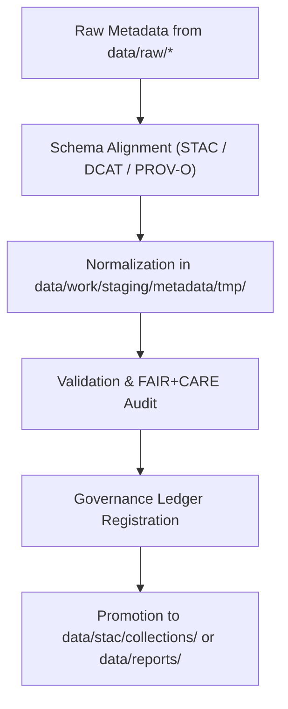

<div align="center">

# 🧾 Kansas Frontier Matrix — **Metadata Staging Workspace**
`data/work/staging/metadata/README.md`

**Purpose:** Dedicated workspace for metadata normalization, schema validation, and FAIR+CARE certification of dataset descriptors within Kansas Frontier Matrix (KFM).  
This layer ensures that all datasets—tabular, spatial, and archival—adhere to open metadata standards (STAC, DCAT, PROV-O) before publication.

[](../../../../docs/standards/faircare-validation.md)
[](../../../../LICENSE)
[](../../../../docs/architecture/repo-focus.md)

</div>

---

## 📚 Overview

The `data/work/staging/metadata/` directory serves as the **intermediate environment for preparing, validating, and harmonizing dataset metadata** prior to integration into the STAC catalog and governance ledger.  
It plays a key role in ensuring metadata completeness, provenance accuracy, and alignment with FAIR+CARE principles.

This workspace supports:
- Crosswalks between STAC 1.0, DCAT 3.0, and internal KFM schemas.  
- Validation of dataset provenance using PROV-O and schema.org metadata models.  
- FAIR+CARE ethical metadata audits and governance review.  
- JSON-LD enrichment for semantic interoperability across data domains.  

---

## 🗂️ Directory Layout

```plaintext
data/work/staging/metadata/
├── README.md                             # This file — documentation of metadata staging workspace
│
├── tmp/                                  # Temporary metadata conversion and harmonization files
│   ├── stac_to_dcat_crosswalk.json
│   ├── provenance_mapping.json
│   └── metadata_merge_preview.json
│
├── validation/                           # Metadata validation reports
│   ├── schema_validation_summary.json
│   ├── faircare_metadata_audit.json
│   ├── stac_link_check.log
│   └── metadata_qa_summary.md
│
└── logs/                                 # Logging and governance integration
    ├── metadata_validation.log
    ├── governance_sync.log
    └── metadata.json
```

---

## ⚙️ Metadata Workflow



### Description:
1. **Alignment:** Metadata harmonized between STAC, DCAT, and internal schemas.  
2. **Normalization:** Temporary files generated to merge metadata fields and fix gaps.  
3. **Validation:** Schema compliance and FAIR+CARE audits executed automatically.  
4. **Governance:** Provenance entries synced to governance ledger for traceability.  
5. **Promotion:** Certified metadata moved to STAC catalog and processed datasets.

---

## 🧩 Example Metadata Record

```json
{
  "id": "metadata_hazards_staging_v9.3.2",
  "source_dataset": "data/archive/hazards/hazards_v9.3.2/",
  "schema_versions": ["STAC 1.0", "DCAT 3.0"],
  "validator": "@kfm-metadata-lab",
  "created": "2025-10-28T14:30:00Z",
  "validation_status": "compliant",
  "checksum": "sha256:29a6c0b97a11e76bcd7ff32d88b2ab1c82a1b01e...",
  "linked_governance_ledger": "data/reports/audit/data_provenance_ledger.json",
  "fairstatus": "certified"
}
```

---

## 🧠 FAIR+CARE Metadata Compliance

| Principle | Implementation in Metadata Staging |
|------------|----------------------------------|
| **Findable** | Metadata registered with global STAC IDs and cross-schema links. |
| **Accessible** | Standardized JSON-LD and DCAT export formats. |
| **Interoperable** | Dual validation for STAC 1.0 and DCAT 3.0 schema conformance. |
| **Reusable** | Provenance and license metadata embedded in every record. |
| **Collective Benefit** | Ensures open, ethical sharing of structured metadata. |
| **Authority to Control** | FAIR+CARE Council oversees metadata harmonization. |
| **Responsibility** | Metadata validators record decisions in governance ledger. |
| **Ethics** | Sensitive metadata fields (e.g., location of cultural sites) reviewed ethically. |

Governance validation results stored in:  
- `data/reports/fair/data_care_assessment.json`  
- `data/reports/audit/data_provenance_ledger.json`  

---

## ⚙️ Metadata Validation Tools

| Tool | Function | Output |
|------|-----------|--------|
| `stac-validator` | Checks STAC compliance and link integrity | `validation/stac_link_check.log` |
| `jsonschema-cli` | Validates schema alignment and structure | `validation/schema_validation_summary.json` |
| `faircare-validator` | Runs FAIR+CARE metadata audit | `validation/faircare_metadata_audit.json` |
| `prov-audit.py` | Validates PROV-O and governance traceability | `logs/governance_sync.log` |

All validation results appended to `metadata_qa_summary.md` and summarized in governance records.

---

## ⚖️ Governance & Provenance Integration

| Record | Description |
|---------|-------------|
| `validation/schema_validation_summary.json` | Field-level schema audit. |
| `validation/faircare_metadata_audit.json` | FAIR+CARE compliance report. |
| `logs/governance_sync.log` | Metadata synchronization with governance ledger. |
| `data/reports/audit/data_provenance_ledger.json` | Final metadata lineage record. |

Metadata promotion automatically triggers governance synchronization workflows (`metadata_sync.yml`).

---

## 🧾 Retention Policy

| File Type | Retention Duration | Policy |
|------------|--------------------|--------|
| Temporary Files (`tmp/`) | 7 days | Purged automatically after validation success. |
| Validation Reports | 180 days | Retained for FAIR+CARE review cycles. |
| Governance Logs | 365 days | Archived for provenance continuity. |
| Metadata Summaries | Permanent | Stored in STAC catalog and governance repository. |

Automation handled by `metadata_cleanup.yml` and `metadata_audit.yml`.

---

## 🧾 Internal Use Citation

```text
Kansas Frontier Matrix (2025). Metadata Staging Workspace (v9.3.2).
Dedicated workspace for harmonizing and validating dataset metadata across STAC, DCAT, and PROV-O standards under FAIR+CARE governance.
Restricted to internal QA and certification workflows.
```

---

## 🧾 Version Notes

| Version | Date | Notes |
|----------|------|--------|
| v9.3.2 | 2025-10-28 | Added FAIR+CARE metadata audit integration and provenance crosswalk validation. |
| v9.2.0 | 2024-07-15 | Implemented STAC–DCAT schema harmonization module. |
| v9.0.0 | 2023-01-10 | Established metadata staging directory and FAIR compliance structure. |

---

<div align="center">

**Kansas Frontier Matrix** · *Metadata Quality × FAIR+CARE Compliance × Provenance Transparency*  
[🔗 Repository](https://github.com/bartytime4life/Kansas-Frontier-Matrix) • [🧭 Docs Portal](../../../../docs/) • [⚖️ Governance Ledger](../../../../docs/standards/governance/)

</div>