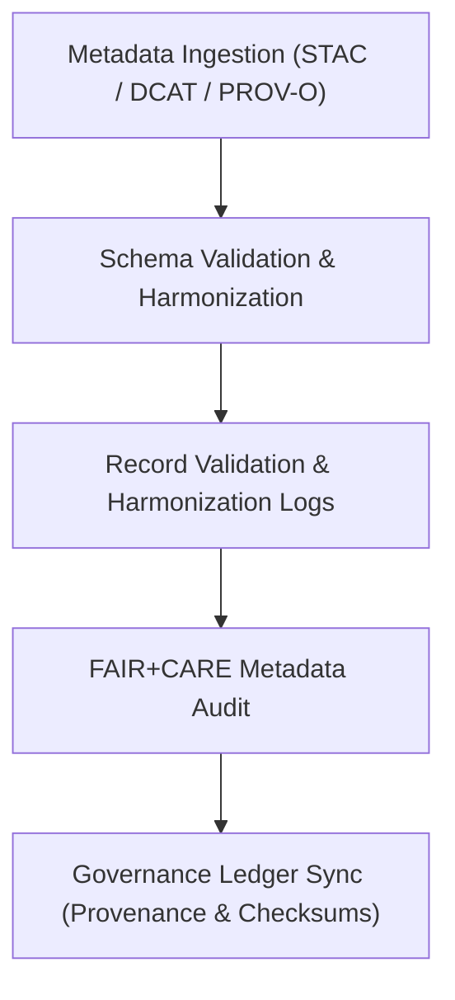

<div align="center">

# 🧾 Kansas Frontier Matrix — **Metadata Logs**
`data/work/staging/metadata/logs/README.md`

**Purpose:** Centralized log repository for metadata validation, harmonization, and FAIR+CARE audit activities across the Kansas Frontier Matrix (KFM).  
Delivers full traceability for schema crosswalks, updates, and provenance synchronization under MCP-DL v6.3 governance.

[](../../../../../docs/standards/faircare-validation.md)
[](../../../../../LICENSE)
[](../../../../../docs/architecture/repo-focus.md)

</div>

---

## 📚 Overview

The `data/work/staging/metadata/logs/` directory records all **metadata-related processing and validation events**, including STAC–DCAT crosswalks, PROV-O lineage updates, schema changes, and FAIR+CARE compliance reports.  
Logs are machine-readable (JSON, NDJSON, or text) and retained per governance policy to support reproducibility, interoperability, and ethics accountability.

### Primary Functions
- Capture schema transformation events and crosswalks (STAC ↔ DCAT ↔ PROV-O).  
- Record FAIR+CARE audit outputs for metadata ethics compliance.  
- Synchronize metadata log hashes and references to the governance ledger.  
- Track validation outcomes, issue remediation, and schema version diffs.

---

## 🗂️ Directory Layout

```plaintext
data/work/staging/metadata/logs/
├── README.md                           # This file — documentation of metadata logs
│
├── metadata_validation.log              # Schema validation and structural consistency trace (text/ndjson)
├── governance_sync.log                  # Synchronization log for governance ledger updates (text)
├── metadata_harmonization_trace.json    # Crosswalk events across STAC/DCAT/PROV-O (JSON)
└── metadata.json                        # Log-level runtime, checksum, and governance metadata (JSON)
```

---

## ⚙️ Metadata Logging Workflow



### Description
1. **Ingestion:** Pull and prepare inputs from `data/work/staging/metadata/tmp/`.  
2. **Validation:** Enforce schema and semantic alignment across standards.  
3. **Logging:** Persist validation and crosswalk events (with timestamps, checksums, validator IDs).  
4. **FAIR+CARE Audit:** Record ethics and accessibility assurance outcomes.  
5. **Governance Sync:** Append log hashes and references to the provenance ledger.

---

## 🧩 Example Metadata Log Record

```json
{
  "id": "metadata_hazards_sync_2025Q4",
  "source_schemas": ["STAC 1.0.0", "DCAT 3.0", "PROV-O"],
  "created": "2025-11-02T15:12:00Z",
  "validator": "@kfm-metadata-lab",
  "records_processed": 18,
  "issues_detected": 0,
  "checksum": "sha256:09a4e5bbf37e98ab45b39f7cd682e47230a90a4e...",
  "fairstatus": "compliant",
  "telemetry_link": "releases/v9.4.0/focus-telemetry.json",
  "governance_ledger_ref": "data/reports/audit/data_provenance_ledger.json"
}
```

---

## 🧠 FAIR+CARE Governance Alignment

| Principle | Implementation |
|------------|----------------|
| **Findable** | Log entries indexed by schema type, dataset, validator, and timestamp. |
| **Accessible** | Machine-readable JSON/NDJSON logs available to governance reviewers. |
| **Interoperable** | Log structures align with DCAT facets for downstream analytics. |
| **Reusable** | Each log references provenance and includes validator attribution and checksums. |
| **Collective Benefit** | Transparent metadata workflows improve public trust and reuse. |
| **Authority to Control** | FAIR+CARE Council validates schema updates prior to catalog promotion. |
| **Responsibility** | Maintainers must record harmonization steps and remediations in logs. |
| **Ethics** | Sensitive identifiers are redacted before log archival or publication. |

Audit and validation results integrated with:  
- `data/reports/audit/data_provenance_ledger.json`  
- `data/reports/fair/data_care_assessment.json`

---

## ⚙️ Log Categories

| File | Purpose | Format |
|------|----------|--------|
| `metadata_validation.log` | Tracks schema validation, issues, and resolutions. | Text/NDJSON |
| `governance_sync.log` | Records synchronization with governance ledger and outcomes. | Text |
| `metadata_harmonization_trace.json` | Documents crosswalk mappings and changes across standards. | JSON |
| `metadata.json` | Captures runtime, checksum, validator info, and governance pointers. | JSON |

---

## ⚖️ Governance & Provenance Integration

| Record | Description |
|---------|-------------|
| `metadata.json` | Validator ID, schema types processed, log checksums, and runtime info. |
| `data/reports/audit/data_provenance_ledger.json` | Immutable ledger for validation lineage and log registration. |
| `data/reports/validation/schema_validation_summary.json` | Aggregated schema validation results. |
| `releases/v9.4.0/manifest.zip` | Manifest of log hashes and release artifacts. |

All logging activities are synchronized via **`metadata_log_sync.yml`**.

---

## 🧾 Retention Policy

| Log Type | Retention Duration | Policy |
|-----------|--------------------|--------|
| Validation Logs | 180 days | Archived when superseded by new schema versions. |
| Governance Sync Logs | 365 days | Retained for audit; key entries mirrored in ledger permanently. |
| Harmonization Traces | 90 days | Retained for FAIR+CARE schema audits and crosswalk reviews. |
| Runtime Metadata | Permanent | Stored for reproducibility and release traceability. |

Cleanup automation handled by **`metadata_logs_cleanup.yml`**.

---

## 🧾 Internal Use Citation

```text
Kansas Frontier Matrix (2025). Metadata Logs (v9.4.0).
Centralized logging for schema harmonization, metadata validation, and FAIR+CARE audit activities under MCP-DL v6.3 governance.
Restricted to internal reproducibility and governance verification.
```

---

## 🧾 Version Notes

| Version | Date | Notes |
|----------|------|--------|
| v9.4.0 | 2025-11-02 | Added telemetry integration, validation report registry, and enhanced crosswalk traceability. |
| v9.3.2 | 2025-10-28 | Introduced harmonization trace and governance sync integration. |
| v9.2.0 | 2024-07-15 | Added FAIR+CARE metadata validation tracking. |
| v9.0.0 | 2023-01-10 | Established metadata logging structure under FAIR+CARE governance. |

---

<div align="center">

**Kansas Frontier Matrix** · *Metadata Transparency × FAIR+CARE Accountability × Provenance Governance × Telemetry Traceability*  
[🔗 Repository](https://github.com/bartytime4life/Kansas-Frontier-Matrix) • [🧭 Docs Portal](../../../../../docs/) • [⚖️ Governance Ledger](../../../../../docs/standards/governance/)

</div>
