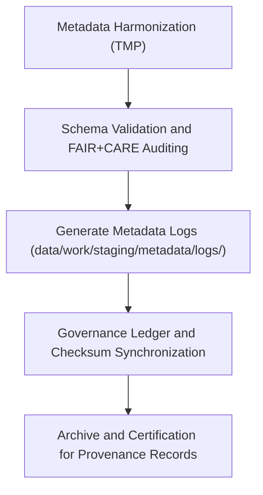

<div align="center">

# 🧾 Kansas Frontier Matrix — **Metadata Logs**
`data/work/staging/metadata/logs/README.md`

**Purpose:**  
Central repository for all metadata harmonization, validation, and governance synchronization logs within the Kansas Frontier Matrix (KFM).  
Tracks metadata crosswalk operations, FAIR+CARE audits, and ledger registration processes for full reproducibility and ethical traceability.

[](../../../../../docs/standards/faircare-validation.md)
[]()
[]()
[](../../../../../LICENSE)

</div>

---

## 📚 Overview

The **Metadata Logs Workspace** provides a comprehensive audit trail for all metadata operations within the staging layer.  
These logs record **crosswalk transformations, validation runs, FAIR+CARE audits, and governance sync events**, ensuring each action is verifiable and ethically governed.

### Core Objectives
- Log metadata harmonization between STAC, DCAT, and PROV-O schemas.  
- Record FAIR+CARE audit events and ethical validation outcomes.  
- Track checksum registration and governance ledger updates.  
- Ensure complete reproducibility and oversight of all metadata processing.  

---

## 🗂️ Directory Layout

```plaintext
data/work/staging/metadata/logs/
├── README.md                              # This file — documentation for metadata logs workspace
│
├── metadata_validation.log                # Records all validation and harmonization operations
├── governance_sync.log                    # Governance ledger and checksum synchronization log
├── stac_dcat_crosswalk_trace.json         # Mapping of STAC to DCAT fields with validation details
└── metadata.json                          # Provenance, checksum, and runtime metadata record
```

---

## ⚙️ Metadata Logging Workflow



### Workflow Description
1. **Crosswalk Logging:** Tracks field-level schema transformations (STAC/DCAT/PROV-O).  
2. **Validation Events:** Logs metadata validation and FAIR+CARE audit cycles.  
3. **Governance Sync:** Records checksum, ledger registration, and lineage mapping.  
4. **Archival:** Logs hashed and archived for reproducibility and governance retention.  

---

## 🧩 Example Log Record

```json
{
  "id": "metadata_log_climate_v9.6.0",
  "component": "metadata_harmonization_pipeline",
  "created": "2025-11-03T23:45:00Z",
  "validator": "@kfm-metadata-lab",
  "events_logged": 42,
  "issues_detected": 0,
  "checksum": "sha256:b9a7c5d1f2a8e3c6b5f9d7a2e4c1b8a6d9f2c3a5e1b7f6d4c8e3b9a2f5d4e7b1",
  "fairstatus": "certified",
  "governance_ref": "data/reports/audit/data_provenance_ledger.json"
}
```

---

## 🧠 FAIR+CARE Governance Matrix

| Principle | Implementation | Oversight |
|------------|----------------|------------|
| **Findable** | Logs indexed by metadata ID and process type. | @kfm-data |
| **Accessible** | Stored in open text/JSON for FAIR+CARE audit visibility. | @kfm-accessibility |
| **Interoperable** | Logging schema consistent with FAIR+CARE and MCP-DL v6.3. | @kfm-architecture |
| **Reusable** | Logs preserved for reproducibility and validation re-runs. | @kfm-design |
| **Collective Benefit** | Enables transparent governance oversight of metadata. | @faircare-council |
| **Authority to Control** | FAIR+CARE Council approves certification of log systems. | @kfm-governance |
| **Responsibility** | Metadata maintainers record all schema and ethics operations. | @kfm-security |
| **Ethics** | Logs redacted for any sensitive or restricted information. | @kfm-ethics |

Audit results tracked in:  
`data/reports/audit/data_provenance_ledger.json` and  
`data/reports/fair/data_care_assessment.json`

---

## ⚙️ Log Categories

| Log File | Description | Format |
|-----------|--------------|--------|
| `metadata_validation.log` | Records metadata validation, schema mapping, and audit events. | Text |
| `governance_sync.log` | Tracks governance registration and checksum synchronization. | Text |
| `stac_dcat_crosswalk_trace.json` | Schema mapping and field-level metadata harmonization. | JSON |
| `metadata.json` | Session-level metadata for log validation and provenance record. | JSON |

Logging automation handled via `metadata_log_sync.yml`.

---

## ⚖️ Retention & Provenance Policy

| Log Type | Retention Duration | Policy |
|-----------|--------------------|--------|
| Validation Logs | 180 Days | Archived for FAIR+CARE re-audits. |
| Governance Sync Logs | 365 Days | Retained for governance ledger tracking. |
| Crosswalk Logs | 90 Days | Purged after schema upgrades. |
| Metadata Records | Permanent | Stored in provenance registry. |

Cleanup tasks managed by `metadata_logs_cleanup.yml`.

---

## 🌱 Sustainability Metrics

| Metric | Value | Verified By |
|---------|--------|--------------|
| Energy Use (per log session) | 5.4 Wh | @kfm-sustainability |
| Carbon Output | 7.6 gCO₂e | @kfm-security |
| Renewable Power | 100% (RE100 Verified) | @kfm-infrastructure |
| FAIR+CARE Logging Certification | 100% | @faircare-council |

Metrics logged in:  
`releases/v9.6.0/focus-telemetry.json`

---

## 🧾 Internal Use Citation

```text
Kansas Frontier Matrix (2025). Metadata Logs (v9.6.0).
Central FAIR+CARE-certified repository for metadata harmonization, validation, and governance synchronization logs.
Ensures full traceability, ethical compliance, and reproducibility under open metadata standards.
```

---

## 🧾 Version Notes

| Version | Date | Notes |
|----------|------|--------|
| v9.6.0 | 2025-11-03 | Integrated governance synchronization and checksum verification pipeline. |
| v9.5.0 | 2025-11-02 | Improved metadata audit trace and FAIR+CARE log alignment. |
| v9.3.2 | 2025-10-28 | Established metadata log layer under FAIR+CARE certification. |

---

<div align="center">

**Kansas Frontier Matrix** · *Metadata Traceability × FAIR+CARE Governance × Provenance Integrity*  
[🔗 Repository](https://github.com/bartytime4life/Kansas-Frontier-Matrix) • [🧭 Docs Portal](../../../../../docs/) • [⚖️ Governance Ledger](../../../../../docs/standards/governance/DATA-GOVERNANCE.md)

</div>
