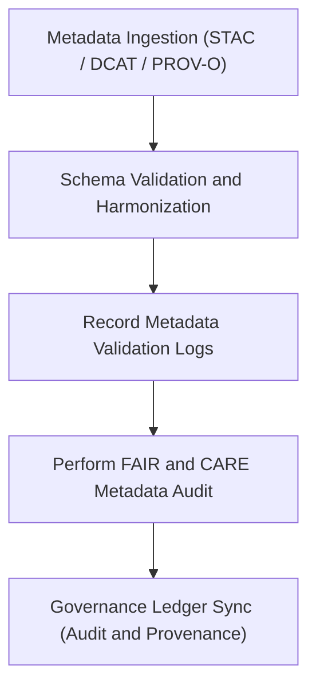

<div align="center">

# 🧾 Kansas Frontier Matrix — **Metadata Logs**
`data/work/staging/metadata/logs/README.md`

**Purpose:** Centralized log repository for all metadata validation, harmonization, and FAIR+CARE audit activities conducted within the Kansas Frontier Matrix (KFM).  
Ensures full traceability of metadata crosswalks, schema updates, and provenance synchronization under MCP-DL v6.3 governance.

[](../../../../../docs/standards/faircare-validation.md)
[](../../../../../LICENSE)
[](../../../../../docs/architecture/repo-focus.md)

</div>

---

## 📚 Overview

The `data/work/staging/metadata/logs/` directory records all **metadata-related processing and validation events**, including schema harmonization, STAC–DCAT crosswalk verification, and FAIR+CARE compliance reports.  
These logs provide a complete audit trail for metadata governance, ensuring reproducibility, interoperability, and ethical accountability.

### Primary Functions:
- Record metadata schema transformation events (STAC → DCAT → PROV-O).  
- Capture FAIR+CARE audit summaries for metadata ethics compliance.  
- Maintain governance synchronization logs with provenance ledger.  
- Track metadata validation, errors, and schema corrections.  

All logs are machine-readable (JSON or NDJSON) and stored for long-term FAIR+CARE compliance audits.

---

## 🗂️ Directory Layout

```plaintext
data/work/staging/metadata/logs/
├── README.md                           # This file — documentation of metadata logs
│
├── metadata_validation.log              # Schema validation and structural consistency trace
├── governance_sync.log                  # Synchronization log for governance ledger updates
├── metadata_harmonization_trace.json    # Crosswalk events between metadata standards
└── metadata.json                        # Log-level runtime and governance metadata
```

---

## ⚙️ Metadata Logging Workflow



### Description:
1. **Ingestion:** Metadata records pulled from `data/work/staging/metadata/tmp/` and harmonized.  
2. **Validation:** Each record validated for schema and semantic alignment.  
3. **Logging:** Validation events recorded with timestamps, checksum, and validator ID.  
4. **FAIR+CARE Audit:** Reports ethical compliance and metadata transparency.  
5. **Governance Sync:** Provenance and log hashes appended to audit ledger.

---

## 🧩 Example Metadata Log Record

```json
{
  "id": "metadata_hazards_sync_2025Q4",
  "source_schemas": ["STAC 1.0.0", "DCAT 3.0", "PROV-O"],
  "created": "2025-10-28T15:50:00Z",
  "validator": "@kfm-metadata-lab",
  "records_processed": 18,
  "issues_detected": 0,
  "checksum": "sha256:09a4e5bbf37e98ab45b39f7cd682e47230a90a4e...",
  "fairstatus": "compliant",
  "governance_ledger_ref": "data/reports/audit/data_provenance_ledger.json"
}
```

---

## 🧠 FAIR+CARE Governance Alignment

| Principle | Implementation |
|------------|----------------|
| **Findable** | Log entries indexed by schema type, dataset, and validation timestamp. |
| **Accessible** | Machine-readable JSON logs accessible to governance reviewers. |
| **Interoperable** | Logs structured per DCAT metadata model for analytics. |
| **Reusable** | Includes provenance references and validator attribution. |
| **Collective Benefit** | Promotes transparency and interoperability in metadata workflows. |
| **Authority to Control** | FAIR+CARE Council validates schema updates before publication. |
| **Responsibility** | Metadata maintainers must record harmonization steps in logs. |
| **Ethics** | Sensitive identifiers redacted before log publication. |

Audit and validation results integrated with:  
- `data/reports/audit/data_provenance_ledger.json`  
- `data/reports/fair/data_care_assessment.json`

---

## ⚙️ Log Categories

| File | Purpose | Format |
|------|----------|--------|
| `metadata_validation.log` | Tracks schema-level validation and error details. | Text |
| `governance_sync.log` | Records metadata synchronization to governance ledger. | Text |
| `metadata_harmonization_trace.json` | Captures STAC–DCAT–PROV-O harmonization mapping. | JSON |
| `metadata.json` | Runtime metadata, log checksum, and governance references. | JSON |

---

## ⚖️ Governance & Provenance Integration

| Record | Description |
|---------|-------------|
| `metadata.json` | Captures validator ID, schema types, and log checksums. |
| `data/reports/audit/data_provenance_ledger.json` | Primary ledger for metadata validation lineage. |
| `data/reports/validation/schema_validation_summary.json` | Documents schema validation results. |
| `releases/v9.3.2/manifest.zip` | Contains log checksums and manifest entries. |

All logging activities are synchronized using the `metadata_log_sync.yml` workflow.

---

## 🧾 Retention Policy

| Log Type | Retention Duration | Policy |
|-----------|--------------------|--------|
| Validation Logs | 180 days | Archived after schema version update. |
| Governance Sync Logs | 365 days | Permanent under governance audit. |
| Harmonization Traces | 90 days | Retained for FAIR+CARE schema audits. |
| Runtime Metadata | Permanent | Stored for reproducibility and version tracking. |

Cleanup automation handled by `metadata_logs_cleanup.yml`.

---

## 🧾 Internal Use Citation

```text
Kansas Frontier Matrix (2025). Metadata Logs (v9.3.2).
Centralized logging system for schema harmonization, metadata validation, and FAIR+CARE audit activities under MCP-DL v6.3.
Restricted to internal reproducibility and governance verification.
```

---

## 🧾 Version Notes

| Version | Date | Notes |
|----------|------|--------|
| v9.3.2 | 2025-10-28 | Added metadata harmonization trace and governance sync integration. |
| v9.2.0 | 2024-07-15 | Introduced FAIR+CARE metadata validation tracking. |
| v9.0.0 | 2023-01-10 | Established metadata logging structure under FAIR+CARE governance. |

---

<div align="center">

**Kansas Frontier Matrix** · *Metadata Transparency × FAIR+CARE Accountability × Provenance Governance*  
[🔗 Repository](https://github.com/bartytime4life/Kansas-Frontier-Matrix) • [🧭 Docs Portal](../../../../../docs/) • [⚖️ Governance Ledger](../../../../../docs/standards/governance/)

</div>