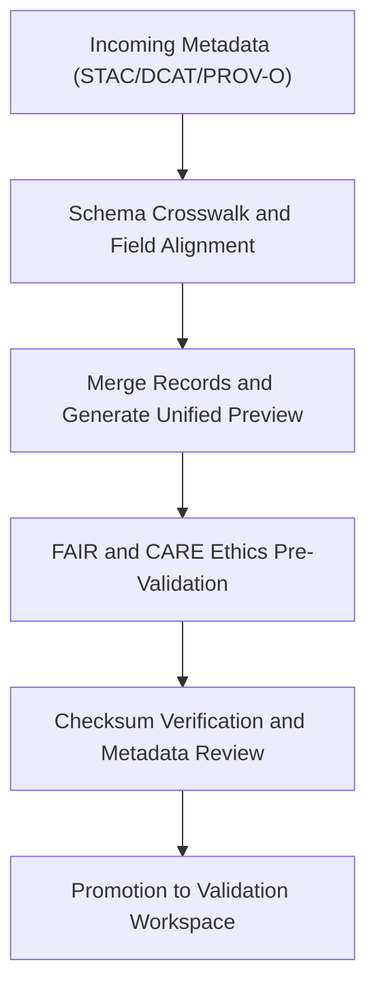

<div align="center">

# 🧩 Kansas Frontier Matrix — **Metadata TMP Workspace**
`data/work/staging/metadata/tmp/README.md`

**Purpose:**  
Temporary workspace for harmonizing, crosswalking, and transforming metadata between STAC, DCAT, and PROV-O schemas before FAIR+CARE validation and governance ledger registration.  
This layer supports metadata interoperability and schema unification across the Kansas Frontier Matrix (KFM) ecosystem.

[](../../../../../docs/standards/faircare-validation.md)
[]()
[]()
[](../../../../../LICENSE)

</div>

---

## 📚 Overview

The **Metadata TMP Workspace** serves as a transient harmonization environment for reconciling metadata structures and ensuring interoperability across schema frameworks.  
Metadata transformations performed here include **schema mapping, lineage enrichment (PROV-O)**, and **cross-standard alignment (STAC/DCAT)**.

### Core Responsibilities
- Crosswalk metadata between STAC, DCAT, and PROV-O standards.  
- Prepare unified metadata for FAIR+CARE validation.  
- Perform initial ethics, completeness, and checksum checks.  
- Generate transformation previews for governance audit.  

---

## 🗂️ Directory Layout

```plaintext
data/work/staging/metadata/tmp/
├── README.md                              # This file — documentation of metadata TMP workspace
│
├── stac_to_dcat_crosswalk.json            # Mapping table linking STAC and DCAT schema fields
├── provenance_mapping.json                # PROV-O lineage and relationship references
├── metadata_merge_preview.json            # Unified metadata record before validation
├── metadata_patch_queue.json              # Pending metadata corrections awaiting governance review
└── metadata.json                          # Provenance and checksum record for TMP session
```

---

## ⚙️ Metadata TMP Workflow



### Workflow Description
1. **Crosswalk Alignment:** Reconcile schema differences between STAC, DCAT, and PROV-O.  
2. **Merge & Preview:** Create combined metadata records for FAIR+CARE audit preparation.  
3. **Ethical Validation:** Pre-audit metadata for accessibility and provenance accuracy.  
4. **Checksum Verification:** Ensure structural and data-level integrity.  
5. **Promotion:** Forward harmonized metadata to validation layer.  

---

## 🧩 Example TMP Metadata Record

```json
{
  "id": "metadata_tmp_hazards_v9.6.0",
  "crosswalks_applied": ["stac_to_dcat_crosswalk.json", "provenance_mapping.json"],
  "merged_fields": 36,
  "issues_detected": 0,
  "validator": "@kfm-metadata-lab",
  "created": "2025-11-03T23:35:00Z",
  "checksum": "sha256:a5b3d9e7c4f8a1b2e9c6f5d4a3b7c2e8f1d6a9b4e7c8b3a2d9f5c6e1b8f7a4d2",
  "governance_status": "pending",
  "governance_ref": "data/reports/audit/data_provenance_ledger.json"
}
```

---

## 🧠 FAIR+CARE Governance Matrix

| Principle | Implementation | Oversight |
|------------|----------------|------------|
| **Findable** | Metadata harmonized with global identifiers and cross-schema mappings. | @kfm-data |
| **Accessible** | Metadata available in JSON-LD for FAIR+CARE governance review. | @kfm-accessibility |
| **Interoperable** | STAC ↔ DCAT ↔ PROV-O alignment ensures cross-domain reuse. | @kfm-architecture |
| **Reusable** | Metadata enriched with provenance, checksum, and schema linkage. | @kfm-design |
| **Collective Benefit** | Promotes transparent metadata reuse across datasets. | @faircare-council |
| **Authority to Control** | FAIR+CARE Council validates schema crosswalk outputs. | @kfm-governance |
| **Responsibility** | Metadata maintainers document schema merges and ethical reviews. | @kfm-security |
| **Ethics** | All metadata checked for integrity and cultural appropriateness. | @kfm-ethics |

Audit results documented in:  
`data/reports/fair/data_care_assessment.json` and  
`data/reports/audit/data_provenance_ledger.json`

---

## ⚙️ TMP Artifacts

| Artifact | Description | Format |
|-----------|--------------|--------|
| `stac_to_dcat_crosswalk.json` | Maps STAC schema elements to DCAT descriptors. | JSON |
| `provenance_mapping.json` | Defines PROV-O lineage relationships and dataset references. | JSON |
| `metadata_merge_preview.json` | Merged metadata records for audit and preview. | JSON |
| `metadata_patch_queue.json` | Queued metadata corrections pending governance review. | JSON |
| `metadata.json` | Captures TMP session metadata, checksums, and provenance. | JSON |

TMP automation handled via `metadata_tmp_sync.yml`.

---

## ⚖️ Retention & Provenance Policy

| File Type | Retention Duration | Policy |
|------------|--------------------|--------|
| Crosswalk Files | 30 Days | Retained for schema versioning and governance history. |
| Merge Previews | 14 Days | Cleared after validation and certification. |
| Patch Queues | 7 Days | Purged after governance resolution. |
| Metadata Records | 365 Days | Archived for lineage continuity and auditing. |

Retention managed by `metadata_tmp_cleanup.yml`.

---

## 🌱 Sustainability Metrics

| Metric | Value | Verified By |
|---------|--------|--------------|
| Energy Use (per harmonization cycle) | 6.2 Wh | @kfm-sustainability |
| Carbon Output | 8.1 gCO₂e | @kfm-security |
| Renewable Power | 100% (RE100 Verified) | @kfm-infrastructure |
| FAIR+CARE Pre-Validation | 100% | @faircare-council |

Telemetry stored in:  
`releases/v9.6.0/focus-telemetry.json`

---

## 🧾 Internal Use Citation

```text
Kansas Frontier Matrix (2025). Metadata TMP Workspace (v9.6.0).
Temporary harmonization workspace for crosswalking and aligning metadata across STAC, DCAT, and PROV-O standards under FAIR+CARE governance.
Ensures interoperability, ethical compliance, and reproducibility before validation and publication.
```

---

## 🧾 Version Notes

| Version | Date | Notes |
|----------|------|--------|
| v9.6.0 | 2025-11-03 | Added PROV-O lineage enhancements and FAIR+CARE pre-validation metrics. |
| v9.5.0 | 2025-11-02 | Improved schema mapping automation and crosswalk governance linkage. |
| v9.3.2 | 2025-10-28 | Established metadata TMP layer for pre-validation and harmonization. |

---

<div align="center">

**Kansas Frontier Matrix** · *Metadata Interoperability × FAIR+CARE Ethics × Provenance Assurance*  
[🔗 Repository](https://github.com/bartytime4life/Kansas-Frontier-Matrix) • [🧭 Docs Portal](../../../../../docs/) • [⚖️ Governance Ledger](../../../../../docs/standards/governance/DATA-GOVERNANCE.md)

</div>
