<div align="center">

# 🧩 Kansas Frontier Matrix — **Metadata TMP Workspace**
`data/work/staging/metadata/tmp/README.md`

**Purpose:**  
Temporary workspace for harmonizing, crosswalking, and transforming metadata between **STAC**, **DCAT**, and **PROV-O** before FAIR+CARE validation and governance ledger registration.  
This layer enables metadata interoperability and schema unification across the Kansas Frontier Matrix (KFM) ecosystem.

[](../../../../../docs/architecture/README.md)
[](../../../../../docs/standards/faircare-validation.md)
[]()
[]()
[](../../../../../LICENSE)

</div>

---

## 📘 Overview

The **Metadata TMP Workspace** is a transient harmonization environment for reconciling metadata structures and ensuring cross-standard interoperability.  
Transformations include **schema mapping**, **lineage enrichment (PROV-O)**, and **cross-standard alignment (STAC/DCAT)** ahead of validation.

### Core Responsibilities
- Crosswalk metadata between STAC, DCAT, and PROV-O.  
- Prepare unified metadata for FAIR+CARE validation.  
- Execute initial ethics, completeness, and checksum checks.  
- Generate transformation previews for governance audit.  

---

## 🗂️ Directory Layout

```plaintext
data/work/staging/metadata/tmp/
├── README.md
├── stac_to_dcat_crosswalk.json         # STAC↔DCAT field mapping table
├── provenance_mapping.json             # PROV-O lineage and relationship references
├── metadata_merge_preview.json         # Unified metadata preview before validation
├── metadata_patch_queue.json           # Corrections pending governance review
└── metadata.json                       # TMP session provenance & checksum record
```

---

## ⚙️ Metadata TMP Workflow

```mermaid
flowchart TD
    A["Incoming Metadata (STAC · DCAT · PROV-O)"] --> B["Schema Crosswalk & Field Alignment"]
    B --> C["Merge Records & Generate Unified Preview"]
    C --> D["FAIR + CARE Ethics Pre-Validation"]
    D --> E["Checksum Verification & Metadata Review"]
    E --> F["Promotion to Validation Workspace"]
```



### Steps
1. **Crosswalk Alignment** — Reconcile schema differences across standards.  
2. **Merge & Preview** — Combine records for FAIR+CARE audit preparation.  
3. **Ethical Pre-Validation** — Check accessibility & provenance accuracy.  
4. **Checksum Verify** — Ensure structural/data integrity.  
5. **Promote** — Forward harmonized metadata to **staging/validation**.

---

## 🧩 Example TMP Metadata Record

```json
{
  "id": "metadata_tmp_hazards_v9.7.0",
  "crosswalks_applied": ["stac_to_dcat_crosswalk.json", "provenance_mapping.json"],
  "merged_fields": 36,
  "issues_detected": 0,
  "validator": "@kfm-metadata-lab",
  "created": "2025-11-06T23:35:00Z",
  "checksum_sha256": "sha256:a5b3d9e7c4f8a1b2e9c6f5d4a3b7c2e8f1d6a9b4e7c8b3a2d9f5c6e1b8f7a4d2",
  "governance_status": "pending",
  "governance_ref": "data/reports/audit/data_provenance_ledger.json"
}
```

---

## 🧠 FAIR+CARE Governance Matrix

| Principle | Implementation | Oversight |
|-----------|----------------|-----------|
| **Findable** | Harmonized with global IDs & cross-schema mappings. | `@kfm-data` |
| **Accessible** | JSON-LD artifacts for internal FAIR reviews. | `@kfm-accessibility` |
| **Interoperable** | STAC ↔ DCAT ↔ PROV-O alignment. | `@kfm-architecture` |
| **Reusable** | Enriched with provenance, checksum, and schema linkages. | `@kfm-design` |
| **Collective Benefit** | Transparent metadata reuse across datasets. | `@faircare-council` |
| **Authority to Control** | Council validates crosswalk outputs. | `@kfm-governance` |
| **Responsibility** | Maintainers document merges & ethical reviews. | `@kfm-security` |
| **Ethics** | Screened for integrity and cultural appropriateness. | `@kfm-ethics` |

**Audit refs:**  
`data/reports/fair/data_care_assessment.json` · `data/reports/audit/data_provenance_ledger.json`

---

## ⚙️ TMP Artifacts

| Artifact                     | Description                                   | Format |
|-----------------------------|-----------------------------------------------|--------|
| `stac_to_dcat_crosswalk.json` | Field mapping between STAC and DCAT          | JSON   |
| `provenance_mapping.json`     | PROV-O lineage & relationship definitions    | JSON   |
| `metadata_merge_preview.json` | Pre-validation merged record preview         | JSON   |
| `metadata_patch_queue.json`   | Pending fixes awaiting governance review     | JSON   |
| `metadata.json`               | TMP session provenance + checksum metadata   | JSON   |

**Automation:** `metadata_tmp_sync.yml`

---

## ♻️ Retention & Lifecycle Policy

| File Type        | Retention | Policy                                   |
|------------------|----------:|------------------------------------------|
| Crosswalk Files  | 30 Days   | Retained for schema versioning history.  |
| Merge Previews   | 14 Days   | Cleared post validation/certification.   |
| Patch Queues     | 7 Days    | Purged after governance resolution.      |
| Metadata Records | 365 Days  | Archived for lineage & audit continuity. |

**Telemetry:** `../../../../../releases/v9.7.0/focus-telemetry.json`

---

## 🧾 Internal Use Citation

```text
Kansas Frontier Matrix (2025). Metadata TMP Workspace (v9.7.0).
Transient harmonization workspace for crosswalking and aligning metadata across STAC, DCAT, and PROV-O under FAIR+CARE governance—ensuring interoperability and ethical compliance before publication.
```

---

## 🕰️ Version History

| Version | Date       | Author              | Summary |
|--------:|------------|---------------------|---------|
| v9.7.0  | 2025-11-06 | `@kfm-metadata`     | Upgraded to v9.7.0; telemetry/schema refs aligned; retention & badges updated. |
| v9.6.0  | 2025-11-03 | `@kfm-metadata`     | Added PROV-O lineage enhancements & pre-validation metrics. |

---

<div align="center">

**Kansas Frontier Matrix**  
*Metadata Interoperability × FAIR+CARE Ethics × Provenance Assurance*  
© 2025 Kansas Frontier Matrix — Internal · FAIR+CARE Certified · Diamond⁹ Ω / Crown∞Ω Ultimate Certified  

[Back to Metadata Staging](../README.md) · [Governance Charter](../../../../../docs/standards/governance/DATA-GOVERNANCE.md)

</div>