<div align="center">

# 🧩 Kansas Frontier Matrix — **Metadata TMP Workspace**
`data/work/staging/metadata/tmp/README.md`

**Purpose:** Temporary workspace for harmonizing, transforming, and cross-validating metadata before governance certification.  
Supports FAIR+CARE metadata interoperability and schema alignment between STAC, DCAT, and PROV-O, ensuring readiness for full validation and catalog integration.

[](../../../../../docs/standards/faircare-validation.md)
[](../../../../../LICENSE)
[](../../../../../docs/architecture/repo-focus.md)

</div>

---

## 📚 Overview

The `data/work/staging/metadata/tmp/` directory serves as a **metadata sandbox** for temporary schema crosswalks and FAIR+CARE pre-validation.  
It enables controlled harmonization across metadata standards—aligning descriptors, generating lineage records, and preparing unified metadata artifacts for validation and governance ingestion.

### Key Responsibilities
- Harmonize and align fields across **STAC 1.0**, **DCAT 3.0**, and **PROV-O** schemas.  
- Conduct pre-validation and FAIR+CARE ethics audits prior to governance certification.  
- Generate preview metadata for testing before ledger registration.  
- Track lineage and checksum integrity for temporary metadata artifacts.  

All files in this workspace are ephemeral and automatically purged after successful validation or the end of each certification session.

---

## 🗂️ Directory Layout

```plaintext
data/work/staging/metadata/tmp/
├── README.md                            # This file — documentation for TMP workspace
│
├── stac_to_dcat_crosswalk.json          # Mapping between STAC and DCAT field definitions
├── provenance_mapping.json              # Metadata lineage and PROV-O relationship mappings
├── metadata_merge_preview.json          # Unified metadata preview combining STAC/DCAT/PROV-O
├── metadata_patch_queue.json            # Temporary patch queue for field and value corrections
└── metadata.json                        # Session-level metadata and governance trace record
```

---

## ⚙️ Metadata Harmonization Workflow

```mermaid
flowchart TD
    A["Incoming Metadata (data/raw/*)"] --> B["Crosswalk: STAC ↔ DCAT ↔ PROV-O"]
    B --> C["Schema Harmonization & Merge"]
    C --> D["FAIR+CARE Pre-Audit"]
    D --> E["Validation Output (data/work/staging/metadata/validation/)"]
    E --> F["Promotion → data/work/staging/metadata/"]
```



### Workflow Description
1. **Crosswalk:** Identify and align corresponding fields and semantics between metadata schemas.  
2. **Harmonization:** Merge compatible fields into unified descriptors, maintaining schema fidelity.  
3. **Pre-Audit:** Perform FAIR+CARE pre-validation on licensing, attribution, and provenance elements.  
4. **Validation:** Generate JSON outputs for formal validation in the next staging layer.  
5. **Promotion:** Approved metadata is promoted for governance registration and STAC/DCAT indexing.

---

## 🧩 Example TMP Metadata Record

```json
{
  "id": "metadata_tmp_climate_v9.4.0",
  "stac_fields": ["id", "title", "description", "extent"],
  "dcat_fields": ["identifier", "distribution", "theme"],
  "prov_fields": ["wasGeneratedBy", "wasDerivedFrom"],
  "merged_record": "metadata_merge_preview.json",
  "created": "2025-11-02T14:40:00Z",
  "validator": "@kfm-metadata-lab",
  "checksum": "sha256:ff0a65bcd87cc13f6f4ef93ab7284b0ff9247d12...",
  "governance_status": "pending",
  "telemetry_link": "releases/v9.4.0/focus-telemetry.json",
  "governance_ledger_ref": "data/reports/audit/data_provenance_ledger.json"
}
```

---

## 🧠 FAIR+CARE Metadata Preparation Alignment

| Principle | Implementation in TMP Layer |
|------------|-----------------------------|
| **Findable** | Unique IDs and cross-schema identifiers logged for each metadata record. |
| **Accessible** | JSON files accessible to staging and governance automation. |
| **Interoperable** | Crosswalked metadata aligns STAC, DCAT, and PROV-O semantics. |
| **Reusable** | Outputs designed for catalog ingestion and reproducibility. |
| **Collective Benefit** | Promotes transparency and ethical metadata governance. |
| **Authority to Control** | FAIR+CARE Council reviews harmonization rules and mappings. |
| **Responsibility** | Analysts document corrections and schema reconciliation actions. |
| **Ethics** | Ensures proper attribution and removal of culturally sensitive terms. |

Compliance and audit records integrated with:  
`data/reports/fair/data_care_assessment.json`  
and `data/reports/audit/data_provenance_ledger.json`

---

## ⚙️ File Descriptions

| File | Purpose | Format |
|------|----------|--------|
| `stac_to_dcat_crosswalk.json` | Field-level mapping between STAC and DCAT schemas. | JSON |
| `provenance_mapping.json` | Records dataset lineage and PROV-O relationships. | JSON |
| `metadata_merge_preview.json` | Unified metadata record preview for verification. | JSON |
| `metadata_patch_queue.json` | Pending metadata updates prior to validation. | JSON |
| `metadata.json` | Captures TMP session context, checksum, and harmonization status. | JSON |

---

## ⚖️ Governance & Provenance Integration

| Record | Description |
|---------|-------------|
| `metadata.json` | Contains session metadata, validation details, and checksum registry. |
| `data/reports/audit/data_provenance_ledger.json` | Tracks TMP activity, harmonization, and governance synchronization. |
| `data/reports/validation/schema_validation_summary.json` | Records schema pre-validation and FAIR+CARE pre-audit results. |
| `releases/v9.4.0/manifest.zip` | Global manifest of TMP hashes and provenance. |

Lifecycle events managed via **`metadata_tmp_sync.yml`** for CI/CD consistency.

---

## 🧾 Retention Policy

| File Category | Retention Duration | Policy |
|----------------|--------------------|--------|
| TMP Files (`*.json`) | 7 days | Purged after validation or promotion. |
| Metadata Merge Previews | 48 hours | Deleted post-validation review. |
| Crosswalk & Provenance Mappings | 30 days | Retained for schema version comparison. |
| Metadata Session Logs | 365 days | Archived for reproducibility and governance traceability. |

Automated cleanup managed by **`metadata_tmp_cleanup.yml`**.

---

## 🧾 Internal Citation

```text
Kansas Frontier Matrix (2025). Metadata TMP Workspace (v9.4.0).
Temporary environment for metadata harmonization, cross-schema validation, and FAIR+CARE pre-auditing.
Supports STAC, DCAT, and PROV-O interoperability under ethical metadata governance.
```

---

## 🧾 Version Notes

| Version | Date | Notes |
|----------|------|--------|
| v9.4.0 | 2025-11-02 | Added telemetry integration, enhanced PROV-O linkage, and automated FAIR+CARE pre-audit reporting. |
| v9.3.2 | 2025-10-28 | Introduced PROV-O lineage mapping and FAIR+CARE crosswalk automation. |
| v9.2.0 | 2024-07-15 | Added metadata merge preview and validation pre-checks. |
| v9.0.0 | 2023-01-10 | Established TMP directory for metadata schema harmonization. |

---

<div align="center">

**Kansas Frontier Matrix** · *Metadata Interoperability × FAIR+CARE Ethics × Provenance Validation × Telemetry Traceability*  
[🔗 Repository](https://github.com/bartytime4life/Kansas-Frontier-Matrix) • [🧭 Docs Portal](../../../../../docs/) • [⚖️ Governance Ledger](../../../../../docs/standards/governance/)

</div>
