<div align="center">

# 🧩 Kansas Frontier Matrix — **Metadata TMP Workspace**
`data/work/staging/metadata/tmp/README.md`

**Purpose:** Temporary workspace for harmonizing, transforming, and cross-validating metadata structures prior to formal validation and governance ledger integration.  
This layer supports FAIR+CARE metadata workflows and ensures all KFM datasets achieve schema interoperability between STAC, DCAT, and PROV-O before certification.

[](../../../../../docs/standards/faircare-validation.md)
[](../../../../../LICENSE)
[](../../../../../docs/architecture/repo-focus.md)

</div>

---

## 📚 Overview

The `data/work/staging/metadata/tmp/` directory acts as a **metadata sandbox** for crosswalking, merging, and testing dataset descriptors before promotion to the validated staging layer.  
It provides a controlled, ephemeral environment for metadata analysts and governance automation tools to reconcile schema mismatches, repair records, and generate unified metadata outputs.

This workspace supports:
- Conversion between STAC 1.0, DCAT 3.0, and schema.org metadata formats.  
- PROV-O lineage augmentation for dataset traceability.  
- FAIR+CARE ethical metadata pre-validation.  
- Preparation of records for ingestion into governance and STAC systems.  

All files here are **temporary** and are automatically deleted upon successful validation or at the end of each staging session.

---

## 🗂️ Directory Layout

```plaintext
data/work/staging/metadata/tmp/
├── README.md                            # This file — documentation for TMP workspace
│
├── stac_to_dcat_crosswalk.json          # Field mapping between STAC and DCAT schemas
├── provenance_mapping.json              # Metadata lineage and PROV-O relations
├── metadata_merge_preview.json          # Combined STAC/DCAT unified preview record
├── metadata_patch_queue.json            # Pending metadata corrections before validation
└── metadata.json                        # Session metadata and governance traceability
```

---

## ⚙️ Metadata Harmonization Workflow

```mermaid
flowchart TD
    A["Incoming Metadata from data/raw/*"] --> B["Crosswalk: STAC ↔ DCAT ↔ PROV-O"]
    B --> C["Field Harmonization & Schema Merge"]
    C --> D["FAIR and CARE Metadata Audit (Pre-Validation)"]
    D --> E["Validation Reports in data/work/staging/metadata/validation/"]
    E --> F["Promotion to data/work/staging/metadata/"]
```



### Workflow Description:
1. **Crosswalk:** Align field names and ontology relationships across metadata schemas.  
2. **Merge:** Combine schema fields into standardized unified records.  
3. **Audit:** Pre-validate FAIR+CARE ethical metadata requirements (accessibility, provenance, licensing).  
4. **Validate:** Pass results to the formal validation stage (`validation/`).  
5. **Promote:** Certified metadata promoted for governance and STAC integration.

---

## 🧩 Example TMP Metadata Record

```json
{
  "id": "metadata_tmp_climate_v9.3.2",
  "stac_fields": ["id", "title", "description", "extent"],
  "dcat_fields": ["identifier", "distribution", "theme"],
  "prov_fields": ["wasGeneratedBy", "wasDerivedFrom"],
  "merged_record": "metadata_merge_preview.json",
  "created": "2025-10-28T14:45:00Z",
  "validator": "@kfm-metadata-lab",
  "checksum": "sha256:ff0a65bcd87cc13f6f4ef93ab7284b0ff9247d12...",
  "governance_status": "pending",
  "governance_ledger_ref": "data/reports/audit/data_provenance_ledger.json"
}
```

---

## 🧠 FAIR+CARE Metadata Preparation Alignment

| Principle | Implementation in TMP Workspace |
|------------|--------------------------------|
| **Findable** | Metadata enriched with unique IDs and STAC/DCAT field mapping. |
| **Accessible** | Stored in open JSON format, accessible to validation workflows. |
| **Interoperable** | Cross-schema harmonization ensures multi-standard compatibility. |
| **Reusable** | Outputs structured for STAC publication and governance reuse. |
| **Collective Benefit** | Supports ethical, discoverable metadata across disciplines. |
| **Authority to Control** | FAIR+CARE Council validates harmonization outcomes. |
| **Responsibility** | Metadata maintainers document schema merges and corrections. |
| **Ethics** | Records reviewed for proper attribution and cultural sensitivity. |

Compliance and audit records integrated with:  
`data/reports/fair/data_care_assessment.json` and `data/reports/audit/data_provenance_ledger.json`.

---

## ⚙️ File Descriptions

| File | Purpose | Format |
|------|----------|--------|
| `stac_to_dcat_crosswalk.json` | Defines mapping between STAC and DCAT fields. | JSON |
| `provenance_mapping.json` | Records dataset lineage relationships (PROV-O). | JSON |
| `metadata_merge_preview.json` | Preview of unified metadata after crosswalk. | JSON |
| `metadata_patch_queue.json` | Holds temporary metadata fix queue before validation. | JSON |
| `metadata.json` | Captures TMP session metadata, validator info, and checksum. | JSON |

---

## ⚖️ Governance & Provenance Integration

| Record | Description |
|---------|-------------|
| `metadata.json` | Contains session context, checksums, and harmonization status. |
| `data/reports/audit/data_provenance_ledger.json` | Master governance ledger linking all TMP metadata operations. |
| `data/reports/validation/schema_validation_summary.json` | Schema pre-validation results. |
| `releases/v9.3.2/manifest.zip` | Tracks checksum hashes for TMP session outputs. |

All temporary metadata lifecycle events logged through `metadata_tmp_sync.yml`.

---

## 🧾 Retention Policy

| File Category | Retention Duration | Policy |
|----------------|--------------------|--------|
| TMP Files (`*.json`) | 7 days | Purged after validation or session completion. |
| Metadata Merge Previews | 48 hours | Deleted after validation review. |
| Crosswalk and Provenance Mappings | 30 days | Retained for schema evolution tracking. |
| Metadata Session Logs | 365 days | Archived for governance traceability. |

Automation governed by `metadata_tmp_cleanup.yml`.

---

## 🧾 Internal Use Citation

```text
Kansas Frontier Matrix (2025). Metadata TMP Workspace (v9.3.2).
Temporary environment for metadata harmonization and FAIR+CARE pre-validation, bridging STAC, DCAT, and PROV-O standards.
Restricted to internal schema alignment and governance workflows.
```

---

## 🧾 Version Notes

| Version | Date | Notes |
|----------|------|--------|
| v9.3.2 | 2025-10-28 | Introduced PROV-O lineage mapping and FAIR+CARE crosswalk automation. |
| v9.2.0 | 2024-07-15 | Added metadata merge preview and validation pre-checks. |
| v9.0.0 | 2023-01-10 | Established TMP directory for metadata schema harmonization. |

---

<div align="center">

**Kansas Frontier Matrix** · *Metadata Interoperability × FAIR+CARE Ethics × Provenance Validation*  
[🔗 Repository](https://github.com/bartytime4life/Kansas-Frontier-Matrix) • [🧭 Docs Portal](../../../../../docs/) • [⚖️ Governance Ledger](../../../../../docs/standards/governance/)

</div>