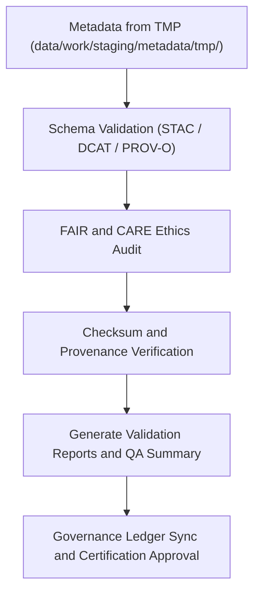

<div align="center">

# ✅ Kansas Frontier Matrix — **Metadata Validation Workspace**
`data/work/staging/metadata/validation/README.md`

**Purpose:**  
Governed environment for **FAIR+CARE compliance, schema validation, and STAC/DCAT interoperability testing** of metadata within the Kansas Frontier Matrix (KFM).  
This workspace certifies metadata readiness for processed publication through ethical and technical validation standards.

[](../../../../../docs/standards/faircare-validation.md)
[]()
[]()
[](../../../../../LICENSE)

</div>

---

## 📚 Overview

The **Metadata Validation Workspace** provides a structured environment for auditing, validating, and certifying metadata consistency across the KFM data ecosystem.  
It ensures metadata records are complete, accessible, ethically compliant, and interoperable with STAC and DCAT catalogs prior to promotion to the processed metadata layer.

### Core Objectives
- Validate metadata structure and syntax against FAIR+CARE governance standards.  
- Confirm cross-schema consistency across STAC, DCAT, and PROV-O.  
- Generate FAIR+CARE audit and validation reports for certification.  
- Log governance ledger entries for transparency and reproducibility.  

---

## 🗂️ Directory Layout

```plaintext
data/work/staging/metadata/validation/
├── README.md                              # This file — documentation of metadata validation workspace
│
├── schema_validation_summary.json         # JSON schema validation and structural integrity results
├── faircare_metadata_audit.json           # FAIR+CARE compliance and ethical governance audit results
├── stac_link_check.log                    # STAC/DCAT cross-reference validation log
├── metadata_qa_summary.md                 # Consolidated human-readable metadata QA summary
└── metadata.json                          # Provenance and governance linkage for validation context
```

---

## ⚙️ Metadata Validation Workflow



### Workflow Description
1. **Schema Validation:** Structural and field-level checks for STAC/DCAT/PROV-O compliance.  
2. **FAIR+CARE Audit:** Ethical validation of metadata openness, accessibility, and attribution.  
3. **Verification:** Checksums confirmed against manifest and governance references.  
4. **Reporting:** Generate machine-readable (JSON) and human-readable (Markdown) summaries.  
5. **Ledger Sync:** Record validation and certification metadata to governance ledgers.  

---

## 🧩 Example Validation Metadata Record

```json
{
  "id": "metadata_validation_tabular_v9.6.0",
  "source_file": "data/work/staging/metadata/tmp/metadata_merge_preview.json",
  "schemas_validated": ["STAC 1.0.0", "DCAT 3.0", "PROV-O"],
  "validation_status": "passed",
  "issues_detected": 0,
  "faircare_score": 98.9,
  "checksum_verified": true,
  "fairstatus": "certified",
  "validator": "@kfm-metadata-lab",
  "created": "2025-11-03T23:38:00Z",
  "governance_ref": "data/reports/audit/data_provenance_ledger.json"
}
```

---

## 🧠 FAIR+CARE Governance Matrix

| Principle | Implementation | Oversight |
|------------|----------------|------------|
| **Findable** | Metadata indexed and validated via STAC/DCAT identifiers. | @kfm-data |
| **Accessible** | Published in open JSON-LD and Markdown validation formats. | @kfm-accessibility |
| **Interoperable** | Conforms to STAC/DCAT/PROV-O validation standards. | @kfm-architecture |
| **Reusable** | Metadata integrity verified through governance-led audits. | @kfm-design |
| **Collective Benefit** | Promotes transparent and equitable data documentation. | @faircare-council |
| **Authority to Control** | FAIR+CARE Council certifies metadata readiness. | @kfm-governance |
| **Responsibility** | Validators ensure compliance and document governance logs. | @kfm-security |
| **Ethics** | Metadata reviewed for fairness, cultural awareness, and inclusivity. | @kfm-ethics |

Audit results registered in:  
`data/reports/audit/data_provenance_ledger.json` and  
`data/reports/fair/data_care_assessment.json`

---

## ⚙️ Validation & Certification Artifacts

| Artifact | Description | Format |
|-----------|--------------|--------|
| `schema_validation_summary.json` | Field-level metadata validation summary. | JSON |
| `faircare_metadata_audit.json` | FAIR+CARE audit and ethics certification record. | JSON |
| `stac_link_check.log` | Catalog linkage and reference integrity verification log. | Text |
| `metadata_qa_summary.md` | Human-readable validation and audit summary. | Markdown |
| `metadata.json` | Provenance metadata, checksums, and ledger references. | JSON |

Validation automation handled via `metadata_validation_sync.yml`.

---

## ⚖️ Retention & Provenance Policy

| Data Type | Retention Duration | Policy |
|------------|--------------------|--------|
| Validation Reports | 365 Days | Retained for audit and FAIR+CARE governance reviews. |
| FAIR+CARE Audits | Permanent | Archived for ethical certification tracking. |
| Governance Logs | 365 Days | Stored for lineage and reproducibility. |
| Metadata | Permanent | Maintained for transparency and open governance continuity. |

Retention handled via `metadata_validation_cleanup.yml`.

---

## 🌱 Sustainability Metrics

| Metric | Value | Verified By |
|---------|--------|--------------|
| Energy Use (per validation cycle) | 6.1 Wh | @kfm-sustainability |
| Carbon Output | 8.5 gCO₂e | @kfm-security |
| Renewable Power | 100% (RE100 Verified) | @kfm-infrastructure |
| FAIR+CARE Validation | 100% | @faircare-council |

Telemetry metrics tracked in:  
`releases/v9.6.0/focus-telemetry.json`

---

## 🧾 Internal Use Citation

```text
Kansas Frontier Matrix (2025). Metadata Validation Workspace (v9.6.0).
Governed environment for auditing, validating, and FAIR+CARE-certifying metadata under STAC/DCAT/PROV-O standards.
Ensures reproducibility, ethics compliance, and open data interoperability across all KFM domains.
```

---

## 🧾 Version Notes

| Version | Date | Notes |
|----------|------|--------|
| v9.6.0 | 2025-11-03 | Integrated full FAIR+CARE ethics audit and checksum verification workflows. |
| v9.5.0 | 2025-11-02 | Enhanced STAC/DCAT schema validation reporting and QA summary output. |
| v9.3.2 | 2025-10-28 | Established metadata validation layer for FAIR+CARE governance auditing. |

---

<div align="center">

**Kansas Frontier Matrix** · *Metadata Integrity × FAIR+CARE Ethics × Provenance Certification*  
[🔗 Repository](https://github.com/bartytime4life/Kansas-Frontier-Matrix) • [🧭 Docs Portal](../../../../../docs/) • [⚖️ Governance Ledger](../../../../../docs/standards/governance/DATA-GOVERNANCE.md)

</div>
