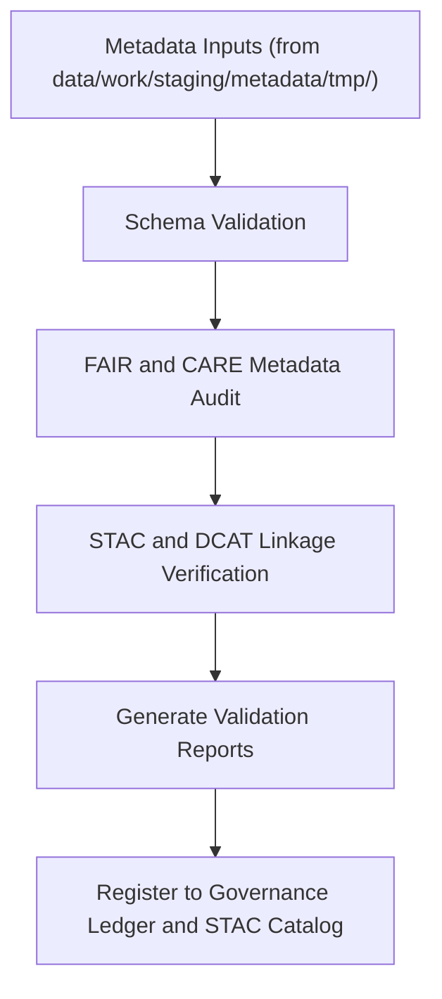

<div align="center">

# ✅ Kansas Frontier Matrix — **Metadata Validation Workspace**
`data/work/staging/metadata/validation/README.md`

**Purpose:** Performs schema validation, FAIR+CARE ethical review, and STAC/DCAT interoperability testing for metadata records within the Kansas Frontier Matrix (KFM).  
This workspace ensures all dataset metadata achieves complete alignment with KFM’s documentation, governance, and open data standards prior to publication.

[](../../../../../docs/standards/faircare-validation.md)
[](../../../../../LICENSE)
[](../../../../../docs/architecture/repo-focus.md)

</div>

---

## 📚 Overview

The `data/work/staging/metadata/validation/` directory contains the **validation and audit results for metadata harmonization** operations conducted within KFM’s staging environment.  
It serves as the bridge between the temporary metadata harmonization layer (`tmp/`) and the finalized metadata integration layer (`data/stac/`).

### Functions of the Metadata Validation Workspace:
- Validate compliance with **STAC 1.0**, **DCAT 3.0**, and **schema.org** metadata standards.  
- Audit FAIR+CARE compliance for accessibility, reusability, and ethical governance.  
- Verify PROV-O lineage metadata consistency and linkage to provenance ledger.  
- Produce structured reports for FAIR+CARE Council review and archival retention.  

---

## 🗂️ Directory Layout

```plaintext
data/work/staging/metadata/validation/
├── README.md                                # This file — metadata validation workspace overview
│
├── schema_validation_summary.json           # Results of JSON Schema validation checks
├── faircare_metadata_audit.json             # FAIR+CARE ethics and accessibility review outcomes
├── stac_link_check.log                      # STAC link validation and cross-reference logs
├── metadata_qa_summary.md                   # Consolidated metadata QA summary report
└── metadata.json                            # Validation context and governance linkage
```

---

## ⚙️ Metadata Validation Workflow



### Workflow Description:
1. **Schema Validation:** Validates field completeness, structure, and syntax against JSON schemas.  
2. **FAIR+CARE Audit:** Evaluates ethical standards, metadata accessibility, and provenance completeness.  
3. **STAC/DCAT Review:** Confirms link accuracy, data distribution metadata, and catalog integration.  
4. **Reporting:** Generates JSON and Markdown summaries for governance dashboards.  
5. **Ledger Integration:** Validation metadata recorded in `data/reports/audit/data_provenance_ledger.json`.

---

## 🧩 Example Metadata Validation Record

```json
{
  "id": "metadata_validation_hazards_v9.3.2",
  "source_file": "data/work/staging/metadata/tmp/metadata_merge_preview.json",
  "created": "2025-10-28T15:50:00Z",
  "validator": "@kfm-metadata-lab",
  "schema_validation": "passed",
  "stac_links_verified": 25,
  "dcat_fields_validated": 18,
  "faircare_score": 98.2,
  "issues_found": 0,
  "checksum": "sha256:6cb2ff203b3a1a92c5fcbf69ef51e2b189d87d20...",
  "governance_ledger_ref": "data/reports/audit/data_provenance_ledger.json"
}
```

---

## 🧠 FAIR+CARE Validation Criteria

| Validation Category | Description | Tools / Standards | Output |
|----------------------|-------------|-------------------|---------|
| **Schema Compliance** | Validates field types and required JSON structure. | `jsonschema-cli` | `schema_validation_summary.json` |
| **STAC/DCAT Links** | Verifies item/collection link integrity. | `stac-validator` | `stac_link_check.log` |
| **FAIR+CARE Audit** | Checks for completeness, accessibility, ethics compliance. | `faircare-validator` | `faircare_metadata_audit.json` |
| **Provenance Trace** | Validates PROV-O lineage and governance references. | `prov-audit.py` | `metadata_qa_summary.md` |

---

## ⚙️ FAIR+CARE Compliance Overview

| Principle | Implementation in Metadata Validation |
|------------|--------------------------------------|
| **Findable** | Metadata records indexed by STAC and governance ID. |
| **Accessible** | Metadata validation reports available to governance council. |
| **Interoperable** | Conformance with STAC, DCAT, and PROV-O schemas. |
| **Reusable** | Metadata enriched with license, provenance, and cross-linking details. |
| **Collective Benefit** | Enhances open science transparency and ethical reuse. |
| **Authority to Control** | FAIR+CARE Council oversees validation approval. |
| **Responsibility** | Validators record schema compliance decisions in governance ledger. |
| **Ethics** | Validation ensures sensitive metadata fields are ethically managed. |

Compliance verified via reports in:  
- `data/reports/fair/data_care_assessment.json`  
- `data/reports/audit/data_provenance_ledger.json`

---

## ⚖️ Governance & Provenance Integration

| Record | Description |
|---------|-------------|
| `schema_validation_summary.json` | Details field-level schema conformance. |
| `faircare_metadata_audit.json` | Reports FAIR+CARE ethical compliance status. |
| `stac_link_check.log` | Confirms spatial and temporal link validity. |
| `metadata_qa_summary.md` | Consolidated FAIR+CARE and schema validation findings. |
| `metadata.json` | Captures validation session metadata and ledger linkage. |

All validation outcomes synchronized with governance ledger through `metadata_validation_sync.yml`.

---

## 🧾 Retention Policy

| File Type | Retention Duration | Policy |
|------------|--------------------|--------|
| Validation Reports | 180 days | Archived for FAIR+CARE audit cycles. |
| FAIR+CARE Audit Logs | 365 days | Permanently stored in governance records. |
| STAC/DCAT Logs | 90 days | Purged after metadata promotion. |
| Metadata Session Metadata | Permanent | Logged to governance ledger for continuity. |

Cleanup handled by `metadata_validation_cleanup.yml`.

---

## 🧾 Internal Use Citation

```text
Kansas Frontier Matrix (2025). Metadata Validation Workspace (v9.3.2).
Governed validation environment ensuring metadata schema integrity, FAIR+CARE ethics compliance, and STAC/DCAT interoperability.
Restricted to internal quality assurance and governance review.
```

---

## 🧾 Version Notes

| Version | Date | Notes |
|----------|------|--------|
| v9.3.2 | 2025-10-28 | Introduced PROV-O trace validation and FAIR+CARE ethics audit integration. |
| v9.2.0 | 2024-07-15 | Added STAC link validator and consolidated metadata QA reporting. |
| v9.0.0 | 2023-01-10 | Established metadata validation workspace under FAIR+CARE governance. |

---

<div align="center">

**Kansas Frontier Matrix** · *Metadata Accuracy × FAIR+CARE Ethics × Open Data Governance*  
[🔗 Repository](https://github.com/bartytime4life/Kansas-Frontier-Matrix) • [🧭 Docs Portal](../../../../../docs/) • [⚖️ Governance Ledger](../../../../../docs/standards/governance/)

</div>