<div align="center">

# ✅ Kansas Frontier Matrix — **Metadata Validation Workspace**
`data/work/staging/metadata/validation/README.md`

**Purpose:**  
Governed environment for **FAIR+CARE compliance, schema validation, and STAC/DCAT interoperability testing** of metadata within the Kansas Frontier Matrix (KFM).  
This workspace certifies metadata readiness for processed publication through ethical and technical validation standards.

[](../../../../../docs/architecture/README.md)
[](../../../../../docs/standards/faircare-validation.md)
[]()
[]()
[](../../../../../LICENSE)

</div>

---

## 📘 Overview

The **Metadata Validation Workspace** provides a structured environment for auditing, validating, and certifying metadata consistency across the KFM ecosystem.  
It ensures records are **complete, accessible, ethically compliant, and interoperable** with STAC and DCAT catalogs prior to promotion to the processed metadata layer.

### Core Objectives
- Validate structure, syntax, and content against **FAIR+CARE** governance standards.  
- Confirm cross-schema consistency across **STAC**, **DCAT**, and **PROV-O**.  
- Generate machine- and human-readable validation artifacts for certification.  
- Register governance ledger entries for transparency and reproducibility.  

---

## 🗂️ Directory Layout

```plaintext
data/work/staging/metadata/validation/
├── README.md                          # This file — metadata validation workspace overview
│
├── schema_validation_summary.json     # JSON Schema + ISO 19115 structural integrity checks
├── faircare_metadata_audit.json       # FAIR+CARE ethics and stewardship audit results
├── stac_link_check.log                # STAC/DCAT cross-reference & link integrity log
├── metadata_qa_summary.md             # Consolidated human-readable QA & audit summary
└── metadata.json                      # Provenance, checksums, and governance linkage
```

---

## ⚙️ Metadata Validation Workflow

```mermaid
flowchart TD
    A["Metadata from TMP (data/work/staging/metadata/tmp/)"] --> B["Schema Validation (STAC · DCAT · PROV-O)"]
    B --> C["FAIR + CARE Ethics Audit"]
    C --> D["Checksum + Provenance Verification"]
    D --> E["Generate Validation Reports + QA Summary"]
    E --> F["Governance Ledger Sync + Certification Approval"]
```



### Steps
1. **Schema Validation** — Field-level & structural checks across STAC/DCAT/PROV-O.  
2. **FAIR+CARE Audit** — Validation of openness, attribution, and ethical context.  
3. **Verification** — SHA-256 checksums confirmed against manifests & ledgers.  
4. **Reporting** — Produce JSON artifacts and Markdown QA summaries.  
5. **Certification** — Record decisions in governance ledgers; mark metadata as ready.

---

## 🧩 Example Validation Metadata Record

```json
{
  "id": "metadata_validation_tabular_v9.7.0",
  "source_file": "data/work/staging/metadata/tmp/metadata_merge_preview.json",
  "schemas_validated": ["STAC 1.0.0", "DCAT 3.0", "PROV-O"],
  "validation_status": "passed",
  "issues_detected": 0,
  "faircare_score": 99.1,
  "checksum_verified": true,
  "fairstatus": "certified",
  "validator": "@kfm-metadata-lab",
  "created": "2025-11-06T23:38:00Z",
  "governance_ref": "data/reports/audit/data_provenance_ledger.json"
}
```

---

## 🧠 FAIR+CARE Governance Matrix

| Principle | Implementation | Oversight |
|-----------|----------------|-----------|
| **Findable** | STAC/DCAT identifiers validated; versioned entries indexed. | `@kfm-data` |
| **Accessible** | JSON-LD & Markdown outputs available to reviewers. | `@kfm-accessibility` |
| **Interoperable** | Conforms to STAC/DCAT/PROV-O & ISO 19115. | `@kfm-architecture` |
| **Reusable** | Integrity verified; provenance/attribution embedded. | `@kfm-design` |
| **Collective Benefit** | Transparent documentation enables equitable reuse. | `@faircare-council` |
| **Authority to Control** | Council sign-off required before promotion. | `@kfm-governance` |
| **Responsibility** | Validators maintain audit trails & certification artifacts. | `@kfm-security` |
| **Ethics** | Reviewed for inclusivity, cultural sensitivity, and openness. | `@kfm-ethics` |

**Cross-references:**  
`data/reports/audit/data_provenance_ledger.json` · `data/reports/fair/data_care_assessment.json`

---

## ⚙️ Validation & Certification Artifacts

| Artifact                         | Description                                   | Format |
|----------------------------------|-----------------------------------------------|--------|
| `schema_validation_summary.json` | Field-level validation results & conformance  | JSON   |
| `faircare_metadata_audit.json`   | Ethics + governance compliance record         | JSON   |
| `stac_link_check.log`            | Link integrity across catalogs                | Text   |
| `metadata_qa_summary.md`         | Human-readable validation & audit summary     | Markdown |
| `metadata.json`                  | Context, checksums, and ledger references     | JSON   |

Automation: `metadata_validation_sync.yml`.

---

## ♻️ Retention & Lifecycle Policy

| Data Type            | Retention | Policy                                              |
|---------------------|----------:|-----------------------------------------------------|
| Validation Reports  | 365 Days  | Retained for audits and FAIR+CARE reviews.          |
| FAIR+CARE Audits    | Permanent | Archived for ethics certification tracking.         |
| Governance Logs     | 365 Days  | Stored for lineage & reproducibility.               |
| Metadata Records    | Permanent | Maintained for transparent governance continuity.   |

**Telemetry:** `../../../../../releases/v9.7.0/focus-telemetry.json`

---

## 🌱 Sustainability Metrics

| Metric | Value | Verified By |
|--------|------:|-------------|
| Energy (per validation cycle) | 6.1 Wh | `@kfm-sustainability` |
| Carbon Output | 8.5 gCO₂e | `@kfm-security` |
| Renewable Power | 100% (RE100) | `@kfm-infrastructure` |
| FAIR+CARE Validation | 100% | `@faircare-council` |

---

## 🧾 Internal Use Citation

```text
Kansas Frontier Matrix (2025). Metadata Validation Workspace (v9.7.0).
Governed environment for auditing, validating, and FAIR+CARE-certifying metadata under STAC/DCAT/PROV-O standards—ensuring reproducibility, ethics compliance, and open-data interoperability across all KFM domains.
```

---

## 🕰️ Version History

| Version | Date       | Author                | Summary |
|--------:|------------|-----------------------|---------|
| v9.7.0  | 2025-11-06 | `@kfm-metadata`       | Upgraded to v9.7.0; telemetry/schema refs aligned; workflows & matrices refreshed. |
| v9.6.0  | 2025-11-03 | `@kfm-metadata`       | Integrated FAIR+CARE ethics audit + checksum verification. |

---

<div align="center">

**Kansas Frontier Matrix**  
*Metadata Integrity × FAIR+CARE Ethics × Provenance Certification*  
© 2025 Kansas Frontier Matrix — Internal · FAIR+CARE Certified · Diamond⁹ Ω / Crown∞Ω Ultimate Certified  

[Back to Metadata Staging](../README.md) · [Governance Charter](../../../../../docs/standards/governance/DATA-GOVERNANCE.md)

</div>