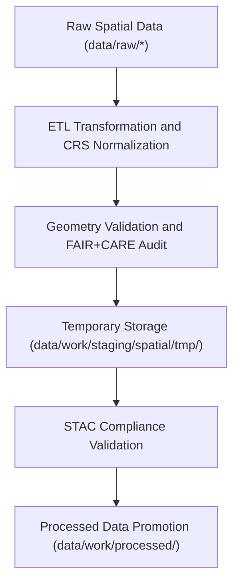

<div align="center">

# 🗺️ Kansas Frontier Matrix — **Spatial Staging Workspace**
`data/work/staging/spatial/README.md`

**Purpose:** Dedicated workspace for harmonizing, validating, and transforming geospatial datasets within the Kansas Frontier Matrix (KFM).  
This layer ensures all GeoJSON, GeoParquet, and raster products conform to spatial schemas, CRS standards, and FAIR+CARE governance requirements before publication.

[](../../../../docs/standards/faircare-validation.md)
[](../../../../LICENSE)
[](../../../../docs/architecture/repo-focus.md)

</div>

---

## 📚 Overview

The `data/work/staging/spatial/` directory serves as the **controlled preprocessing environment for all geospatial datasets**, including hazard maps, hydrologic boundaries, and landcover layers.  
Here, spatial files are reprojected, normalized, and validated to ensure consistency with the Kansas Frontier Matrix’s STAC catalog and data governance standards.

This workspace supports:
- Reprojection and CRS normalization to EPSG:4326 (WGS84).  
- Validation of geometry integrity and spatial extent consistency.  
- Metadata injection for STAC 1.0 and DCAT 3.0 interoperability.  
- FAIR+CARE spatial audit for ethical data use and territorial accuracy.  

---

## 🗂️ Directory Layout

```plaintext
data/work/staging/spatial/
├── README.md                             # This file — documentation for spatial staging
│
├── tmp/                                  # Temporary workspace for spatial ETL processes
│   ├── reprojection/                     # CRS conversion artifacts
│   ├── clipping/                         # Boundary-filtered datasets
│   ├── union_merge/                      # Merged layer outputs
│   └── metadata.json                     # Temporary provenance metadata
│
├── validation/                           # Validation and QA results
│   ├── geometry_validation_report.json   # Topology and geometry QA
│   ├── stac_spatial_compliance.json      # STAC spatial metadata validation
│   ├── crs_check_summary.json            # CRS and bounding box validation
│   └── faircare_spatial_audit.json       # FAIR+CARE compliance report
│
└── logs/                                 # Spatial ETL and validation logs
    ├── spatial_pipeline_run.log
    ├── reprojection_summary.log
    ├── governance_sync.log
    └── metadata.json
```

---

## ⚙️ Spatial ETL Workflow



### Workflow Summary:
1. **Normalization:** Spatial datasets reprojected and harmonized for unified CRS and geometry type.  
2. **Validation:** Geometry integrity checks ensure topological correctness.  
3. **Compliance:** FAIR+CARE audits verify ethical boundaries and governance compliance.  
4. **Promotion:** Approved files promoted to `data/work/processed/spatial/`.  
5. **Governance Sync:** Provenance and checksums registered in `data/reports/audit/data_provenance_ledger.json`.

---

## 🧩 Example Metadata Record

```json
{
  "id": "staging_spatial_hazards_v9.3.2",
  "source_files": [
    "data/raw/fema/flood_zones/kansas_flood_zones_2025.geojson",
    "data/raw/usgs/elevation_models/kansas_dem_10m.tif"
  ],
  "crs_target": "EPSG:4326",
  "geometry_type": "Polygon",
  "extent_bbox": [-102.05, 36.99, -94.61, 40.00],
  "created": "2025-10-28T15:25:00Z",
  "validator": "@kfm-spatial-lab",
  "checksum": "sha256:cf29a1e0b4c9e12a64e2c30d6c0bda9b9f65c47f...",
  "fairstatus": "compliant",
  "governance_ref": "data/reports/audit/data_provenance_ledger.json"
}
```

---

## 🧠 FAIR+CARE Governance in Spatial Data

| Principle | Implementation in Spatial Staging |
|------------|----------------------------------|
| **Findable** | Each dataset assigned STAC-compliant spatial ID and geometry summary. |
| **Accessible** | Stored in open formats (GeoJSON, GeoParquet, TIFF). |
| **Interoperable** | CRS normalized (EPSG:4326) and metadata conforms to STAC/DCAT schemas. |
| **Reusable** | Includes checksum, geometry validation, and provenance metadata. |
| **Collective Benefit** | Promotes reproducible geospatial analyses and ethical territorial representation. |
| **Authority to Control** | Governance Council approves all spatial dataset boundaries and CRS transformations. |
| **Responsibility** | Validators log all reprojection and correction steps. |
| **Ethics** | Spatial data reviewed for cultural, legal, and jurisdictional sensitivity. |

Audit references available in:  
`data/reports/fair/data_care_assessment.json`  
and `data/reports/audit/data_provenance_ledger.json`.

---

## ⚙️ Spatial Validation Criteria

| Validation Type | Description | Tool | Output |
|------------------|-------------|------|---------|
| **Geometry Integrity** | Checks for null, invalid, or self-intersecting geometries. | GDAL / Shapely | `geometry_validation_report.json` |
| **CRS Normalization** | Ensures all geometries reprojected to EPSG:4326. | pyproj / Fiona | `crs_check_summary.json` |
| **STAC Spatial Metadata** | Confirms presence of bounding boxes, centroids, and linkages. | stac-validator | `stac_spatial_compliance.json` |
| **FAIR+CARE Audit** | Verifies ethical and transparent handling of spatial data. | faircare-validator | `faircare_spatial_audit.json` |

---

## ⚖️ Governance & Provenance Integration

| Record | Description |
|---------|-------------|
| `validation/faircare_spatial_audit.json` | Records ethical review results for spatial data. |
| `validation/stac_spatial_compliance.json` | Ensures STAC spatial metadata alignment. |
| `logs/governance_sync.log` | Tracks ledger and checksum updates for spatial workflows. |
| `data/reports/audit/data_provenance_ledger.json` | Central provenance ledger linking all spatial datasets. |

All validation workflows orchestrated by `spatial_validation_sync.yml` automation.

---

## 🧾 Retention Policy

| File Category | Retention Duration | Policy |
|----------------|--------------------|--------|
| Temporary Files (`tmp/`) | 14 days | Cleared after successful spatial validation. |
| Validation Reports | 180 days | Retained for FAIR+CARE and QA review. |
| Logs | 90 days | Archived in `data/work/logs/system/` for governance reference. |
| Certified Metadata | Permanent | Promoted to STAC catalog upon validation approval. |

Cleanup managed by automated `spatial_cleanup.yml` task.

---

## 🧾 Internal Use Citation

```text
Kansas Frontier Matrix (2025). Spatial Staging Workspace (v9.3.2).
Intermediate processing and validation environment for geospatial datasets, ensuring CRS, topology, and FAIR+CARE compliance prior to publication.
Restricted to internal ETL and governance workflows.
```

---

## 🧾 Version Notes

| Version | Date | Notes |
|----------|------|--------|
| v9.3.2 | 2025-10-28 | Added FAIR+CARE spatial audit reports and STAC compliance integration. |
| v9.2.0 | 2024-07-15 | Introduced reprojection and CRS validation modules. |
| v9.0.0 | 2023-01-10 | Established spatial staging directory for geospatial normalization. |

---

<div align="center">

**Kansas Frontier Matrix** · *Geospatial Integrity × FAIR+CARE Ethics × Reproducible Validation*  
[🔗 Repository](https://github.com/bartytime4life/Kansas-Frontier-Matrix) • [🧭 Docs Portal](../../../../docs/) • [⚖️ Governance Ledger](../../../../docs/standards/governance/)

</div>