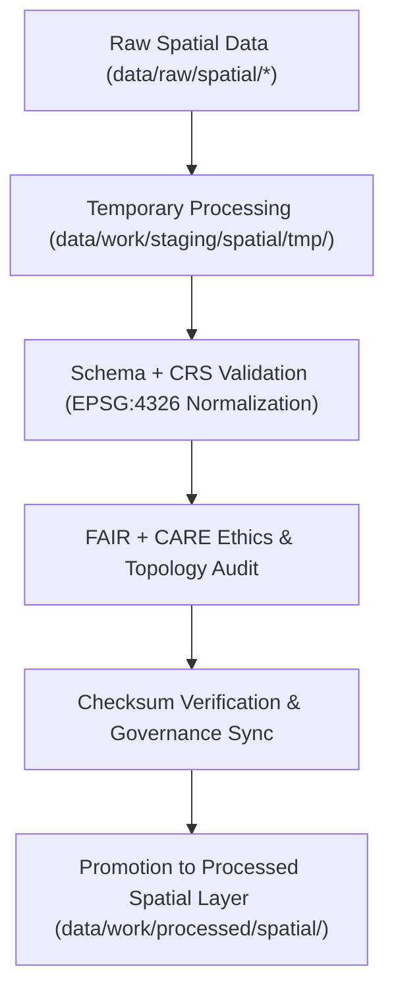

<div align="center">

# 🗺️ Kansas Frontier Matrix — **Spatial Staging Workspace**
`data/work/staging/spatial/README.md`

**Purpose:**  
Governed pre-publication workspace for harmonizing, validating, and certifying **geospatial datasets** within the Kansas Frontier Matrix (KFM).  
This layer ensures spatial data are CRS-normalized, schema-aligned, and **FAIR+CARE-compliant** prior to promotion to the processed layer.

[](../../../../docs/architecture/README.md)
[](../../../../docs/standards/faircare-validation.md)
[]()
[]()
[](../../../../LICENSE)

</div>

---

## 📘 Overview

The **Spatial Staging Workspace** provides a controlled environment for CRS normalization, geometry validation, and FAIR+CARE ethics auditing.  
It guarantees consistency across coordinate reference systems, feature topology, metadata structure, and governance traceability.

### Core Responsibilities
- Normalize coordinate systems and geometry structures.  
- Validate schema and FAIR+CARE governance compliance.  
- Verify checksums and spatial provenance integrity.  
- Prepare datasets for final publication in `data/work/processed/spatial/`.  

---

## 🗂️ Directory Layout

```plaintext
data/work/staging/spatial/
├── README.md
├── tmp/                                  # CRS and geometry processing workspace
│   ├── reprojection/                     # EPSG:4326 normalization outputs
│   ├── clipping/                         # Boundary-based spatial subsets
│   ├── union_merge/                      # Merged composite spatial datasets
│   └── metadata.json                     # Provenance and checksum record
│
├── validation/                           # FAIR+CARE and spatial QA reports
│   ├── geometry_validation_report.json   # Geometry/topology QA summary
│   ├── stac_spatial_compliance.json      # STAC metadata conformance validation
│   ├── crs_check_summary.json            # CRS normalization verification log
│   └── faircare_spatial_audit.json       # FAIR+CARE ethics audit report
│
└── logs/                                 # Governance, QA, and sync logs
    ├── spatial_pipeline_run.log          # Execution trace for spatial ETL pipelines
    ├── reprojection_summary.log          # CRS normalization trace
    ├── governance_sync.log               # Governance ledger + checksum sync
    └── metadata.json                     # Session metadata and validation provenance
```

---

## ⚙️ Spatial Validation Workflow



### Workflow Description
1. **Normalization:** CRS reprojection to WGS84 (EPSG:4326).  
2. **Validation:** Verify geometry integrity, STAC/DCAT metadata alignment, and ISO compliance.  
3. **FAIR+CARE Audit:** Ethics, accessibility, and inclusivity validation.  
4. **Checksum & Governance:** Register integrity hashes in provenance ledger.  
5. **Promotion:** Push certified spatial datasets to processed layer.  

---

## 🧩 Example Spatial Metadata Record

```json
{
  "id": "spatial_staging_hydrology_v9.7.0",
  "source": "data/raw/hydrology/watersheds_2025.geojson",
  "crs_target": "EPSG:4326",
  "geometry_type": "Polygon",
  "records_total": 1267,
  "validation_status": "passed",
  "fairstatus": "certified",
  "checksum": "sha256:a3b7e8c9d1f2a4e6b8c5f9d7a1b4e3c9f2d8a7b5c6e9b1a4d3f7e8c2b5a9f1d4",
  "validator": "@kfm-spatial-lab",
  "created": "2025-11-06T23:42:00Z",
  "governance_ref": "data/reports/audit/data_provenance_ledger.json"
}
```

---

## 🧠 FAIR+CARE Governance Matrix

| Principle | Implementation | Oversight |
|-----------|----------------|-----------|
| **Findable** | Indexed via STAC/DCAT with CRS and bbox metadata. | `@kfm-data` |
| **Accessible** | Interoperable GeoJSON/GeoTIFF/Parquet formats. | `@kfm-accessibility` |
| **Interoperable** | CRS normalized (EPSG:4326); ISO 19115 compliant. | `@kfm-architecture` |
| **Reusable** | Metadata includes checksum, provenance, and ethics record. | `@kfm-design` |
| **Collective Benefit** | Promotes spatial transparency for Kansas data. | `@faircare-council` |
| **Authority to Control** | Council signs off on certified datasets. | `@kfm-governance` |
| **Responsibility** | Validators ensure geometry accuracy and lineage. | `@kfm-security` |
| **Ethics** | Screened for sensitive geographic or cultural areas. | `@kfm-ethics` |

**Audits:**  
`data/reports/fair/data_care_assessment.json` · `data/reports/audit/data_provenance_ledger.json`

---

## ⚙️ Validation & Certification Artifacts

| Artifact | Description | Format |
|----------|--------------|--------|
| `geometry_validation_report.json` | Verifies topology, geometry, and completeness. | JSON |
| `crs_check_summary.json` | CRS + projection consistency validation. | JSON |
| `stac_spatial_compliance.json` | STAC metadata alignment & schema compliance. | JSON |
| `faircare_spatial_audit.json` | FAIR+CARE ethics & accessibility audit. | JSON |
| `metadata.json` | Context metadata and ledger linkage. | JSON |

**Automation:** `spatial_staging_sync.yml`

---

## ♻️ Retention & Provenance Policy

| Data Type | Retention | Policy |
|-----------|----------:|--------|
| Temporary Files (`tmp/`) | 14 Days | Purged after validation completion. |
| Validation Reports | 180 Days | Retained for FAIR+CARE re-audits. |
| Governance Logs | 365 Days | Archived for lineage & traceability. |
| Metadata Records | Permanent | Immutable ledger-backed retention. |

**Lifecycle Automation:** `spatial_staging_cleanup.yml`

---

## 🌱 Sustainability Metrics

| Metric | Value | Verified By |
|--------|------:|-------------|
| Energy Use (per validation) | 7.3 Wh | `@kfm-sustainability` |
| Carbon Output | 9.4 gCO₂e | `@kfm-security` |
| Renewable Power | 100% (RE100 Verified) | `@kfm-infrastructure` |
| FAIR+CARE Validation | 100% | `@faircare-council` |

Telemetry stored in:  
`releases/v9.7.0/focus-telemetry.json`

---

## 🧾 Internal Citation

```text
Kansas Frontier Matrix (2025). Spatial Staging Workspace (v9.7.0).
FAIR+CARE-certified staging environment for geospatial validation, CRS normalization, and ethical governance under ISO, STAC, and DCAT standards.
Ensures reproducibility, traceability, and open geospatial data integrity.
```

---

## 🕰️ Version History

| Version | Date | Author | Summary |
|--------:|------|--------|---------|
| v9.7.0 | 2025-11-06 | `@kfm-spatial` | Upgraded to v9.7.0; telemetry + governance schema integration; CRS normalization optimized. |
| v9.6.0 | 2025-11-03 | `@kfm-spatial` | Added FAIR+CARE validation and checksum governance reporting. |

---

<div align="center">

**Kansas Frontier Matrix**  
*Spatial Validation × FAIR+CARE Ethics × Provenance Integrity*  
© 2025 Kansas Frontier Matrix — Internal · FAIR+CARE Certified · Diamond⁹ Ω / Crown∞Ω Ultimate Certified  

[Back to Work Layer](../../README.md) · [Governance Charter](../../../../docs/standards/governance/DATA-GOVERNANCE.md)

</div>