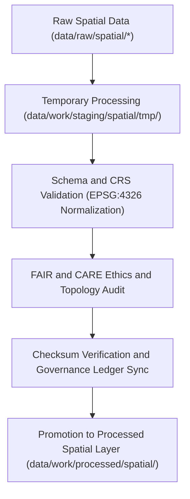

<div align="center">

# 🗺️ Kansas Frontier Matrix — **Spatial Staging Workspace**
`data/work/staging/spatial/README.md`

**Purpose:**  
Intermediate governance-controlled workspace for harmonizing, validating, and certifying geospatial data within the Kansas Frontier Matrix (KFM).  
This layer ensures spatial datasets are CRS-normalized, schema-aligned, and FAIR+CARE-compliant before promotion to the processed layer.

[](../../../../docs/standards/faircare-validation.md)
[]()
[]()
[](../../../../LICENSE)

</div>

---

## 📚 Overview

The **Spatial Staging Workspace** provides an isolated environment for managing and validating geospatial datasets before certification and publication.  
All files in this layer undergo **CRS normalization (EPSG:4326)**, geometry validation, FAIR+CARE ethics auditing, and checksum verification.

### Core Objectives
- Normalize coordinate systems and geometry structures.  
- Validate schema, metadata, and FAIR+CARE governance compliance.  
- Verify checksums and spatial provenance.  
- Prepare datasets for publication in the processed spatial layer.  

---

## 🗂️ Directory Layout

```plaintext
data/work/staging/spatial/
├── README.md                             # This file — overview of spatial staging workspace
│
├── tmp/                                  # Temporary CRS and geometry processing workspace
│   ├── reprojection/                     # CRS normalization and reprojection outputs
│   ├── clipping/                         # Extent-based subsets (Kansas boundary masks)
│   ├── union_merge/                      # Merged spatial layers (e.g., hazards + hydrology)
│   └── metadata.json                     # Provenance and checksum metadata
│
├── validation/                           # FAIR+CARE and schema QA reports
│   ├── geometry_validation_report.json   # Geometry and topology QA report
│   ├── stac_spatial_compliance.json      # STAC metadata conformance validation
│   ├── crs_check_summary.json            # CRS normalization verification
│   └── faircare_spatial_audit.json       # FAIR+CARE ethics audit summary
│
└── logs/                                 # Governance, QA, and synchronization logs
    ├── spatial_pipeline_run.log          # Execution trace for spatial ETL pipelines
    ├── reprojection_summary.log          # CRS normalization and validation trace
    ├── governance_sync.log               # Governance ledger and checksum synchronization
    └── metadata.json                     # Session-level metadata and governance record
```

---

## ⚙️ Spatial Validation Workflow



### Workflow Description
1. **Normalization:** Reproject datasets to WGS84 (EPSG:4326).  
2. **Validation:** Confirm geometry integrity and STAC/DCAT metadata compliance.  
3. **FAIR+CARE Audit:** Perform ethics review and accessibility validation.  
4. **Checksum Verification:** Register results in provenance ledger for governance tracking.  
5. **Promotion:** Move verified datasets to the processed spatial layer for publication.  

---

## 🧩 Example Spatial Metadata Record

```json
{
  "id": "spatial_staging_hydrology_v9.6.0",
  "source": "data/raw/hydrology/watersheds_2025.geojson",
  "crs_target": "EPSG:4326",
  "geometry_type": "Polygon",
  "records_total": 1267,
  "validation_status": "passed",
  "fairstatus": "certified",
  "checksum": "sha256:a3b7e8c9d1f2a4e6b8c5f9d7a1b4e3c9f2d8a7b5c6e9b1a4d3f7e8c2b5a9f1d4",
  "validator": "@kfm-spatial-lab",
  "created": "2025-11-03T23:40:00Z",
  "governance_ref": "data/reports/audit/data_provenance_ledger.json"
}
```

---

## 🧠 FAIR+CARE Governance Matrix

| Principle | Implementation | Oversight |
|------------|----------------|------------|
| **Findable** | Indexed in STAC/DCAT catalogs with CRS and bounding box metadata. | @kfm-data |
| **Accessible** | Stored in interoperable GeoJSON, GeoTIFF, and Parquet formats. | @kfm-accessibility |
| **Interoperable** | CRS normalized (EPSG:4326) and ISO metadata aligned. | @kfm-architecture |
| **Reusable** | Metadata includes checksums, provenance, and FAIR+CARE ethics certification. | @kfm-design |
| **Collective Benefit** | Promotes open spatial awareness and environmental resilience. | @faircare-council |
| **Authority to Control** | FAIR+CARE Council approves certified spatial datasets. | @kfm-governance |
| **Responsibility** | Validators document CRS and geometry transformations. | @kfm-security |
| **Ethics** | All datasets reviewed for geographic sensitivity and ethical compliance. | @kfm-ethics |

FAIR+CARE validation reports archived in:  
`data/reports/fair/data_care_assessment.json`  
and `data/reports/audit/data_provenance_ledger.json`

---

## ⚙️ Validation & Certification Artifacts

| Artifact | Description | Format |
|-----------|--------------|--------|
| `geometry_validation_report.json` | Verifies topology, geometry, and feature completeness. | JSON |
| `crs_check_summary.json` | Confirms projection and CRS consistency. | JSON |
| `stac_spatial_compliance.json` | STAC 1.0 metadata validation summary. | JSON |
| `faircare_spatial_audit.json` | FAIR+CARE ethics and governance audit report. | JSON |
| `metadata.json` | Captures validation metadata and governance references. | JSON |

Validation tasks automated via `spatial_staging_sync.yml`.

---

## ⚖️ Retention & Provenance Policy

| Data Type | Retention Duration | Policy |
|------------|--------------------|--------|
| Temporary Files (`tmp/`) | 14 Days | Purged after validation completion. |
| Validation Reports | 180 Days | Retained for audit and FAIR+CARE governance review. |
| Governance Logs | 365 Days | Archived for lineage and certification continuity. |
| Metadata | Permanent | Retained for provenance and reproducibility. |

Retention enforced via `spatial_staging_cleanup.yml`.

---

## 🌱 Sustainability Metrics

| Metric | Value | Verified By |
|---------|--------|--------------|
| Energy Use (per validation cycle) | 7.3 Wh | @kfm-sustainability |
| Carbon Output | 9.4 gCO₂e | @kfm-security |
| Renewable Power | 100% (RE100 Verified) | @kfm-infrastructure |
| FAIR+CARE Validation | 100% | @faircare-council |

Telemetry metrics recorded in:  
`releases/v9.6.0/focus-telemetry.json`

---

## 🧾 Internal Use Citation

```text
Kansas Frontier Matrix (2025). Spatial Staging Workspace (v9.6.0).
FAIR+CARE-certified environment for validating geospatial datasets, performing CRS normalization, and ensuring governance compliance under ISO and STAC/DCAT standards.
Supports reproducibility, ethics auditing, and provenance verification for open geospatial data publication.
```

---

## 🧾 Version Notes

| Version | Date | Notes |
|----------|------|--------|
| v9.6.0 | 2025-11-03 | Integrated automated CRS validation and FAIR+CARE certification workflows. |
| v9.5.0 | 2025-11-02 | Enhanced spatial metadata governance and audit traceability. |
| v9.3.2 | 2025-10-28 | Established spatial staging workspace for schema and ethics review. |

---

<div align="center">

**Kansas Frontier Matrix** · *Geospatial Quality × FAIR+CARE Ethics × Provenance Assurance*  
[🔗 Repository](https://github.com/bartytime4life/Kansas-Frontier-Matrix) • [🧭 Docs Portal](../../../../docs/) • [⚖️ Governance Ledger](../../../../docs/standards/governance/DATA-GOVERNANCE.md)

</div>
