<div align="center">

# 🗺️ Kansas Frontier Matrix — **Spatial Staging Workspace**
`data/work/staging/spatial/README.md`

**Purpose:** Dedicated workspace for harmonizing, validating, and transforming geospatial datasets within the Kansas Frontier Matrix (KFM).  
This layer ensures all GeoJSON, GeoParquet, and raster products conform to spatial schemas, CRS standards, and FAIR+CARE governance requirements before publication.

[](../../../../docs/standards/faircare-validation.md)
[](../../../../LICENSE)
[](../../../../docs/architecture/repo-focus.md)

</div>

---

## 📚 Overview

The `data/work/staging/spatial/` directory serves as the **controlled preprocessing environment for all geospatial datasets**, including hazard maps, hydrologic boundaries, elevation tiles, and landcover layers.  
Here, spatial files are reprojected, normalized, and validated to ensure consistency with KFM’s STAC catalog, governance standards, and FAIR+CARE ethics.

This workspace supports:
- Reprojection and CRS normalization to **EPSG:4326 (WGS84)**.  
- Validation of geometry integrity, topology, and spatial extent consistency.  
- Metadata injection for **STAC 1.0 / DCAT 3.0** interoperability.  
- FAIR+CARE spatial audit for ethical data use and territorial accuracy.  
- **Telemetry logging** of validation outcomes to drive governance dashboards.

---

## 🗂️ Directory Layout

```plaintext
data/work/staging/spatial/
├── README.md                             # This file — documentation for spatial staging
│
├── tmp/                                  # Temporary workspace for spatial ETL processes
│   ├── reprojection/                     # CRS conversion artifacts
│   ├── clipping/                         # Boundary-filtered datasets
│   ├── union_merge/                      # Merged layer outputs
│   └── metadata.json                     # Temporary provenance metadata
│
├── validation/                           # Validation and QA results
│   ├── geometry_validation_report.json   # Topology and geometry QA
│   ├── stac_spatial_compliance.json      # STAC spatial metadata validation
│   ├── crs_check_summary.json            # CRS and bounding box validation
│   └── faircare_spatial_audit.json       # FAIR+CARE compliance report
│
└── logs/                                 # Spatial ETL and validation logs
    ├── spatial_pipeline_run.log
    ├── reprojection_summary.log
    ├── governance_sync.log
    └── metadata.json
```

---

## ⚙️ Spatial ETL Workflow

```mermaid
flowchart TD
    A["Raw Spatial Data (data/raw/*)"] --> B["ETL Transformation & CRS Normalization (EPSG:4326)"]
    B --> C["Geometry Validation & FAIR+CARE Audit"]
    C --> D["Temporary Storage (data/work/staging/spatial/tmp/)"]
    D --> E["STAC/DCAT Compliance Validation"]
    E --> F["Promotion → Processed Layer (data/work/processed/spatial/)"]
    F --> G["Catalog Sync (STAC/DCAT) + Governance Ledger Update + Telemetry"]
```



### Workflow Summary
1. **Normalization:** Reproject inputs; harmonize geometry types and attributes.  
2. **Validation:** Ensure topology correctness and extent consistency; run FAIR+CARE ethics review.  
3. **Compliance:** Validate STAC/DCAT fields (bbox, links, asset types).  
4. **Promotion:** Move approved assets to `data/work/processed/spatial/`.  
5. **Governance:** Register provenance, checksums, and ethics status in the ledger; emit telemetry.

---

## 🧩 Example Staging Metadata Record

```json
{
  "id": "staging_spatial_hazards_v9.4.0",
  "source_files": [
    "data/raw/fema/flood_zones/kansas_flood_zones_2025.geojson",
    "data/raw/usgs/elevation_models/kansas_dem_10m.tif"
  ],
  "crs_target": "EPSG:4326",
  "geometry_type": "Polygon",
  "extent_bbox": [-102.05, 36.99, -94.61, 40.00],
  "created": "2025-11-02T14:58:00Z",
  "validator": "@kfm-spatial-lab",
  "checksum": "sha256:cf29a1e0b4c9e12a64e2c30d6c0bda9b9f65c47f...",
  "fairstatus": "compliant",
  "telemetry_link": "releases/v9.4.0/focus-telemetry.json",
  "governance_ref": "data/reports/audit/data_provenance_ledger.json"
}
```

---

## 🧠 FAIR+CARE Governance in Spatial Data

| Principle | Implementation in Spatial Staging |
|------------|----------------------------------|
| **Findable** | STAC-compliant spatial IDs, bbox, and geometry summaries recorded. |
| **Accessible** | Open formats (GeoJSON, GeoParquet, GeoTIFF) with documented schemas. |
| **Interoperable** | CRS normalized (EPSG:4326) and metadata aligned to STAC/DCAT. |
| **Reusable** | Checksums, lineage, and validation artifacts included. |
| **Collective Benefit** | Promotes reproducible analyses and ethical representation of territories. |
| **Authority to Control** | Governance Council approves boundaries and CRS transformations. |
| **Responsibility** | Validators document reprojection and corrections in logs. |
| **Ethics** | Reviewed for cultural, legal, and jurisdictional sensitivity; restricted areas excluded. |

Audit references:  
`data/reports/fair/data_care_assessment.json` • `data/reports/audit/data_provenance_ledger.json`

---

## ⚙️ Spatial Validation Criteria

| Validation Type | Description | Tool | Output |
|------------------|-------------|------|--------|
| **Geometry Integrity** | Detect null, invalid, or self-intersecting geometries. | GDAL / Shapely | `validation/geometry_validation_report.json` |
| **CRS Normalization** | Confirm EPSG:4326, bbox, and axis order. | pyproj / Fiona | `validation/crs_check_summary.json` |
| **STAC Spatial Metadata** | Verify bbox, centroids, asset links, and roles. | stac-validator | `validation/stac_spatial_compliance.json` |
| **FAIR+CARE Audit** | Ethics & territorial accuracy checks. | faircare-validator | `validation/faircare_spatial_audit.json` |

---

## ⚖️ Governance & Provenance Integration

| Record | Description |
|---------|-------------|
| `validation/faircare_spatial_audit.json` | Ethics review outcomes for spatial datasets. |
| `validation/stac_spatial_compliance.json` | STAC spatial metadata compliance summary. |
| `logs/governance_sync.log` | Ledger and checksum update trace. |
| `data/reports/audit/data_provenance_ledger.json` | Central lineage record for spatial workflows. |

All workflows orchestrated by **`spatial_validation_sync.yml`**; release artifacts registered in **`releases/v9.4.0/`**.

---

## 🧾 Retention Policy

| File Category | Retention | Policy |
|----------------|-----------|--------|
| Temporary Files (`tmp/`) | 14 days | Purged after successful validation. |
| Validation Reports | 180 days | Retained for FAIR+CARE and QA review. |
| Logs | 90 days | Archived to `data/work/logs/system/`. |
| Certified Metadata | Permanent | Promoted to the STAC catalog upon approval. |

Cleanup managed by **`spatial_cleanup.yml`** automation.

---

## 🧾 Internal Use Citation

```text
Kansas Frontier Matrix (2025). Spatial Staging Workspace (v9.4.0).
Intermediate processing and validation environment for geospatial datasets, ensuring CRS, topology, and FAIR+CARE compliance prior to publication.
Restricted to internal ETL and governance workflows.
```

---

## 🧾 Version Notes

| Version | Date | Notes |
|----------|------|--------|
| v9.4.0 | 2025-11-02 | Added telemetry integration, enhanced STAC/DCAT validation, and automated governance sync. |
| v9.3.2 | 2025-10-28 | Added FAIR+CARE spatial audit reports and STAC compliance integration. |
| v9.2.0 | 2024-07-15 | Introduced reprojection and CRS validation modules. |
| v9.0.0 | 2023-01-10 | Established spatial staging directory for geospatial normalization. |

---

<div align="center">

**Kansas Frontier Matrix** · *Geospatial Integrity × FAIR+CARE Ethics × Reproducible Validation × Telemetry Traceability*  
[🔗 Repository](https://github.com/bartytime4life/Kansas-Frontier-Matrix) • [🧭 Docs Portal](../../../../docs/) • [⚖️ Governance Ledger](../../../../docs/standards/governance/)

</div>
