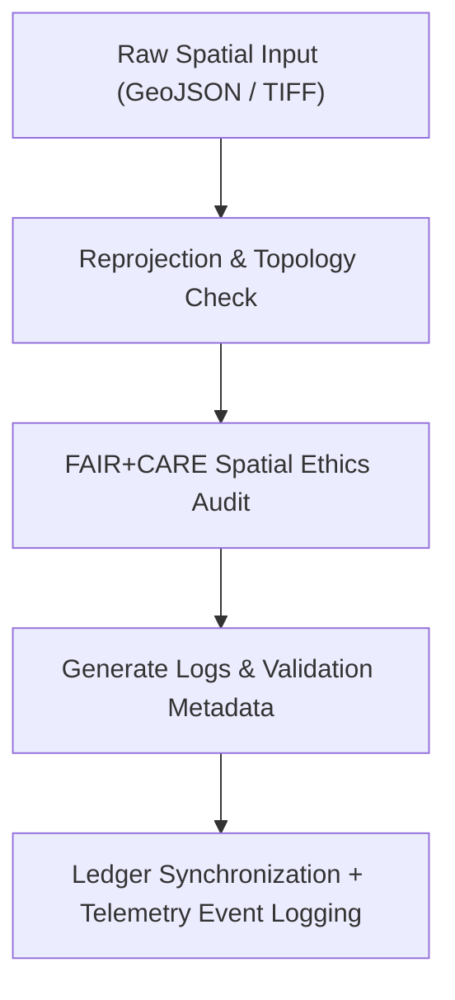

<div align="center">

# 🗺️ Kansas Frontier Matrix — **Spatial Logs**
`data/work/staging/spatial/logs/README.md`

**Purpose:** Records execution, validation, and governance audit logs for spatial data transformations performed within the Kansas Frontier Matrix (KFM).  
These logs ensure full traceability of reprojection, clipping, merging, and FAIR+CARE spatial compliance workflows executed in the staging environment.

[](../../../../../docs/standards/faircare-validation.md)
[](../../../../../LICENSE)
[](../../../../../docs/architecture/repo-focus.md)

</div>

---

## 📚 Overview

The `data/work/staging/spatial/logs/` directory archives all **execution traces and governance logs** associated with spatial data ETL, validation, and FAIR+CARE certification processes.  
It maintains a permanent record of geometry validation, CRS normalization, and synchronization activities between staging datasets and the central governance ledger.

This workspace provides:
- Transparent records of spatial transformations (merge, clip, reprojection).  
- FAIR+CARE compliance documentation for spatial ethics review.  
- Governance sync logs ensuring provenance and checksum verification.  
- Telemetry-linked audit metadata to track validator activity and runtime statistics.  

All logs conform to **MCP-DL v6.3** governance standards and FAIR+CARE traceability policies.

---

## 🗂️ Directory Layout

```plaintext
data/work/staging/spatial/logs/
├── README.md                              # This file — documentation of spatial logs
│
├── spatial_pipeline_run.log               # Full execution trace of spatial ETL pipelines
├── reprojection_summary.log               # CRS normalization and coordinate transformation details
├── geometry_validation.log                # Geometry QA and topology check report
├── governance_sync.log                    # FAIR+CARE audit and ledger synchronization log
└── metadata.json                          # Log-level provenance metadata and validator details
```

---

## ⚙️ Spatial Logging Workflow



### Workflow Summary
1. **Preprocessing:** Log sequence begins when spatial datasets are loaded into ETL pipelines.  
2. **Validation:** CRS normalization, reprojection, and topology fixes recorded with timestamps.  
3. **Audit:** FAIR+CARE ethics compliance results captured for geographic datasets.  
4. **Governance:** Log metadata, validator identity, and checksum results synced to the governance ledger and telemetry database.

---

## 🧩 Example Spatial Log Metadata Record

```json
{
  "id": "spatial_log_hazards_v9.4.0",
  "source_files": [
    "data/raw/fema/flood_zones/kansas_flood_zones_2025.geojson",
    "data/raw/usgs/elevation_models/kansas_dem_10m.tif"
  ],
  "created": "2025-11-02T15:10:00Z",
  "validator": "@kfm-spatial-lab",
  "records_processed": 2173,
  "geometry_errors_corrected": 2,
  "crs_transformations": 1,
  "telemetry_link": "releases/v9.4.0/focus-telemetry.json",
  "checksum": "sha256:1dcd0fa3a28a3e39ff9b10f774c3a789fd3a44a2...",
  "fairstatus": "compliant",
  "governance_ledger_ref": "data/reports/audit/data_provenance_ledger.json"
}
```

---

## 🧠 FAIR+CARE Governance for Spatial Logging

| Principle | Implementation |
|------------|----------------|
| **Findable** | Logs include dataset ID, CRS, bounding box, and validator references. |
| **Accessible** | Text and JSON logs available to internal governance reviewers. |
| **Interoperable** | Stored in open plain-text/JSON formats usable across validation systems. |
| **Reusable** | Linked with STAC catalog entries and provenance metadata. |
| **Collective Benefit** | Promotes transparency and reproducibility in spatial workflows. |
| **Authority to Control** | FAIR+CARE Council validates log accuracy before archival. |
| **Responsibility** | Validators required to record reprojection, fixes, and CRS alignment. |
| **Ethics** | Logs affirm proper handling of culturally and jurisdictionally sensitive boundaries. |

Audits and validation records linked to:  
`data/reports/audit/data_provenance_ledger.json` and `data/reports/fair/data_care_assessment.json`.

---

## ⚙️ Log Categories

| File | Description | Format |
|------|--------------|--------|
| `spatial_pipeline_run.log` | Full ETL execution trace for spatial workflows. | Text |
| `reprojection_summary.log` | CRS and projection validation record. | Text |
| `geometry_validation.log` | Geometry QA and topology results. | Text |
| `governance_sync.log` | Governance and FAIR+CARE ledger synchronization details. | Text |
| `metadata.json` | Captures validator info, runtime context, telemetry link, and checksum. | JSON |

---

## ⚖️ Governance & Provenance Integration

| Record | Description |
|---------|-------------|
| `metadata.json` | Log provenance metadata, checksum hash, and governance linkage. |
| `data/reports/audit/data_provenance_ledger.json` | Immutable ledger tracking spatial workflow lineage. |
| `data/reports/validation/stac_validation_report.json` | Documents STAC metadata alignment. |
| `releases/v9.4.0/manifest.zip` | Manifest of spatial log hashes for reproducibility. |

Governance synchronization automated through **`spatial_log_sync.yml`** and recorded via telemetry.

---

## 🧾 Retention Policy

| Log Type | Retention | Policy |
|-----------|-----------|--------|
| Spatial Pipeline Logs | 90 days | Archived quarterly for governance and audit review. |
| CRS and Reprojection Logs | 60 days | Purged after validation cycle completion. |
| Geometry Validation Logs | 180 days | Retained for FAIR+CARE spatial ethics and QA audits. |
| Governance Sync Logs | Permanent | Stored indefinitely for provenance and traceability. |

Cleanup handled automatically via **`spatial_log_cleanup.yml`**.

---

## 🧾 Internal Use Citation

```text
Kansas Frontier Matrix (2025). Spatial Logs (v9.4.0).
Comprehensive audit logging framework for geospatial ETL, validation, and FAIR+CARE governance synchronization.
Restricted to internal reproducibility, QA, and ethics auditing within the Kansas Frontier Matrix.
```

---

## 🧾 Version Notes

| Version | Date | Notes |
|----------|------|--------|
| v9.4.0 | 2025-11-02 | Added telemetry integration, governance linkage enhancements, and checksum-based trace automation. |
| v9.3.2 | 2025-10-28 | Added detailed reprojection and geometry QA logs; integrated FAIR+CARE governance sync. |
| v9.2.0 | 2024-07-15 | Expanded CRS validation and spatial topology integrity checks. |
| v9.0.0 | 2023-01-10 | Established spatial logging structure for ETL and validation workflows. |

---

<div align="center">

**Kansas Frontier Matrix** · *Spatial Validation × FAIR+CARE Ethics × Governance Traceability × Telemetry Traceability*  
[🔗 Repository](https://github.com/bartytime4life/Kansas-Frontier-Matrix) • [🧭 Docs Portal](../../../../../docs/) • [⚖️ Governance Ledger](../../../../../docs/standards/governance/)

</div>
