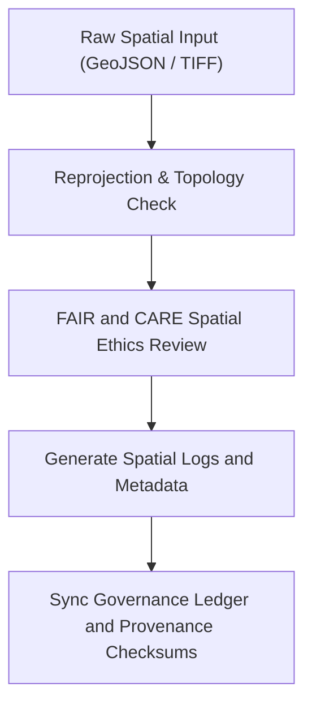

<div align="center">

# 🗺️ Kansas Frontier Matrix — **Spatial Logs**
`data/work/staging/spatial/logs/README.md`

**Purpose:** Records the execution, validation, and governance audit logs for spatial data transformations performed within the Kansas Frontier Matrix (KFM).  
These logs ensure full traceability of reprojection, clipping, merging, and FAIR+CARE spatial compliance workflows executed in the staging environment.

[](../../../../../docs/standards/faircare-validation.md)
[](../../../../../LICENSE)
[](../../../../../docs/architecture/repo-focus.md)

</div>

---

## 📚 Overview

The `data/work/staging/spatial/logs/` directory archives all **execution traces and audit logs related to spatial data processing and validation.**  
This includes reprojection summaries, geometry validation outputs, and synchronization logs connecting staging datasets to the global governance ledger.

These logs serve to:
- Document CRS normalization and geometry correction actions.  
- Track spatial ETL steps, such as merging, clipping, and reprojection.  
- Log FAIR+CARE compliance assessments for geographic data ethics.  
- Maintain checksum records for provenance and integrity verification.  

All logs adhere to MCP-DL v6.3 logging standards and are FAIR+CARE-auditable.

---

## 🗂️ Directory Layout

```plaintext
data/work/staging/spatial/logs/
├── README.md                              # This file — spatial logs documentation
│
├── spatial_pipeline_run.log               # Execution summary of spatial ETL pipelines
├── reprojection_summary.log               # Details of CRS normalization and coordinate transformations
├── geometry_validation.log                # Geometry QA and topology check report
├── governance_sync.log                    # FAIR+CARE and ledger synchronization record
└── metadata.json                          # Log-level provenance and governance metadata
```

---

## ⚙️ Spatial Logging Workflow



### Workflow Summary:
1. **Preprocessing:** Logs start when spatial files are loaded for transformation.  
2. **Validation:** CRS, geometry, and topology corrections recorded line by line.  
3. **Ethical Audit:** FAIR+CARE compliance events tracked in `governance_sync.log`.  
4. **Governance:** Provenance entries linked with audit ledger for reproducibility.

---

## 🧩 Example Spatial Log Metadata Record

```json
{
  "id": "spatial_log_hazards_v9.3.2",
  "source_files": [
    "data/raw/fema/flood_zones/kansas_flood_zones_2025.geojson",
    "data/raw/usgs/elevation_models/kansas_dem_10m.tif"
  ],
  "created": "2025-10-28T15:35:00Z",
  "validator": "@kfm-spatial-lab",
  "records_processed": 2145,
  "geometry_errors_corrected": 3,
  "crs_transformations": 1,
  "checksum": "sha256:1dcd0fa3a28a3e39ff9b10f774c3a789fd3a44a2...",
  "fairstatus": "compliant",
  "governance_ledger_ref": "data/reports/audit/data_provenance_ledger.json"
}
```

---

## 🧠 FAIR+CARE Governance for Spatial Logging

| Principle | Implementation |
|------------|----------------|
| **Findable** | Logs include spatial dataset references and validation IDs. |
| **Accessible** | Logs are machine-readable and auditable via governance council access. |
| **Interoperable** | Stored in open formats (TXT, JSON) for use across QA systems. |
| **Reusable** | Linked to data provenance and STAC catalog metadata. |
| **Collective Benefit** | Promotes reproducible geospatial transformations and integrity. |
| **Authority to Control** | FAIR+CARE Council oversees all reprojection and validation processes. |
| **Responsibility** | Validators must record all topology fixes and CRS normalizations. |
| **Ethics** | Ensures cultural and jurisdictional geographic boundaries are respected. |

Audit and compliance results stored in:  
`data/reports/audit/data_provenance_ledger.json` and `data/reports/fair/data_care_assessment.json`.

---

## ⚙️ Log Categories

| File | Description | Format |
|------|--------------|--------|
| `spatial_pipeline_run.log` | Execution trace of spatial ETL pipeline operations. | Text |
| `reprojection_summary.log` | CRS normalization and reprojection report. | Text |
| `geometry_validation.log` | Detailed geometry integrity validation results. | Text |
| `governance_sync.log` | Governance synchronization summary and FAIR+CARE linkage. | Text |
| `metadata.json` | Log provenance, checksum, and governance reference. | JSON |

---

## ⚖️ Governance & Provenance Integration

| Record | Description |
|---------|-------------|
| `metadata.json` | Defines runtime context, validator ID, and log checksums. |
| `data/reports/audit/data_provenance_ledger.json` | Central record of spatial process lineage and checksums. |
| `data/reports/validation/stac_validation_report.json` | Tracks STAC spatial metadata compliance. |
| `releases/v9.3.2/manifest.zip` | Manifest of validated log hashes and integrity data. |

Governance synchronization automated by `spatial_log_sync.yml`.

---

## 🧾 Retention Policy

| Log Type | Retention Duration | Policy |
|-----------|--------------------|--------|
| Spatial Pipeline Logs | 90 days | Archived quarterly for governance review. |
| CRS and Reprojection Logs | 60 days | Purged after validation approval. |
| Geometry Validation Logs | 180 days | Retained for FAIR+CARE spatial QA. |
| Governance Sync Logs | 365 days | Stored permanently for provenance tracking. |

Purge automation managed by `spatial_log_cleanup.yml`.

---

## 🧾 Internal Use Citation

```text
Kansas Frontier Matrix (2025). Spatial Logs (v9.3.2).
Comprehensive logging framework for geospatial ETL, validation, and FAIR+CARE governance synchronization.
Restricted to internal reproducibility, QA, and provenance auditing.
```

---

## 🧾 Version Notes

| Version | Date | Notes |
|----------|------|--------|
| v9.3.2 | 2025-10-28 | Added detailed reprojection and geometry QA logs; integrated FAIR+CARE governance sync. |
| v9.2.0 | 2024-07-15 | Expanded CRS validation and spatial topology integrity checks. |
| v9.0.0 | 2023-01-10 | Established spatial logging structure for ETL and validation workflows. |

---

<div align="center">

**Kansas Frontier Matrix** · *Spatial Validation × FAIR+CARE Ethics × Governance Traceability*  
[🔗 Repository](https://github.com/bartytime4life/Kansas-Frontier-Matrix) • [🧭 Docs Portal](../../../../../docs/) • [⚖️ Governance Ledger](../../../../../docs/standards/governance/)

</div>