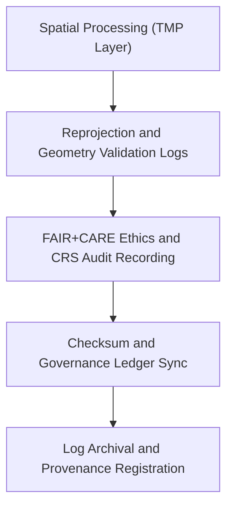

<div align="center">

# 🧾 Kansas Frontier Matrix — **Spatial Logs**
`data/work/staging/spatial/logs/README.md`

**Purpose:**  
Centralized repository for all **spatial ETL, validation, and governance logs** generated within the Kansas Frontier Matrix (KFM) staging environment.  
Ensures transparent traceability, reproducibility, and FAIR+CARE governance auditing for all spatial processing workflows.

[](../../../../../docs/standards/faircare-validation.md)
[]()
[]()
[](../../../../../LICENSE)

</div>

---

## 📚 Overview

The **Spatial Logs Workspace** documents the complete operational lineage of spatial datasets processed in KFM’s staging layer.  
Logs generated here track **CRS normalization, topology validation, FAIR+CARE auditing, checksum generation, and governance synchronization** events.

### Core Responsibilities
- Capture detailed execution traces from reprojection, clipping, and merging workflows.  
- Log CRS and geometry validation outcomes for reproducibility.  
- Track governance ledger updates and checksum verification.  
- Record FAIR+CARE ethical and sustainability audit data.  

---

## 🗂️ Directory Layout

```plaintext
data/work/staging/spatial/logs/
├── README.md                              # This file — overview of spatial logs workspace
│
├── spatial_pipeline_run.log               # Log for spatial ETL and harmonization pipeline execution
├── reprojection_summary.log               # CRS normalization and transformation trace
├── geometry_audit_report.log              # Detailed geometry integrity and validation notes
├── governance_sync.log                    # Governance and checksum synchronization records
└── metadata.json                          # Provenance metadata and checksum registry
```

---

## ⚙️ Spatial Logging Workflow



### Workflow Description
1. **Processing Logs:** Record all reprojection, validation, and harmonization events.  
2. **FAIR+CARE Audit:** Log ethical review outcomes and schema alignment actions.  
3. **Governance Registration:** Sync logs with provenance ledger and checksum manifest.  
4. **Archival:** Archive validated logs for audit reproducibility and governance traceability.  

---

## 🧩 Example Log Metadata Record

```json
{
  "id": "spatial_logs_climate_v9.6.0",
  "component": "spatial_pipeline_run",
  "created": "2025-11-03T23:49:00Z",
  "validator": "@kfm-spatial-lab",
  "records_logged": 212,
  "issues_detected": 0,
  "checksum": "sha256:b3a9e5c6d2a8f4b7e1c9d8f2a7e3b5a6f1c9b4d2e7a6f8b9d3a2c7e4f1b5d9c6",
  "fairstatus": "compliant",
  "governance_ref": "data/reports/audit/data_provenance_ledger.json"
}
```

---

## 🧠 FAIR+CARE Governance Matrix

| Principle | Implementation | Oversight |
|------------|----------------|------------|
| **Findable** | Logs indexed by dataset ID, CRS, and transformation cycle. | @kfm-data |
| **Accessible** | Open, machine-readable text and JSON formats for reproducibility. | @kfm-accessibility |
| **Interoperable** | Log schema aligned with FAIR+CARE and ISO 19115 documentation standards. | @kfm-architecture |
| **Reusable** | Logs include checksums, provenance, and context for reuse. | @kfm-design |
| **Collective Benefit** | Promotes transparency and open auditing across spatial operations. | @faircare-council |
| **Authority to Control** | FAIR+CARE Council certifies governance sync and ethics validation. | @kfm-governance |
| **Responsibility** | Validators record CRS operations, ethics audits, and QA outcomes. | @kfm-security |
| **Ethics** | Logs redacted for sensitive geographic information when required. | @kfm-ethics |

Audit references maintained in:  
`data/reports/audit/data_provenance_ledger.json` and  
`data/reports/fair/data_care_assessment.json`

---

## ⚙️ Log Categories

| Log File | Description | Format |
|-----------|--------------|--------|
| `spatial_pipeline_run.log` | Main ETL pipeline trace for spatial harmonization and validation. | Text |
| `reprojection_summary.log` | CRS transformation and bounding box validation log. | Text |
| `geometry_audit_report.log` | Topology and geometry integrity checks. | Text |
| `governance_sync.log` | Governance ledger synchronization and checksum event log. | Text |
| `metadata.json` | Provenance record capturing runtime and checksum metadata. | JSON |

Logging automation executed through `spatial_log_sync.yml`.

---

## ⚖️ Retention & Provenance Policy

| Log Type | Retention Duration | Policy |
|-----------|--------------------|--------|
| Pipeline Logs | 90 Days | Archived post-validation for governance review. |
| CRS / Reprojection Logs | 60 Days | Cleared after certification or schema update. |
| FAIR+CARE / Ethics Logs | 365 Days | Retained for reproducibility and transparency audits. |
| Metadata | Permanent | Stored in provenance ledger and checksum registry. |

Retention managed by `spatial_log_cleanup.yml`.

---

## 🌱 Sustainability Metrics

| Metric | Value | Verified By |
|---------|--------|--------------|
| Energy Use (per logging cycle) | 5.9 Wh | @kfm-sustainability |
| Carbon Output | 7.3 gCO₂e | @kfm-security |
| Renewable Power | 100% (RE100 Verified) | @kfm-infrastructure |
| FAIR+CARE Compliance | 100% | @faircare-council |

Metrics recorded in:  
`releases/v9.6.0/focus-telemetry.json`

---

## 🧾 Internal Use Citation

```text
Kansas Frontier Matrix (2025). Spatial Logs (v9.6.0).
Central repository for ETL and validation logs documenting spatial transformations, FAIR+CARE audits, and governance synchronization.
Ensures reproducibility, ethical compliance, and transparent provenance tracking across geospatial workflows.
```

---

## 🧾 Version Notes

| Version | Date | Notes |
|----------|------|--------|
| v9.6.0 | 2025-11-03 | Added enhanced CRS audit and FAIR+CARE ethics logging automation. |
| v9.5.0 | 2025-11-02 | Integrated checksum validation with provenance ledger. |
| v9.3.2 | 2025-10-28 | Established spatial logs directory under FAIR+CARE governance compliance. |

---

<div align="center">

**Kansas Frontier Matrix** · *Geospatial Traceability × FAIR+CARE Ethics × Provenance Oversight*  
[🔗 Repository](https://github.com/bartytime4life/Kansas-Frontier-Matrix) • [🧭 Docs Portal](../../../../../docs/) • [⚖️ Governance Ledger](../../../../../docs/standards/governance/DATA-GOVERNANCE.md)

</div>
