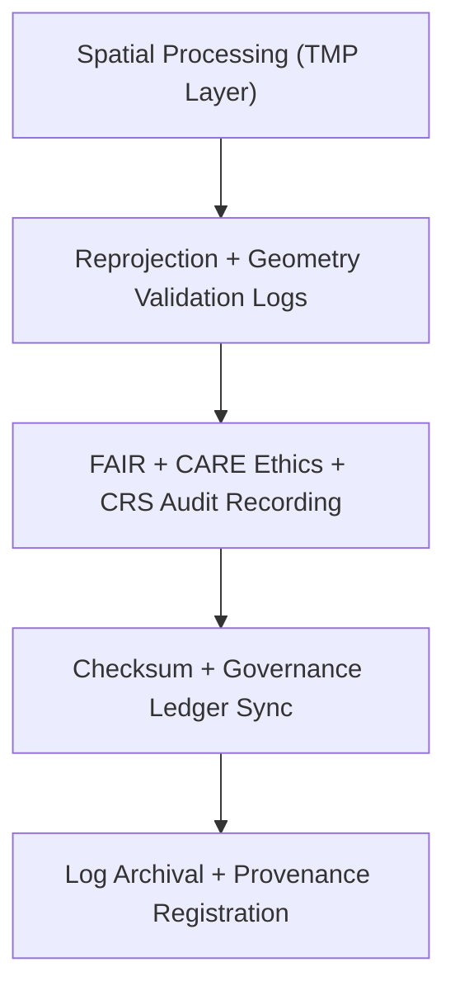

<div align="center">

# 🧾 Kansas Frontier Matrix — **Spatial Logs**
`data/work/staging/spatial/logs/README.md`

**Purpose:**  
Centralized repository for **spatial ETL, validation, and governance logs** generated within the KFM staging environment.  
Ensures traceability, reproducibility, and FAIR+CARE governance auditing for all spatial processing workflows.

[](../../../../../docs/architecture/README.md)
[](../../../../../docs/standards/faircare-validation.md)
[]()
[]()
[](../../../../../LICENSE)

</div>

---

## 📘 Overview

The **Spatial Logs Workspace** documents operational lineage of spatial datasets processed in KFM’s staging layer.  
Logs capture **CRS normalization, topology validation, FAIR+CARE audits, checksum events, and governance synchronization**.

### Core Objectives
- Record detailed execution traces for reprojection, clipping, and merges.  
- Log CRS & geometry validation outcomes for reproducibility.  
- Track governance ledger updates and checksum verification.  
- Store FAIR+CARE environmental and ethics audit references.  

---

## 🗂️ Directory Layout

```plaintext
data/work/staging/spatial/logs/
├── README.md
├── spatial_pipeline_run.log               # Spatial ETL/harmonization pipeline trace
├── reprojection_summary.log               # CRS normalization and transformation log
├── geometry_audit_report.log              # Geometry integrity & topology checks
├── governance_sync.log                    # Governance + checksum synchronization records
└── metadata.json                          # Session provenance + checksum registry
```

---

## ⚙️ Spatial Logging Workflow



### Steps
1. **Processing Logs** — Record reprojection, validation, and harmonization events.  
2. **FAIR+CARE Audit** — Log ethics outcomes and schema alignment actions.  
3. **Governance** — Sync logs with provenance ledger and checksum manifest.  
4. **Archival** — Hash, sign, and archive logs for audit reproducibility.

---

## 🧩 Example Log Metadata Record

```json
{
  "id": "spatial_logs_climate_v9.7.0",
  "component": "spatial_pipeline_run",
  "created": "2025-11-06T23:49:00Z",
  "validator": "@kfm-spatial-lab",
  "records_logged": 212,
  "issues_detected": 0,
  "checksum_sha256": "sha256:b3a9e5c6d2a8f4b7e1c9d8f2a7e3b5a6f1c9b4d2e7a6f8b9d3a2c7e4f1b5d9c6",
  "fairstatus": "compliant",
  "governance_ref": "data/reports/audit/data_provenance_ledger.json"
}
```

---

## 🧠 FAIR+CARE Governance Matrix

| Principle | Implementation | Oversight |
|-----------|----------------|-----------|
| **Findable** | Logs indexed by dataset ID, CRS, and cycle. | `@kfm-data` |
| **Accessible** | Open text/JSON for FAIR+CARE audit visibility. | `@kfm-accessibility` |
| **Interoperable** | Log schema aligns with FAIR+CARE + ISO 19115. | `@kfm-architecture` |
| **Reusable** | Checksums, provenance, and context preserved. | `@kfm-design` |
| **Collective Benefit** | Enables transparent spatial governance oversight. | `@faircare-council` |
| **Authority to Control** | Council certifies logging + governance sync. | `@kfm-governance` |
| **Responsibility** | Validators record CRS ops, ethics audits, and QA outcomes. | `@kfm-security` |
| **Ethics** | Logs redacted for sensitive geographic indicators. | `@kfm-ethics` |

**Audit references:**  
`data/reports/audit/data_provenance_ledger.json` · `data/reports/fair/data_care_assessment.json`

---

## ⚙️ Log Types & Artifacts

| Log File | Description | Format |
|----------|-------------|--------|
| `spatial_pipeline_run.log` | Core ETL + harmonization trace | Text |
| `reprojection_summary.log` | CRS transformation checks | Text |
| `geometry_audit_report.log` | Topology/geometry QA | Text |
| `governance_sync.log` | Ledger + checksum events | Text |
| `metadata.json` | Session provenance + checksums | JSON |

**Automation:** `spatial_log_sync.yml`

---

## ♻️ Retention & Sustainability

| Log Type | Retention | Policy |
|----------|----------:|--------|
| Pipeline Logs | 90 Days | Archived post-validation for governance review. |
| Reprojection Logs | 60 Days | Cleared after certification or schema update. |
| FAIR+CARE Logs | 365 Days | Retained for reproducibility & transparency. |
| Metadata Records | Permanent | Stored in provenance ledger. |

**Telemetry:** `../../../../../releases/v9.7.0/focus-telemetry.json`

---

## 🧾 Internal Citation

```text
Kansas Frontier Matrix (2025). Spatial Logs (v9.7.0).
Central repository for spatial ETL/validation logs documenting CRS normalization, FAIR+CARE audits, and governance synchronization to ensure transparent and reproducible geospatial workflows.
```

---

<div align="center">

**Kansas Frontier Matrix**  
*Geospatial Traceability × FAIR+CARE Ethics × Provenance Oversight*  
© 2025 Kansas Frontier Matrix — Internal · FAIR+CARE Certified · Diamond⁹ Ω / Crown∞Ω Ultimate Certified  

[Back to Spatial Staging](../README.md) · [Governance Charter](../../../../../docs/standards/governance/DATA-GOVERNANCE.md)

</div>