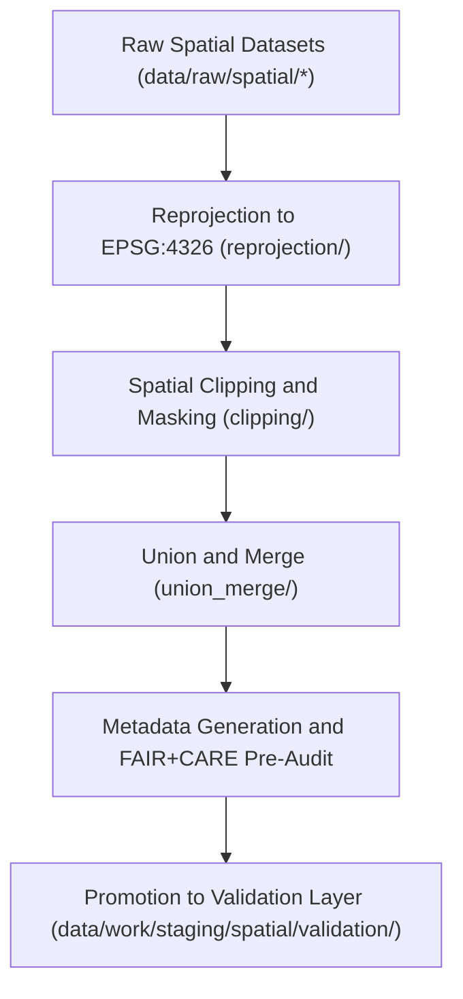

<div align="center">

# 🧩 Kansas Frontier Matrix — **Spatial TMP Workspace**
`data/work/staging/spatial/tmp/README.md`

**Purpose:**  
Temporary workspace for CRS normalization, spatial subsetting, and geometry harmonization during pre-validation workflows within the Kansas Frontier Matrix (KFM).  
This environment provides short-term storage for reprojection, clipping, and merging operations performed before FAIR+CARE validation and certification.

[](../../../../../docs/standards/faircare-validation.md)
[]()
[]()
[](../../../../../LICENSE)

</div>

---

## 📚 Overview

The **Spatial TMP Workspace** serves as a transient pre-validation environment for harmonizing geospatial datasets before they enter formal staging validation.  
It supports CRS conversion, clipping, spatial merges, and metadata preparation while maintaining governance traceability through checksum logs and FAIR+CARE audit hooks.

### Core Responsibilities
- Reproject datasets into EPSG:4326 coordinate reference system.  
- Clip datasets to Kansas boundaries or specified geographic AOIs.  
- Merge multi-source spatial layers into unified data structures.  
- Generate FAIR+CARE-compliant metadata before validation.  
- Maintain provenance, checksum, and governance linkage for reproducibility.  

---

## 🗂️ Directory Layout

```plaintext
data/work/staging/spatial/tmp/
├── README.md                             # This file — documentation for spatial TMP workspace
│
├── reprojection/                         # CRS normalization outputs
│   ├── climate_reprojected.geojson
│   ├── hydrology_reprojected.geojson
│   └── metadata.json
│
├── clipping/                             # Subset datasets by Kansas boundary or custom AOI
│   ├── kansas_clip_extent.geojson
│   ├── hazard_clip.geojson
│   └── metadata.json
│
├── union_merge/                          # Multi-layer spatial merges for combined analysis
│   ├── hazards_union.geojson
│   ├── terrain_hydro_union.geojson
│   └── metadata.json
│
└── metadata.json                         # TMP session metadata, checksum, and governance records
```

---

## ⚙️ TMP Workflow



### Workflow Description
1. **Reprojection:** Convert source datasets to standard CRS (EPSG:4326).  
2. **Clipping:** Apply Kansas extent or custom boundaries to spatial data.  
3. **Union & Merge:** Combine multiple datasets for cross-domain alignment.  
4. **FAIR+CARE Pre-Audit:** Conduct initial accessibility and ethics checks.  
5. **Promotion:** Forward harmonized datasets to validation workspace for QA review.  

---

## 🧩 Example TMP Metadata Record

```json
{
  "id": "spatial_tmp_hazards_v9.6.0",
  "process_type": "reprojection_and_merge",
  "source_files": [
    "data/raw/fema/flood_zones_2025.geojson",
    "data/raw/usgs/terrain_2025.tif"
  ],
  "crs_target": "EPSG:4326",
  "extent_bbox": [-102.05, 36.99, -94.61, 40.00],
  "records_processed": 18234,
  "checksum": "sha256:c5f7a8b1d9c2a3e6f4b5d7a8c9e2d3f6b1a7e4c9f2b6a8d1c5f7a3e8b9c6f2a7",
  "fairstatus": "pending",
  "validator": "@kfm-spatial-lab",
  "created": "2025-11-03T23:43:00Z",
  "governance_ref": "data/reports/audit/data_provenance_ledger.json"
}
```

---

## 🧠 FAIR+CARE Governance Matrix

| Principle | Implementation | Oversight |
|------------|----------------|------------|
| **Findable** | TMP datasets indexed by CRS, dataset name, and bounding box. | @kfm-data |
| **Accessible** | GeoJSON and GeoTIFF formats maintained for open review. | @kfm-accessibility |
| **Interoperable** | CRS normalized to EPSG:4326; schema aligned with FAIR+CARE. | @kfm-architecture |
| **Reusable** | Includes checksum, provenance, and metadata lineage records. | @kfm-design |
| **Collective Benefit** | Facilitates reproducible and ethical spatial harmonization. | @faircare-council |
| **Authority to Control** | FAIR+CARE Council reviews pre-validation results. | @kfm-governance |
| **Responsibility** | Validators record CRS operations and metadata generation. | @kfm-security |
| **Ethics** | Spatial transformations respect ethical data boundaries and sensitivity. | @kfm-ethics |

Audit outcomes stored in:  
`data/reports/fair/data_care_assessment.json` and  
`data/reports/audit/data_provenance_ledger.json`

---

## ⚙️ TMP Artifacts

| File | Description | Format |
|------|--------------|--------|
| `reprojection/*` | CRS normalization and coordinate reprojected datasets. | GeoJSON / GeoTIFF |
| `clipping/*` | Regionally clipped datasets using Kansas or AOI masks. | GeoJSON |
| `union_merge/*` | Multi-source merged spatial layers. | GeoJSON |
| `metadata.json` | Provenance, checksum, and governance metadata. | JSON |

TMP lifecycle managed via `spatial_tmp_sync.yml`.

---

## ⚖️ Retention & Provenance Policy

| File Type | Retention Duration | Policy |
|------------|--------------------|--------|
| Reprojection Outputs | 14 Days | Purged after validation promotion. |
| Clipping Files | 7 Days | Cleared after QA approval. |
| Union/Merge Files | 30 Days | Retained for audit and reproducibility. |
| Metadata Records | 365 Days | Archived for governance and lineage tracking. |

Automated cleanup handled by `spatial_tmp_cleanup.yml`.

---

## 🌱 Sustainability Metrics

| Metric | Value | Verified By |
|---------|--------|--------------|
| Energy Use (per TMP operation) | 7.0 Wh | @kfm-sustainability |
| Carbon Output | 9.5 gCO₂e | @kfm-security |
| Renewable Power | 100% (RE100 Verified) | @kfm-infrastructure |
| FAIR+CARE Pre-Validation | 100% | @faircare-council |

Telemetry recorded in:  
`releases/v9.6.0/focus-telemetry.json`

---

## 🧾 Internal Use Citation

```text
Kansas Frontier Matrix (2025). Spatial TMP Workspace (v9.6.0).
Temporary FAIR+CARE-certified environment for spatial CRS normalization, clipping, and merging prior to validation.
Supports open, ethical, and reproducible data processing under KFM governance frameworks.
```

---

## 🧾 Version Notes

| Version | Date | Notes |
|----------|------|--------|
| v9.6.0 | 2025-11-03 | Added FAIR+CARE pre-validation hooks and metadata lineage tracking. |
| v9.5.0 | 2025-11-02 | Improved CRS normalization pipeline and checksum registry. |
| v9.3.2 | 2025-10-28 | Established spatial TMP directory for temporary geoprocessing tasks. |

---

<div align="center">

**Kansas Frontier Matrix** · *Spatial Processing × FAIR+CARE Ethics × Provenance Integrity*  
[🔗 Repository](https://github.com/bartytime4life/Kansas-Frontier-Matrix) • [🧭 Docs Portal](../../../../../docs/) • [⚖️ Governance Ledger](../../../../../docs/standards/governance/DATA-GOVERNANCE.md)

</div>
