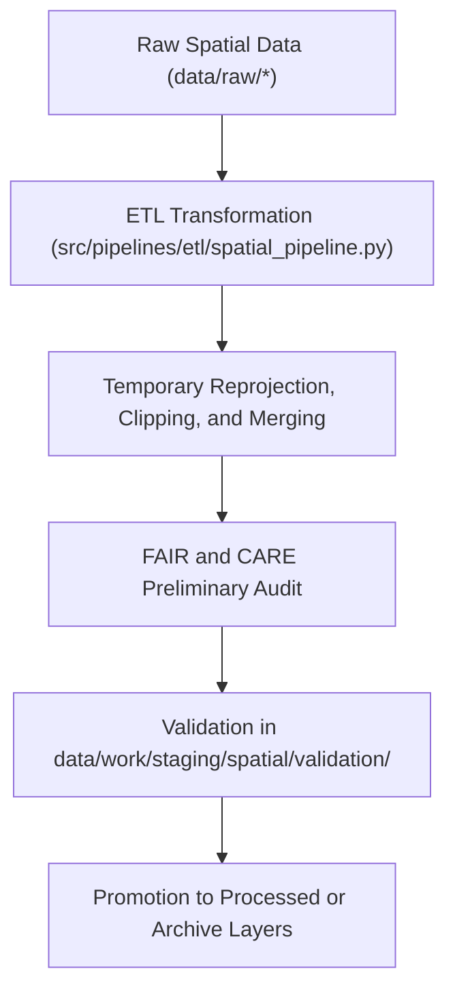

<div align="center">

# 🧩 Kansas Frontier Matrix — **Spatial TMP Workspace**
`data/work/staging/spatial/tmp/README.md`

**Purpose:** Temporary sandbox for geospatial transformations, reprojections, clipping operations, and geometry harmonization performed within the Kansas Frontier Matrix (KFM) staging environment.  
This workspace enables efficient intermediate spatial processing prior to validation and FAIR+CARE certification.

[](../../../../../docs/standards/faircare-validation.md)
[](../../../../../LICENSE)
[](../../../../../docs/architecture/repo-focus.md)

</div>

---

## 📚 Overview

The `data/work/staging/spatial/tmp/` directory provides a **controlled temporary environment** for spatial data processing and transformation tasks.  
It contains transient intermediate outputs generated by reprojection, clipping, and spatial merge operations before final validation in `data/work/staging/spatial/validation/`.

This layer is optimized for:
- CRS normalization (e.g., EPSG:4326).  
- Spatial clipping and subsetting by Kansas boundaries.  
- Merging multiple spatial datasets into unified layers.  
- Generating temporary GeoJSON, GeoParquet, and raster tiles.  
- Conducting FAIR+CARE preliminary ethical and territorial checks.  

All TMP files are regenerated automatically during pipeline execution and are purged after successful validation or workflow completion.

---

## 🗂️ Directory Layout

```plaintext
data/work/staging/spatial/tmp/
├── README.md                              # This file — documentation for TMP workspace
│
├── reprojection/                          # CRS normalization outputs
│   ├── flood_zones_reprojected.geojson
│   ├── elevation_normalized.tif
│   └── metadata.json
│
├── clipping/                              # Spatial subsets clipped to Kansas boundaries
│   ├── kansas_clip_extent.geojson
│   ├── hydrology_clip.geojson
│   └── metadata.json
│
├── union_merge/                           # Unified multi-layer merge outputs
│   ├── hazards_merged.geojson
│   ├── terrain_hydro_union.geojson
│   └── metadata.json
│
└── metadata.json                          # TMP session metadata and provenance details
```

---

## ⚙️ Spatial TMP Workflow



### Workflow Steps:
1. **Reprojection:** Convert all layers to standard coordinate system (EPSG:4326).  
2. **Clipping:** Filter data within Kansas boundaries using polygon masks.  
3. **Union & Merge:** Combine multi-source datasets for integrated analysis.  
4. **Audit:** Preliminary FAIR+CARE ethical validation before full review.  
5. **Promotion:** Send cleaned spatial datasets to validation layer for QA.

---

## 🧩 Example TMP Metadata Record

```json
{
  "id": "spatial_tmp_hazards_v9.3.2",
  "task": "reprojection_and_merge",
  "source_files": [
    "data/raw/fema/flood_zones/kansas_flood_zones_2025.geojson",
    "data/raw/usgs/elevation_models/kansas_dem_10m.tif"
  ],
  "crs_target": "EPSG:4326",
  "extent_bbox": [-102.05, 36.99, -94.61, 40.00],
  "created": "2025-10-28T15:25:00Z",
  "records_processed": 9873,
  "validator": "@kfm-spatial-lab",
  "checksum": "sha256:3f6acbb2c58f9a7f24a37cfa17f640bda8c2b07a...",
  "fairstatus": "pending",
  "governance_ref": "data/reports/audit/data_provenance_ledger.json"
}
```

---

## 🧠 FAIR+CARE Alignment in Spatial TMP

| Principle | Implementation |
|------------|----------------|
| **Findable** | Each TMP session and layer includes unique ID, CRS, and bounding box metadata. |
| **Accessible** | TMP outputs stored in open, cross-platform geospatial formats. |
| **Interoperable** | CRS normalized (EPSG:4326) and metadata compatible with STAC/DCAT. |
| **Reusable** | Metadata links each layer to provenance and checksum logs. |
| **Collective Benefit** | Provides reproducible transformation steps for open geospatial science. |
| **Authority to Control** | FAIR+CARE Council reviews spatial transformation policies. |
| **Responsibility** | Validators document reprojection and clipping procedures. |
| **Ethics** | All transformations reviewed for ethical representation of Indigenous and territorial data. |

Audit trail maintained via `data/reports/audit/data_provenance_ledger.json` and `data/reports/fair/data_care_assessment.json`.

---

## ⚙️ Key File Types

| File | Description | Format |
|------|--------------|--------|
| `flood_zones_reprojected.geojson` | Reprojected FEMA NFHL flood zones to EPSG:4326. | GeoJSON |
| `elevation_normalized.tif` | USGS DEM standardized to common projection and tile schema. | GeoTIFF |
| `hydrology_clip.geojson` | Hydrology boundaries clipped to Kansas state extent. | GeoJSON |
| `hazards_merged.geojson` | Unified hazard layer combining multiple data sources. | GeoJSON |
| `metadata.json` | Contains provenance, checksum, and validation state. | JSON |

---

## ⚖️ Governance & Provenance Integration

| Record | Description |
|---------|-------------|
| `metadata.json` | TMP runtime context, task info, and provenance checksums. |
| `data/reports/audit/data_provenance_ledger.json` | Master governance ledger tracking all TMP operations. |
| `data/reports/validation/schema_validation_summary.json` | Schema QA for temporary outputs. |
| `releases/v9.3.2/manifest.zip` | Central manifest recording TMP checksum hashes. |

TMP operations logged automatically through `spatial_tmp_sync.yml` automation workflow.

---

## 🧾 Retention Policy

| TMP Category | Retention Duration | Policy |
|---------------|--------------------|--------|
| Reprojection Artifacts | 14 days | Purged after CRS verification. |
| Clipping Results | 7 days | Cleared after validation approval. |
| Union/Merge Layers | 30 days | Retained for QA and governance review. |
| TMP Metadata | 365 days | Archived permanently in governance logs. |

Automated cleanup handled by `spatial_tmp_cleanup.yml`.

---

## 🧾 Internal Use Citation

```text
Kansas Frontier Matrix (2025). Spatial TMP Workspace (v9.3.2).
Temporary environment for geospatial reprojection, clipping, and harmonization under FAIR+CARE governance.
Restricted to internal ETL and QA workflows.
```

---

## 🧾 Version Notes

| Version | Date | Notes |
|----------|------|--------|
| v9.3.2 | 2025-10-28 | Added CRS normalization and FAIR+CARE audit trace for TMP transformations. |
| v9.2.0 | 2024-07-15 | Implemented automated clipping workflow and metadata checksum tracking. |
| v9.0.0 | 2023-01-10 | Established spatial TMP directory for temporary geoprocessing steps. |

---

<div align="center">

**Kansas Frontier Matrix** · *Spatial Processing × FAIR+CARE Integrity × Reproducible Geospatial Pipelines*  
[🔗 Repository](https://github.com/bartytime4life/Kansas-Frontier-Matrix) • [🧭 Docs Portal](../../../../../docs/) • [⚖️ Governance Ledger](../../../../../docs/standards/governance/)

</div>