<div align="center">

# 🧩 Kansas Frontier Matrix — **Spatial TMP Workspace**
`data/work/staging/spatial/tmp/README.md`

**Purpose:** Temporary sandbox for geospatial transformations—reprojection, clipping, and geometry harmonization—executed within the Kansas Frontier Matrix (KFM) staging environment.  
This workspace enables efficient intermediate spatial processing prior to validation and FAIR+CARE certification.

[](../../../../../docs/standards/faircare-validation.md)
[](../../../../../LICENSE)
[](../../../../../docs/architecture/repo-focus.md)

</div>

---

## 📚 Overview

The `data/work/staging/spatial/tmp/` directory provides a **controlled temporary environment** for spatial ETL tasks.  
It stores transient artifacts produced by reprojection, clipping, and multi-layer merges before final validation in `data/work/staging/spatial/validation/`.

This layer is optimized for:
- CRS normalization to **EPSG:4326 (WGS84)**.  
- Spatial clipping and subsetting to Kansas boundaries.  
- Merging multi-source datasets into unified layers.  
- Generating temporary GeoJSON, GeoParquet, and raster tiles.  
- Performing **preliminary FAIR+CARE** ethics checks.  
- Emitting **telemetry** for pipeline dashboards and governance analytics.

All TMP files are regenerated automatically during pipeline execution and are purged after successful validation or session completion.

---

## 🗂️ Directory Layout

```plaintext
data/work/staging/spatial/tmp/
├── README.md                              # This file — documentation for TMP workspace
│
├── reprojection/                          # CRS normalization outputs
│   ├── flood_zones_reprojected.geojson
│   ├── elevation_normalized.tif
│   └── metadata.json
│
├── clipping/                              # Spatial subsets clipped to Kansas boundaries
│   ├── kansas_clip_extent.geojson
│   ├── hydrology_clip.geojson
│   └── metadata.json
│
├── union_merge/                           # Unified multi-layer merge outputs
│   ├── hazards_merged.geojson
│   ├── terrain_hydro_union.geojson
│   └── metadata.json
│
└── metadata.json                          # TMP session metadata, checksum, and telemetry link
```

---

## ⚙️ Spatial TMP Workflow

```mermaid
flowchart TD
    A["Raw Spatial Data (data/raw/*)"] --> B["ETL Transformation (src/pipelines/etl/spatial_pipeline.py)"]
    B --> C["TMP Reprojection, Clipping, & Merging"]
    C --> D["FAIR+CARE Preliminary Audit"]
    D --> E["Validation (data/work/staging/spatial/validation/)"]
    E --> F["Promotion → Processed / Archive Layers + Catalog Sync"]
```



### Workflow Steps
1. **Reprojection:** Convert layers to **EPSG:4326** with verified axis order and extent.  
2. **Clipping:** Apply official Kansas boundary masks to spatial datasets.  
3. **Union & Merge:** Generate integrated layers for downstream validation.  
4. **Audit:** Execute preliminary FAIR+CARE review for territorial and cultural sensitivity.  
5. **Promotion:** Move cleaned spatial datasets to validation; register artifacts for catalog sync.

---

## 🧩 Example TMP Metadata Record

```json
{
  "id": "spatial_tmp_hazards_v9.4.0",
  "task": "reprojection_and_merge",
  "source_files": [
    "data/raw/fema/flood_zones/kansas_flood_zones_2025.geojson",
    "data/raw/usgs/elevation_models/kansas_dem_10m.tif"
  ],
  "crs_target": "EPSG:4326",
  "extent_bbox": [-102.05, 36.99, -94.61, 40.00],
  "created": "2025-11-02T15:05:00Z",
  "records_processed": 10042,
  "validator": "@kfm-spatial-lab",
  "checksum": "sha256:3f6acbb2c58f9a7f24a37cfa17f640bda8c2b07a...",
  "fairstatus": "pending",
  "telemetry_link": "releases/v9.4.0/focus-telemetry.json",
  "governance_ref": "data/reports/audit/data_provenance_ledger.json"
}
```

---

## 🧠 FAIR+CARE Alignment in Spatial TMP

| Principle | Implementation |
|------------|----------------|
| **Findable** | TMP sessions include unique IDs, CRS, bbox, and telemetry pointers. |
| **Accessible** | Outputs stored in open geospatial formats for automated validators. |
| **Interoperable** | CRS normalized (EPSG:4326) with STAC/DCAT-compatible metadata. |
| **Reusable** | Provenance links and checksums facilitate reproducibility. |
| **Collective Benefit** | Provides auditable transformation steps for open geospatial science. |
| **Authority to Control** | FAIR+CARE Council monitors spatial policies and TMP procedures. |
| **Responsibility** | Validators document transformations (reprojection, clipping, merges). |
| **Ethics** | Preliminary review for culturally sensitive geographies and boundaries. |

Audit trail maintained via:  
`data/reports/audit/data_provenance_ledger.json` and `data/reports/fair/data_care_assessment.json`.

---

## ⚙️ Key File Types

| File | Description | Format |
|------|--------------|--------|
| `flood_zones_reprojected.geojson` | FEMA NFHL flood zones reprojected to EPSG:4326. | GeoJSON |
| `elevation_normalized.tif` | USGS DEM standardized to common projection and tile schema. | GeoTIFF |
| `hydrology_clip.geojson` | Hydrology boundaries clipped to the state extent. | GeoJSON |
| `hazards_merged.geojson` | Unified hazard layer combining multi-agency sources. | GeoJSON |
| `metadata.json` | TMP session metadata, checksum, and telemetry hooks. | JSON |

---

## ⚖️ Governance & Provenance Integration

| Record | Description |
|---------|-------------|
| `metadata.json` | Session context, checksums, validator ID, and telemetry link. |
| `data/reports/audit/data_provenance_ledger.json` | Central ledger tracking TMP operations and hashes. |
| `data/reports/validation/schema_validation_summary.json` | Schema checks for temporary outputs. |
| `releases/v9.4.0/manifest.zip` | Manifest of TMP artifact checksums for reproducibility. |

TMP operations logged via **`spatial_tmp_sync.yml`** and reported to telemetry dashboards.

---

## 🧾 Retention Policy

| TMP Category | Retention Duration | Policy |
|---------------|--------------------|--------|
| Reprojection Artifacts | 14 days | Purged after CRS verification. |
| Clipping Results | 7 days | Cleared after validation approval. |
| Union/Merge Layers | 30 days | Retained for QA and governance review. |
| TMP Metadata | 365 days | Archived in governance logs; minimal content retained in TMP. |

Automated cleanup handled by **`spatial_tmp_cleanup.yml`**.

---

## 🧾 Internal Use Citation

```text
Kansas Frontier Matrix (2025). Spatial TMP Workspace (v9.4.0).
Temporary environment for geospatial reprojection, clipping, and harmonization under FAIR+CARE governance.
Restricted to internal ETL and QA workflows.
```

---

## 🧾 Version Notes

| Version | Date | Notes |
|----------|------|--------|
| v9.4.0 | 2025-11-02 | Added telemetry linkage, expanded CRS validation, and automated governance sync. |
| v9.3.2 | 2025-10-28 | Added CRS normalization and FAIR+CARE audit trace for TMP transformations. |
| v9.2.0 | 2024-07-15 | Implemented automated clipping workflow and checksum tracking. |
| v9.0.0 | 2023-01-10 | Established spatial TMP directory for temporary geoprocessing steps. |

---

<div align="center">

**Kansas Frontier Matrix** · *Spatial Processing × FAIR+CARE Integrity × Reproducible Geospatial Pipelines × Telemetry Traceability*  
[🔗 Repository](https://github.com/bartytime4life/Kansas-Frontier-Matrix) • [🧭 Docs Portal](../../../../../docs/) • [⚖️ Governance Ledger](../../../../../docs/standards/governance/)

</div>
