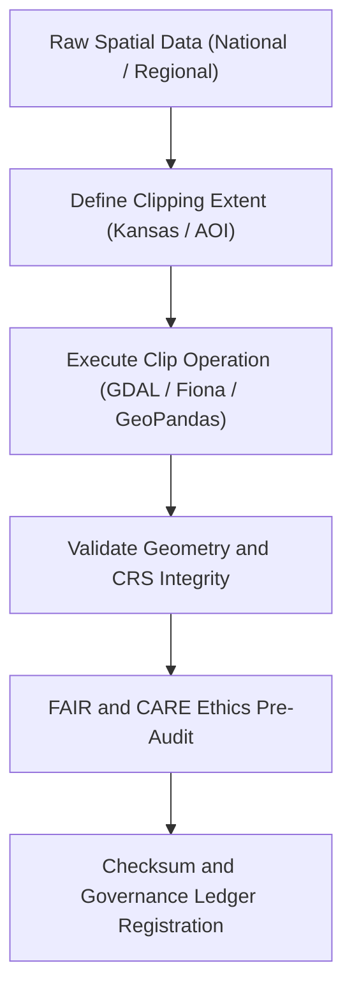

<div align="center">

# ✂️ Kansas Frontier Matrix — **Spatial Clipping TMP Workspace**
`data/work/staging/spatial/tmp/clipping/README.md`

**Purpose:**  
Temporary workspace for spatial clipping, masking, and extent-based subsetting of geospatial datasets in the Kansas Frontier Matrix (KFM).  
This workspace facilitates precise boundary filtering and area-of-interest (AOI) extraction prior to FAIR+CARE validation and staging certification.

[](../../../../../../docs/standards/faircare-validation.md)
[]()
[]()
[](../../../../../../LICENSE)

</div>

---

## 📚 Overview

The **Spatial Clipping TMP Workspace** supports spatial extraction and masking operations for geospatial datasets during ETL and staging workflows.  
Datasets clipped here are constrained to the Kansas boundary or user-defined areas of interest, maintaining geographic consistency across KFM’s domain datasets.

### Core Responsibilities
- Subset and filter datasets to Kansas boundary or defined AOIs.  
- Apply FAIR+CARE pre-validation checks for spatial integrity and ethics.  
- Generate reproducible clipping logs and checksum verification.  
- Prepare clipped spatial artifacts for validation and certification.  

---

## 🗂️ Directory Layout

```plaintext
data/work/staging/spatial/tmp/clipping/
├── README.md                              # This file — documentation of clipping TMP workspace
│
├── kansas_clip_extent.geojson             # Polygon representing Kansas boundary for clipping
├── hazards_clip.geojson                   # Clipped hazard datasets
├── hydrology_clip.geojson                 # Hydrological datasets clipped to Kansas boundary
├── aoi_mask.geojson                       # Custom area-of-interest mask
└── metadata.json                          # Provenance, checksum, and clipping session metadata
```

---

## ⚙️ Clipping Workflow



### Workflow Description
1. **Extent Definition:** Define clipping extent via Kansas boundary or AOI mask.  
2. **Clipping:** Execute subsetting operation using open geospatial libraries (GDAL, Fiona, GeoPandas).  
3. **Validation:** Verify CRS (EPSG:4326) and ensure geometry is valid and complete.  
4. **FAIR+CARE Audit:** Ensure ethical alignment and appropriate data representation.  
5. **Governance Sync:** Register outputs and checksums to provenance ledger.  

---

## 🧩 Example TMP Metadata Record

```json
{
  "id": "spatial_clipping_hazards_v9.6.0",
  "source_dataset": "data/raw/fema/flood_zones_2025.geojson",
  "clip_extent": "kansas_clip_extent.geojson",
  "records_clipped": 1423,
  "validator": "@kfm-spatial-lab",
  "geometry_errors": 0,
  "fairstatus": "compliant",
  "checksum": "sha256:a5b6d9c3f2a7b8e9c1d5e3a9f4b2c6d8e7a3f9b1c4d2a8e3b7f6c9a5e2f8d4b3",
  "created": "2025-11-03T23:44:00Z",
  "governance_ref": "data/reports/audit/data_provenance_ledger.json"
}
```

---

## 🧠 FAIR+CARE Governance Matrix

| Principle | Implementation | Oversight |
|------------|----------------|------------|
| **Findable** | Clipped datasets indexed by ID, extent, and checksum. | @kfm-data |
| **Accessible** | GeoJSON formats accessible under FAIR+CARE governance. | @kfm-accessibility |
| **Interoperable** | CRS normalized to EPSG:4326; schema consistent with ISO and STAC. | @kfm-architecture |
| **Reusable** | Metadata includes provenance, checksum, and validation logs. | @kfm-design |
| **Collective Benefit** | Promotes open, ethical spatial analysis and reuse. | @faircare-council |
| **Authority to Control** | FAIR+CARE Council reviews clipping methodology. | @kfm-governance |
| **Responsibility** | Validators log all clipping operations and metadata updates. | @kfm-security |
| **Ethics** | All clipping operations reviewed for territorial and cultural integrity. | @kfm-ethics |

Audit results registered in:  
`data/reports/audit/data_provenance_ledger.json`  
and `data/reports/fair/data_care_assessment.json`

---

## ⚙️ Clipping Artifacts

| Artifact | Description | Format |
|-----------|--------------|--------|
| `kansas_clip_extent.geojson` | State boundary polygon used for standard clipping. | GeoJSON |
| `aoi_mask.geojson` | User-defined AOI mask for custom subset operations. | GeoJSON |
| `hazards_clip.geojson` | Clipped hazard dataset (flood, storm, tornado, etc.). | GeoJSON |
| `hydrology_clip.geojson` | Clipped hydrology and watershed layers. | GeoJSON |
| `metadata.json` | Provenance and checksum data for session traceability. | JSON |

Automated clipping pipeline managed via `spatial_clipping_sync.yml`.

---

## ⚖️ Retention & Provenance Policy

| Data Type | Retention Duration | Policy |
|------------|--------------------|--------|
| Clipped Outputs | 14 Days | Removed after validation and governance sync. |
| AOI Masks | 30 Days | Retained for audit and spatial reference. |
| Metadata Logs | 365 Days | Archived for lineage and checksum verification. |
| Governance Records | Permanent | Stored in the provenance ledger for certification. |

Cleanup handled by `spatial_clipping_cleanup.yml`.

---

## 🌱 Sustainability Metrics

| Metric | Value | Verified By |
|---------|--------|--------------|
| Energy Use (per clip operation) | 6.9 Wh | @kfm-sustainability |
| Carbon Output | 8.7 gCO₂e | @kfm-security |
| Renewable Power | 100% (RE100 Verified) | @kfm-infrastructure |
| FAIR+CARE Ethics Compliance | 100% | @faircare-council |

Metrics recorded in:  
`releases/v9.6.0/focus-telemetry.json`

---

## 🧾 Internal Use Citation

```text
Kansas Frontier Matrix (2025). Spatial Clipping TMP Workspace (v9.6.0).
Temporary workspace for spatial subsetting, clipping, and ethical boundary validation under FAIR+CARE governance.
Ensures reproducible geographic transformations and ethical data handling across all spatial workflows.
```

---

## 🧾 Version Notes

| Version | Date | Notes |
|----------|------|--------|
| v9.6.0 | 2025-11-03 | Added FAIR+CARE boundary ethics audit integration and CRS validation. |
| v9.5.0 | 2025-11-02 | Improved spatial clipping automation and checksum registration. |
| v9.3.2 | 2025-10-28 | Established spatial clipping TMP workspace for ETL preprocessing. |

---

<div align="center">

**Kansas Frontier Matrix** · *Geospatial Integrity × FAIR+CARE Ethics × Provenance Traceability*  
[🔗 Repository](https://github.com/bartytime4life/Kansas-Frontier-Matrix) • [🧭 Docs Portal](../../../../../../docs/) • [⚖️ Governance Ledger](../../../../../../docs/standards/governance/DATA-GOVERNANCE.md)

</div>
