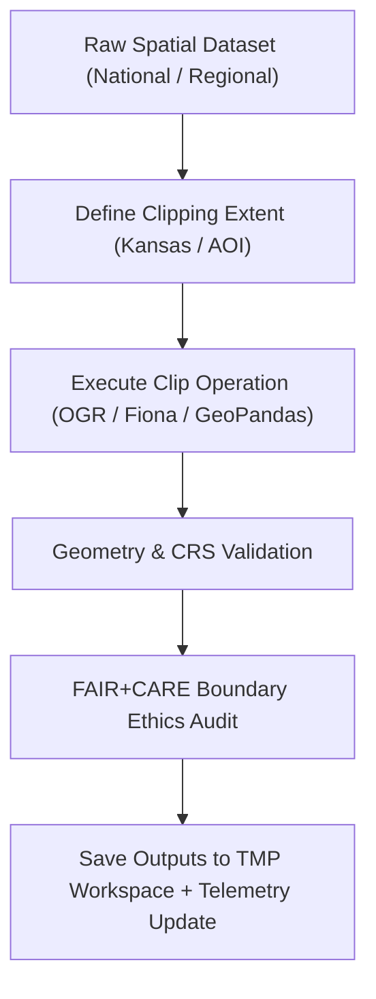

<div align="center">

# ✂️ Kansas Frontier Matrix — **Spatial Clipping TMP Workspace**
`data/work/staging/spatial/tmp/clipping/README.md`

**Purpose:** Temporary environment for spatial subsetting, masking, and boundary clipping of geospatial datasets during ETL and validation workflows within the Kansas Frontier Matrix (KFM).  
Ensures spatial datasets are accurately constrained to Kansas boundaries or project-specific extents under FAIR+CARE governance and ethical mapping principles.

[](../../../../../../docs/standards/faircare-validation.md)
[](../../../../../../LICENSE)
[](../../../../../../docs/architecture/repo-focus.md)

</div>

---

## 📚 Overview

The `data/work/staging/spatial/tmp/clipping/` directory acts as a **temporary geospatial workspace** for spatial subsetting, masking, and extent filtering operations.  
It supports workflows that isolate regionally bounded datasets—such as Kansas state extents or watershed-level AOIs—prior to validation and FAIR+CARE certification.

### Core Capabilities
- Clip national or regional datasets to Kansas or custom AOIs.  
- Apply project-specific bounding polygons for targeted analysis.  
- Generate reusable spatial masks for hydrology, hazard, or terrain overlays.  
- Conduct pre-validation FAIR+CARE ethics checks for boundary representation.  
- Emit **telemetry** records for governance traceability and dashboard visibility.

All outputs in this directory are temporary and automatically purged after validation to ensure reproducible and secure ETL workflows.

---

## 🗂️ Directory Layout

```plaintext
data/work/staging/spatial/tmp/clipping/
├── README.md                             # This file — clipping TMP workspace documentation
│
├── kansas_clip_extent.geojson             # Polygon extent for Kansas state boundaries
├── hazards_clip_2025.geojson              # Hazard dataset clipped to Kansas (FEMA + NOAA)
├── hydrology_clip.geojson                 # Hydrology features clipped to Kansas
├── aoi_mask.geojson                       # Custom area-of-interest polygon mask
└── metadata.json                          # Provenance metadata and governance trace record
```

---

## ⚙️ Clipping Workflow



### Workflow Description
1. **Extent Definition:** Determine clipping polygon (Kansas boundary or AOI).  
2. **Clipping:** Apply mask-based subsetting using OGR, Fiona, or Shapely.  
3. **Validation:** Run geometry validation and CRS consistency checks.  
4. **Ethics Audit:** Review spatial extents for fairness, inclusion, and accuracy.  
5. **Governance:** Record provenance, checksums, and telemetry references for lineage continuity.

---

## 🧩 Example Metadata Record

```json
{
  "id": "spatial_clipping_hazards_v9.4.0",
  "source_dataset": "data/raw/fema/flood_zones/kansas_flood_zones_2025.geojson",
  "clip_extent": "kansas_clip_extent.geojson",
  "created": "2025-11-02T15:25:00Z",
  "records_clipped": 1456,
  "validator": "@kfm-spatial-lab",
  "geometry_errors": 0,
  "checksum": "sha256:aedb67c1f2e12a03447f0fa8738f76572b08b7e2...",
  "fairstatus": "compliant",
  "telemetry_link": "releases/v9.4.0/focus-telemetry.json",
  "governance_ledger_ref": "data/reports/audit/data_provenance_ledger.json"
}
```

---

## 🧠 FAIR+CARE Compliance in Spatial Clipping

| Principle | Implementation |
|------------|----------------|
| **Findable** | Each clipping task logged with unique ID, dataset references, and telemetry metadata. |
| **Accessible** | Outputs saved in open, portable GeoJSON format for validator access. |
| **Interoperable** | CRS standardized (EPSG:4326) and validated via pyproj. |
| **Reusable** | Linked with source dataset lineage and provenance ledger. |
| **Collective Benefit** | Promotes ethical reuse of geospatial data in research and public service. |
| **Authority to Control** | FAIR+CARE Council approves official clipping boundaries and AOIs. |
| **Responsibility** | Validators document process parameters and ethical notes. |
| **Ethics** | Ensures accurate geographic representation; avoids boundary mischaracterization. |

Audit findings stored in:  
`data/reports/fair/data_care_assessment.json` and `data/reports/audit/data_provenance_ledger.json`.

---

## ⚙️ Common Tools Used

| Tool | Function | Output |
|------|-----------|--------|
| **GDAL / OGR2OGR** | Executes polygon-based clipping and reprojection. | GeoJSON / GeoPackage |
| **Fiona / Shapely** | Handles geometry operations and topology fixes. | GeoJSON |
| **GeoPandas** | Automates clipping and metadata generation in Python. | GeoJSON / Parquet |
| **pyproj** | Verifies CRS consistency post-clip. | CRS metadata |
| **stac-validator** | Confirms STAC metadata structure after subsetting. | JSON report |

---

## ⚖️ Governance & Provenance Integration

| Record | Description |
|---------|-------------|
| `metadata.json` | Stores clipping session metadata, checksum, and validator context. |
| `data/reports/audit/data_provenance_ledger.json` | Records audit and checksum lineage of clipping operations. |
| `data/reports/validation/stac_validation_report.json` | Confirms post-clip metadata and schema conformance. |
| `releases/v9.4.0/manifest.zip` | Contains checksum registry for TMP clipping outputs. |

Governance synchronization automated by **`spatial_clipping_sync.yml`**; telemetry events logged for governance dashboard analytics.

---

## 🧾 Retention Policy

| File Category | Retention Duration | Policy |
|----------------|--------------------|--------|
| Clipped Outputs | 14 days | Purged after validation success. |
| AOI Masks | 30 days | Retained for governance and FAIR+CARE review. |
| Metadata Records | 365 days | Archived for provenance and reproducibility. |
| Logs | 90 days | Moved to `data/work/logs/system/` for archival. |

Cleanup and retention managed by **`spatial_tmp_cleanup.yml`** automation.

---

## 🧾 Internal Use Citation

```text
Kansas Frontier Matrix (2025). Spatial Clipping TMP Workspace (v9.4.0).
Temporary workspace for clipping and subsetting geospatial datasets under FAIR+CARE governance.
Ensures CRS normalization, spatial accuracy, and ethical boundary validation prior to certification.
Restricted to internal ETL and validation workflows.
```

---

## 🧾 Version Notes

| Version | Date | Notes |
|----------|------|--------|
| v9.4.0 | 2025-11-02 | Added telemetry integration, ethics audit linkage, and CRS validation improvements. |
| v9.3.2 | 2025-10-28 | Integrated FAIR+CARE spatial ethics audit into clipping workflow. |
| v9.2.0 | 2024-07-15 | Added CRS normalization and geometry validation for clipping. |
| v9.0.0 | 2023-01-10 | Established spatial clipping TMP workspace for ETL preprocessing. |

---

<div align="center">

**Kansas Frontier Matrix** · *Geospatial Precision × FAIR+CARE Ethics × Provenance Integrity × Telemetry Traceability*  
[🔗 Repository](https://github.com/bartytime4life/Kansas-Frontier-Matrix) • [🧭 Docs Portal](../../../../../../docs/) • [⚖️ Governance Ledger](../../../../../../docs/standards/governance/)

</div>
