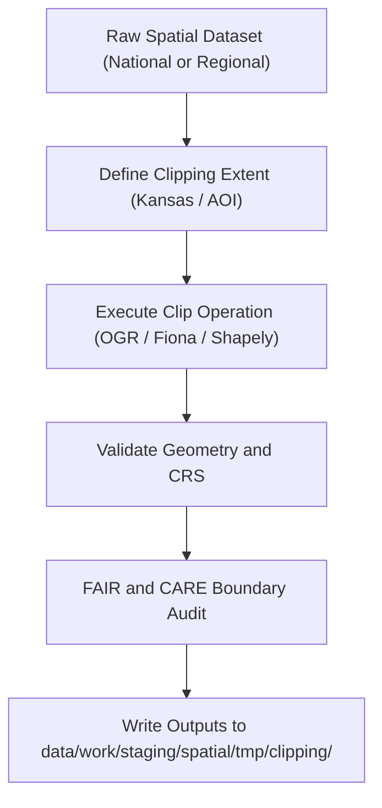

<div align="center">

# ✂️ Kansas Frontier Matrix — **Spatial Clipping TMP Workspace**
`data/work/staging/spatial/tmp/clipping/README.md`

**Purpose:** Temporary environment for spatial subsetting and clipping of geospatial datasets during ETL and validation workflows within the Kansas Frontier Matrix (KFM).  
Ensures spatial datasets are accurately constrained to Kansas boundaries and project-specific extents under FAIR+CARE governance principles.

[](../../../../../../docs/standards/faircare-validation.md)
[](../../../../../../LICENSE)
[](../../../../../../docs/architecture/repo-focus.md)

</div>

---

## 📚 Overview

The `data/work/staging/spatial/tmp/clipping/` directory provides a controlled workspace for spatial **clipping, masking, and extent-based filtering** of geospatial datasets.  
It enables analysts and pipelines to extract regionally bounded datasets (Kansas state extent or custom AOIs) prior to validation and processing.

### Functions:
- Clip nationwide or multi-state datasets to Kansas geographic extent.  
- Apply project-specific bounding boxes (e.g., watershed, county, hazard zones).  
- Generate masks for hydrology, hazard, or environmental overlays.  
- Perform initial FAIR+CARE spatial ethics review (e.g., Indigenous boundaries).  

All clipping outputs are stored temporarily and purged after validation, ensuring clean and reproducible spatial workflows.

---

## 🗂️ Directory Layout

```plaintext
data/work/staging/spatial/tmp/clipping/
├── README.md                              # This file — documentation for clipping TMP workspace
│
├── kansas_clip_extent.geojson             # Polygon extent for Kansas state boundaries
├── hazards_clip_2025.geojson              # Clipped hazard boundaries (FEMA + NOAA)
├── hydrology_clip.geojson                 # Clipped hydrologic features
├── aoi_mask.geojson                       # Custom area-of-interest mask (if applicable)
└── metadata.json                          # Provenance and governance metadata for clipping session
```

---

## ⚙️ Clipping Workflow



### Workflow Description:
1. **Extent Definition:** Identify bounding polygon (Kansas or custom AOI).  
2. **Clipping:** Subset features to defined extent using spatial mask operations.  
3. **Validation:** Check for geometry errors, CRS mismatches, and empty geometries.  
4. **FAIR+CARE Audit:** Confirm boundary aligns with ethical and governance standards.  
5. **Governance:** Provenance recorded and checksum added to ledger.

---

## 🧩 Example Metadata Record

```json
{
  "id": "spatial_clipping_hazards_v9.3.2",
  "source_dataset": "data/raw/fema/flood_zones/kansas_flood_zones_2025.geojson",
  "clip_extent": "kansas_clip_extent.geojson",
  "created": "2025-10-28T14:55:00Z",
  "records_clipped": 1420,
  "validator": "@kfm-spatial-lab",
  "geometry_errors": 0,
  "checksum": "sha256:aedb67c1f2e12a03447f0fa8738f76572b08b7e2...",
  "fairstatus": "compliant",
  "governance_ledger_ref": "data/reports/audit/data_provenance_ledger.json"
}
```

---

## 🧠 FAIR+CARE Compliance in Spatial Clipping

| Principle | Implementation |
|------------|----------------|
| **Findable** | Clipping session metadata registered with unique ID and dataset references. |
| **Accessible** | Temporary outputs stored in open GeoJSON format. |
| **Interoperable** | CRS normalized to EPSG:4326 and validated via pyproj. |
| **Reusable** | Clipped datasets linked to original source and provenance chain. |
| **Collective Benefit** | Supports equitable access to localized environmental data. |
| **Authority to Control** | Governance Council reviews and authorizes clipping extents. |
| **Responsibility** | All clipping logs stored under governance for reproducibility. |
| **Ethics** | Verifies boundary accuracy to avoid territorial misrepresentation. |

All audit findings registered under:  
`data/reports/fair/data_care_assessment.json` and `data/reports/audit/data_provenance_ledger.json`.

---

## ⚙️ Common Tools Used

| Tool | Function | Output |
|------|-----------|--------|
| **GDAL / OGR2OGR** | Spatial clipping and reprojection | GeoJSON / GeoPackage |
| **Fiona / Shapely** | Geometry filtering and validation | GeoJSON |
| **GeoPandas** | Python-based clipping automation | GeoJSON / Parquet |
| **pyproj** | CRS verification | CRS metadata |
| **stac-validator** | Metadata validation post-clipping | JSON report |

---

## ⚖️ Governance & Provenance Integration

| Record | Description |
|---------|-------------|
| `metadata.json` | Contains task details, checksum, and validation state. |
| `data/reports/audit/data_provenance_ledger.json` | Logs clipping operations and governance audit. |
| `data/reports/validation/stac_validation_report.json` | Validates spatial and metadata conformity. |
| `releases/v9.3.2/manifest.zip` | Central manifest of all spatial TMP checksum hashes. |

Governance synchronization performed by `spatial_clipping_sync.yml` workflow.

---

## 🧾 Retention Policy

| File Category | Retention Duration | Policy |
|----------------|--------------------|--------|
| Clipped Outputs | 14 days | Deleted after validation success. |
| AOI Masks | 30 days | Retained for governance reference. |
| Metadata Records | 365 days | Archived for provenance and ethics review. |
| Logs | 90 days | Transferred to `data/work/logs/system/`. |

Purge automation handled by `spatial_tmp_cleanup.yml`.

---

## 🧾 Internal Use Citation

```text
Kansas Frontier Matrix (2025). Spatial Clipping TMP Workspace (v9.3.2).
Temporary workspace for spatial subsetting, clipping, and FAIR+CARE-compliant boundary validation.
Restricted to internal ETL, QA, and governance workflows.
```

---

## 🧾 Version Notes

| Version | Date | Notes |
|----------|------|--------|
| v9.3.2 | 2025-10-28 | Integrated FAIR+CARE spatial ethics audit into clipping workflow. |
| v9.2.0 | 2024-07-15 | Added CRS normalization and geometry validation for clipping. |
| v9.0.0 | 2023-01-10 | Established spatial clipping TMP workspace for ETL preprocessing. |

---

<div align="center">

**Kansas Frontier Matrix** · *Geospatial Precision × FAIR+CARE Ethics × Provenance Integrity*  
[🔗 Repository](https://github.com/bartytime4life/Kansas-Frontier-Matrix) • [🧭 Docs Portal](../../../../../../docs/) • [⚖️ Governance Ledger](../../../../../../docs/standards/governance/)

</div>