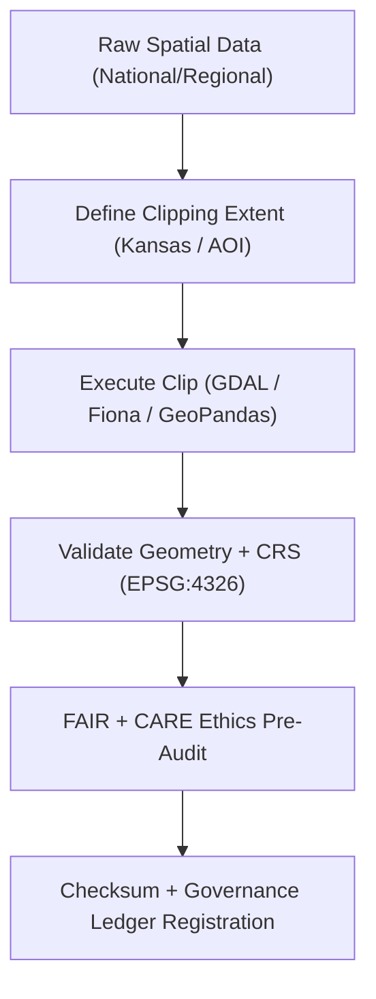

<div align="center">

# ✂️ Kansas Frontier Matrix — **Spatial Clipping TMP Workspace**
`data/work/staging/spatial/tmp/clipping/README.md`

**Purpose:**  
Temporary workspace for **spatial clipping, masking, and extent-based subsetting** of geospatial datasets in KFM.  
Facilitates precise boundary filtering and area-of-interest (AOI) extraction prior to **FAIR+CARE** validation and staging certification.

[](../../../../../../docs/architecture/README.md)
[](../../../../../../docs/standards/faircare-validation.md)
[]()
[]()
[](../../../../../../LICENSE)

</div>

---

## 📘 Overview

The **Spatial Clipping TMP Workspace** supports spatial extraction and masking operations during ETL and staging workflows.  
Outputs are constrained to Kansas boundaries or user-defined AOIs, ensuring geographic consistency across KFM domain datasets.

### Core Responsibilities
- Subset and filter datasets to Kansas boundary or custom AOIs.  
- Run **FAIR+CARE** pre-validation checks for spatial integrity and ethics.  
- Produce reproducible clipping logs + checksum verification.  
- Prepare artifacts for validation and certification.

---

## 🗂️ Directory Layout

```plaintext
data/work/staging/spatial/tmp/clipping/
├── README.md
├── kansas_clip_extent.geojson             # Kansas boundary polygon
├── hazards_clip_v9.7.0.geojson           # Clipped hazard datasets
├── hydrology_clip_v9.7.0.geojson         # Hydrology clipped to Kansas boundary
├── aoi_mask.geojson                       # Custom area-of-interest mask
└── metadata.json                          # Provenance, checksum, and session metadata
```

---

## ⚙️ Clipping Workflow



### Steps
1. **Extent Definition** — Select Kansas boundary or AOI mask.  
2. **Clipping** — Subset features using open geospatial libraries.  
3. **Validation** — Verify CRS (EPSG:4326) and geometry integrity.  
4. **FAIR+CARE Audit** — Check ethical representation and accessibility.  
5. **Governance Sync** — Register outputs & checksums to provenance ledger.

---

## 🧩 Example TMP Metadata Record

```json
{
  "id": "spatial_clipping_hazards_v9.7.0",
  "source_dataset": "data/raw/fema/flood_zones_2025.geojson",
  "clip_extent": "kansas_clip_extent.geojson",
  "records_clipped": 1423,
  "validator": "@kfm-spatial-lab",
  "geometry_errors": 0,
  "fairstatus": "compliant",
  "checksum_sha256": "sha256:a5b6d9c3f2a7b8e9c1d5e3a9f4b2c6d8e7a3f9b1c4d2a8e3b7f6c9a5e2f8d4b3",
  "created": "2025-11-06T23:44:00Z",
  "governance_ref": "data/reports/audit/data_provenance_ledger.json"
}
```

---

## 🧠 FAIR+CARE Governance Matrix

| Principle | Implementation | Oversight |
|-----------|----------------|-----------|
| **Findable** | Clipped outputs indexed by ID, extent, and checksum. | `@kfm-data` |
| **Accessible** | GeoJSON artifacts exposed for audit under FAIR+CARE. | `@kfm-accessibility` |
| **Interoperable** | EPSG:4326 normalized; ISO/STAC schema-consistent. | `@kfm-architecture` |
| **Reusable** | Provenance + checksum + validation logs included. | `@kfm-design` |
| **Collective Benefit** | Enables ethical spatial analysis and reuse. | `@faircare-council` |
| **Authority to Control** | Council reviews methods and outcomes. | `@kfm-governance` |
| **Responsibility** | Validators log clipping metadata and QA results. | `@kfm-security` |
| **Ethics** | Boundary choices reviewed for territorial/cultural integrity. | `@kfm-ethics` |

**Audit references:**  
`data/reports/audit/data_provenance_ledger.json` · `data/reports/fair/data_care_assessment.json`

---

## ⚙️ Clipping Artifacts

| Artifact | Description | Format |
|----------|-------------|--------|
| `kansas_clip_extent.geojson` | Standard Kansas boundary polygon. | GeoJSON |
| `aoi_mask.geojson` | Custom AOI mask for specialized subsets. | GeoJSON |
| `hazards_clip_v9.7.0.geojson` | Clipped hazards (flood/storm/tornado/etc.). | GeoJSON |
| `hydrology_clip_v9.7.0.geojson` | Clipped hydrology/watershed layers. | GeoJSON |
| `metadata.json` | Provenance + checksum + governance linkage. | JSON |

**Automation:** `spatial_clipping_sync.yml`

---

## ♻️ Retention & Sustainability

| Artifact | Retention | Policy |
|----------|----------:|--------|
| Clipped Outputs | 14 Days | Purged after validation + governance sync. |
| AOI Masks | 30 Days | Retained for audit & spatial reference. |
| Metadata Logs | 365 Days | Archived for lineage & checksum verification. |
| Governance Records | Permanent | Stored in provenance ledger. |

**Telemetry:** `../../../../../../releases/v9.7.0/focus-telemetry.json`

---

## 🧾 Internal Citation

```text
Kansas Frontier Matrix (2025). Spatial Clipping TMP Workspace (v9.7.0).
Temporary workspace for spatial subsetting and boundary validation under FAIR+CARE governance—ensuring reproducible geographic transformations and ethical data handling.
```

---

## 🕰️ Version History

| Version | Date | Author | Summary |
|--------:|------|--------|---------|
| v9.7.0  | 2025-11-06 | `@kfm-spatial` | Upgraded to v9.7.0; telemetry schema added; filenames normalized; badges hardened. |
| v9.6.0  | 2025-11-03 | `@kfm-spatial` | Added boundary ethics audit & CRS validation. |

---

<div align="center">

**Kansas Frontier Matrix**  
*Geospatial Integrity × FAIR+CARE Ethics × Provenance Traceability*  
© 2025 Kansas Frontier Matrix — Internal · FAIR+CARE Certified · Diamond⁹ Ω / Crown∞Ω Ultimate Certified  

[Back to Spatial TMP](../README.md) · [Governance Charter](../../../../../../docs/standards/governance/DATA-GOVERNANCE.md)

</div>