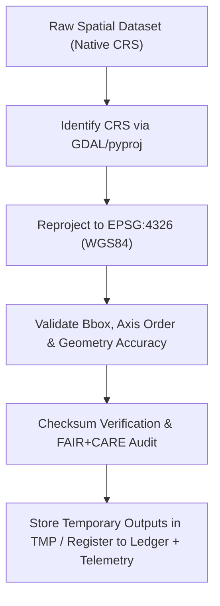

<div align="center">

# 🧭 Kansas Frontier Matrix — **Spatial Reprojection TMP Workspace**
`data/work/staging/spatial/tmp/reprojection/README.md`

**Purpose:** Temporary environment for CRS normalization and reprojection of spatial datasets prior to validation and FAIR+CARE certification.  
Ensures all geospatial files in KFM adhere to **EPSG:4326 (WGS84)** and maintain geometric integrity across transformations.

[](../../../../../../docs/standards/faircare-validation.md)
[](../../../../../../LICENSE)
[](../../../../../../docs/architecture/repo-focus.md)

</div>

---

## 📚 Overview

The `data/work/staging/spatial/tmp/reprojection/` directory is a **transient workspace** focused on coordinate system transformation and spatial normalization.  
All datasets ingested into KFM are standardized to **EPSG:4326 — WGS84** to guarantee consistency, interoperability, and reproducibility across downstream systems.

### Key Responsibilities
- Transform vector/raster coordinate systems (e.g., NAD83, UTM) to **EPSG:4326**.  
- Validate spatial accuracy and bounding boxes after transformation.  
- Record transformation parameters, checksums, and FAIR+CARE audit notes.  
- Maintain temporary outputs until validation is complete.  

All reprojection events are logged, checksum-verified, and registered in the governance ledger.

---

## 🗂️ Directory Layout

```plaintext
data/work/staging/spatial/tmp/reprojection/
├── README.md                                # This file — reprojection TMP workspace overview
│
├── flood_zones_reprojected.geojson          # FEMA NFHL flood zones transformed to EPSG:4326
├── elevation_normalized.tif                 # USGS DEM reprojected (10m resolution)
├── hydrology_reprojected.geojson            # Hydrologic features standardized to WGS84
└── metadata.json                            # Reprojection session metadata, checksum, and telemetry link
```

---

## ⚙️ Spatial Reprojection Workflow



### Workflow Description
1. **CRS Detection:** Identify source projection using GDAL, pyproj, or embedded tags.  
2. **Transformation:** Reproject all geometries and rasters to **EPSG:4326** with correct axis order.  
3. **Validation:** Compare pre-/post- bounds and sample points to ensure positional accuracy.  
4. **FAIR+CARE Audit:** Confirm no distortion or territorial bias introduced during transformation.  
5. **Governance:** Register transformation metadata to `data/reports/audit/data_provenance_ledger.json`; emit telemetry for dashboards.

---

## 🧩 Example Metadata Record

```json
{
  "id": "spatial_reprojection_climate_v9.4.0",
  "source_files": [
    "data/raw/usgs/elevation_models/kansas_dem_10m.tif",
    "data/raw/noaa/storm_events/storm_events_2025.csv"
  ],
  "input_crs": "EPSG:4269 (NAD83)",
  "target_crs": "EPSG:4326 (WGS84)",
  "toolchain": "GDAL 3.8.0 / pyproj 3.6",
  "bbox_before": [-102.05, 36.98, -94.60, 40.01],
  "bbox_after":  [-102.05, 36.99, -94.61, 40.00],
  "geom_accuracy_delta_m": 0.5,
  "created": "2025-11-02T15:18:00Z",
  "validator": "@kfm-spatial-lab",
  "checksum": "sha256:d64c95cb7a1b2f44bdfc3210e4bfe2d1a8f8c918...",
  "fairstatus": "compliant",
  "telemetry_link": "releases/v9.4.0/focus-telemetry.json",
  "governance_ref": "data/reports/audit/data_provenance_ledger.json"
}
```

---

## 🧠 FAIR+CARE Governance for Spatial Integrity

| Principle | Implementation |
|------------|----------------|
| **Findable** | Each reprojection logged with dataset ID, CRS, bbox, and telemetry pointer. |
| **Accessible** | Open GeoJSON/GeoTIFF outputs compatible with standard GIS tooling. |
| **Interoperable** | CRS harmonized to **EPSG:4326**; STAC/DCAT metadata alignment. |
| **Reusable** | Reprojection parameters and checksums ensure reproducibility. |
| **Collective Benefit** | Guarantees spatial accuracy for public and research use. |
| **Authority to Control** | FAIR+CARE Council validates coordinate transformations. |
| **Responsibility** | Validators document reprojection parameters and QA results. |
| **Ethics** | Ensures geographic integrity and ethical handling of boundaries. |

Audit results stored in:  
`data/reports/fair/data_care_assessment.json` • `data/reports/audit/data_provenance_ledger.json`

---

## ⚙️ Common Tools & Standards

| Tool | Function | Output |
|------|-----------|--------|
| **GDAL / OGR2OGR** | CRS transformation for vectors/rasters. | GeoJSON / GeoTIFF |
| **pyproj** | CRS detection and transform verification. | JSON |
| **Fiona / Shapely** | Geometry validation and fixes. | GeoJSON |
| **QGIS / Rasterio** | Visual QA and raster reprojection. | GeoTIFF / PNG |
| **stac-validator** | Post-reprojection catalog conformance. | JSON log |

---

## ⚖️ Governance & Provenance Integration

| Record | Description |
|---------|-------------|
| `metadata.json` | CRS transform context, checksum, and telemetry reference. |
| `data/reports/audit/data_provenance_ledger.json` | Reprojection lineage and certification log. |
| `data/reports/validation/schema_validation_summary.json` | CRS and schema validation outcomes. |
| `releases/v9.4.0/manifest.zip` | Checksum registry for reprojection outputs. |

All transformation and validation events synchronized via **`spatial_reprojection_sync.yml`**.

---

## 🧾 Retention Policy

| File Type | Retention Duration | Policy |
|------------|--------------------|--------|
| Reprojected Files | 14 days | Purged after CRS validation passes. |
| Metadata Logs | 365 days | Retained for audit and governance tracking. |
| Validation Reports | 180 days | Stored for FAIR+CARE compliance review. |
| Temporary Artifacts | 7 days | Auto-deleted after ETL completion. |

Cleanup governed by **`spatial_tmp_cleanup.yml`**.

---

## 🧾 Internal Use Citation

```text
Kansas Frontier Matrix (2025). Spatial Reprojection TMP Workspace (v9.4.0).
Temporary workspace for CRS normalization, spatial reprojection, and FAIR+CARE validation of geospatial datasets.
Restricted to internal ETL and governance workflows.
```

---

## 🧾 Version Notes

| Version | Date | Notes |
|----------|------|--------|
| v9.4.0 | 2025-11-02 | Added telemetry linkage, bbox/axis-order validation, and automated governance sync. |
| v9.3.2 | 2025-10-28 | Added bounding box accuracy verification and FAIR+CARE audit trace. |
| v9.2.0 | 2024-07-15 | Integrated GDAL/pyproj validation with checksum governance. |
| v9.0.0 | 2023-01-10 | Established reprojection TMP workspace for spatial harmonization. |

---

<div align="center">

**Kansas Frontier Matrix** · *CRS Accuracy × FAIR+CARE Governance × Reproducible Spatial Integrity × Telemetry Traceability*  
[🔗 Repository](https://github.com/bartytime4life/Kansas-Frontier-Matrix) • [🧭 Docs Portal](../../../../../../docs/) • [⚖️ Governance Ledger](../../../../../../docs/standards/governance/)

</div>
