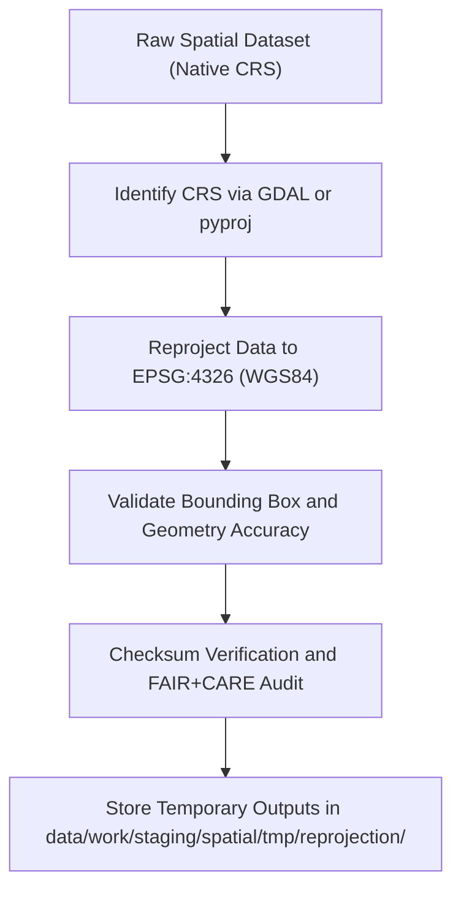

<div align="center">

# 🧭 Kansas Frontier Matrix — **Spatial Reprojection TMP Workspace**
`data/work/staging/spatial/tmp/reprojection/README.md`

**Purpose:** Temporary environment for coordinate reference system (CRS) normalization and reprojection of spatial datasets prior to validation and FAIR+CARE certification.  
Ensures all geospatial files within Kansas Frontier Matrix (KFM) adhere to EPSG:4326 (WGS84) standards and maintain geometric integrity across transformations.

[](../../../../../../docs/standards/faircare-validation.md)
[](../../../../../../LICENSE)
[](../../../../../../docs/architecture/repo-focus.md)

</div>

---

## 📚 Overview

The `data/work/staging/spatial/tmp/reprojection/` directory is a **transient workspace for coordinate system transformation and spatial normalization**.  
All datasets ingested into KFM must be standardized to the global coordinate system (EPSG:4326 — WGS84) to ensure consistency, interoperability, and reproducibility.

### Key Responsibilities:
- Transform coordinate systems (e.g., NAD83, UTM) to EPSG:4326.  
- Validate spatial accuracy and bounding box consistency post-reprojection.  
- Record transformation parameters and FAIR+CARE audit logs.  
- Maintain temporary reprojected outputs before validation.  

All reprojection tasks are logged, checksum-verified, and registered in the governance ledger for audit compliance.

---

## 🗂️ Directory Layout

```plaintext
data/work/staging/spatial/tmp/reprojection/
├── README.md                                # This file — documentation of reprojection TMP workspace
│
├── flood_zones_reprojected.geojson          # FEMA NFHL flood zones reprojected to EPSG:4326
├── elevation_normalized.tif                 # USGS DEM reprojected raster (10m resolution)
├── hydrology_reprojected.geojson            # Hydrologic features standardized to WGS84
└── metadata.json                            # Reprojection session metadata and governance linkage
```

---

## ⚙️ Spatial Reprojection Workflow



### Workflow Description:
1. **CRS Detection:** Identify original projection using GDAL, pyproj, or metadata tags.  
2. **Transformation:** Reproject all geometries and rasters to EPSG:4326.  
3. **Validation:** Compare spatial bounds pre/post-transformation to ensure positional accuracy.  
4. **FAIR+CARE Audit:** Confirm no distortion or territorial boundary bias introduced.  
5. **Governance:** Register transformation metadata to `data/reports/audit/data_provenance_ledger.json`.

---

## 🧩 Example Metadata Record

```json
{
  "id": "spatial_reprojection_climate_v9.3.2",
  "source_files": [
    "data/raw/usgs/elevation_models/kansas_dem_10m.tif",
    "data/raw/noaa/storm_events/storm_events_2025.csv"
  ],
  "input_crs": "EPSG:4269 (NAD83)",
  "target_crs": "EPSG:4326 (WGS84)",
  "transformation_tool": "GDAL 3.8.0",
  "bounding_box_before": [-102.05, 36.98, -94.60, 40.01],
  "bounding_box_after": [-102.05, 36.99, -94.61, 40.00],
  "geometry_accuracy_delta_m": 0.5,
  "created": "2025-10-28T15:12:00Z",
  "validator": "@kfm-spatial-lab",
  "checksum": "sha256:d64c95cb7a1b2f44bdfc3210e4bfe2d1a8f8c918...",
  "fairstatus": "compliant",
  "governance_ref": "data/reports/audit/data_provenance_ledger.json"
}
```

---

## 🧠 FAIR+CARE Governance for Spatial Integrity

| Principle | Implementation |
|------------|----------------|
| **Findable** | Each reprojection logged with dataset ID, CRS info, and bounding box. |
| **Accessible** | Open GeoJSON/GeoTIFF outputs compatible with standard GIS tools. |
| **Interoperable** | CRS harmonized to EPSG:4326, aligned with STAC/DCAT metadata. |
| **Reusable** | Reprojection metadata ensures reproducibility of transformations. |
| **Collective Benefit** | Guarantees spatial accuracy for public and research use. |
| **Authority to Control** | FAIR+CARE Council validates all coordinate transformations. |
| **Responsibility** | Validators document reprojection parameters in logs. |
| **Ethics** | Ensures geographic integrity and ethical handling of spatial data. |

Audit results stored in:  
`data/reports/fair/data_care_assessment.json` and `data/reports/audit/data_provenance_ledger.json`.

---

## ⚙️ Common Tools & Standards

| Tool | Function | Output |
|------|-----------|--------|
| **GDAL / OGR2OGR** | CRS transformation and reprojection for vector/raster data. | GeoJSON, GeoTIFF |
| **pyproj** | CRS detection and coordinate transformation verification. | JSON |
| **Fiona / Shapely** | Geometry validation and spatial fix operations. | GeoJSON |
| **QGIS / Rasterio** | Manual and visual CRS confirmation. | GeoTIFF / PNG |
| **stac-validator** | Post-reprojection STAC compliance check. | JSON log |

---

## ⚖️ Governance & Provenance Integration

| Record | Description |
|---------|-------------|
| `metadata.json` | Records CRS transformation context and checksum. |
| `data/reports/audit/data_provenance_ledger.json` | Logs reprojection and FAIR+CARE certification events. |
| `data/reports/validation/schema_validation_summary.json` | Contains schema and CRS validation outcomes. |
| `releases/v9.3.2/manifest.zip` | Stores checksum registry for reprojection outputs. |

All transformation and validation events synchronized via `spatial_reprojection_sync.yml`.

---

## 🧾 Retention Policy

| File Type | Retention Duration | Policy |
|------------|--------------------|--------|
| Reprojected Files | 14 days | Cleared after CRS validation passes. |
| Metadata Logs | 365 days | Retained for audit and governance tracking. |
| Validation Reports | 180 days | Stored for FAIR+CARE compliance review. |
| Temporary Artifacts | 7 days | Auto-deleted after ETL completion. |

Cleanup governed by `spatial_tmp_cleanup.yml`.

---

## 🧾 Internal Use Citation

```text
Kansas Frontier Matrix (2025). Spatial Reprojection TMP Workspace (v9.3.2).
Temporary workspace for CRS normalization, spatial reprojection, and FAIR+CARE validation of geospatial datasets.
Restricted to internal ETL and data governance workflows.
```

---

## 🧾 Version Notes

| Version | Date | Notes |
|----------|------|--------|
| v9.3.2 | 2025-10-28 | Added bounding box accuracy verification and FAIR+CARE audit trace. |
| v9.2.0 | 2024-07-15 | Integrated GDAL and pyproj validation with checksum governance. |
| v9.0.0 | 2023-01-10 | Established reprojection TMP workspace for spatial harmonization. |

---

<div align="center">

**Kansas Frontier Matrix** · *CRS Accuracy × FAIR+CARE Governance × Reproducible Spatial Integrity*  
[🔗 Repository](https://github.com/bartytime4life/Kansas-Frontier-Matrix) • [🧭 Docs Portal](../../../../../../docs/) • [⚖️ Governance Ledger](../../../../../../docs/standards/governance/)

</div>