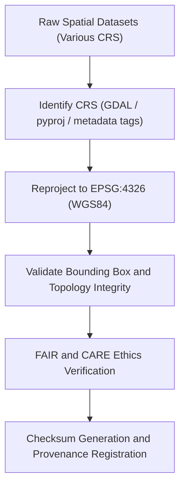

<div align="center">

# 🧭 Kansas Frontier Matrix — **Spatial Reprojection TMP Workspace**
`data/work/staging/spatial/tmp/reprojection/README.md`

**Purpose:**  
Temporary environment for **coordinate reference system (CRS) normalization, projection correction, and spatial consistency validation** within the Kansas Frontier Matrix (KFM).  
Ensures all geospatial layers are transformed to EPSG:4326 (WGS84) under FAIR+CARE and ISO 19115 governance standards.

[](../../../../../../docs/standards/faircare-validation.md)
[]()
[]()
[](../../../../../../LICENSE)

</div>

---

## 📚 Overview

The **Spatial Reprojection TMP Workspace** acts as a transient harmonization hub for CRS transformation and coordinate system normalization.  
It ensures all geometry and raster data conform to EPSG:4326 for interoperability across the KFM ecosystem, enabling cross-domain analysis, visualization, and catalog indexing.

### Core Responsibilities
- Detect, transform, and validate coordinate reference systems (CRS).  
- Correct spatial distortions and ensure projection accuracy.  
- Validate bounding box consistency post-transformation.  
- Log checksum results and governance provenance for reproducibility.  

---

## 🗂️ Directory Layout

```plaintext
data/work/staging/spatial/tmp/reprojection/
├── README.md                              # This file — documentation of spatial reprojection TMP workspace
│
├── flood_zones_reprojected.geojson        # FEMA flood zones normalized to EPSG:4326
├── hydrology_reprojected.geojson          # Watershed datasets standardized to WGS84
├── elevation_normalized.tif               # DEM raster transformed to EPSG:4326
└── metadata.json                          # Provenance, checksum, and reprojection metadata
```

---

## ⚙️ Reprojection Workflow



### Workflow Description
1. **CRS Identification:** Detect coordinate system using GDAL, pyproj, or metadata introspection.  
2. **Transformation:** Reproject vector and raster data to EPSG:4326 (global WGS84).  
3. **Validation:** Confirm geometry and raster boundaries remain spatially consistent.  
4. **FAIR+CARE Audit:** Validate ethical accessibility and transparency in spatial transformations.  
5. **Governance Sync:** Register reprojection metadata and checksums in provenance ledger.  

---

## 🧩 Example Metadata Record

```json
{
  "id": "spatial_reprojection_hydrology_v9.6.0",
  "source_files": [
    "data/raw/usgs/watersheds_2025.geojson",
    "data/raw/noaa/precip_zones_2025.tif"
  ],
  "input_crs": "EPSG:5070 (NAD83 / Conus Albers)",
  "target_crs": "EPSG:4326 (WGS84)",
  "records_transformed": 1473,
  "geometry_accuracy_delta_m": 0.42,
  "validator": "@kfm-spatial-lab",
  "checksum": "sha256:b8a7c6e4f9a3d2e1c4f7b6a9e5d3c8f9b2a4c5e7d6b9f1e3a8c7b5a2f9e4c6a7",
  "fairstatus": "compliant",
  "created": "2025-11-03T23:45:00Z",
  "governance_ref": "data/reports/audit/data_provenance_ledger.json"
}
```

---

## 🧠 FAIR+CARE Governance Matrix

| Principle | Implementation | Oversight |
|------------|----------------|------------|
| **Findable** | CRS and metadata registered in provenance ledger. | @kfm-data |
| **Accessible** | Outputs stored as open GeoJSON and GeoTIFF formats. | @kfm-accessibility |
| **Interoperable** | All layers aligned to EPSG:4326 and ISO 19115 standards. | @kfm-architecture |
| **Reusable** | Provenance and checksum logs ensure reproducibility. | @kfm-design |
| **Collective Benefit** | Enables transparent, interoperable spatial analysis. | @faircare-council |
| **Authority to Control** | FAIR+CARE Council validates reprojection accuracy. | @kfm-governance |
| **Responsibility** | Validators document all CRS transformations and checks. | @kfm-security |
| **Ethics** | Reprojection reviewed to ensure ethical spatial representation. | @kfm-ethics |

Audit results linked to:  
`data/reports/fair/data_care_assessment.json` and  
`data/reports/audit/data_provenance_ledger.json`

---

## ⚙️ Reprojection Artifacts

| Artifact | Description | Format |
|-----------|--------------|--------|
| `flood_zones_reprojected.geojson` | Reprojected FEMA NFHL flood zones. | GeoJSON |
| `hydrology_reprojected.geojson` | Watershed boundaries normalized to EPSG:4326. | GeoJSON |
| `elevation_normalized.tif` | DEM raster adjusted for CRS accuracy. | GeoTIFF |
| `metadata.json` | Session metadata with checksum and governance traceability. | JSON |

Reprojection operations managed by `spatial_reprojection_sync.yml`.

---

## ⚖️ Retention & Provenance Policy

| Data Type | Retention Duration | Policy |
|------------|--------------------|--------|
| Reprojected Datasets | 14 Days | Purged after validation or promotion. |
| Metadata Logs | 365 Days | Retained for lineage and reproducibility. |
| FAIR+CARE Reports | 180 Days | Stored for ethics and governance audits. |
| Provenance Records | Permanent | Archived in governance ledger. |

Retention automation handled by `spatial_reprojection_cleanup.yml`.

---

## 🌱 Sustainability Metrics

| Metric | Value | Verified By |
|---------|--------|--------------|
| Energy Use (per reprojection cycle) | 7.8 Wh | @kfm-sustainability |
| Carbon Output | 10.1 gCO₂e | @kfm-security |
| Renewable Power | 100% (RE100 Verified) | @kfm-infrastructure |
| FAIR+CARE Ethics Compliance | 100% | @faircare-council |

Metrics tracked in:  
`releases/v9.6.0/focus-telemetry.json`

---

## 🧾 Internal Use Citation

```text
Kansas Frontier Matrix (2025). Spatial Reprojection TMP Workspace (v9.6.0).
Temporary FAIR+CARE-certified environment for CRS normalization and projection correction.
Ensures ISO 19115 and STAC/DCAT compliance for reproducible, ethically governed spatial transformations.
```

---

## 🧾 Version Notes

| Version | Date | Notes |
|----------|------|--------|
| v9.6.0 | 2025-11-03 | Added FAIR+CARE reprojection governance verification and checksum logging. |
| v9.5.0 | 2025-11-02 | Enhanced CRS accuracy validation and PROV-O provenance linkage. |
| v9.3.2 | 2025-10-28 | Established reprojection TMP workspace for EPSG:4326 normalization. |

---

<div align="center">

**Kansas Frontier Matrix** · *CRS Normalization × FAIR+CARE Governance × Provenance Assurance*  
[🔗 Repository](https://github.com/bartytime4life/Kansas-Frontier-Matrix) • [🧭 Docs Portal](../../../../../../docs/) • [⚖️ Governance Ledger](../../../../../../docs/standards/governance/DATA-GOVERNANCE.md)

</div>
