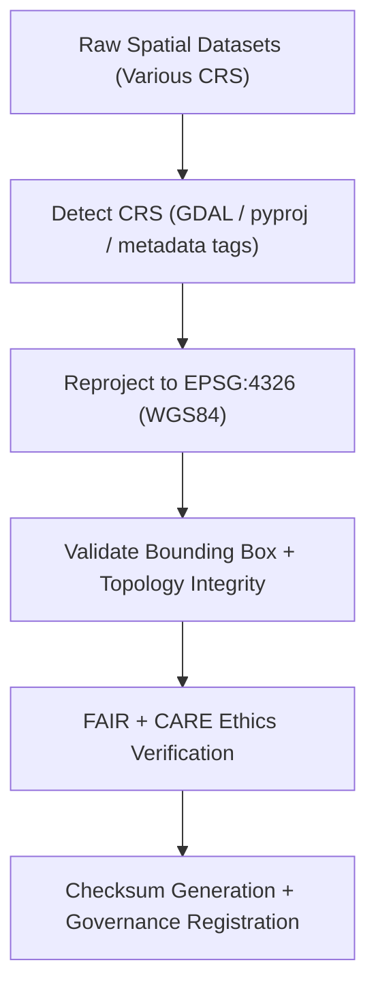

<div align="center">

# 🧭 Kansas Frontier Matrix — **Spatial Reprojection TMP Workspace**
`data/work/staging/spatial/tmp/reprojection/README.md`

**Purpose:**  
Temporary environment for **coordinate reference system (CRS) normalization, projection correction, and spatial validation** within KFM.  
Ensures all geospatial layers are transformed to **EPSG:4326 (WGS84)** under FAIR+CARE and ISO 19115 ethical governance.

[](../../../../../../docs/architecture/README.md)
[](../../../../../../docs/standards/faircare-validation.md)
[]()
[]()
[](../../../../../../LICENSE)

</div>

---

## 📘 Overview

The **Spatial Reprojection TMP Workspace** serves as a transient harmonization zone for CRS transformation and coordinate normalization.  
It ensures geometry and raster data conform to **EPSG:4326**, guaranteeing interoperability across KFM’s ecosystem.

### Core Responsibilities
- Detect and validate CRS before transformation.  
- Reproject to EPSG:4326 using GDAL, pyproj, or PROJ libraries.  
- Confirm spatial alignment and bounding box consistency.  
- Log FAIR+CARE ethics audits and governance metadata.  
- Register transformations in provenance ledgers for transparency.

---

## 🗂️ Directory Layout

```plaintext
data/work/staging/spatial/tmp/reprojection/
├── README.md
├── flood_zones_reprojected.geojson        # FEMA NFHL flood zones normalized to EPSG:4326
├── hydrology_reprojected.geojson          # Watershed datasets standardized to WGS84
├── elevation_normalized.tif               # DEM raster transformed to EPSG:4326
└── metadata.json                          # Provenance, checksum, and reprojection record
```

---

## ⚙️ Reprojection Workflow



### Steps
1. **Detection** — Identify source CRS from embedded metadata.  
2. **Transformation** — Apply reprojection using open-source GIS libraries.  
3. **Validation** — Ensure geometric accuracy and consistent boundaries.  
4. **FAIR+CARE Audit** — Verify accessibility, transparency, and openness.  
5. **Governance Sync** — Log outputs and hashes to provenance ledger.

---

## 🧩 Example Metadata Record

```json
{
  "id": "spatial_reprojection_hydrology_v9.7.0",
  "source_files": [
    "data/raw/usgs/watersheds_2025.geojson",
    "data/raw/noaa/precip_zones_2025.tif"
  ],
  "input_crs": "EPSG:5070 (NAD83 / Conus Albers)",
  "target_crs": "EPSG:4326 (WGS84)",
  "records_transformed": 1473,
  "geometry_accuracy_delta_m": 0.42,
  "validator": "@kfm-spatial-lab",
  "checksum_sha256": "sha256:b8a7c6e4f9a3d2e1c4f7b6a9e5d3c8f9b2a4c5e7d6b9f1e3a8c7b5a2f9e4c6a7",
  "fairstatus": "compliant",
  "created": "2025-11-06T23:45:00Z",
  "governance_ref": "data/reports/audit/data_provenance_ledger.json"
}
```

---

## 🧠 FAIR+CARE Governance Matrix

| Principle | Implementation | Oversight |
|-----------|----------------|-----------|
| **Findable** | CRS details indexed with provenance + checksum. | `@kfm-data` |
| **Accessible** | GeoJSON/GeoTIFF formats under FAIR+CARE compliance. | `@kfm-accessibility` |
| **Interoperable** | CRS normalized to EPSG:4326, ISO 19115 metadata enforced. | `@kfm-architecture` |
| **Reusable** | Logs include lineage, checksums, and CRS reports. | `@kfm-design` |
| **Collective Benefit** | Enables transparent, interoperable spatial analytics. | `@faircare-council` |
| **Authority to Control** | FAIR+CARE Council validates transformation accuracy. | `@kfm-governance` |
| **Responsibility** | Validators document CRS conversions and metadata changes. | `@kfm-security` |
| **Ethics** | Reprojections reviewed for cultural and territorial sensitivity. | `@kfm-ethics` |

**Audit references:**  
`data/reports/audit/data_provenance_ledger.json` · `data/reports/fair/data_care_assessment.json`

---

## ⚙️ Reprojection Artifacts

| Artifact | Description | Format |
|----------|-------------|--------|
| `flood_zones_reprojected.geojson` | FEMA NFHL flood zones normalized to EPSG:4326. | GeoJSON |
| `hydrology_reprojected.geojson` | Hydrology datasets standardized to WGS84. | GeoJSON |
| `elevation_normalized.tif` | DEM raster aligned to WGS84 CRS. | GeoTIFF |
| `metadata.json` | Provenance, checksum, and governance metadata. | JSON |

**Automation:** `spatial_reprojection_sync.yml`

---

## ♻️ Retention & Sustainability Policy

| Type | Retention | Policy |
|------|-----------:|--------|
| Reprojected Files | 14 Days | Purged post-validation or promotion. |
| Metadata Logs | 365 Days | Archived for lineage & reproducibility. |
| FAIR+CARE Audits | 180 Days | Retained for ethics & governance checks. |
| Provenance | Permanent | Stored in the governance ledger. |

**Telemetry:** `../../../../../../releases/v9.7.0/focus-telemetry.json`

---

## 🌱 Sustainability Metrics

| Metric | Value | Verified By |
|--------|------:|-------------|
| Energy Use (per reprojection) | 7.8 Wh | `@kfm-sustainability` |
| Carbon Output | 10.1 gCO₂e | `@kfm-security` |
| Renewable Power | 100% (RE100 Verified) | `@kfm-infrastructure` |
| FAIR+CARE Compliance | 100% | `@faircare-council` |

---

## 🧾 Internal Citation

```text
Kansas Frontier Matrix (2025). Spatial Reprojection TMP Workspace (v9.7.0).
Temporary FAIR+CARE-certified reprojection environment for CRS normalization and coordinate transformation.
Ensures ISO 19115 and STAC/DCAT compliance for reproducible, ethically governed spatial data workflows.
```

---

## 🕰️ Version History

| Version | Date | Author | Summary |
|--------:|------|--------|---------|
| v9.7.0 | 2025-11-06 | `@kfm-spatial` | Upgraded to v9.7.0; added telemetry schema + ISO lineage tracking. |
| v9.6.0 | 2025-11-03 | `@kfm-spatial` | Added governance verification + checksum audit. |

---

<div align="center">

**Kansas Frontier Matrix**  
*CRS Normalization × FAIR+CARE Governance × Provenance Integrity*  
© 2025 Kansas Frontier Matrix — Internal · FAIR+CARE Certified · Diamond⁹ Ω / Crown∞Ω Ultimate Certified  

[Back to Spatial TMP](../README.md) · [Governance Charter](../../../../../../docs/standards/governance/DATA-GOVERNANCE.md)

</div>