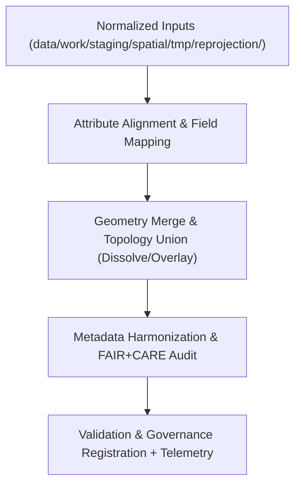

<div align="center">

# 🌐 Kansas Frontier Matrix — **Spatial Union & Merge TMP Workspace**
`data/work/staging/spatial/tmp/union_merge/README.md`

**Purpose:** Temporary environment for combining, fusing, and harmonizing multiple spatial datasets during Kansas Frontier Matrix (KFM) ETL processing.  
This layer enables union/merge operations across geospatial layers (e.g., flood zones, hazard boundaries, hydrology networks) to create unified, governance-compliant spatial composites.

[](../../../../../../docs/standards/faircare-validation.md)
[](../../../../../../LICENSE)
[](../../../../../../docs/architecture/repo-focus.md)

</div>

---

## 📚 Overview

The `data/work/staging/spatial/tmp/union_merge/` directory functions as a **temporary workspace** for spatial union and merge operations.  
It combines multiple geospatial datasets into unified layers while preserving topological integrity, CRS alignment, and FAIR+CARE ethical transparency.

### Key Objectives
- Merge polygon/line datasets with consistent attribute schemas.  
- Execute spatial joins and attribute harmonization across sources.  
- Resolve overlaps, gaps, and duplicates; enforce dissolve rules.  
- Produce merged layers for hazard, hydrology, terrain, and climate mapping.  
- Maintain FAIR+CARE compliance and provenance for integrated products.  
- Emit **telemetry** for governance dashboards and runtime analytics.

All outputs here are **temporary artifacts** generated during automated ETL runs and validated prior to promotion.

---

## 🗂️ Directory Layout

```plaintext
data/work/staging/spatial/tmp/union_merge/
├── README.md                              # This file — union & merge TMP workspace documentation
│
├── hazards_merged.geojson                 # Unified hazard dataset (NOAA + FEMA + USGS)
├── terrain_hydro_union.geojson            # Combined terrain and hydrology spatial layer
├── landcover_climate_merge.geojson        # Cross-domain landcover × climate union
└── metadata.json                          # Provenance record, checksums, and telemetry link
```

---

## ⚙️ Spatial Merge Workflow



### Workflow Description
1. **Attribute Alignment:** Standardize field names, types, and semantics across inputs.  
2. **Geometry Union:** Merge polygons/lines using dissolve/overlay; repair topology.  
3. **Validation:** Verify geometry integrity and attribute preservation; confirm CRS.  
4. **FAIR+CARE Audit:** Review for ethical boundary representation and provenance.  
5. **Governance:** Register operation metadata in `data/reports/audit/data_provenance_ledger.json`; emit telemetry.

---

## 🧩 Example Metadata Record

```json
{
  "id": "spatial_union_merge_hazards_v9.4.0",
  "merged_sources": [
    "data/raw/noaa/storm_events/storm_events_2025.csv",
    "data/raw/fema/flood_zones/kansas_flood_zones_2025.geojson",
    "data/raw/usgs/groundwater_levels/aquifer_extent.geojson"
  ],
  "geometry_type": "Polygon",
  "crs": "EPSG:4326",
  "records_merged": 3511,
  "geometry_issues_fixed": 1,
  "created": "2025-11-02T15:28:00Z",
  "validator": "@kfm-spatial-lab",
  "checksum": "sha256:3d5b1b3a247a5f2b32fd77e5a0a48d6245f89fa8...",
  "fairstatus": "compliant",
  "telemetry_link": "releases/v9.4.0/focus-telemetry.json",
  "governance_ref": "data/reports/audit/data_provenance_ledger.json"
}
```

---

## 🧠 FAIR+CARE Spatial Integration Governance

| Principle | Implementation |
|------------|----------------|
| **Findable** | Merged outputs documented with IDs, CRS, lineage, and telemetry. |
| **Accessible** | GeoJSON outputs aligned with STAC/DCAT metadata. |
| **Interoperable** | CRS normalized (EPSG:4326); attributes harmonized via schema mapping. |
| **Reusable** | Provenance chain recorded; checksums validated for all inputs and outputs. |
| **Collective Benefit** | Supports open, ethical geodata integration and research reuse. |
| **Authority to Control** | Governance Council reviews integration and topology rules. |
| **Responsibility** | Validators ensure proper field mapping and topology preservation. |
| **Ethics** | Sensitive boundaries reviewed for cultural/jurisdictional accuracy. |

Audit records:  
`data/reports/audit/data_provenance_ledger.json` • `data/reports/fair/data_care_assessment.json`

---

## ⚙️ Common Tools and Libraries

| Tool | Purpose | Output |
|------|---------|--------|
| **GeoPandas / Shapely** | Dissolve/overlay, topology repair, and attribute alignment. | GeoJSON |
| **GDAL / OGR2OGR** | Field union, CRS validation, and format conversion. | GeoPackage / GeoJSON |
| **PostGIS** | Advanced spatial joins, de-duplication, and cluster dissolves. | SQL / GeoJSON |
| **pyproj** | CRS consistency verification across merged sources. | JSON metadata |
| **stac-validator** | STAC metadata audit post-merge. | JSON log |

---

## ⚖️ Governance & Provenance Integration

| Record | Description |
|---------|-------------|
| `metadata.json` | Stores merge parameters, CRS, checksums, and telemetry reference. |
| `data/reports/audit/data_provenance_ledger.json` | Logs merge lineage and FAIR+CARE certification. |
| `data/reports/validation/stac_validation_report.json` | Records spatial metadata compliance post-merge. |
| `releases/v9.4.0/manifest.zip` | Global checksum registry for merged artifacts. |

Events tracked via **`spatial_merge_sync.yml`** automation.

---

## 🧾 Retention Policy

| File Type | Retention Duration | Policy |
|------------|--------------------|--------|
| Merged Outputs | 30 days | Retained for QA and governance review. |
| Metadata Logs | 365 days | Archived for long-term provenance. |
| Temporary Artifacts | 7 days | Purged after validation success. |
| FAIR+CARE Reports | 180 days | Stored for ethics audits and re-certification. |

Automation managed by **`spatial_tmp_cleanup.yml`**.

---

## 🧾 Internal Use Citation

```text
Kansas Frontier Matrix (2025). Spatial Union & Merge TMP Workspace (v9.4.0).
Temporary workspace for harmonizing and merging multi-source geospatial data under FAIR+CARE governance.
Restricted to internal ETL, QA, and ethical validation workflows.
```

---

## 🧾 Version Notes

| Version | Date | Notes |
|----------|------|--------|
| v9.4.0 | 2025-11-02 | Added telemetry integration, enhanced topology repair workflow, and automated governance sync. |
| v9.3.2 | 2025-10-28 | Added FAIR+CARE ethical audit to merged datasets and improved governance trace logging. |
| v9.2.0 | 2024-07-15 | Integrated topology repair automation using Shapely and GDAL. |
| v9.0.0 | 2023-01-10 | Established spatial merge TMP workspace for composite data creation. |

---

<div align="center">

**Kansas Frontier Matrix** · *Spatial Integration × FAIR+CARE Ethics × Provenance Traceability × Telemetry Traceability*  
[🔗 Repository](https://github.com/bartytime4life/Kansas-Frontier-Matrix) • [🧭 Docs Portal](../../../../../../docs/) • [⚖️ Governance Ledger](../../../../../../docs/standards/governance/)

</div>
