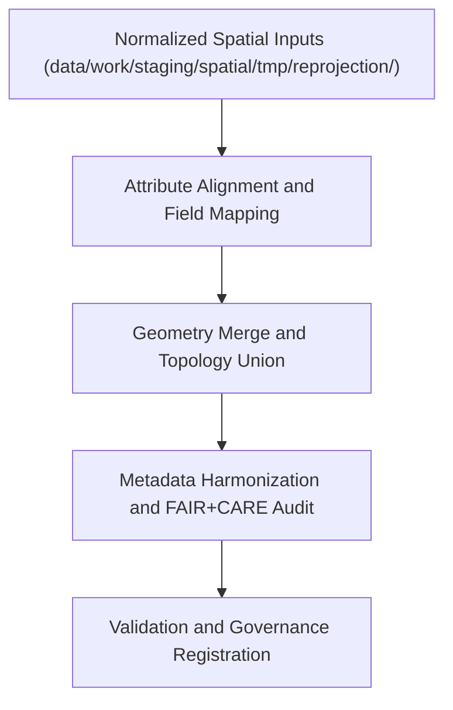

<div align="center">

# 🌐 Kansas Frontier Matrix — **Spatial Union & Merge TMP Workspace**
`data/work/staging/spatial/tmp/union_merge/README.md`

**Purpose:** Temporary environment for combining, fusing, and harmonizing multiple spatial datasets during Kansas Frontier Matrix (KFM) ETL processing.  
This layer enables merging and unioning of geospatial layers (e.g., flood zones, hazard boundaries, hydrology networks) to create unified, governance-compliant spatial composites.

[](../../../../../../docs/standards/faircare-validation.md)
[](../../../../../../LICENSE)
[](../../../../../../docs/architecture/repo-focus.md)

</div>

---

## 📚 Overview

The `data/work/staging/spatial/tmp/union_merge/` directory serves as a **temporary workspace for spatial union and merge operations**.  
It is designed to combine multiple geospatial datasets into a unified layer while maintaining topological integrity, CRS alignment, and FAIR+CARE ethical transparency.

### Key Objectives:
- Merge polygon and line datasets with consistent attributes.  
- Perform spatial joins and attribute harmonization across sources.  
- Resolve geometry overlaps, gaps, and duplicates.  
- Create merged layers for hazard, hydrology, and climate mapping.  
- Ensure FAIR+CARE compliance in data integration processes.  

All outputs here are **temporary artifacts**, regenerated as part of automated ETL runs and validated before promotion to the processed layer.

---

## 🗂️ Directory Layout

```plaintext
data/work/staging/spatial/tmp/union_merge/
├── README.md                              # This file — documentation for union & merge TMP workspace
│
├── hazards_merged.geojson                 # Unified hazard dataset (NOAA + FEMA + USGS)
├── terrain_hydro_union.geojson            # Combined terrain and hydrology spatial layer
├── landcover_climate_merge.geojson        # Cross-domain merge for landcover and climate zones
└── metadata.json                          # Provenance and governance metadata for merge session
```

---

## ⚙️ Spatial Merge Workflow



### Workflow Description:
1. **Attribute Alignment:** Standardize field names, schema, and CRS for input datasets.  
2. **Geometry Merge:** Use geospatial tools to merge and union polygon and line features.  
3. **Validation:** Check topological integrity, dissolve rules, and attribute preservation.  
4. **FAIR+CARE Audit:** Ensure ethical boundary representation and provenance accuracy.  
5. **Governance:** Record operation metadata in `data/reports/audit/data_provenance_ledger.json`.

---

## 🧩 Example Metadata Record

```json
{
  "id": "spatial_union_merge_hazards_v9.3.2",
  "merged_sources": [
    "data/raw/noaa/storm_events/storm_events_2025.csv",
    "data/raw/fema/flood_zones/kansas_flood_zones_2025.geojson",
    "data/raw/usgs/groundwater_levels/aquifer_extent.geojson"
  ],
  "geometry_type": "Polygon",
  "crs": "EPSG:4326",
  "records_merged": 3456,
  "geometry_issues_fixed": 2,
  "created": "2025-10-28T15:30:00Z",
  "validator": "@kfm-spatial-lab",
  "checksum": "sha256:3d5b1b3a247a5f2b32fd77e5a0a48d6245f89fa8...",
  "fairstatus": "compliant",
  "governance_ref": "data/reports/audit/data_provenance_ledger.json"
}
```

---

## 🧠 FAIR+CARE Spatial Integration Governance

| Principle | Implementation |
|------------|----------------|
| **Findable** | Each merged dataset documented with ID, CRS, and source lineage. |
| **Accessible** | Open GeoJSON output; metadata aligned with STAC/DCAT standards. |
| **Interoperable** | CRS normalized to EPSG:4326; attributes harmonized via schema mapping. |
| **Reusable** | Provenance chain recorded; checksums validated for all source layers. |
| **Collective Benefit** | Promotes open, ethical reuse of integrated environmental data. |
| **Authority to Control** | FAIR+CARE Council reviews integration workflows. |
| **Responsibility** | Validators ensure proper field mapping and topology preservation. |
| **Ethics** | Boundary-sensitive data reviewed for cultural and jurisdictional accuracy. |

Audit records linked to:  
`data/reports/audit/data_provenance_ledger.json` and `data/reports/fair/data_care_assessment.json`.

---

## ⚙️ Common Tools and Libraries

| Tool | Purpose | Output |
|------|----------|--------|
| **GeoPandas / Shapely** | Geometry merging and topology correction. | GeoJSON |
| **GDAL / OGR2OGR** | Attribute field union and CRS validation. | GeoPackage / GeoJSON |
| **PostGIS** | Advanced spatial joins and dissolve operations. | SQL / GeoJSON |
| **pyproj** | CRS consistency check across merged sources. | JSON metadata |
| **stac-validator** | STAC metadata audit post-merge. | JSON log |

---

## ⚖️ Governance & Provenance Integration

| Record | Description |
|---------|-------------|
| `metadata.json` | Defines merge parameters, CRS, and checksum trace. |
| `data/reports/audit/data_provenance_ledger.json` | Logs merge lineage and FAIR+CARE certification. |
| `data/reports/validation/stac_validation_report.json` | Records spatial metadata compliance post-merge. |
| `releases/v9.3.2/manifest.zip` | Global checksum registry for merged artifacts. |

All union and merge events tracked via `spatial_merge_sync.yml`.

---

## 🧾 Retention Policy

| File Type | Retention Duration | Policy |
|------------|--------------------|--------|
| Merged Outputs | 30 days | Retained for QA and governance review. |
| Metadata Logs | 365 days | Archived permanently for provenance tracking. |
| Temporary Files | 7 days | Purged after validation success. |
| FAIR+CARE Reports | 180 days | Retained for ethics re-audit and certification. |

Automation and cleanup managed by `spatial_tmp_cleanup.yml`.

---

## 🧾 Internal Use Citation

```text
Kansas Frontier Matrix (2025). Spatial Union & Merge TMP Workspace (v9.3.2).
Temporary workspace for merging, harmonizing, and validating multi-source geospatial datasets under FAIR+CARE governance.
Restricted to internal ETL, QA, and ethical validation workflows.
```

---

## 🧾 Version Notes

| Version | Date | Notes |
|----------|------|--------|
| v9.3.2 | 2025-10-28 | Added FAIR+CARE ethical audit for merged datasets; improved governance trace logging. |
| v9.2.0 | 2024-07-15 | Integrated topology repair automation using Shapely and GDAL. |
| v9.0.0 | 2023-01-10 | Established spatial merge TMP workspace for composite data creation. |

---

<div align="center">

**Kansas Frontier Matrix** · *Spatial Integration × FAIR+CARE Ethics × Provenance Traceability*  
[🔗 Repository](https://github.com/bartytime4life/Kansas-Frontier-Matrix) • [🧭 Docs Portal](../../../../../../docs/) • [⚖️ Governance Ledger](../../../../../../docs/standards/governance/)

</div>