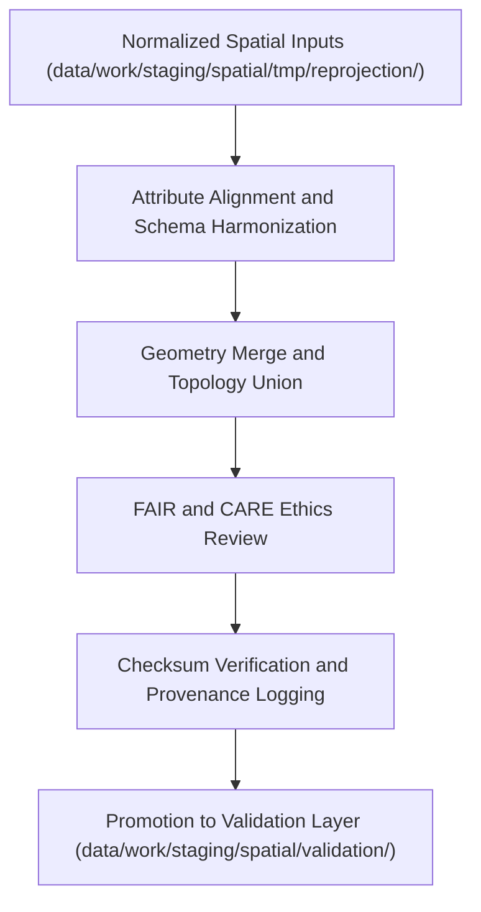

<div align="center">

# 🌐 Kansas Frontier Matrix — **Spatial Union & Merge TMP Workspace**
`data/work/staging/spatial/tmp/union_merge/README.md`

**Purpose:**  
Temporary FAIR+CARE-governed environment for combining, harmonizing, and validating multiple spatial layers during ETL and pre-staging workflows.  
This workspace supports union and merge operations across domains such as hazards, hydrology, and landcover to create unified, governance-compliant geospatial composites.

[](../../../../../../docs/standards/faircare-validation.md)
[]()
[]()
[](../../../../../../LICENSE)

</div>

---

## 📚 Overview

The **Spatial Union & Merge TMP Workspace** serves as a temporary data harmonization hub for spatial datasets that require integration across multiple domains.  
Merges performed here create composite datasets that align geospatially, semantically, and ethically under FAIR+CARE and ISO governance standards.

### Core Responsibilities
- Merge multi-source spatial datasets into unified layers (GeoJSON or Parquet).  
- Ensure CRS normalization and geometry alignment across merged inputs.  
- Validate field schemas and metadata consistency.  
- Apply FAIR+CARE ethics audit before dataset promotion to validation.  

---

## 🗂️ Directory Layout

```plaintext
data/work/staging/spatial/tmp/union_merge/
├── README.md                              # This file — documentation for union & merge TMP workspace
│
├── hazards_merged.geojson                 # Merged hazard datasets (NOAA + FEMA + USGS)
├── terrain_hydro_union.geojson            # Combined terrain and hydrology layers
├── landcover_climate_merge.geojson        # Cross-domain merge for landcover and climate zones
└── metadata.json                          # Provenance, checksum, and governance linkage metadata
```

---

## ⚙️ Spatial Merge Workflow



### Workflow Description
1. **Input Harmonization:** Align schema attributes and CRS before merge.  
2. **Union Process:** Combine overlapping datasets ensuring valid geometry and topology.  
3. **Validation:** Run spatial QA checks for duplicates, overlaps, or feature gaps.  
4. **Ethics Audit:** FAIR+CARE review confirms data transparency and inclusivity.  
5. **Governance Sync:** Log results and lineage to data provenance ledger.  

---

## 🧩 Example Metadata Record

```json
{
  "id": "spatial_union_merge_hazards_v9.6.0",
  "merged_sources": [
    "data/raw/noaa/storm_events_2025.csv",
    "data/raw/fema/flood_zones_2025.geojson",
    "data/raw/usgs/earthquake_points_2025.geojson"
  ],
  "geometry_type": "Polygon",
  "crs": "EPSG:4326",
  "records_merged": 3428,
  "geometry_issues_fixed": 3,
  "checksum": "sha256:c9b2a8d5e1f3b7c6a4e9f1d7b3a6c5e2d9a8b4f7c6e1d5a3f9b7c8e4a5d2b9a3",
  "validator": "@kfm-spatial-lab",
  "fairstatus": "compliant",
  "created": "2025-11-03T23:48:00Z",
  "governance_ref": "data/reports/audit/data_provenance_ledger.json"
}
```

---

## 🧠 FAIR+CARE Governance Matrix

| Principle | Implementation | Oversight |
|------------|----------------|------------|
| **Findable** | Merged datasets documented in provenance registry with unique IDs. | @kfm-data |
| **Accessible** | Stored in open formats (GeoJSON, Parquet) under internal access policies. | @kfm-accessibility |
| **Interoperable** | CRS normalized to EPSG:4326 and metadata harmonized. | @kfm-architecture |
| **Reusable** | Metadata enriched with provenance, checksum, and schema lineage. | @kfm-design |
| **Collective Benefit** | Supports equitable open geospatial analysis. | @faircare-council |
| **Authority to Control** | FAIR+CARE Council oversees spatial integration certification. | @kfm-governance |
| **Responsibility** | Validators ensure CRS alignment and ethical merge compliance. | @kfm-security |
| **Ethics** | Integration reviewed for cultural sensitivity and territorial boundaries. | @kfm-ethics |

Audit results linked to:  
`data/reports/fair/data_care_assessment.json` and  
`data/reports/audit/data_provenance_ledger.json`

---

## ⚙️ Merge Artifacts

| Artifact | Description | Format |
|-----------|--------------|--------|
| `hazards_merged.geojson` | Multi-domain hazard composite dataset. | GeoJSON |
| `terrain_hydro_union.geojson` | Combined elevation and hydrological datasets. | GeoJSON |
| `landcover_climate_merge.geojson` | Spatial merge of landcover classifications and climate zones. | GeoJSON |
| `metadata.json` | Provenance record including checksum and governance details. | JSON |

Merge operations automated via `spatial_union_merge_sync.yml`.

---

## ⚖️ Retention & Provenance Policy

| Data Type | Retention Duration | Policy |
|------------|--------------------|--------|
| Merged Datasets | 30 Days | Purged after successful validation and promotion. |
| FAIR+CARE Logs | 365 Days | Retained for governance review and certification. |
| Metadata Files | Permanent | Archived for lineage and provenance verification. |
| QA Reports | 90 Days | Maintained for cross-domain validation tracking. |

Retention handled through `spatial_union_merge_cleanup.yml`.

---

## 🌱 Sustainability Metrics

| Metric | Value | Verified By |
|---------|--------|--------------|
| Energy Use (per merge cycle) | 8.3 Wh | @kfm-sustainability |
| Carbon Output | 10.5 gCO₂e | @kfm-security |
| Renewable Power | 100% (RE100 Verified) | @kfm-infrastructure |
| FAIR+CARE Ethics Compliance | 100% | @faircare-council |

Telemetry data captured in:  
`releases/v9.6.0/focus-telemetry.json`

---

## 🧾 Internal Use Citation

```text
Kansas Frontier Matrix (2025). Spatial Union & Merge TMP Workspace (v9.6.0).
Temporary FAIR+CARE-certified environment for combining and harmonizing spatial datasets across domains.
Ensures reproducibility, CRS consistency, and ethics-certified spatial integration under governance oversight.
```

---

## 🧾 Version Notes

| Version | Date | Notes |
|----------|------|--------|
| v9.6.0 | 2025-11-03 | Added enhanced checksum governance and FAIR+CARE merge certification workflow. |
| v9.5.0 | 2025-11-02 | Integrated topology validation and CRS normalization checks. |
| v9.3.2 | 2025-10-28 | Established spatial merge TMP workspace for pre-staging harmonization. |

---

<div align="center">

**Kansas Frontier Matrix** · *Spatial Integration × FAIR+CARE Ethics × Provenance Verification*  
[🔗 Repository](https://github.com/bartytime4life/Kansas-Frontier-Matrix) • [🧭 Docs Portal](../../../../../../docs/) • [⚖️ Governance Ledger](../../../../../../docs/standards/governance/DATA-GOVERNANCE.md)

</div>
