<div align="center">

# 🌐 Kansas Frontier Matrix — **Spatial Union & Merge TMP Workspace**
`data/work/staging/spatial/tmp/union_merge/README.md`

**Purpose:**  
Temporary FAIR+CARE-governed environment for combining, harmonizing, and validating multi-source spatial layers during ETL and pre-staging workflows.  
Supports union/merge operations across hazards, hydrology, landcover, and climate to create unified, governance-compliant composites.

[](../../../../../../docs/architecture/README.md)
[](../../../../../../docs/standards/faircare-validation.md)
[]()
[]()
[](../../../../../../LICENSE)

</div>

---

## 📘 Overview

The **Spatial Union & Merge TMP Workspace** is a transient harmonization hub for spatial datasets requiring cross-domain integration.  
Merges here yield composites that align **geospatially, semantically, and ethically** under FAIR+CARE and ISO governance.

### Core Responsibilities
- Merge multi-source datasets into unified layers (GeoJSON/Parquet).  
- Guarantee CRS normalization and geometry alignment.  
- Validate attribute schemas and metadata consistency.  
- Apply FAIR+CARE ethics audit before promotion to validation.  

---

## 🗂️ Directory Layout

```plaintext
data/work/staging/spatial/tmp/union_merge/
├── README.md
├── hazards_merged_v9.7.0.geojson           # NOAA + FEMA + USGS hazard composite
├── terrain_hydro_union_v9.7.0.geojson      # Elevation + hydrology composite
├── landcover_climate_merge_v9.7.0.geojson  # Landcover + climate zones merge
└── metadata.json                            # Provenance, checksum, governance linkage
```

---

## ⚙️ Spatial Merge Workflow

```mermaid
flowchart TD
    A["Normalized Inputs (staging/spatial/tmp/reprojection/)"] --> B["Attribute Alignment & Schema Harmonization"]
    B --> C["Geometry Merge & Topology Union"]
    C --> D["FAIR + CARE Ethics Review"]
    D --> E["Checksum Verification & Provenance Logging"]
    E --> F["Promotion → Validation (staging/spatial/validation/)"]
```



### Steps
1. **Input Harmonization** — Align schema attributes/CRS before merge.  
2. **Union Process** — Combine features; fix geometry; remove duplicates/gaps.  
3. **Validation** — Run QA on topology & attribute coherence.  
4. **Ethics Audit** — FAIR+CARE review of transparency & inclusivity.  
5. **Governance** — Log lineage & hashes to provenance ledger.

---

## 🧩 Example Metadata Record

```json
{
  "id": "spatial_union_merge_hazards_v9.7.0",
  "merged_sources": [
    "data/raw/noaa/storm_events_2025.csv",
    "data/raw/fema/flood_zones_2025.geojson",
    "data/raw/usgs/earthquake_points_2025.geojson"
  ],
  "geometry_type": "Polygon",
  "crs": "EPSG:4326",
  "records_merged": 3428,
  "geometry_issues_fixed": 3,
  "checksum_sha256": "sha256:c9b2a8d5e1f3b7c6a4e9f1d7b3a6c5e2d9a8b4f7c6e1d5a3f9b7c8e4a5d2b9a3",
  "validator": "@kfm-spatial-lab",
  "fairstatus": "compliant",
  "created": "2025-11-06T23:48:00Z",
  "governance_ref": "data/reports/audit/data_provenance_ledger.json"
}
```

---

## 🧠 FAIR+CARE Governance Matrix

| Principle | Implementation | Oversight |
|-----------|----------------|-----------|
| **Findable** | Composites documented with unique IDs in provenance registry. | `@kfm-data` |
| **Accessible** | GeoJSON/Parquet stored under internal access policy. | `@kfm-accessibility` |
| **Interoperable** | EPSG:4326 CRS; ISO/ STAC metadata harmonization. | `@kfm-architecture` |
| **Reusable** | Provenance, checksum, and schema lineage embedded. | `@kfm-design` |
| **Collective Benefit** | Enables equitable open geospatial analysis. | `@faircare-council` |
| **Authority to Control** | Council oversees integration certification. | `@kfm-governance` |
| **Responsibility** | Validators ensure CRS alignment & ethical merge compliance. | `@kfm-security` |
| **Ethics** | Integration reviewed for cultural sensitivity & territorial integrity. | `@kfm-ethics` |

**Audit refs:**  
`data/reports/fair/data_care_assessment.json` · `data/reports/audit/data_provenance_ledger.json`

---

## ⚙️ Merge Artifacts

| Artifact                           | Description                                  | Format |
|-----------------------------------|----------------------------------------------|--------|
| `hazards_merged_v9.7.0.geojson`   | Multi-domain hazard composite                | GeoJSON |
| `terrain_hydro_union_v9.7.0.geojson` | Elevation + hydrology union                 | GeoJSON |
| `landcover_climate_merge_v9.7.0.geojson` | Landcover + climate zones composite      | GeoJSON |
| `metadata.json`                   | Provenance + checksum + governance metadata  | JSON   |

**Automation:** `spatial_union_merge_sync.yml`

---

## ♻️ Retention & Sustainability

| Data Type        | Retention | Policy |
|------------------|----------:|--------|
| Merged Datasets  | 30 Days   | Purged after validation/promotion. |
| FAIR+CARE Logs   | 365 Days  | Retained for certification review. |
| Metadata Files   | Permanent | Archived for provenance verification. |
| QA Reports       | 90 Days   | Maintained for cross-domain validation. |

**Telemetry:** `../../../../../../releases/v9.7.0/focus-telemetry.json`

---

## 🧾 Internal Citation

```text
Kansas Frontier Matrix (2025). Spatial Union & Merge TMP Workspace (v9.7.0).
Temporary FAIR+CARE-certified environment for combining and harmonizing spatial datasets across domains—ensuring CRS consistency, ethical integration, and reproducible governance oversight.
```

---

## 🕰️ Version History

| Version | Date | Author | Summary |
|--------:|------|--------|---------|
| v9.7.0  | 2025-11-06 | `@kfm-spatial` | Upgraded to v9.7.0; telemetry schema added; filenames normalized; governance links hardened. |
| v9.6.0  | 2025-11-03 | `@kfm-spatial` | Added checksum governance + FAIR+CARE merge certification. |

---

<div align="center">

**Kansas Frontier Matrix**  
*Spatial Integration × FAIR+CARE Ethics × Provenance Verification*  
© 2025 Kansas Frontier Matrix — Internal · FAIR+CARE Certified · Diamond⁹ Ω / Crown∞Ω Ultimate Certified  

[Back to Spatial TMP](../README.md) · [Governance Charter](../../../../../../docs/standards/governance/DATA-GOVERNANCE.md)

</div>