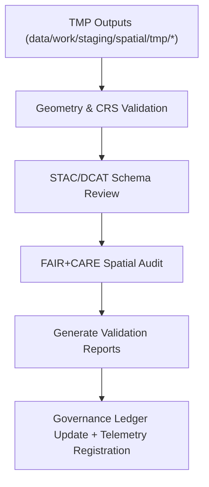

<div align="center">

# ✅ Kansas Frontier Matrix — **Spatial Validation Workspace**
`data/work/staging/spatial/validation/README.md`

**Purpose:** Performs geometry integrity checks, CRS validation, FAIR+CARE spatial ethics audits, and STAC/DCAT metadata verification for geospatial datasets within Kansas Frontier Matrix (KFM).  
Ensures all spatial data adhere to technical, ethical, and interoperability standards before promotion to processed or archival layers.

[](../../../../../../docs/standards/faircare-validation.md)
[](../../../../../../LICENSE)
[](../../../../../../docs/architecture/repo-focus.md)

</div>

---

## 📚 Overview

The `data/work/staging/spatial/validation/` directory is the **governed validation environment** for final QA of geospatial datasets.  
All geometry, CRS, and ethical validations are performed here prior to data certification, ensuring complete alignment with FAIR+CARE and STAC governance standards.

### Core Responsibilities
- Validate CRS and bounding boxes for **EPSG:4326 (WGS84)** compliance.  
- Check geometry validity, topology consistency, and feature completeness.  
- Verify STAC/DCAT metadata alignment and discoverability.  
- Conduct FAIR+CARE spatial ethics and territorial audits.  
- Register results, checksums, and telemetry metrics in the governance ledger.

All validation actions are logged, auditable, and version-controlled to guarantee reproducibility and data trustworthiness.

---

## 🗂️ Directory Layout

```plaintext
data/work/staging/spatial/validation/
├── README.md                              # This file — documentation of spatial validation workspace
│
├── geometry_validation_report.json        # Geometry and topology QA results
├── stac_spatial_compliance.json           # STAC metadata and bounding box validation
├── crs_check_summary.json                 # CRS and projection audit
├── faircare_spatial_audit.json            # FAIR+CARE ethics and boundary review
└── metadata.json                          # Validation context, checksum, and telemetry link
```

---

## ⚙️ Spatial Validation Workflow



### Workflow Description
1. **Geometry Validation:** Detect and fix null, invalid, or self-intersecting geometries.  
2. **CRS Check:** Confirm EPSG:4326 normalization, bbox consistency, and axis order.  
3. **Metadata Review:** Verify STAC/DCAT schema compliance and spatial fields.  
4. **Ethics Audit:** Evaluate geographic boundaries for equity and representation.  
5. **Governance Sync:** Update provenance ledger and telemetry dashboards with validation status.

---

## 🧩 Example Validation Metadata Record

```json
{
  "id": "spatial_validation_hazards_v9.4.0",
  "source_dataset": "data/work/staging/spatial/tmp/union_merge/hazards_merged.geojson",
  "created": "2025-11-02T15:33:00Z",
  "validator": "@kfm-spatial-lab",
  "geometry_valid": true,
  "crs_compliance": "EPSG:4326",
  "stac_metadata_valid": true,
  "faircare_score": 98.5,
  "issues_found": 0,
  "checksum": "sha256:bc30f6c182db8b8f6dc94f031a01c34f15dbb3ad...",
  "telemetry_link": "releases/v9.4.0/focus-telemetry.json",
  "governance_ref": "data/reports/audit/data_provenance_ledger.json"
}
```

---

## 🧠 FAIR+CARE Validation Criteria

| Validation Category | Description | Tool / Standard | Output |
|----------------------|-------------|------------------|---------|
| **Geometry Integrity** | Ensures valid geometries and topological consistency. | Shapely / GDAL | `geometry_validation_report.json` |
| **CRS Alignment** | Verifies reprojection accuracy and bounding box correctness. | pyproj / Fiona | `crs_check_summary.json` |
| **Metadata Compliance** | Validates STAC/DCAT metadata completeness. | stac-validator | `stac_spatial_compliance.json` |
| **Ethical Governance Audit** | Checks spatial fairness, jurisdictional boundaries, and Indigenous territory representation. | faircare-validator | `faircare_spatial_audit.json` |

---

## ⚙️ FAIR+CARE Spatial Compliance Overview

| Principle | Implementation |
|------------|----------------|
| **Findable** | Datasets indexed by STAC/DCAT catalogs with spatial metadata. |
| **Accessible** | Validation results and FAIR+CARE audits stored for governance council access. |
| **Interoperable** | CRS normalized and schema fields aligned with STAC 1.0/DCAT 3.0. |
| **Reusable** | Provenance and ethics metadata ensure reproducibility. |
| **Collective Benefit** | Reinforces open, equitable data sharing for Kansas research. |
| **Authority to Control** | FAIR+CARE Council reviews validation reports pre-certification. |
| **Responsibility** | Validators document corrections and audit actions in logs. |
| **Ethics** | Guarantees cultural, jurisdictional, and geographic sensitivity. |

FAIR+CARE outcomes are permanently stored in:  
`data/reports/fair/data_care_assessment.json` • `data/reports/audit/data_provenance_ledger.json`

---

## ⚖️ Governance & Provenance Integration

| Record | Description |
|---------|-------------|
| `geometry_validation_report.json` | Geometry and topology integrity report. |
| `crs_check_summary.json` | CRS normalization and accuracy audit. |
| `stac_spatial_compliance.json` | STAC/DCAT field validation summary. |
| `faircare_spatial_audit.json` | FAIR+CARE ethics audit and spatial integrity review. |
| `metadata.json` | Records runtime context, telemetry, and governance linkage. |
| `data/reports/audit/data_provenance_ledger.json` | Global ledger documenting lineage and certification. |

All validations automated via **`spatial_validation_sync.yml`**.

---

## 🧾 Retention Policy

| File Type | Retention Duration | Policy |
|------------|--------------------|--------|
| Geometry/CRS Reports | 180 days | Archived for reproducibility. |
| FAIR+CARE Ethics Audits | 365 days | Retained permanently for ethics review. |
| Metadata Reports | 180 days | Stored with ledger and catalog metadata. |
| Validation Metadata | Permanent | Logged for full provenance traceability. |

Cleanup and archival managed by **`spatial_validation_cleanup.yml`**.

---

## 🧾 Internal Use Citation

```text
Kansas Frontier Matrix (2025). Spatial Validation Workspace (v9.4.0).
Governed validation layer ensuring spatial geometry integrity, CRS alignment, and FAIR+CARE ethical compliance.
Restricted to internal QA and governance audit operations.
```

---

## 🧾 Version Notes

| Version | Date | Notes |
|----------|------|--------|
| v9.4.0 | 2025-11-02 | Added telemetry integration, enhanced CRS audit, and automated governance ledger sync. |
| v9.3.2 | 2025-10-28 | Added FAIR+CARE ethics audit integration and automated CRS validation. |
| v9.2.0 | 2024-07-15 | Expanded STAC metadata validation and topology QA. |
| v9.0.0 | 2023-01-10 | Established spatial validation workspace under FAIR+CARE governance. |

---

<div align="center">

**Kansas Frontier Matrix** · *Spatial Quality × FAIR+CARE Ethics × Provenance Governance × Telemetry Traceability*  
[🔗 Repository](https://github.com/bartytime4life/Kansas-Frontier-Matrix) • [🧭 Docs Portal](../../../../../../docs/) • [⚖️ Governance Ledger](../../../../../../docs/standards/governance/)

</div>
