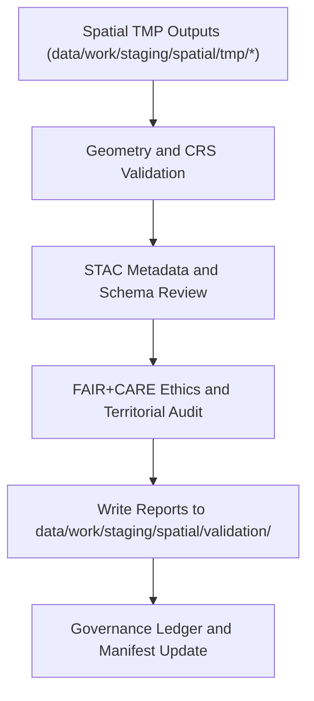

<div align="center">

# ✅ Kansas Frontier Matrix — **Spatial Validation Workspace**
`data/work/staging/spatial/validation/README.md`

**Purpose:** Performs geometry integrity checks, CRS validation, FAIR+CARE spatial ethics audits, and STAC metadata verification for geospatial datasets within Kansas Frontier Matrix (KFM).  
Ensures all spatial data adhere to technical, ethical, and interoperability standards before being promoted to processed or archival layers.

[](../../../../../../docs/standards/faircare-validation.md)
[](../../../../../../LICENSE)
[](../../../../../../docs/architecture/repo-focus.md)

</div>

---

## 📚 Overview

The `data/work/staging/spatial/validation/` directory is the **governed validation environment** where spatial datasets undergo technical, schema, and ethical reviews.  
It acts as the quality assurance layer bridging raw and processed spatial data.

### Key Responsibilities:
- Verify CRS and bounding box alignment (EPSG:4326).  
- Check geometry validity, topology integrity, and feature completeness.  
- Validate STAC/DCAT spatial metadata for discoverability.  
- Run FAIR+CARE audits on ethical and territorial correctness.  
- Record validation outcomes and governance approvals.

All validation activities are logged and cross-referenced with provenance records in the governance ledger.

---

## 🗂️ Directory Layout

```plaintext
data/work/staging/spatial/validation/
├── README.md                              # This file — documentation of spatial validation workspace
│
├── geometry_validation_report.json        # Results of geometry and topology integrity checks
├── stac_spatial_compliance.json           # STAC metadata and bounding box validation
├── crs_check_summary.json                 # CRS normalization and projection audit
├── faircare_spatial_audit.json            # FAIR+CARE ethics and boundary compliance review
└── metadata.json                          # Validation context and governance traceability
```

---

## ⚙️ Spatial Validation Workflow



### Workflow Description:
1. **Geometry Check:** Detect and correct invalid, null, or self-intersecting geometries.  
2. **CRS Verification:** Confirm all datasets use EPSG:4326 projection.  
3. **Metadata Review:** Ensure completeness of STAC/DCAT fields and spatial coverage tags.  
4. **Ethics Audit:** Validate territorial boundaries, Indigenous lands, and ethical representation.  
5. **Governance Sync:** Log results and checksum into provenance ledger.

---

## 🧩 Example Validation Metadata Record

```json
{
  "id": "spatial_validation_hazards_v9.3.2",
  "source_dataset": "data/work/staging/spatial/tmp/union_merge/hazards_merged.geojson",
  "created": "2025-10-28T15:50:00Z",
  "validator": "@kfm-spatial-lab",
  "geometry_valid": true,
  "crs_compliance": "EPSG:4326",
  "stac_metadata_valid": true,
  "faircare_score": 97.9,
  "issues_found": 0,
  "checksum": "sha256:bc30f6c182db8b8f6dc94f031a01c34f15dbb3ad...",
  "governance_ref": "data/reports/audit/data_provenance_ledger.json"
}
```

---

## 🧠 FAIR+CARE Validation Criteria

| Validation Category | Description | Tool / Standard | Output |
|----------------------|-------------|------------------|---------|
| **Geometry Integrity** | Validates geometry correctness and topology consistency. | Shapely / GDAL | `geometry_validation_report.json` |
| **CRS Alignment** | Verifies projection and bounding box coverage. | pyproj / Fiona | `crs_check_summary.json` |
| **Metadata Compliance** | STAC and DCAT field completeness review. | stac-validator | `stac_spatial_compliance.json` |
| **FAIR+CARE Ethics Audit** | Reviews boundaries and ethical alignment with territorial data. | faircare-validator | `faircare_spatial_audit.json` |

---

## ⚙️ FAIR+CARE Spatial Compliance Overview

| Principle | Implementation |
|------------|----------------|
| **Findable** | STAC items indexed with bounding boxes and CRS metadata. |
| **Accessible** | Metadata available for public and internal governance review. |
| **Interoperable** | All spatial datasets use EPSG:4326 and standardized formats. |
| **Reusable** | Provenance metadata ensures reproducibility and ethical use. |
| **Collective Benefit** | Promotes open, responsible spatial data sharing. |
| **Authority to Control** | FAIR+CARE Council oversees spatial data validation workflows. |
| **Responsibility** | Validators record CRS and geometry corrections in governance logs. |
| **Ethics** | Ensures representation of Indigenous and jurisdictional boundaries with respect. |

FAIR+CARE results stored in:  
`data/reports/fair/data_care_assessment.json` and `data/reports/audit/data_provenance_ledger.json`.

---

## ⚖️ Governance & Provenance Integration

| Record | Description |
|---------|-------------|
| `geometry_validation_report.json` | Captures geometry and topology QA results. |
| `crs_check_summary.json` | Reports CRS normalization and accuracy. |
| `stac_spatial_compliance.json` | STAC field and spatial metadata validation summary. |
| `faircare_spatial_audit.json` | Ethical review and FAIR+CARE spatial audit outcomes. |
| `metadata.json` | Records validation runtime context and ledger linkage. |
| `data/reports/audit/data_provenance_ledger.json` | Global governance ledger for spatial lineage. |

All validation actions managed via `spatial_validation_sync.yml` automation.

---

## 🧾 Retention Policy

| File Type | Retention Duration | Policy |
|------------|--------------------|--------|
| Geometry and CRS Reports | 180 days | Archived for spatial QA and reproducibility. |
| FAIR+CARE Ethics Audits | 365 days | Retained permanently for ethical oversight. |
| Metadata Compliance Reports | 180 days | Linked to governance ledger and catalog. |
| Validation Metadata | Permanent | Stored for provenance continuity. |

Cleanup and archival handled by `spatial_validation_cleanup.yml`.

---

## 🧾 Internal Use Citation

```text
Kansas Frontier Matrix (2025). Spatial Validation Workspace (v9.3.2).
Governed environment for spatial geometry, CRS, and FAIR+CARE validation ensuring ethical and reproducible geospatial workflows.
Restricted to internal QA and governance audit operations.
```

---

## 🧾 Version Notes

| Version | Date | Notes |
|----------|------|--------|
| v9.3.2 | 2025-10-28 | Added FAIR+CARE ethics audit integration and automated CRS validation. |
| v9.2.0 | 2024-07-15 | Expanded STAC metadata validation and topology QA. |
| v9.0.0 | 2023-01-10 | Established spatial validation workspace under FAIR+CARE governance. |

---

<div align="center">

**Kansas Frontier Matrix** · *Spatial Quality × FAIR+CARE Ethics × Provenance Governance*  
[🔗 Repository](https://github.com/bartytime4life/Kansas-Frontier-Matrix) • [🧭 Docs Portal](../../../../../../docs/) • [⚖️ Governance Ledger](../../../../../../docs/standards/governance/)

</div>