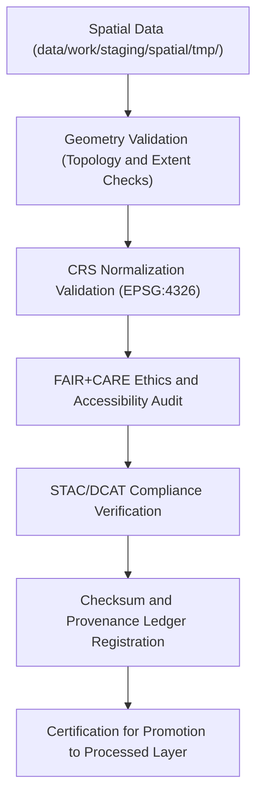

<div align="center">

# ✅ Kansas Frontier Matrix — **Spatial Validation Workspace**
`data/work/staging/spatial/validation/README.md`

**Purpose:**  
Governed validation environment for **FAIR+CARE, CRS, and geometry audits** of spatial datasets across all Kansas Frontier Matrix (KFM) domains.  
This layer ensures geospatial data are schema-verified, ethics-certified, and ready for promotion to the processed spatial layer.

[](../../../../../docs/standards/faircare-validation.md)
[]()
[]()
[](../../../../../LICENSE)

</div>

---

## 📚 Overview

The **Spatial Validation Workspace** is the final quality control checkpoint for all spatial datasets in the KFM staging environment.  
It performs **geometry integrity checks, CRS normalization audits, FAIR+CARE ethical evaluations,** and **metadata linkage verification** before processed publication.

### Core Objectives
- Validate CRS, geometry, and metadata schema compliance.  
- Audit FAIR+CARE governance alignment for open data readiness.  
- Confirm checksum consistency and governance linkage.  
- Generate validation reports and ethical certification summaries.  

---

## 🗂️ Directory Layout

```plaintext
data/work/staging/spatial/validation/
├── README.md                              # This file — documentation for spatial validation workspace
│
├── geometry_validation_report.json        # Validation report for geometry and topology accuracy
├── crs_check_summary.json                 # CRS and projection consistency validation
├── stac_spatial_compliance.json           # STAC/DCAT spatial metadata verification report
├── faircare_spatial_audit.json            # FAIR+CARE ethical compliance report
└── metadata.json                          # Validation metadata, checksum registry, and governance record
```

---

## ⚙️ Spatial Validation Workflow



### Workflow Description
1. **Geometry Validation:** Detect invalid geometries, self-intersections, and topological errors.  
2. **CRS Audit:** Ensure all geometries conform to EPSG:4326 for interoperability.  
3. **FAIR+CARE Audit:** Verify ethical and open accessibility of geospatial data.  
4. **STAC/DCAT Validation:** Confirm spatial metadata completeness and linkage integrity.  
5. **Governance Registration:** Log results in the provenance ledger for certification readiness.  

---

## 🧩 Example Validation Metadata Record

```json
{
  "id": "spatial_validation_landcover_v9.6.0",
  "source_dataset": "data/work/staging/spatial/tmp/reprojection/landcover_2025.geojson",
  "geometry_valid": true,
  "crs_status": "EPSG:4326",
  "stac_metadata_valid": true,
  "faircare_score": 99.2,
  "issues_detected": 0,
  "checksum": "sha256:a7b3e8c4f9d6a1b5c2f8d7e4b9c5a3f2e1d6b7c8a9f5e3d4c7b2a6f8e1c9d3b5",
  "validator": "@kfm-spatial-lab",
  "fairstatus": "certified",
  "created": "2025-11-03T23:42:00Z",
  "governance_ref": "data/reports/audit/data_provenance_ledger.json"
}
```

---

## 🧠 FAIR+CARE Governance Matrix

| Principle | Implementation | Oversight |
|------------|----------------|------------|
| **Findable** | Datasets indexed via STAC/DCAT metadata for discovery. | @kfm-data |
| **Accessible** | Stored in open formats (GeoJSON, GeoTIFF, Parquet). | @kfm-accessibility |
| **Interoperable** | CRS normalized and aligned with ISO and STAC metadata. | @kfm-architecture |
| **Reusable** | Metadata enriched with provenance, checksum, and schema context. | @kfm-design |
| **Collective Benefit** | Ensures equitable access to geospatial knowledge. | @faircare-council |
| **Authority to Control** | FAIR+CARE Council certifies data readiness. | @kfm-governance |
| **Responsibility** | Validators log QA results and FAIR+CARE compliance. | @kfm-security |
| **Ethics** | Reviews sensitive areas and protected sites for responsible release. | @kfm-ethics |

All governance audits registered in:  
`data/reports/audit/data_provenance_ledger.json` and  
`data/reports/fair/data_care_assessment.json`

---

## ⚙️ Validation & Certification Artifacts

| Artifact | Description | Format |
|-----------|--------------|--------|
| `geometry_validation_report.json` | Geometry and topology QA validation report. | JSON |
| `crs_check_summary.json` | CRS consistency and normalization record. | JSON |
| `stac_spatial_compliance.json` | STAC 1.0/DCAT 3.0 spatial metadata conformance results. | JSON |
| `faircare_spatial_audit.json` | FAIR+CARE ethics and accessibility audit. | JSON |
| `metadata.json` | Records lineage, validation outcomes, and checksum registry. | JSON |

Validation automation managed via `spatial_validation_sync.yml`.

---

## ⚖️ Retention & Provenance Policy

| Data Type | Retention Duration | Policy |
|------------|--------------------|--------|
| Validation Reports | 365 Days | Retained for FAIR+CARE and ISO re-certification. |
| FAIR+CARE Audits | Permanent | Maintained for governance transparency. |
| Governance Logs | 365 Days | Archived for lineage and audit continuity. |
| Metadata | Permanent | Preserved in governance and provenance ledgers. |

Cleanup governed by `spatial_validation_cleanup.yml`.

---

## 🌱 Sustainability Metrics

| Metric | Value | Verified By |
|---------|--------|--------------|
| Energy Use (per validation run) | 7.1 Wh | @kfm-sustainability |
| Carbon Output | 9.8 gCO₂e | @kfm-security |
| Renewable Power | 100% (RE100 Verified) | @kfm-infrastructure |
| FAIR+CARE Certification | 100% | @faircare-council |

Telemetry metrics recorded in:  
`releases/v9.6.0/focus-telemetry.json`

---

## 🧾 Internal Use Citation

```text
Kansas Frontier Matrix (2025). Spatial Validation Workspace (v9.6.0).
FAIR+CARE-governed validation layer ensuring geometry, CRS, and metadata integrity for spatial datasets.
Certified under ISO 19115, STAC 1.0, and DCAT 3.0 frameworks for reproducibility and ethics compliance.
```

---

## 🧾 Version Notes

| Version | Date | Notes |
|----------|------|--------|
| v9.6.0 | 2025-11-03 | Added CRS and FAIR+CARE automation with checksum ledger registration. |
| v9.5.0 | 2025-11-02 | Enhanced geometry validation and STAC/DCAT compliance audit integration. |
| v9.3.2 | 2025-10-28 | Established spatial validation workspace for FAIR+CARE-certified QA. |

---

<div align="center">

**Kansas Frontier Matrix** · *Spatial Integrity × FAIR+CARE Ethics × Provenance Governance*  
[🔗 Repository](https://github.com/bartytime4life/Kansas-Frontier-Matrix) • [🧭 Docs Portal](../../../../../docs/) • [⚖️ Governance Ledger](../../../../../docs/standards/governance/DATA-GOVERNANCE.md)

</div>
