<div align="center">

# ✅ Kansas Frontier Matrix — **Spatial Validation Workspace**
`data/work/staging/spatial/validation/README.md`

**Purpose:**  
Governed environment for **FAIR+CARE, CRS, and geometry validations** across all spatial domains within KFM.  
Ensures every geospatial dataset is schema-verified, ethics-certified, and promotion-ready for the processed spatial layer.

[](../../../../../docs/architecture/README.md)
[](../../../../../docs/standards/faircare-validation.md)
[]()
[]()
[](../../../../../LICENSE)

</div>

---

## 📘 Overview

The **Spatial Validation Workspace** acts as the final QA checkpoint for geospatial datasets before public release.  
It performs **CRS verification, topology integrity checks, FAIR+CARE ethics audits,** and **metadata schema validation** to ensure reproducibility, ethics, and interoperability.

### Core Objectives
- Validate CRS normalization and geometry schema integrity.  
- Perform FAIR+CARE ethical audits for governance readiness.  
- Register checksum and provenance metadata.  
- Certify datasets for STAC/DCAT publication in processed layers.  

---

## 🗂️ Directory Layout

```plaintext
data/work/staging/spatial/validation/
├── README.md
├── geometry_validation_report.json        # Geometry integrity and topology QA report
├── crs_check_summary.json                 # CRS and projection normalization audit
├── stac_spatial_compliance.json           # STAC/DCAT spatial metadata validation results
├── faircare_spatial_audit.json            # FAIR+CARE ethics compliance report
└── metadata.json                          # Validation metadata and governance ledger linkage
```

---

## ⚙️ Spatial Validation Workflow

```mermaid
flowchart TD
    A["Spatial Data (staging/spatial/tmp/*)"] --> B["Geometry Integrity Validation (Topology + Extent)"]
    B --> C["CRS Audit (EPSG:4326 Normalization Check)"]
    C --> D["FAIR + CARE Ethics Review"]
    D --> E["STAC/DCAT Metadata Compliance Audit"]
    E --> F["Checksum Verification + Governance Ledger Sync"]
    F --> G["Certification → Processed Spatial Layer"]
```



### Steps
1. **Geometry Validation** — Detect invalid geometries and topology anomalies.  
2. **CRS Audit** — Confirm EPSG:4326 standardization and coordinate accuracy.  
3. **FAIR+CARE Ethics Audit** — Verify open accessibility and cultural responsibility.  
4. **Metadata Audit** — Ensure STAC/DCAT alignment and completeness.  
5. **Governance Sync** — Record ledger entries for reproducibility and certification.

---

## 🧩 Example Validation Record

```json
{
  "id": "spatial_validation_landcover_v9.7.0",
  "source_dataset": "data/work/staging/spatial/tmp/reprojection/landcover_2025.geojson",
  "geometry_valid": true,
  "crs_status": "EPSG:4326",
  "stac_metadata_valid": true,
  "faircare_score": 99.2,
  "issues_detected": 0,
  "checksum_sha256": "sha256:a7b3e8c4f9d6a1b5c2f8d7e4b9c5a3f2e1d6b7c8a9f5e3d4c7b2a6f8e1c9d3b5",
  "validator": "@kfm-spatial-lab",
  "fairstatus": "certified",
  "created": "2025-11-06T23:42:00Z",
  "governance_ref": "data/reports/audit/data_provenance_ledger.json"
}
```

---

## 🧠 FAIR+CARE Governance Matrix

| Principle | Implementation | Oversight |
|-----------|----------------|-----------|
| **Findable** | Indexed in STAC/DCAT catalogs with CRS and provenance. | `@kfm-data` |
| **Accessible** | Stored in open, audit-accessible formats (GeoJSON, GeoTIFF). | `@kfm-accessibility` |
| **Interoperable** | CRS normalized and schema aligned with ISO and STAC. | `@kfm-architecture` |
| **Reusable** | Metadata includes lineage, checksum, and schema verification. | `@kfm-design` |
| **Collective Benefit** | Enables equitable open geospatial research. | `@faircare-council` |
| **Authority to Control** | FAIR+CARE Council approves certification readiness. | `@kfm-governance` |
| **Responsibility** | Validators maintain QA reports and governance documentation. | `@kfm-security` |
| **Ethics** | Reviews sensitive geography for ethical compliance. | `@kfm-ethics` |

**Audit logs:**  
`data/reports/audit/data_provenance_ledger.json` · `data/reports/fair/data_care_assessment.json`

---

## ⚙️ Validation & Certification Artifacts

| Artifact | Description | Format |
|-----------|--------------|--------|
| `geometry_validation_report.json` | Validates geometry and topology consistency. | JSON |
| `crs_check_summary.json` | CRS normalization and projection audit. | JSON |
| `stac_spatial_compliance.json` | STAC 1.0/DCAT 3.0 metadata verification. | JSON |
| `faircare_spatial_audit.json` | FAIR+CARE ethics certification results. | JSON |
| `metadata.json` | Validation metadata, checksums, and governance record. | JSON |

**Automation:** `spatial_validation_sync.yml`

---

## ♻️ Retention & Sustainability Policy

| Data Type | Retention | Policy |
|------------|----------:|--------|
| Validation Reports | 365 Days | Retained for FAIR+CARE recertification. |
| FAIR+CARE Audits | Permanent | Archived for transparency & ethics documentation. |
| Governance Logs | 365 Days | Stored for lineage & reproducibility. |
| Metadata | Permanent | Preserved in governance provenance ledgers. |

**Telemetry:** `../../../../../releases/v9.7.0/focus-telemetry.json`

---

## 🌱 Sustainability Metrics

| Metric | Value | Verified By |
|--------|------:|-------------|
| Energy Use (per validation) | 7.1 Wh | `@kfm-sustainability` |
| Carbon Output | 9.8 gCO₂e | `@kfm-security` |
| Renewable Power | 100% (RE100 Verified) | `@kfm-infrastructure` |
| FAIR+CARE Certification | 100% | `@faircare-council` |

---

## 🧾 Internal Citation

```text
Kansas Frontier Matrix (2025). Spatial Validation Workspace (v9.7.0).
Governed FAIR+CARE-certified environment ensuring spatial, CRS, and metadata validation for all geospatial datasets.
Fully compliant with ISO 19115, STAC 1.0, and DCAT 3.0 frameworks for reproducible, ethically managed data governance.
```

---

## 🕰️ Version History

| Version | Date | Author | Summary |
|--------:|------|--------|---------|
| v9.7.0 | 2025-11-06 | `@kfm-spatial` | Upgraded to v9.7.0; telemetry schema added; governance fields expanded. |
| v9.6.0 | 2025-11-03 | `@kfm-spatial` | Added FAIR+CARE automation + checksum ledger sync. |

---

<div align="center">

**Kansas Frontier Matrix**  
*Spatial Integrity × FAIR+CARE Ethics × Provenance Governance*  
© 2025 Kansas Frontier Matrix — Internal · FAIR+CARE Certified · Diamond⁹ Ω / Crown∞Ω Ultimate Certified  

[Back to Spatial Staging](../README.md) · [Governance Charter](../../../../../docs/standards/governance/DATA-GOVERNANCE.md)

</div>