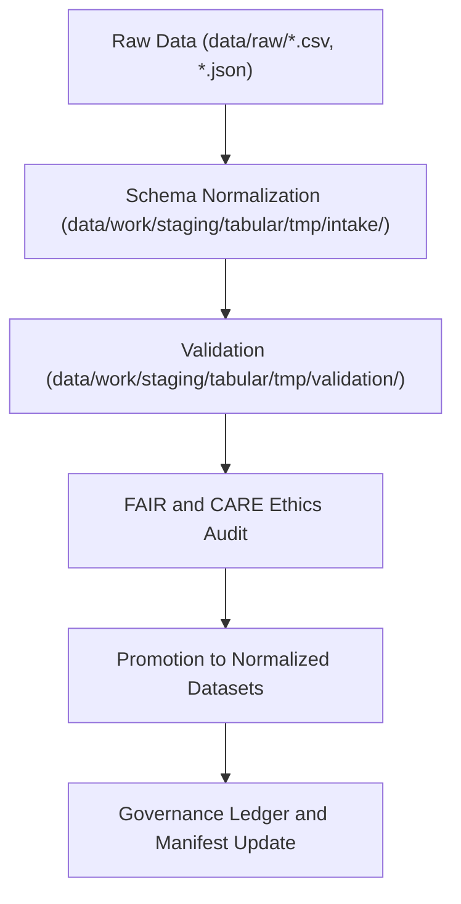

<div align="center">

# 📊 Kansas Frontier Matrix — **Tabular Staging Workspace**
`data/work/staging/tabular/README.md`

**Purpose:** Intermediate workspace for tabular datasets undergoing normalization, schema validation, and FAIR+CARE certification within the Kansas Frontier Matrix (KFM).  
Ensures all CSV, Parquet, and database-derived tables conform to data contracts, governance standards, and reproducible open-data formats.

[](../../../../docs/standards/faircare-validation.md)
[](../../../../LICENSE)
[](../../../../docs/architecture/repo-focus.md)

</div>

---

## 📚 Overview

The `data/work/staging/tabular/` directory is the **transitional data layer** where tabular datasets are ingested, standardized, and validated before publication or archival.  
This workspace integrates quality assurance, data contract validation, and FAIR+CARE ethics checks for all non-spatial KFM data sources.

### Functions:
- Normalize field names, data types, and schema alignment with JSON contracts.  
- Validate CSV and Parquet integrity using automated schema checkers.  
- Perform FAIR+CARE audits to ensure ethical handling and accessibility.  
- Generate metadata summaries and validation reports.  

All transformations here are tracked in the **governance ledger** and cross-linked to raw data sources for full provenance.

---

## 🗂️ Directory Layout

```plaintext
data/work/staging/tabular/
├── README.md                             # This file — documentation of tabular staging workspace
│
├── tmp/                                  # Temporary data normalization and validation workspace
│   ├── intake/                           # Raw-to-staging tabular ETL workflows
│   ├── validation/                       # Schema compliance and FAIR+CARE audits
│   └── logs/                             # ETL trace and governance logs
│
├── normalized/                           # Harmonized tabular data ready for validation
│   ├── hazards_normalized.csv
│   ├── climate_indices_normalized.parquet
│   ├── treaties_metadata_normalized.csv
│   └── metadata.json
│
└── metadata/                             # Metadata harmonization and schema documentation
    ├── tmp/
    ├── validation/
    └── logs/
```

---

## ⚙️ Tabular ETL Workflow



### Workflow Steps:
1. **Schema Alignment:** Normalize all field names, data types, and encodings.  
2. **Validation:** Run data contract and JSON schema checks.  
3. **FAIR+CARE Audit:** Verify compliance with accessibility, ethics, and governance standards.  
4. **Normalization:** Export validated data to open, structured formats (CSV, Parquet).  
5. **Governance:** Register dataset checksum and schema in provenance ledger.

---

## 🧩 Example Tabular Staging Metadata Record

```json
{
  "id": "staging_tabular_climate_indices_v9.3.2",
  "dataset_type": "tabular",
  "source_files": [
    "data/raw/noaa/temperature_anomalies/kansas_temp_anomalies_2025.csv",
    "data/raw/noaa/drought_monitor/drought_monitor_2025.csv"
  ],
  "pipeline": "src/pipelines/etl/climate_indices_pipeline.py",
  "records_processed": 54012,
  "schema_version": "v3.0.1",
  "created": "2025-10-28T15:35:00Z",
  "validation_status": "passed",
  "checksum": "sha256:72f6b3cb2179cc83042e41ed9e55dbff97db9ffb...",
  "fairstatus": "compliant",
  "governance_ref": "data/reports/audit/data_provenance_ledger.json"
}
```

---

## 🧠 FAIR+CARE Governance in Tabular Data

| Principle | Implementation |
|------------|----------------|
| **Findable** | Each dataset indexed with checksum and schema in governance ledger. |
| **Accessible** | Data stored in open, documented CSV or Parquet formats. |
| **Interoperable** | Schema validation ensures DCAT/DCAT-AP and JSON Schema compatibility. |
| **Reusable** | Metadata includes provenance, version, and license information. |
| **Collective Benefit** | Promotes ethical and transparent use of tabular data. |
| **Authority to Control** | Governance Council approves schema changes and updates. |
| **Responsibility** | Validators log schema compliance reports to ledger. |
| **Ethics** | No personal or sensitive data; all attributes anonymized if required. |

FAIR+CARE audit outcomes stored in:  
`data/reports/fair/data_care_assessment.json` and `data/reports/audit/data_provenance_ledger.json`.

---

## ⚙️ Validation & QA Reports

| Report | Description | Output |
|---------|-------------|---------|
| `schema_validation_summary.json` | Results of schema field and type checks. | JSON |
| `faircare_tabular_audit.json` | FAIR+CARE compliance audit for tabular data. | JSON |
| `stac_dcat_mapping.log` | STAC/DCAT schema field crosswalk trace. | Text |
| `qa_summary.md` | Human-readable quality assurance overview. | Markdown |

Validation workflows automatically triggered by `tabular_validation_sync.yml`.

---

## ⚖️ Governance & Provenance Integration

| Record | Description |
|---------|-------------|
| `metadata.json` | Captures dataset-level provenance, checksum, and schema status. |
| `data/reports/audit/data_provenance_ledger.json` | Logs ETL lineage and validation results. |
| `data/reports/validation/schema_validation_summary.json` | Field-level QA report. |
| `releases/v9.3.2/manifest.zip` | Checksum and validation registry for reproducibility. |

Governance synchronization handled by `staging_tabular_sync.yml`.

---

## 🧾 Retention Policy

| File Type | Retention Duration | Policy |
|------------|--------------------|--------|
| Temporary Files (TMP) | 7 days | Auto-deleted after successful validation. |
| Normalized Datasets | 90 days | Promoted to processed layer after QA approval. |
| Validation Reports | 180 days | Archived for FAIR+CARE and QA audits. |
| Governance Metadata | Permanent | Retained for lineage and certification tracking. |

Cleanup performed by `staging_tabular_cleanup.yml`.

---

## 🧾 Internal Use Citation

```text
Kansas Frontier Matrix (2025). Tabular Staging Workspace (v9.3.2).
Intermediate processing and validation workspace for tabular datasets under FAIR+CARE governance.
Restricted to internal ETL, QA, and provenance validation workflows.
```

---

## 🧾 Version Notes

| Version | Date | Notes |
|----------|------|--------|
| v9.3.2 | 2025-10-28 | Added FAIR+CARE ethics validation and unified schema QA automation. |
| v9.2.0 | 2024-07-15 | Integrated Parquet normalization and checksum verification. |
| v9.0.0 | 2023-01-10 | Established tabular staging workspace for schema compliance. |

---

<div align="center">

**Kansas Frontier Matrix** · *Tabular Data Quality × FAIR+CARE Ethics × Provenance Integrity*  
[🔗 Repository](https://github.com/bartytime4life/Kansas-Frontier-Matrix) • [🧭 Docs Portal](../../../../docs/) • [⚖️ Governance Ledger](../../../../docs/standards/governance/)

</div>
