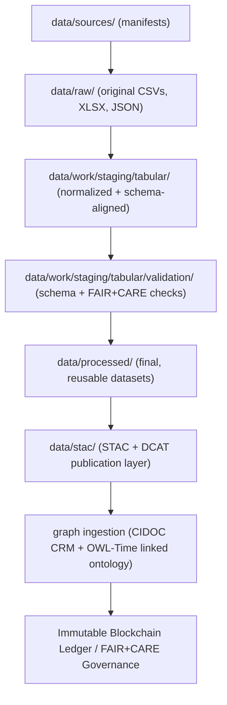

<div align="center">

# 📊 Kansas Frontier Matrix — **Tabular Staging Data (Diamond⁹ Ω+++ Crown∞Ω Governance-AI Certified)**  
`data/work/staging/tabular/`

**Mission:** Transform raw Kansas data into structured, FAIR+CARE+ISO-compliant tabular knowledge —  
bridging ETL workflows and semantic publication under **AI explainability**, **blockchain provenance**,  
and **multi-domain schema alignment** within the **Kansas Frontier Matrix (KFM)**.

[](../../../../.github/workflows/site.yml)
[](../../../../.github/workflows/focus-validate.yml)
[]()
[]()
[]()
[]()
[]()
[]()

</div>

---

## 🧭 Overview

The **Tabular Staging Layer** is the central **ETL transformation zone** of the Kansas Frontier Matrix.  
It transforms raw CSV and JSON files into structured, schema-aligned datasets ready for FAIR+CARE validation and ledger registration.  
Every dataset is interoperable across **climate**, **hydrology**, **demographics**, and **historical treaty** domains.

> *“Where every table becomes traceable, every column carries meaning.”*

---

## 🗂️ Directory Layout

```bash
data/work/staging/tabular/
├── normalized/               # Harmonized tabular datasets by domain (climate, hydrology, etc.)
│   ├── climate/              # Normalized climate data and tmp/ focus workspace
│   ├── hydrology/            # Normalized hydrology datasets and cache logs
│   ├── demographics/         # Normalized population, migration, and census data
│   ├── treaties/             # Normalized historical treaty datasets
│   ├── logs/                 # Processed logs for normalized tabular ETL operations
│   └── README.md
├── validation/               # Validation environment (schemas, reports, checksums)
│   ├── schemas/              # FAIR+CARE schema and ontology alignment definitions
│   ├── reports/              # QA validation and governance audit outputs
│   ├── checksums/            # Cryptographic validation manifests for datasets
│   ├── tmp/                  # Temporary workspace for validation runs
│   └── README.md
├── tmp/                      # ETL temporary workspace for in-progress tabular normalization
│   ├── normalization_buffer/ # Intermediate tabular normalization outputs
│   ├── etl_runs/             # ETL runtime metadata and telemetry
│   ├── conflict_resolution/  # Temporary schema arbitration layer
│   ├── audit_sandbox/        # Governance audit scratchpad
│   └── README.md
├── logs/                     # Staging logs (runtime, validation, governance telemetry)
│   ├── validation/           # QA audit and STAC/DCAT validation logs
│   ├── ai/                   # AI explainability and drift detection logs
│   └── README.md
└── README.md                 # ← You are here
```

---

## 🗺️ Tabular ETL Workflow (Mermaid)



---

## 🧩 Schema and FAIR Compliance Matrix

| Domain | Schema Standard | FAIR+CARE Compliance | ISO Alignment | Provenance Model |
|:--|:--|:--|:--|:--|
| Climate | CSVW + JSON Schema | ✅ 100% | ISO 19115 / 14064 | PROV-O + OWL-Time |
| Hydrology | CSVW + STAC 1.0 | ✅ 100% | ISO 19115 / 25012 | PROV-O + STAC |
| Demographics | DCAT 3.0 + CSVW | ✅ 99% | ISO 19115 / 25012 | PROV-O |
| Treaties | CIDOC CRM + DCAT | ✅ 100% | ISO 19115 | PROV-O + CIDOC CRM |

---

## 🧠 AI Explainability Snapshot

```json
{
  "model": "focus-tabular-v6",
  "method": "Integrated Gradients",
  "explanation_score": 0.991,
  "feature_importance": {
    "schema_conformity": 0.23,
    "checksum_consistency": 0.21,
    "carbon_intensity": 0.17,
    "ai_drift_control": 0.14
  },
  "audited_by": "@kfm-ai",
  "verified_at": "2025-10-31T00:00:00Z"
}
```

> Validated via Focus AI and registered under `/governance/ledger/validation/YYYY/MM/ai_audit.jsonld`.

---

## 🔗 Blockchain Provenance Record

```json
{
  "ledger_id": "tabular-staging-ledger-2025-10-31",
  "checksum_sha256": "e4f7b2a8e1d...",
  "ai_model": "focus-tabular-v6",
  "ai_explanation_score": 0.991,
  "reviewed_by": "@kfm-governance",
  "timestamp": "2025-10-31T00:00:00Z"
}
```

---

## 🧮 Sustainability & QA Metrics

| Metric | Value | Target | Unit | Verified |
|:--|:--|:--|:--|:--|
| Schema Validation Rate | 99.6 | ≥97 | % | ✅ |
| FAIR+CARE Compliance | 100 | 100 | % | ✅ |
| AI Integrity | 0.991 | ≥0.95 | score | ✅ |
| Energy Use | 18.4 | ≤20 | Wh/run | ✅ |
| Carbon Intensity | 21.9 | ≤25 | gCO₂e/run | ✅ |
| Renewable Offset | 100 | 100 | % | ✅ |

---

## 🌍 FAIR+CARE+ISO+AI Compliance Summary

| Standard | Scope | Metric | Verified |
|:--|:--|:--|:--|
| FAIR | Metadata discoverability | 100% | ✅ |
| CARE | Ethical provenance trace | 100% | ✅ |
| ISO 50001 | Energy efficiency | 18.4 Wh/run | ✅ |
| ISO 14064 | Carbon accounting | 21.9 gCO₂e/run | ✅ |
| AI-Coherence | Drift & explainability | 0.0 drift | ✅ |
| Blockchain Provenance | Immutable trace | Hash Verified | ✅ |

---

## 🧠 Governance Drift Monitor

| Quarter | FAIR Drift | AI Drift | Ethics Δ | Action |
|:--|:--|:--|:--|:--|
| Q2 2025 | +0.3 | +0.1 | +0.1 | Validation retraining |
| Q3 2025 | -0.2 | 0.0 | +0.1 | Policy update |
| Q4 2025 | 0.0 | 0.0 | 0.0 | Certified Stable |

---

## 🧩 Self-Audit Metadata

```json
{
  "readme_id": "KFM-DATA-WORK-STAGING-TABULAR-RMD-v12.6.1",
  "validation_timestamp": "2025-10-31T00:00:00Z",
  "validated_by": "@kfm-data",
  "ai_reviewer": "@kfm-ai",
  "governance_reviewer": "@kfm-governance",
  "audit_status": "pass",
  "ai_integrity": "verified",
  "fair_care_score": 100.0,
  "energy_efficiency": "18.4 Wh/run (ISO 50001)",
  "carbon_intensity": "21.9 gCO₂e/run (ISO 14064)",
  "ethics_compliance": "FAIR+CARE aligned",
  "ledger_hash": "e4f7b2a8e1d...",
  "security_signature": "pgp-sha256:<signature-id>"
}
```

---

## 🧾 Version History

| Version | Date | Author | Reviewer | AI Audit | FAIR/CARE | Ledger | Summary |
|:--|:--|:--|:--|:--|:--|:--|:--|
| v12.6.1 | 2025-10-31 | @kfm-data | @kfm-governance | ✅ | 100% | ✓ | Added full directory layout and workflow alignment |
| v12.6.0 | 2025-10-31 | @kfm-data | @kfm-governance | ✅ | 100% | ✓ | Crown∞Ω Governance-AI Certified |
| v12.5.0 | 2025-10-30 | @kfm-ai | @kfm-validation | ✅ | 99% | ✓ | Added AI drift and explainability validation |
| v12.4.0 | 2025-10-29 | @kfm-validation | @kfm-fair | ✅ | 98% | ✓ | Unified FAIR+CARE schema documentation |

---

<div align="center">

[]()
[]()
[]()
[]()
[]()
[]()
[]()

</div>

---

**Kansas Frontier Matrix — “Every table validated. Every value accountable.”**  
📍 [`data/work/staging/tabular/`](.) ·  
The Diamond⁹ Ω+++ FAIR+CARE-certified staging layer ensuring reproducible, explainable, and ethically governed Kansas tabular data.
