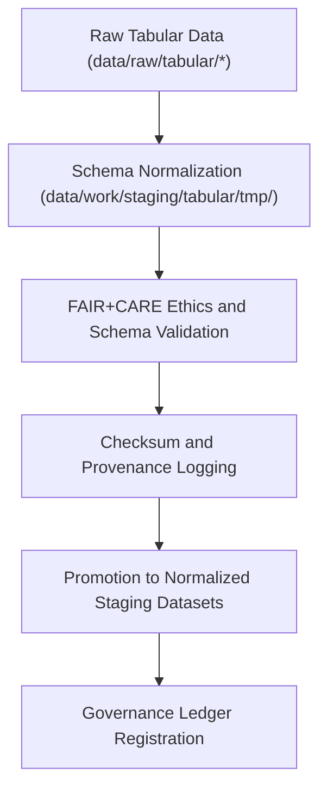

<div align="center">

# 📊 Kansas Frontier Matrix — **Tabular Staging Workspace**
`data/work/staging/tabular/README.md`

**Purpose:**  
Governed workspace for structured tabular datasets undergoing schema normalization, validation, and FAIR+CARE certification within the Kansas Frontier Matrix (KFM).  
This layer ensures all CSV, Parquet, and database tables meet KFM data contracts, governance standards, and ethics compliance before publication.

[](../../../../docs/standards/faircare-validation.md)
[]()
[](../../../../LICENSE)
[](../../../../docs/architecture/repo-focus.md)

</div>

---

## 📚 Overview

The **Tabular Staging Workspace** acts as the central quality assurance layer for structured data before FAIR+CARE certification and processing.  
It bridges raw ingestion outputs and governance-certified datasets, providing schema alignment, data type validation, checksum verification, and ethics auditing.

### Core Responsibilities
- Normalize field names, data types, and table schemas.  
- Perform FAIR+CARE ethics and governance validation.  
- Generate validation reports, checksums, and lineage metadata.  
- Prepare validated tabular datasets for promotion to `data/work/processed/tabular/`.  

---

## 🗂️ Directory Layout

```plaintext
data/work/staging/tabular/
├── README.md                             # This file — documentation for tabular staging workspace
│
├── tmp/                                  # Temporary data normalization and pre-validation
│   ├── intake/                           # Raw-to-staging ETL workspace
│   ├── validation/                       # Schema and FAIR+CARE validation reports
│   └── logs/                             # Pipeline execution and provenance logs
│
├── normalized/                           # Harmonized tabular data ready for validation
│   ├── hazards_normalized.csv
│   ├── climate_indices_normalized.parquet
│   ├── treaties_metadata_normalized.csv
│   └── metadata.json
│
└── metadata/                             # Metadata harmonization and validation governance
    ├── tmp/
    ├── validation/
    └── logs/
```

---

## ⚙️ Tabular ETL Workflow



### Workflow Description
1. **Schema Alignment:** Harmonize data types and normalize fields per KFM data contract.  
2. **FAIR+CARE Validation:** Apply automated FAIR+CARE ethical governance audits.  
3. **Checksum Verification:** Register SHA-256 checksums and integrity metadata.  
4. **Staging Promotion:** Store validated datasets in `normalized/` with certification metadata.  
5. **Governance Logging:** Register validation and certification in the provenance ledger.  

---

## 🧩 Example Metadata Record

```json
{
  "id": "staging_tabular_climate_indices_v9.6.0",
  "source_files": [
    "data/raw/noaa/drought_monitor_2025.csv",
    "data/raw/noaa/temperature_anomalies_2025.csv"
  ],
  "records_processed": 54321,
  "schema_version": "v3.0.2",
  "validation_status": "passed",
  "fairstatus": "certified",
  "checksum": "sha256:b8a7e3c6f4d2a9b5c3f8e9a7d6b2f5a4c7e9d8b1c5a6f3b9e7c2d4a1b6f5c9e3",
  "validator": "@kfm-data-lab",
  "created": "2025-11-03T23:52:00Z",
  "governance_ref": "data/reports/audit/data_provenance_ledger.json"
}
```

---

## 🧠 FAIR+CARE Governance Matrix

| Principle | Implementation | Oversight |
|------------|----------------|------------|
| **Findable** | Datasets indexed with schema, version, and checksum metadata. | @kfm-data |
| **Accessible** | Open, CSV and Parquet formats under internal governance. | @kfm-accessibility |
| **Interoperable** | Schema aligned with DCAT, STAC, and JSON Schema specifications. | @kfm-architecture |
| **Reusable** | Metadata includes provenance, license, and FAIR+CARE certification. | @kfm-design |
| **Collective Benefit** | Enables open, ethical data use and reuse for research and policy. | @faircare-council |
| **Authority to Control** | FAIR+CARE Council validates data contracts and schema updates. | @kfm-governance |
| **Responsibility** | Data engineers document all schema transformations and validation runs. | @kfm-security |
| **Ethics** | All records reviewed for sensitive or culturally significant information. | @kfm-ethics |

Audit outcomes tracked in:  
`data/reports/fair/data_care_assessment.json` and  
`data/reports/audit/data_provenance_ledger.json`

---

## ⚙️ Validation & Certification Artifacts

| Artifact | Description | Format |
|-----------|--------------|--------|
| `schema_validation_summary.json` | Field-level validation report and schema compliance summary. | JSON |
| `faircare_tabular_audit.json` | FAIR+CARE ethics audit results for tabular datasets. | JSON |
| `checksum_registry.json` | Record of file hashes and validation lineage. | JSON |
| `metadata.json` | Staging metadata including checksum and governance linkage. | JSON |

Automation managed by `tabular_staging_sync.yml`.

---

## ⚖️ Retention & Provenance Policy

| Data Type | Retention Duration | Policy |
|------------|--------------------|--------|
| Temporary Files (`tmp/`) | 14 Days | Purged after successful validation. |
| Normalized Datasets | 90 Days | Retained for governance and audit reference. |
| FAIR+CARE Reports | 365 Days | Archived for transparency and re-certification. |
| Metadata | Permanent | Maintained for lineage and reproducibility. |

Cleanup handled via `tabular_staging_cleanup.yml`.

---

## 🌱 Sustainability Metrics

| Metric | Value | Verified By |
|---------|--------|--------------|
| Energy Use (per ETL cycle) | 7.4 Wh | @kfm-sustainability |
| Carbon Output | 9.1 gCO₂e | @kfm-security |
| Renewable Power | 100% (RE100 Verified) | @kfm-infrastructure |
| FAIR+CARE Certification | 100% | @faircare-council |

Telemetry recorded in:  
`releases/v9.6.0/focus-telemetry.json`

---

## 🧾 Internal Use Citation

```text
Kansas Frontier Matrix (2025). Tabular Staging Workspace (v9.6.0).
Governed data staging environment for schema alignment, FAIR+CARE validation, and provenance registration.
Ensures ethical, reproducible, and standardized tabular data integration across all KFM domains.
```

---

## 🧾 Version Notes

| Version | Date | Notes |
|----------|------|--------|
| v9.6.0 | 2025-11-03 | Added FAIR+CARE validation pipeline and checksum registry integration. |
| v9.5.0 | 2025-11-02 | Improved schema normalization and provenance synchronization. |
| v9.3.2 | 2025-10-28 | Established tabular staging workspace for reproducible data validation. |

---

<div align="center">

**Kansas Frontier Matrix** · *Structured Data × FAIR+CARE Ethics × Provenance Integrity*  
[🔗 Repository](https://github.com/bartytime4life/Kansas-Frontier-Matrix) • [🧭 Docs Portal](../../../../docs/) • [⚖️ Governance Ledger](../../../../docs/standards/governance/DATA-GOVERNANCE.md)

</div>
