<div align="center">

# 📊 Kansas Frontier Matrix — **Tabular Staging Workspace**  
`data/work/staging/tabular/README.md`

**Purpose:**  
Governed workspace for structured datasets undergoing **schema normalization, validation, and FAIR+CARE certification** within KFM.  
Ensures all CSV/Parquet tables meet data contracts, governance standards, and ethics compliance before publication.

[](../../../../docs/architecture/README.md)
[](../../../../docs/standards/faircare-validation.md)
[]()
[](../../../../LICENSE)

</div>

---

## 📘 Overview

The **Tabular Staging Workspace** is the central QA layer for structured data before FAIR+CARE certification and processing.  
It bridges raw outputs and governance-certified datasets by providing **schema alignment, type validation, checksums, and ethics auditing**.

### Core Responsibilities
- Normalize field names, data types, and table schemas.  
- Perform FAIR+CARE ethics & governance validation.  
- Generate validation reports, checksums, and lineage metadata.  
- Promote validated datasets to `data/work/processed/tabular/`.  

---

## 🗂️ Directory Layout

```plaintext
data/work/staging/tabular/
├── README.md
├── tmp/
│   ├── intake/           # Raw→staging ETL workspace
│   ├── validation/       # Schema + FAIR+CARE validation reports
│   └── logs/             # Pipeline execution + provenance logs
├── normalized/
│   ├── hazards_normalized_v9.7.0.csv
│   ├── climate_indices_normalized_v9.7.0.parquet
│   ├── treaties_metadata_normalized_v9.7.0.csv
│   └── metadata.json
└── metadata/
    ├── tmp/
    ├── validation/
    └── logs/
```

---

## ⚙️ Tabular ETL Workflow

```mermaid
flowchart TD
    A["Raw Tabular (data/raw/tabular/*)"] --> B["Schema Normalization (staging/tabular/tmp/)"]
    B --> C["FAIR + CARE Ethics + Schema Validation"]
    C --> D["Checksum + Provenance Logging"]
    D --> E["Promotion → Normalized Staging Datasets"]
    E --> F["Governance Ledger Registration"]
```



### Steps
1. **Schema Alignment** — Harmonize types & fields per KFM contract.  
2. **FAIR+CARE Validation** — Automated ethics & governance audits.  
3. **Checksum Verification** — Register SHA-256 + integrity metadata.  
4. **Staging Promotion** — Store validated datasets in `normalized/`.  
5. **Governance Logging** — Record validation & certification in provenance ledger.

---

## 🧩 Example Metadata Record

```json
{
  "id": "staging_tabular_climate_indices_v9.7.0",
  "source_files": [
    "data/raw/noaa/drought_monitor_2025.csv",
    "data/raw/noaa/temperature_anomalies_2025.csv"
  ],
  "records_processed": 56310,
  "schema_version": "v3.1.1",
  "validation_status": "passed",
  "fairstatus": "certified",
  "checksum_sha256": "sha256:b8a7e3c6f4d2a9b5c3f8e9a7d6b2f5a4c7e9d8b1c5a6f3b9e7c2d4a1b6f5c9e3",
  "validator": "@kfm-data-lab",
  "created": "2025-11-06T23:52:00Z",
  "governance_ref": "data/reports/audit/data_provenance_ledger.json"
}
```

---

## 🧠 FAIR+CARE Governance Matrix

| Principle | Implementation | Oversight |
|-----------|----------------|-----------|
| **Findable** | Indexed with schema/version/checksum metadata. | `@kfm-data` |
| **Accessible** | CSV/Parquet under internal governance. | `@kfm-accessibility` |
| **Interoperable** | Aligned with DCAT + JSON Schema; STAC-linked where relevant. | `@kfm-architecture` |
| **Reusable** | Provenance, license, and certification included. | `@kfm-design` |
| **Collective Benefit** | Enables open, ethical data reuse. | `@faircare-council` |
| **Authority to Control** | Council validates contracts & schema updates. | `@kfm-governance` |
| **Responsibility** | Engineers document transformations & validations. | `@kfm-security` |
| **Ethics** | Records screened for equity, privacy, and cultural sensitivity. | `@kfm-ethics` |

**Audit refs:**  
`data/reports/fair/data_care_assessment.json` · `data/reports/audit/data_provenance_ledger.json`

---

## ⚙️ Validation & Certification Artifacts

| Artifact                         | Description                                 | Format |
|----------------------------------|---------------------------------------------|--------|
| `schema_validation_summary.json` | Field-level validation & schema conformance | JSON   |
| `faircare_tabular_audit.json`    | FAIR+CARE ethics audit results              | JSON   |
| `checksum_registry.json`         | File hashes & validation lineage            | JSON   |
| `metadata.json`                  | Staging metadata + checksum + governance    | JSON   |

**Automation:** `tabular_staging_sync.yml`

---

## ♻️ Retention & Sustainability

| Data Type            | Retention | Policy |
|---------------------|----------:|--------|
| Temporary (`tmp/`)  | 14 Days   | Purged after successful validation. |
| Normalized Datasets | 90 Days   | Retained for governance & audit.    |
| FAIR+CARE Reports   | 365 Days  | Archived for re-certification.      |
| Metadata            | Permanent | Maintained for lineage & reproducibility. |

**Telemetry:** `../../../../releases/v9.7.0/focus-telemetry.json`

---

## 🧾 Internal Citation

```text
Kansas Frontier Matrix (2025). Tabular Staging Workspace (v9.7.0).
Governed staging environment for schema alignment, FAIR+CARE validation, and provenance registration—ensuring ethical, reproducible, and standardized tabular data integration across KFM.
```

---

## 🕰️ Version History

| Version | Date       | Author             | Summary |
|--------:|------------|--------------------|---------|
| v9.7.0  | 2025-11-06 | `@kfm-tabular`     | Upgraded to v9.7.0; telemetry/schema refs aligned; filenames normalized. |
| v9.6.0  | 2025-11-03 | `@kfm-tabular`     | Added FAIR+CARE pipeline + checksum registry. |

---

<div align="center">

**Kansas Frontier Matrix**  
*Structured Data × FAIR+CARE Ethics × Provenance Integrity*  
© 2025 Kansas Frontier Matrix — Internal · FAIR+CARE Certified · Diamond⁹ Ω / Crown∞Ω Ultimate Certified  

[Back to Staging](../README.md) · [Governance Charter](../../../../docs/standards/governance/DATA-GOVERNANCE.md)

</div>
